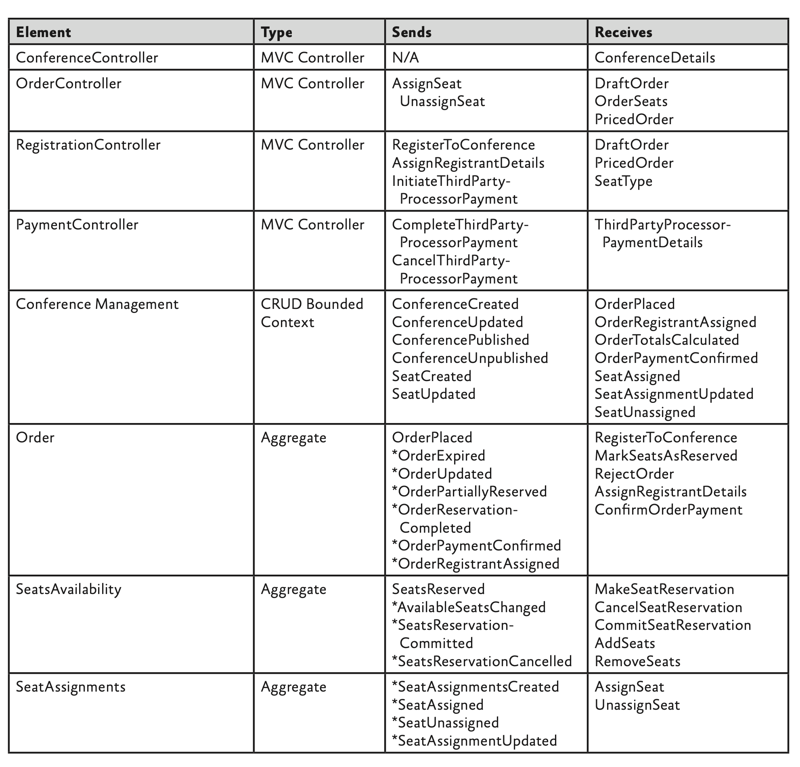
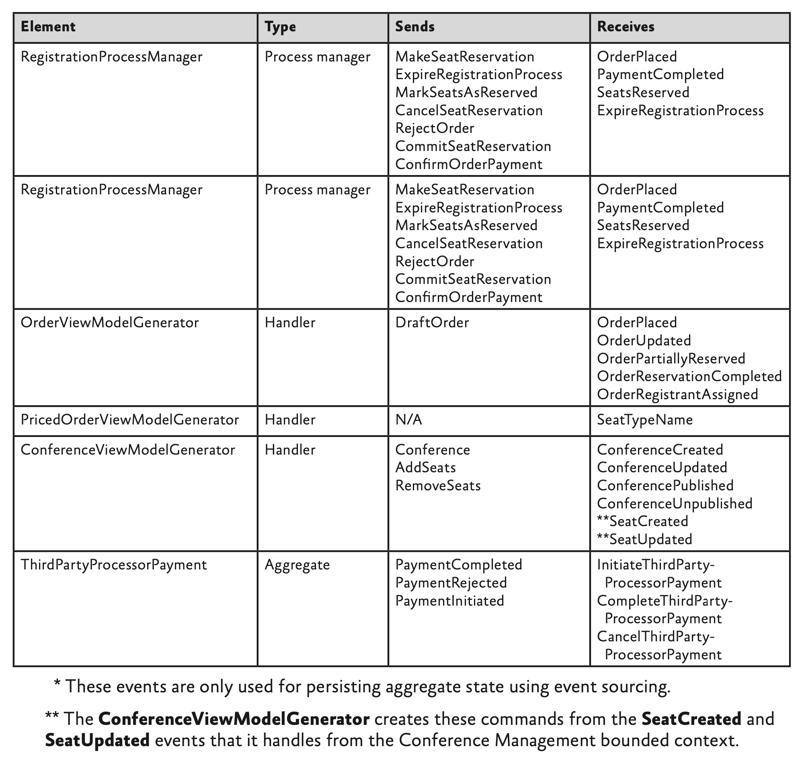

# CQRS Journey

CQRS
Martin Fowler -> 읽기 모델, 쓰기 모델을 분리하는 것?
Greg Young -> 읽기 담당 오브젝트, 쓰기 담당 오브젝트를 분리하는 것

The CQRS Pattern and event sourcing are not mere simplistic solutions to the problems associated with large-scale,
distributed systems.

## Journey 1 - Our Domain: Conference Management System

multi-tenancy 여러 고객에게 서비스를 제공하는 아키텍처

DDD는 써봄, CQRS는 경험해본 사람은 없다고 가정

### Overview of the system
- Manage the sale of different seat types for the conference
- Create a conference and define characteristics of that conference

### Selling seats for a conference
### Creating a conference

### NonFunctional Requirements

Scalability,
Flexibility,

## Journey 2 - Decomposing the domain

### Definition used in this chapter

- Domain
- Bounded context
- Context Map

### Bounded contexts in the conference management system
#### Order and Registration (CQRS/ES)
- Order
  - reservation, payment, registration items (order 1 : N orderItems)
- Reservation
  - seat, ordering process (reservation 1 : N seat)
- If the registrant does not pay for the tickets with 15 minutes, 
the system deletes the reservation and the seats become available for other registrants to reserve 

#### Conference Management (CRUD)
- The name, description, and slug
- The start and end dates of the conference
- The different types and quotas of seats available at the conference

#### Payment (CQRS)

#### Discount Policy, Occasionally Disconnected, Submissions and schedule

### The Context map for the consoto conference management system
1. Events that report when conference have been created, updated, or published. Events that report when seat types have been created or updated
2. Events that report when orders have been created or updated. Events that report when attendees have been assigned to seats.
3. Requests for a payment be made.
4. Acknowledgement of the success or failure of the payment.

## Journey 3 - Orders and Registration Bounded Context

### Domain
- attendee
- registrant
- user
- seat assignment
- order
- order item
- seat
- reservation
- seat availability
- conference site

### Pattern and concepts

1. two separate aggregates
2. a single aggregate
3. using a process manager

first not use event sourcing

> the system must
> check that sufficient seats are available
> record detail of the registration
> update the total number of seats booked for the conference

Validation, Transaction Boundaries, Concurrency, Aggregate and aggregate roots 

### High level architecture
1. Querying the read model
2. issuing commands -> asynchronously and once only to a single recipient
3. handling commands
4. initiating business logic in the domain
5. persisting the changes
6. polling the read model

command model
command > fire and forget

### Impact on testing

We might have a set of tests that we can use to test our domain objects, and all of those tests might be passing.
We might also have a set of tests to verify that our ORM layer can save and retrieve objects successfully.

## Journey 4 - Extending and Enhancing the Orders and Registration Bounded Context

The specific topics described in this chapter include
- Improvements to the way message correlation works with the RegistrationProcessManager class, This illustrates how aggregate instances within the bounded context can interact in a complex manner.
- Implementating a record locator to enable a registrant to retrieve an order that she saved during a previous session. This illustrates adding some additional logic to the write side that enables you to locate an aggregate instance without knowing its unique ID
- Adding a countdown timer to the UI to enable a registrant to track how much longer they habe to complete an order. This illustrates enhancements to the write side to support the display of rich information in the UI
- Supporting orders for multiple seat types simultaneously. For example, a registrant requests five seats for a preconference event and eight seats for the full conference. This requires more complex business logic on the write side
- CQRS command validation. This illustrates how to make use of the model validation feature in MVC to validate your CQRS commands before you send them to the domain

Command - MakeSeatReservation > A command bus trans- ports commands that command handlers then dispatch to aggregates. Sending a command is an asynchronous operation with no return value. 
Event - OrderConfirmed > Multiple subscribers can handle a specific event. Aggregates pub- lish events to an event bus; handlers register for specific types of events on the event bus and then deliver the events to the subscriber. In this bounded context, the only subscriber is a process manager.
Process Manager - The process manager in this bounded context can receive com- mands as well as subscribe to events.

### User Stories
Orders and Registrations bounded context

- Implement a login using a record locator
- Tell the registrant how much time remains to complete an order
- Enable a registrant to create an order that includes multiple seat types

#### ARCHITECTURE

### Patterns and concepts

#### Record Locators

#### Querying the read side
In this initial exploration of the CQRS pattern, the team decided to use SQL views in the database as the underlying source of the data queried by the MVC controllers on the read side.

> The team will split the database into two and explore options for pushing changes from the normalized write side to the denormalized read side in a later stage of the journey. 

#### Storing denormalized views in a database
One common option for storing the read-side data is to use a set of relational database tables to hold the denormalized views.

two approaches to implementing the ViewRepository
- IQueryable interface and using non-generic data access objects (DAO)

IQueryable
Simplicity, Testability(Mock)

non-generic DAOs
Simplicity, Flexibility, Performance, Testability

#### CQRS Command Validation

You should be careful to distinguish between errors and business failures. 
Examples of errors include:
• A message is not delivered due to a failure in the messaging infrastructure.
• Data is not persisted due to a connectivity problem with the database.
In many cases, especially in the cloud, you can handle these errors by retrying the operation.
A business failure should have a predetermined business response. 
For example:
• If the system cannot reserve a seat because there are no seats left, then it should add the request to a wait list.
• If a credit card payment fails, the user should be given the chance to either try a different card, or set up payment by invoice.

#### The countdown timer and the read model

### Implementation Details

#### Order access code Record Locator
#### Countdown timer
#### Using ASP.NET MVE validation for commands

### Pushing changes to the read side

The system stores the denormalized order data in a SQL Database instance in two tables: the OrdersView and OrderItemsView tables. 
The OrderItemsView table includes the RequestedSeats column that contains data that only exists on the read side.

The OrderViewModelGenerator class handles these events and updates the read-side repository.

#### Querying the read side
The following code sample shows a nongeneric DAO class that the MVC controllers use to query for conference information on the read side. 
It wraps the ConferenceRegistrationDbContext class shown previously.

Previously, the aggregate raised either a ReservationAccepted or a ReservationRejected event, depending on whether there were sufficient seats. 
Now the aggregate raises a SeatsReserved event that reports how many seats of a particular type it could reserve. 
This means that the number of seats reserved may not match the number of seats requested; this information is passed back to the UI for the registrant to make a decision on how to proceed with the registration.

#### Acceptance tests and the domain expert
The team had the following goals for their acceptance testing approach:
• The acceptance tests should be expressed clearly and unambiguously in a format that the
domain expert could understand.
• It should be possible to execute the acceptance tests automatically.

MIL 이벤트 추적 DSL

command는 bounded context 안에서 하는 경우가 많으므로 in memory queue를 사용하는 것은 어떤가(서버 내려가면 사라짐 - spring은 destory hook 도 있음)
메시지 버스를 태우면 전달까지는 기록됨

> 서버를 다르게 함으로써 대용량이 필요한 곳에서 대용량 처리를 함
> retry 하는 코드가 일괄적으로 필요함
> 
> cqrs하다가 개발 생산성이 떨어질 수 있지 않나

비정규화한 테이블을 따로 만들어야 한다.
aggregate 쪽에서 완료하는 이벤트를 던지면 그 이벤트를 받아서

! 읽기 모델에 save 명령이 있음 빠르게 읽어서 쓰기 모델에 요청함
! 어드민에 가공해서 데이터를 설정하고 사용하는 경우도 있음 [EagerReadDerivation](https://martinfowler.com/bliki/EagerReadDerivation.html)
! [이벤트 소싱 패턴](https://learn.microsoft.com/ko-kr/azure/architecture/patterns/event-sourcing)

컨퍼런스 CRUD, order cqrs+event sourcing, payment cars

aggregate을 완전 분리 command processor을 통해서 옮겼음
기존 service 어떻게 보면 application
order db에 넣고 seat availability -> event를 받아서 aggregate 불러서 처리

이벤트 소싱 - 버저닝 관점에서 v2가 생겼을 때 이벤트 들을 실행하며 다른 요구사항을 만족시키며 v1을 만족할 수 있음
[이벤트 소싱](https://www.youtube.com/watch?v=Yd7TXUdcaUQ)

(카프카에서 이벤트가 큐에 얼마나 머물렀는지 분석해서 성능 개선도 가능함)

## Journey 5 - Preparing for the V1 Release

### The Contoso Conference Management System V1 release

One of the key refactorings undertaken by the team during this phase of the journey was to introduce event sourcing into the Orders and Registrations bounded context
One of the anticipated benefits from implementing the CQRS pattern is that it will help us manage change in a complex system

Access code - When a business customer creates a new conference, the system generates a five-character access code ande sends it by email to the business customer
Even sourcing - Event sourcing is a way of persisting and reloading the sate of aggregates within the system.
Eventual consistency - the storage system does guarantee that if no new updates are made to the object during a sufficiently long period of time 

The table that follows lists all of the message that the artifacts shown in the diagram exchange with each other

### identifying aggregates

팀이 V1 릴리즈를 위해 만든 Event Store 는 애그리거트 ID 를 파티션 키로 사용했고 이는 특정 애그리거트에 대한 이벤트를 보유하는 파티션을 효율적으로 찾을 수 있게 해준다.

CRUD
CQRS 패턴을 모든 시스템에 적용할 필요는 없다. 명확한 이점을 제공하는 Bounded Context 에서만 패턴을 적용해야 한다.
Contoso 컨퍼런스 관리 시스템에서 Conference Management 바운디드 컨텍스트는 비교적 간단하고 작다.

###
비즈니스 고객이 좌석 타입의 할당량을 변경할 때, 다른 바운디드 컨텍스트도 이 변화에 대해서 인지하고 있어야 한다.

왜 여기서 두 가지 다른 접근법을 사용하나요? 하나의 접근법을 사용하는 것이 더 쉬울 것 같아요.
장기적으로 이벤트를 사용하는 것이 더 유연하죠.
추가 바운디드 컨텍스트에 이 정보가 필요한 경우, 이벤트를 쉽게 구독할 수 있습니다. 이벤트를 사용하면 경계 컨텍스트 사이의 결합이 줄어듭니다.

위 대화와 별개로 또 다른 문제는 통합에 대한 이벤트를 언제 어디서 저장해야 하는지에 관한 것이다.
위에서 논의한 예를 보면, 컨퍼런스 관리 바운디드 컨텍스트는 이벤트를 게시하고 주문 및 등록 바운디드 컨텍스트는 이를 처리하고 read model 을 업데이트하는 데 사용된다.
시스템이 read model 에서 오류가 발생하면 이벤트를 저장하지 않고는 그 읽기 모델 데이터를 다시 만들어내는 방법은 없다.
이러한 통합 이벤트를 저장해야 하는지에 대한 여부는 애플리케이션의 특정 요구사항과 구현에 따라 다를 수 있다.

관심 정도가 중요

> write side 는 현재의 예와 같이 read side 대신 integration 을 처리할 수 있다.
> 그런 다음 이벤트는 write side 에서 다른 이벤트로 저장되는 변경 사항의 결과가 된다.
> integration data 는 저장될 필요가 없는 일시적인 데이터일 수도 있다.
> CRUD 스타일 바운디드 컨텍스트의 통합 이벤트는 마지막 이벤트만 필요하도록 상태 데이터를 포함할 수 있다.
> 예를 들어, 컨퍼런스 관리 바운디드 컨텍스트의 이벤트에 현재 좌석 할당량이 포함된 경우 이전 값에 관심이 없을 수 있다. 

### 분산 트랜잭션 및 이벤트 소싱
컨퍼런스 관리 바운디드 컨텍스트의 통합에 대해서 논의한 이전 섹션은 컨퍼런스 관리 데이터를 저장하는 데이터베이스와 다른 바운디드 컨텍스트에 변경 사항을 publish 하는 메시징 인프라간의 일관성을 보장하기 위해서 분산된 2-phase commit 트랜잭션을 사용하는데에 문제를 제기했다.
이벤트 소싱을 구현할 때 동일한 문제가 발생된다.
모든 이벤트를 저장하는 바운디드 컨텍스트의 이벤트 스토어와 해당 이벤트를 다른 바운디드 컨텍스트에 게시하는 메시징 인프라 간의 일관성을 보장해야 한다.
이벤트 스토어 구현의 주요 특징은 저장하는 이벤트와 바운디드 컨텍스트가 게시하는 이벤트 사이의 일관성을 보장해줘야 한다는 것이다

최종 일관성을 수용하는 주요 이점은 시스템에서 유지해야 하는 잠금의 수와 기간으로 인해 대규모 시스템의 확장성과 성능에 상당히 부정적인 영향을 미치는 분산 트랜잭션 사용에 대한 요구 사항을 제거하는 것 

Favoring Autonomy (자율성)
자율접근방식은 주문 및 등록 바운디드 컨텍스트에서 주문 금액의 합계를 계산하는 책임을 부여한다.
주문 및 등록 바운디드 컨텍스트는 총 금액을 계산하기 위한 정보들이 이미 존재하므로(특정 작업중 컨퍼런스 관리 바운디드 컨텍스트로부터 필요한 정보를 캐시한다면) 계산을 수행할 때 다른 외부 바운디드 컨텍스트에 종속되지 않는다.
이 접근법의 장점은 주문 및 등록 바운디드 컨텍스트가 자율적, 독립적이라는 것이다. 다른 바운디드 컨텍스트 또는 서비스의 가용성에 대해서 의존하지 않는다.
하지만 단점은 가격에 대한 정보가 최신이 아닐 수 있다는 것이다.
비즈니스 고객이 컨퍼런스 관리 바운디드 컨텍스트에서 가격 정보를 변경할 수 있다. 그럼 변경 사항이 주문 및 등록 바운디드 컨텍스트에 즉시적으로 반영되지 않을 수 있다.

Favoring Authority (권위)
이 접근법은, 주문 금액 합계를 계산하는 로직이 계산을 수행하는 시점의 바운디드 컨텍스트로부터 가격 정보를 받는 방식이다.
주문과 등록 바운디드 컨텍스트는 계산을 수행하거나 다른 바운디드 컨텍스트 혹은 서비스로 계산하는 책임을 위임할 수 있다.
이 접근법의 장점은 시스템이 주문 금액 합계를 계산할 때마다 항상 최신의 가격 정보를 토대로 계산한다는 것이다.
단점은 주문 및 등록 바운디드 컨텍스트가 주문 금액 합계를 계산할 때마다 다른 바운디드 컨텍스트에 종속된다는 것이다.
최신 가격 정보를 위해 컨퍼런스 관리 바운디드 컨텍스트를 쿼리하거나 계산을 수행하는 다른 서비스를 호출해야한다.

두 가지 대안 중 선택은 비즈니스 결정.
시나리오의 특정 비즈니스 요구 사항에 따라 어떤 접근 방식을 취할지 결정해야 함.
자율성은 대규모 온라인 시스템에서 선호하는 경우가 많음
-> 초과 예약 시나리오를 고려
+ 다른 컨텍스트 다운으로 시트를 구매할 수 없는 경우를 방지

온라인 결제 서비스
- 결제 제공업체에 판매자 계정이 필요하지 않은 간단한 접근 방식은 간단한 리디렉션 메커니즘을 통해 작동. 고객을 결제 서비스로 리디렉션. 
결제 서비스는 결제를 받은 다음 확인 코드와 함께 고객을 사이트의 페이지로 다시 리디렉션
- 판매자 계정이 필요한 보다 정교한 접근 방식은 API를 기반으로 함. 일반적으로 두 단계를 사용.
먼저 결제 서비스는 고객이 필요한 금액을 지불할 수 있는지 확인하고 토큰을 보냄. 둘째, 결제 서비스에 토큰을 다시 전송하여 정해진 시간 내에 토큰을 사용하여 결제를 완료.

고객이 결제를 완료하는 동안 좌석 예약이 만료될 수 있음

- 집계 인스턴스의 상태가 변경될 때마다 인스턴스는 상태 변경을 완전히 설명하는 이벤트를 발생
- 시스템은 이러한 이벤트를 이벤트 저장소에 보관
- 집계는 과거 이벤트 스트림을 재생하여 상태를 다시 빌드할 수 있음
- 다른 집계 및 프로세스 관리자(제한된 다른 컨텍스트에 있을 수 있음)는 이러한 이벤트를 구독

팀은 이러한 가능성에 대해 사용자에게 미리 경고하는 alert 을 추가하기로 결정했다.

이벤트 소싱의 장점은 re-play 가 가능하다.
만번째 snapshot 형태로 저장한다.

aggregate 를 나누는 시점에서 복잡성이 올라가긴 함. 반 버논 aggregate 사이에는 이벤트를 이용해야한다.

## Journey 6 - Versioning Our System

The top-level goal for this stage in the journey is to learn about how to upgrade a system that includes bounded contexts that implement the CQRS pattern and event sourcing.

> Command
> A single recipient processes a command. A command bus transports commands that command handlers then dispatch to aggregates. 
> Sending a command is an asynchronous operation with no return value.

> Event
> Aggregates in the domain model raise events. Events can also come from other bounded contexts.
> Multiple subscribers can handle a specific event.

> Idempotency (멱등성)
> Idempotency is a characteristic of an operation that means the operation can be applied multiple times without changing the result. 

v1 -> v2 모델 변경을 했는데 이벤트 기반으로 했기 때문에 똑같이 처리가 가능하도록 좀 더 유연하게 수정 가능했음

!!No down time upgrade, display remaining seat quantities, Handle zero-cost seats

### Handling changes to events definitions
- mapping/filtering event messages in the infrastructure
- handling multiple message versions in the aggregates
- honoring message idempotency

- 원래 제한된 컨텍스트(컨퍼런스 관리 제한된 컨텍스트)의 모든 이벤트를 저장하고 주문 및 등록 제한된 컨텍스트가 이러한 이벤트를 재생하기 위해 액세스할 수 있는 공유 이벤트 저장소를 사용합니다. 제한된 컨텍스트 수신은 이전에 좌석 유형 설명이 무엇인지 확인해야 하는 시점까지 이벤트 스트림을 재생할 수 있음
- 수신하는 제한된 컨텍스트(주문 및 등록 제한된 컨텍스트)에 도착하는 즉시 모든 이벤트를 저장
- 뷰 모델 생성기의 명령 처리기가 이벤트를 저장하고 필요한 항목만 선택하도록 함
- 보기 모델 생성기의 명령 처리기가 이 보기 모델에 대한 이벤트 소싱을 사용하여 다른 이벤트를 저장하도록 함
- 모든 바인딩된 컨텍스트의 모든 명령 및 이벤트 메시지를 메시지 로그에 저장

- v1 메시지 순서가 제대로 동작하지 않아 시퀀스, 타임스탬프를 사용했음

데이터 마이그레이션의 일부로 사용 가능한 수량을 올바르게 계산하기 위해 각 SeatsAvailability 집계 에 대한 이벤트 저장소의 모든 이벤트를 재생
팀이 V2에 대해 도입한 변경 사항 중 하나는 미래에 사용될 수 있는 모든 것을 캡처하여 애플리케이션의 미래 경쟁력을 보장하기 위해 모든 명령 및 이벤트 메시지의 복사본을 메시지 로그에 보관하는 것
마이그레이션 프로세스는 이 새로운 기능을 고려함
future-proof

- 이벤트 중복 처리 -> 메시지 멱등성 존중

이 예에서 도메인 모델에는 명령을 전송하여 이벤트에 응답하는 프로세스 관리자가 포함되어 있음
테스트는 예상되는 모든 명령이 전송되고 예상되는 모든 이벤트가 발생하는지 확인함

마이그레이션 프로세스를 테스트하면 마이그레이션이 예상대로 실행되는지 확인할 뿐만 아니라 
잠재적으로 애플리케이션 자체의 버그를 드러낼 수 있음

## Journey 7 - Adding Resilience and Optimizing Performance

- 장애에 대한 시스템의 복원력 높이기
- UI 응답성 개선
- 디자인 확장성 보장

RegistrationProcessManager

일반적으로 프로세스 관리자는 들어오는 이벤트를 수신한 다음 프로세스 관리자의 상태에 따라 제한된 컨텍스트 내의 집계에 하나 이상의 명령을 보낸다.
프로세스 관리자가 명령을 보낼 때 일반적으로 자체 상태를 변경한다.

### 탄련성 추가
이벤트 완료표시 못하고 시간 흐른 후 복원

### 시스템 복원련
여러번 이벤트를 받는 것은 멱등성에 의해 괜찮지만 명령이 전혀 전송되지 않는 것은 중요

### 성능 개선
- UI 최적화 1
대부분의 경우 회의에 사용할 수 있는 좌석이 충분하며 등록자는 좌석을 예약하기 위해 서로 경쟁할 필요가 없다. 
컨퍼런스가 거의 매진되기 직전인 짧은 시간 동안만 등록자가 남은 자리를 두고 경쟁하게 된다.

- UI 최적화 2
주문 집계를 예약이 완료될 때가 아니라 접수될 때 계산

- 명령 처리 최적화
동기적으로 할 수 있는 것은 동기적으로

- 이벤트 소싱과 함께 스탭샷 사용
우리가 구현한 솔루션은 Memento를 사용하여 SeatAvailability 집계 상태를 캡처한 다음 Memento의 복사본을 캐시에 보관. 
그런 다음 시스템은 항상 이벤트 저장소에서 집계를 다시 로드하는 대신 캐시된 데이터로 작업을 시도.

- 동시 게시 이벤트
- 구독에서 메시지 필터링

- Service Bus 분할
다른 메시지 유형에 대해 별도의 주제를 사용
여러 개의 유사한 주제를 사용하고 라운드 로빈에서 모두 경청하여 부하를 분산

### 확장성 향상

- 데이터 분할
- Service Bus 추가 분할
- 저장 및 전달
- 조절 표시기 수신 및 반응

### 기타 최적화
- 순차 GUID 사용 페이지 분할 자주 발생 부정적 영향 해결
- 비동기 ASP.NET MVC 컨트롤러 사용.
- 프리페치를 사용하여 Service Bus에서 여러 메시지를 검색합니다. (단일 왕복으로 여러 메시지 검색)
- 여러 Windows Azure Service Bus 세션을 병렬로 수락합니다. 
- 낙관정 동시성 검사 추가
- 좌석 예약 명령이 만료됩니다.

