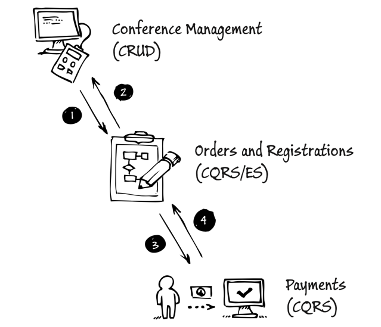
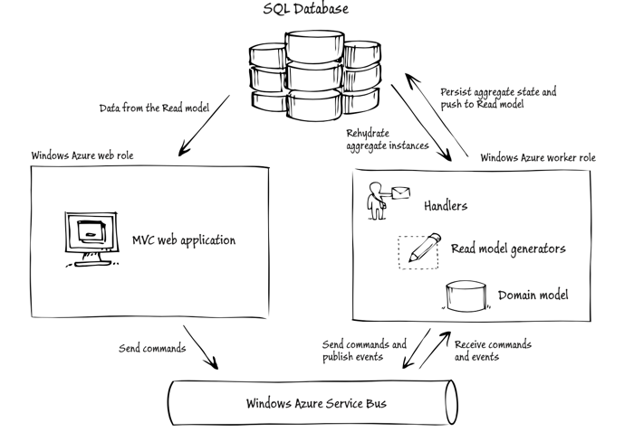

# CQRS Journey

CQRS
Martin Fowler -> 읽기 모델, 쓰기 모델을 분리하는 것?
Greg Young -> 읽기 담당 오브젝트, 쓰기 담당 오브젝트를 분리하는 것

The CQRS Pattern and event sourcing are not mere simplistic solutions to the problems associated with large-scale,
distributed systems.

## Journey 1 - Our Domain: Conference Management System

multi-tenancy 여러 고객에게 서비스를 제공하는 아키텍처

DDD는 써봄, CQRS는 경험해본 사람은 없다고 가정

### Overview of the system
- Manage the sale of different seat types for the conference
- Create a conference and define characteristics of that conference

### Selling seats for a conference
### Creating a conference

### NonFunctional Requirements

Scalability,
Flexibility,

## Journey 2 - Decomposing the domain

### Definition used in this chapter

- Domain
- Bounded context
- Context Map

### Bounded contexts in the conference management system
#### Order and Registration (CQRS/ES)
- Order
  - reservation, payment, registration items (order 1 : N orderItems)
- Reservation
  - seat, ordering process (reservation 1 : N seat)
- If the registrant does not pay for the tickets with 15 minutes, 
the system deletes the reservation and the seats become available for other registrants to reserve 

#### Conference Management (CRUD)
- The name, description, and slug
- The start and end dates of the conference
- The different types and quotas of seats available at the conference

#### Payment (CQRS)

#### Discount Policy, Occasionally Disconnected, Submissions and schedule

### The Context map for the consoto conference management system
1. Events that report when conference have been created, updated, or published. Events that report when seat types have been created or updated
2. Events that report when orders have been created or updated. Events that report when attendees have been assigned to seats.
3. Requests for a payment be made.
4. Acknowledgement of the success or failure of the payment.

## Journey 3 - Orders and Registration Bounded Context

### Domain
- attendee
- registrant
- user
- seat assignment
- order
- order item
- seat
- reservation
- seat availability
- conference site

### Pattern and concepts

1. two separate aggregates
2. a single aggregate
3. using a process manager

first not use event sourcing

> the system must
> check that sufficient seats are available
> record detail of the registration
> update the total number of seats booked for the conference

Validation, Transaction Boundaries, Concurrency, Aggregate and aggregate roots 

### High level architecture
1. Querying the read model
2. issuing commands -> asynchronously and once only to a single recipient
3. handling commands
4. initiating business logic in the domain
5. persisting the changes
6. polling the read model

command model
command > fire and forget

### Impact on testing

We might have a set of tests that we can use to test our domain objects, and all of those tests might be passing.
We might also have a set of tests to verify that our ORM layer can save and retrieve objects successfully.

## Journey 4 - Extending and Enhancing the Orders and Registration Bounded Context

The specific topics described in this chapter include
- Improvements to the way message correlation works with the RegistrationProcessManager class, This illustrates how aggregate instances within the bounded context can interact in a complex manner.
- Implementating a record locator to enable a registrant to retrieve an order that she saved during a previous session. This illustrates adding some additional logic to the write side that enables you to locate an aggregate instance without knowing its unique ID
- Adding a countdown timer to the UI to enable a registrant to track how much longer they habe to complete an order. This illustrates enhancements to the write side to support the display of rich information in the UI
- Supporting orders for multiple seat types simultaneously. For example, a registrant requests five seats for a preconference event and eight seats for the full conference. This requires more complex business logic on the write side
- CQRS command validation. This illustrates how to make use of the model validation feature in MVC to validate your CQRS commands before you send them to the domain

Command - MakeSeatReservation > A command bus trans- ports commands that command handlers then dispatch to aggregates. Sending a command is an asynchronous operation with no return value. 
Event - OrderConfirmed > Multiple subscribers can handle a specific event. Aggregates pub- lish events to an event bus; handlers register for specific types of events on the event bus and then deliver the events to the subscriber. In this bounded context, the only subscriber is a process manager.
Process Manager - The process manager in this bounded context can receive com- mands as well as subscribe to events.

### User Stories
Orders and Registrations bounded context

- Implement a login using a record locator
- Tell the registrant how much time remains to complete an order
- Enable a registrant to create an order that includes multiple seat types

#### ARCHITECTURE

### Patterns and concepts

#### Record Locators

#### Querying the read side
In this initial exploration of the CQRS pattern, the team decided to use SQL views in the database as the underlying source of the data queried by the MVC controllers on the read side.

> The team will split the database into two and explore options for pushing changes from the normalized write side to the denormalized read side in a later stage of the journey. 

#### Storing denormalized views in a database
One common option for storing the read-side data is to use a set of relational database tables to hold the denormalized views.

two approaches to implementing the ViewRepository
- IQueryable interface and using non-generic data access objects (DAO)

IQueryable
Simplicity, Testability(Mock)

non-generic DAOs
Simplicity, Flexibility, Performance, Testability

#### CQRS Command Validation

You should be careful to distinguish between errors and business failures. 
Examples of errors include:
• A message is not delivered due to a failure in the messaging infrastructure.
• Data is not persisted due to a connectivity problem with the database.
In many cases, especially in the cloud, you can handle these errors by retrying the operation.
A business failure should have a predetermined business response. 
For example:
• If the system cannot reserve a seat because there are no seats left, then it should add the request to a wait list.
• If a credit card payment fails, the user should be given the chance to either try a different card, or set up payment by invoice.

#### The countdown timer and the read model

### Implementation Details

#### Order access code Record Locator
#### Countdown timer
#### Using ASP.NET MVE validation for commands

### Pushing changes to the read side

The system stores the denormalized order data in a SQL Database instance in two tables: the OrdersView and OrderItemsView tables. 
The OrderItemsView table includes the RequestedSeats column that contains data that only exists on the read side.

The OrderViewModelGenerator class handles these events and updates the read-side repository.

#### Querying the read side
The following code sample shows a nongeneric DAO class that the MVC controllers use to query for conference information on the read side. 
It wraps the ConferenceRegistrationDbContext class shown previously.

Previously, the aggregate raised either a ReservationAccepted or a ReservationRejected event, depending on whether there were sufficient seats. 
Now the aggregate raises a SeatsReserved event that reports how many seats of a particular type it could reserve. 
This means that the number of seats reserved may not match the number of seats requested; this information is passed back to the UI for the registrant to make a decision on how to proceed with the registration.

#### Acceptance tests and the domain expert
The team had the following goals for their acceptance testing approach:
• The acceptance tests should be expressed clearly and unambiguously in a format that the
domain expert could understand.
• It should be possible to execute the acceptance tests automatically.

