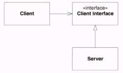
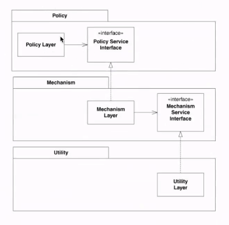

객체지향 개발 5대 원리 - SOLID 

!! SRP - Single Responsibility Principle

개발하는 단위는 변경하는 이유는 딱 한 가지여야함

이유가 여러개라면 분리를 해야한다, 낮은 결합도 높은 응집도

결합도 A라는 component와 B Component가 변화가 물결처럼 흘러간다. ripple effect

응집도가 높으면 프로그램을 이해하기 쉽다.

엔티티를 수정하는 이유는 도메인 로직이 변경되어서 mysql SRP를 위반하는 것이다.

SRP를 지키면 응집도가 높아진다.

!!OCP - Open Closed Principle (Solid에서 제일 중요하다)

STRATEGY pattern: client is both open and closed.

client 코드를 고칠 필요 없이 Server을 변경 가능하다.

interface에만 의존하기 때문에 코드가 바뀌지 않는다.

변경에는 열려있고 자기 자신은 변하지 않는다.

- template method 패턴

!! LSP - Liskov Substitution Principle

Functions that user pointers or references to base classes must be able to use objects of derived classes without knowing it

!! ISP - The Interface Segregation Principle

인터페이스를 너무 뚱뚱하게 만들지 말아라

등록 인터페이스, 사용 인터페이스 등등 다양하게 쪼개 놓는 것이 좋다.

필요한 기능만 사용할 수 있기 때문에

interface를 쪼갠다고 class를 쪼개지 않는다.

UserService - UserFinder, UserRegistrator

!! DIP - Dependency-Inversion Principle

High-level modules should not depend on low-level modules. Both should depend on abstractions

Abstractions should not depend upon details. Details should depend upon abstractions.

UserEncryptor 은 common에 Jasypt는 api에 있다.

상위레벨은 하위레벨에 의존하지 않게하고 추상화에만 의존하게 한다.

UserRepository 의 구현 class 는 하위 모듈에 구현된어 있다.