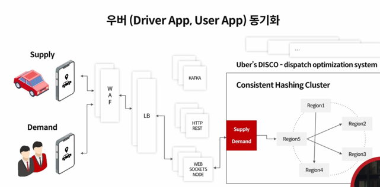
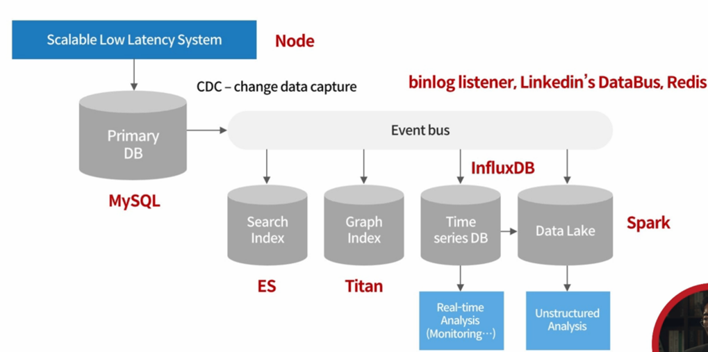

# 4천만 MAU를 지탱하는 기술 - 카카오 페이지

## 확장성과 안정성있는 서비스 시스템 설계 패턴

SPoF: Single Point of Failure
Active-Standby 이중화 구성

Server-level Scalability 
스택, db설계, 시스템 아키텍처 배포 관리

Code-level Scalability
언어 선정, 테이블 설계, 디자인 패턴, 버전 관리

웹 서버의 확장이 용이한 이유: 아무것도 공유하지 않는 구조 떄문
데이터베이스의 확장이 어려운 이유: 데이터베이스는 공유 자원이며, 데이터 관계의 복잡도 때문
(샤딩하여 트래픽을 분산하는 방법을 많이 사용한다.)

> 문제의 정의와 그를 해결하는 알고리즘 개발, 그리고 확장성 있는 소프트웨어 디자인과 구조를 통해 장애와 성능 문제를 최소화 할 수 있다.

## 대규모 서비스에서 알고리즘과 자료구조의 중요성

### 유클리드 거리 문제
유클리드, 구면 코사인 거리 -> 데이터베이스에 쿼리만 의존 -> 데이터 베이스 쿼리 조회 + 서버 분산 처리
공간 색인(Spatial Indexing)을 지원하는 db를 사용한다.

### 안심번호 할당문제 (Lock, Mutex, Semaphore) - Google, Chubby
안심번호를 원하는 고객에게 할당하라

Lock Manager를 통해 Acquires lock

간단한 기능 요구사항을 하나 구현하더라고, 알고리즘을 잘 알고 모르고에 따라 구현의 성숙도, 품질, 생산성이 크게 달라질 수 있다.

## 코드 유지보수성과 확장성을 높이는 디자인 패턴
절차 -> 구조 -> 객체지향 (작은 객체를 기본 단위로 큰 문제를 해결)

### object composition
객체합성 구조를 통해 확장성을 획득 (DI)

### logical architecture
대규모의 소프트웨어 클래스를 패키지, 서브시스템 및 레이어로 조직화 한 것
### 함수형 언어 모델
fault tolerance, concurrent safety, easy to use

코드 유지보수성, 재사용성, 확장성을 위해 디자인 패턴을 공부하자

## 데이터 모델과 트랜잭션 디자인
### 논리적 데이터 아키텍처
객체 기반의 개체-관계 ER, 행 기반의 관계형

### 트랜잭션
데이터베이스의 상태를 변화시키기 위해서 수행하는 논리적 작업의 단위

### 트랜잭션 인터페이스 디자인
트랜잭션이 클라이언트에게 명시적인지 묵시적인지 가장 중요

## 개발 프로세스 운영 관리 및 배포 시스템 디자인
rolling deployment (순차적으로 패치), blue/green deployments(전체 서버를 스와핑 하는 방식), canary deployments(트래픽을 순차적으로 이주)

## 실시간 속성의 서비스 데이터 처리
실시간 시스템 + event-driven

real time database
Firebase RTDB (공장 자동화, 항공 우주, 교통 제어, 주식 거래)

관계형 db + pubsub 디자인 패턴, 실시간/시계열 데이터 베이스, NoSQL 등

