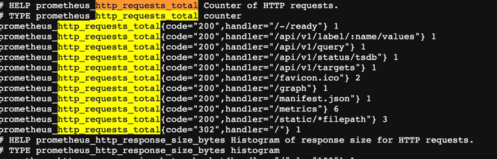
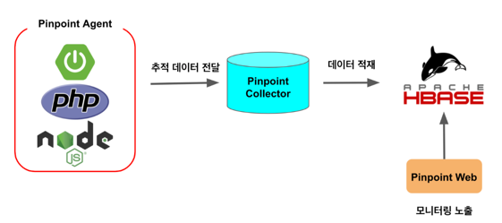
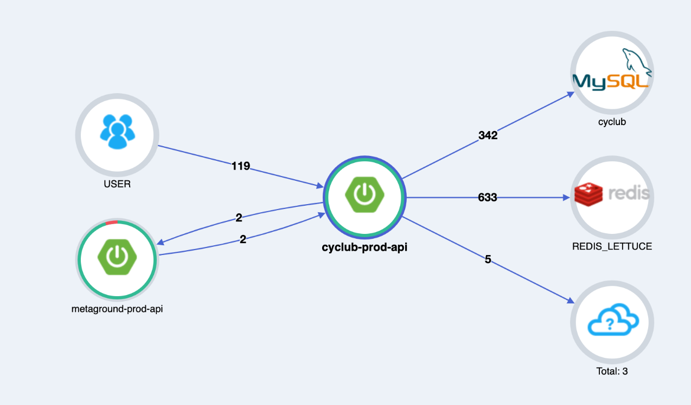

# monitoring

## prometheus, grafana

### prometheus

```sh
brew install prometheus
sudo mkdir /usr/local/prometheus
sudo chown mac:admin prometheus

tar -xvf prometheus.tar

./startup.sh
```


프로메테우스는 타겟 서버한테 데이터를 요청해서 가져온다.
시계열 데이터베이스

rule promql -> prometheus read only
```
lobal:
scrape_interval: 15s

rule_files:
- "rules/myrules.yml"

scrape_configs:
- job_name: "prometheus"
  static_configs:
    - targets: ["localhost:9090"]
```


그라파나가 promql을 짜서 prometheus(수집기+시계열db) 요청함


잠깐 떴다가 죽는 서버인 경우는 푸시서버를 둔다.

node-exporter linux나 윈도우 서버 정보를 가져오고 싶을때
spring-exporter 적용
(ami 다운 받아서 하도록)

ip를 조회했었지만 -> aws에서 스케일 아웃 될 때마다 설정할 수 없으니 -> prometheus aws ec2 가져오는 문법을 사용하면 됨 (ec2_se_configs)
path > /actuator/prometheus
actuator, micrometer를 넣어주면 할 수 있음

! 이름 예쁘게 변경 relabel_config 

### grafana


[grafana dashboard](https://grafana.com/grafana/dashboards/)
디자인 (node-exporter > settings > json Model)

amazon rds도 보고 싶음 > data source > CloudWatch, Prometheus
(aws iam 계정에서 권한 만들어서 access key 만들고 cli 를 넣어주면 다 할 수 있음)

대시보드 꾸미기

micrometer가 
G1, GC, HikairCP, Stop the world 확인할 수 있도록 해줌


## pinpoint (Application Performance Monitoring)



### 구성
- Pinpoint Agent
  - 애플리케이션의 모니터링 정보를 Collector로 전달
- Pinpoint Collector
  - Agent에서 받은 정보를 HBase에 적재
- Pinpoint Web
  - 적재된 데이터를 Web으로 노출하여 모니터링 제공

###
```shell
1. HBase 구성

wget https://archive.apache.org/dist/hbase/1.2.7/hbase-1.2.7-bin.tar.gz

tar xzf hbase-1.2.7-bin.tar.gz

hbase/bin/start-hbase.sh

wget https://raw.githubusercontent.com/pinpoint-apm/pinpoint/master/hbase/scripts/hbase-create.hbase

hbase/bin/hbase shell ../hbase-create.hbase

2. Collector & Web

1. Collector
wget https://github.com/pinpoint-apm/pinpoint/releases/download/v2.2.2/pinpoint-collector-boot-2.2.2.jar

chmod +x pinpoint-collector-boot-2.2.2.jar

nohup java -jar -Dpinpoint.zookeeper.address=localhost pinpoint-collector-boot-2.2.2.jar >/dev/null 2>&1 &

2. Web
wget https://github.com/pinpoint-apm/pinpoint/releases/download/v2.2.2/pinpoint-web-boot-2.2.2.jar

chmod +x pinpoint-web-boot-2.2.2.jar

nohup java -jar -Dpinpoint.zookeeper.address=localhost pinpoint-web-boot-2.2.2.jar >/dev/null 2>&1 &

PinPoint Agent 설치

# agent 설치
wget https://github.com/pinpoint-apm/pinpoint/releases/download/v2.2.2/pinpoint-agent-2.2.2.tar.gz

# 압축 해제
tar xvzf pinpoint-agent-2.2.2.tar.gz

# 이동
cd pinpoint-agent-2.2.2

# config 파일 수정
sudo vi pinpoint-root.config

# 127.0.0.1 로 되어있을 텐데, 앞서 구성한 Pinpoint EC2의 ip로 수정
profiler.transport.grpc.collector.ip=pinpoint ip로 변경

applicationName
Pinpoint에 연결된 많은 프로젝트들 중, 이 프로젝트를 구분짓기 위한 ID
스케일아웃하여 여러 EC2로 구성되어있더라도 같은 프로젝트라면 이 값을 모두 같은 값

agentId
같은 PINPOINT_APPLICATION_NAME 내에서 각 서버들을 구분하기 위한 ID

config
앞서 수정한 config를 명시해서 적용되도록 하는 것

Agent 실행
docker 를 이용해서 할 수 있지만 우리는 procfile을 다음과 같이 변경해서 배포하면 된다.

web: java -javaagent:/home/webapp/pinpoint-agent-2.2.2/pinpoint-bootstrap-2.2.2.jar -jar -Dpinpoint.config=/home/webapp/pinpoint-agent-2.2.2/pinpoint-root.config metaground-api.jar
```



## amazon eventBridge -> lambda -> server
