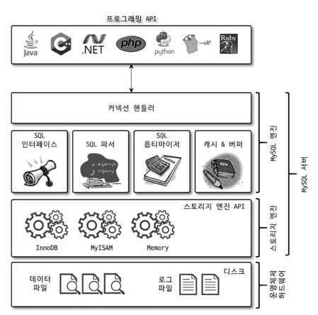

# Real MySQL

## 1. 소개

DMBS
- 안정성
- 성능과 기능
- 커뮤니티와 인지도

## 2. 설치와 설정

## 3. 사용자 및 권한

## 4. 아키텍처

### 4.1 MySQL 엔진 아키텍처

MySQL 엔진은 요청된 SQL 문장을 분석하거나 최적화하는 등 DBMS의 두뇌에 해당하는 처리를 수행하고, 실제 데이터를 디스크 스토리지에 저장하거나 디스크 스토리지로부터 데이러틑 읽어오는 부분은 스토리지 엔진이 전담한다.

핸들러 API
MySQL 엔진의 쿼리 실행기에서 데이터를 쓰거나 읽어야 할 때는 각 스토리지 엔진에 쓰기 또는 읽기를 요청하는데
이러한 요청을 핸들러 요청이라 함

MySQL 스레딩 구조 (포그라운드 스레드 커넥션, 캐시) -> 백그라운드 스레드

#### 쿼리 실행 구조
쿼리 파서 > 전처리기 > 옵티마이저 > 실행 엔진 > 핸들러

쿼리 캐시
스레드 풀

#### InnoDB
유일하게 레코드 기반의 잠금을 제공하며, 그 때문에 높은 동시성 처리가 가하고 안정적이며 성능이 뛰어나다.
- 프라이머리 키를 기준으로 클러스터링되어 저장된다.
- 외래 키 지원

MVCC(Multi Version Concurrency Control)

데이터 변경시 데이터 반영은 격리 수준에 따라 다르다.
READ_COMMITTED, READ_UNCOMMITTED, REPEATABLE_READ, SERIALIZABLE

UPDATE 쿼리가 실행되면 InnoDB 버퍼 풀은 즉시 새로운 데이터로 변경 COMMIT 하면 영구정인 데이터로 만든다.
롤백하면 언두 영역에 있는 백업된 데이터를 InnoDB 버퍼 풀로 다시 복구하고 언두 삭제

잠금 없는 일관된 읽기, 자동 데드락 감지, 자동화된 장애 복구

#### 언두 로그 레코드 모니터링
DML로 변경 되기 이전 버전의 데이터를 별도로 백업한다. 백업된 데이터를 언두 로그라고 한다.
- 트랜잭션 보장
- 격리 수준 보장

#### 어댑티브 해시 인덱스