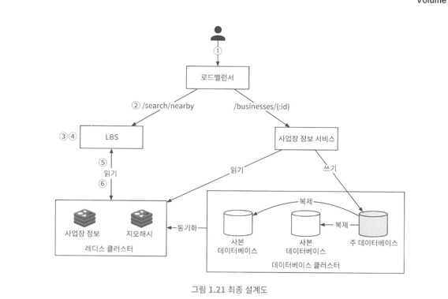
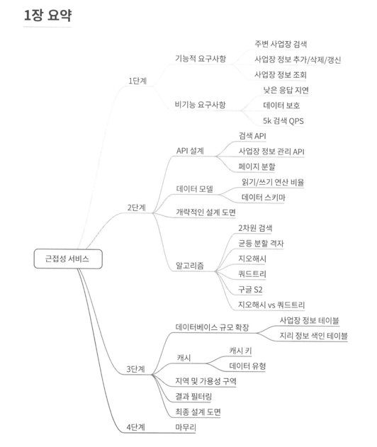
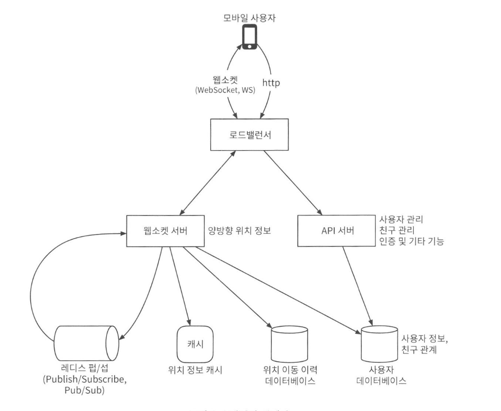
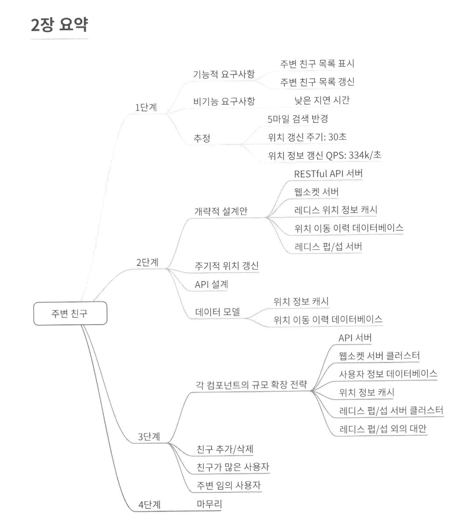

# 가상 면접 사례로 배우는 대규모 시스템 설계 2

## 1장 근접성 서비스
근접성 서비스는 음식점, 호텔, 극장, 박물관 등 현재 위치에서 가까운 시설을 찾는 데 이용되며 주변에 있는 좋은 식당 검색, 구글맴의 경우에는 가까운 k개 주유소

### 1단계: 문제 이해 및 설계 범위 확정

질문을 던져 설계 범위를 줄인다.

기능 요구사항
- 사용자의 위치와 검색 반경 정보에 매치되는 사업장 목록을 반환
- 사업장 소유주가 사업장 정보를 추가, 삭제, 갱신, 그 정보가 실시간으로 반영될 필요는 없음
- 고객은 사업장의 상세 정보를 살필 수 있어야함

비기능 요구사항
- 낮은 응답 지연
- 데이터 보호
- 고가용성 및 규모 확장성

개량적 규모 추정
DAU 1억명, 사업장 수 2억
QPS = (1억 * 5 ) / (24 * 60 * 60 ~ 10^5) = 5000

### 2단계: 개략적 설계안 제시 및 동의 구하기

- API 설계
    - 특정 검색 기준 사업장 목록 (위도, 경도, radius)
    - 사업장 관련 api

- 개략적 설계안

- 주변 사업장 검색 알고리즘

Geohash in redis, Postgres with postGIS

방안 1: 2차원 검색
위도 또는 경도만 성능 개선 할 수 있음 -> 2차원 데이터를 한 차원에 대응시킬 밥법이 있을까 (지도를 작은 영역으로 분할하고 고속 검색이 가능하도록 색인을 만드는 것)
해시 기반 방안: 균등 격자, 지오해시, 카르테시안 계층
트리 기반 방안: 쿼드 트리, 구글 S2, R트리

방안 2: 균등 격자
지도를 작은 격자 또는 구획으로 나누는 단순한 접근법
동작은 하지만 사업장 분포가 균등하지 않다.

방안 3: 지오해시
지오해시 알고리즘은 비트를 하나씩 늘려가면서 재귀적으로 세계를 더 작은 격자로 분할해 나간다.
지오해시는 통상적으로 base32 표현법을 사용

최적 정밀도 구하기
반경   지오해시 길이
0.5km -> 6
1km -> 5
2km -> 5
5km -> 4
20km-> 4

경계 조건 처리는 면접관과 상의

표시할 사업장이 충분하지 않으면 영역을 넓힘

방안 4: 쿼드트리

방안 5: 구글 S2

지오해시 vs 쿼드트리

- 데이터 모델
    - 읽기 쓰기 비율 및 스키마 설계
    - 읽기 비율이 높음 (geohash)

### 3단계: 상세설계

데이터베이스 규모 확장성

사업장 테이블 : 사업장 id를 기중으로 샤딩
지리 정보 색인 테이블

캐시
정말 필요한가를 생각해보기

요약 사진 넣기

## 2장 주변 친구

근접성 서비스의 경우 사업장 주소가 정적
주변 친구 위치는 자주 바뀔 수 있음

### 1단계: 문제 이해 및 설계 범위 확정

기능 요구사항
- 사용자는 모바일 앱에서 주변 친구를 확인할 수 있어야함, 마지막 갱신 시간도 표시
- 친구 목록은 몇 초마다 한 번씩 갱신

비기능 요구사항
- Low latency
- 안정성
- Eventual consistency

개략적 규모 추정
- 주변 친구는 5마일 이내
- 친구 위치 정보는 30초 주기로 갱신 (사람이 걷는 시간은 3,4마일 정도기 때문)
- 평균 사용자 1억명
- 동시 접속 사용자수는 DAU의 약 10%로 가정
- 평균적으로 400명의 친구를 가짐
- 페이지당 20명의 친구를 표시하고, 더 많은 친구 보여줌

QPS 계산
- 천만 / 30초마다 호출 = 334,000

### 2단계: 개략적 설계안 제시 및 동의 구하기

개략적 설계
백엔드
- 모든 활성 상태 사용자의 위치 변화 내역을 수신
- 사용자 위치 변경 내역을 수신할 때마다 해당 사용자의 모든 활성 상태 친구를 찾아서 그 친구들의 단말로 변경 내역을 전달
- 두 사용자 사이의 거리가 특정 임계치보다 먼 경우에는 변경 내역을 전송하지 않음
  친구 400명의 친구를 갖는다고 하면 1400만건 보내야해서 문제 있음

API 설계

레디스 쓰고
위치 이동은 데이터베이스에 넣음

데이터 모델

### 3단계: 상세 설계
얼마나 많은 레디스 펍/섭 서버가 필요한가?

메모리 사용량
모든 활성 사용자 1억 - 구독자 한명 20바이트 200GB
100GB의 메모리를 설치할 수 있는 최신 서버 두 대면 된다.

CPU 사용량
초당 1400만건 기가비트 네트워크 카드를 탑재한 현대적 아키텍처의 서버 한 대로 감당 가능한 구독자의 수는 100,000 정도
140대 가 필요

본 설계안이 풀어야 하는 문제의 규모를 감당하려면 분산 레디스 펍섭 클러스터가 필요

서비스 탐색 컴포넌트를 도입 - etcd, 주키퍼 등
펍/섭 서버 교체 알고리즘

친구 추가/삭제
친구가 많은 사용자
주변의 임의 사용자

레디스 펍/섭 이외에 얼랭이 해결책이 될 수 있다.

