# 가상 면접 사례로 배우는 대규모 시스템 설계 2

## 1장 근접성 서비스
근접성 서비스는 음식점, 호텔, 극장, 박물관 등 현재 위치에서 가까운 시설을 찾는 데 이용되며 주변에 있는 좋은 식당 검색, 구글맴의 경우에는 가까운 k개 주유소

### 1단계: 문제 이해 및 설계 범위 확정

질문을 던져 설계 범위를 줄인다.

기능 요구사항
- 사용자의 위치와 검색 반경 정보에 매치되는 사업장 목록을 반환
- 사업장 소유주가 사업장 정보를 추가, 삭제, 갱신, 그 정보가 실시간으로 반영될 필요는 없음
- 고객은 사업장의 상세 정보를 살필 수 있어야함

비기능 요구사항
- 낮은 응답 지연
- 데이터 보호
- 고가용성 및 규모 확장성

개량적 규모 추정
DAU 1억명, 사업장 수 2억
QPS = (1억 * 5 ) / (24 * 60 * 60 ~ 10^5) = 5000

### 2단계: 개략적 설계안 제시 및 동의 구하기

- API 설계
    - 특정 검색 기준 사업장 목록 (위도, 경도, radius)
    - 사업장 관련 api

- 개략적 설계안
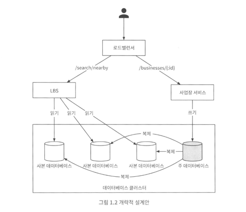
- 주변 사업장 검색 알고리즘

Geohash in redis, Postgres with postGIS

방안 1: 2차원 검색
위도 또는 경도만 성능 개선 할 수 있음 -> 2차원 데이터를 한 차원에 대응시킬 밥법이 있을까 (지도를 작은 영역으로 분할하고 고속 검색이 가능하도록 색인을 만드는 것)
해시 기반 방안: 균등 격자, 지오해시, 카르테시안 계층
트리 기반 방안: 쿼드 트리, 구글 S2, R트리

방안 2: 균등 격자
지도를 작은 격자 또는 구획으로 나누는 단순한 접근법
동작은 하지만 사업장 분포가 균등하지 않다.

방안 3: 지오해시
지오해시 알고리즘은 비트를 하나씩 늘려가면서 재귀적으로 세계를 더 작은 격자로 분할해 나간다.
지오해시는 통상적으로 base32 표현법을 사용

최적 정밀도 구하기
반경   지오해시 길이
0.5km -> 6
1km -> 5
2km -> 5
5km -> 4
20km-> 4

경계 조건 처리는 면접관과 상의

표시할 사업장이 충분하지 않으면 영역을 넓힘

방안 4: 쿼드트리

방안 5: 구글 S2

지오해시 vs 쿼드트리

- 데이터 모델
    - 읽기 쓰기 비율 및 스키마 설계
    - 읽기 비율이 높음 (geohash)

### 3단계: 상세설계

데이터베이스 규모 확장성

사업장 테이블 : 사업장 id를 기중으로 샤딩
지리 정보 색인 테이블

캐시
정말 필요한가를 생각해보기

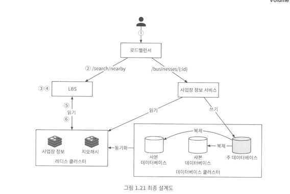

요약 사진 넣기
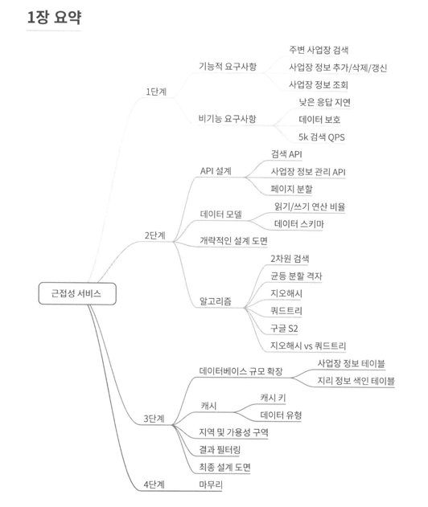

## 2장 주변 친구

근접성 서비스의 경우 사업장 주소가 정적
주변 친구 위치는 자주 바뀔 수 있음

### 1단계: 문제 이해 및 설계 범위 확정

기능 요구사항
- 사용자는 모바일 앱에서 주변 친구를 확인할 수 있어야함, 마지막 갱신 시간도 표시
- 친구 목록은 몇 초마다 한 번씩 갱신

비기능 요구사항
- Low latency
- 안정성
- Eventual consistency

개략적 규모 추정
- 주변 친구는 5마일 이내
- 친구 위치 정보는 30초 주기로 갱신 (사람이 걷는 시간은 3,4마일 정도기 때문)
- 평균 사용자 1억명
- 동시 접속 사용자수는 DAU의 약 10%로 가정
- 평균적으로 400명의 친구를 가짐
- 페이지당 20명의 친구를 표시하고, 더 많은 친구 보여줌

QPS 계산
- 천만 / 30초마다 호출 = 334,000

### 2단계: 개략적 설계안 제시 및 동의 구하기

개략적 설계
백엔드
- 모든 활성 상태 사용자의 위치 변화 내역을 수신
- 사용자 위치 변경 내역을 수신할 때마다 해당 사용자의 모든 활성 상태 친구를 찾아서 그 친구들의 단말로 변경 내역을 전달
- 두 사용자 사이의 거리가 특정 임계치보다 먼 경우에는 변경 내역을 전송하지 않음
  친구 400명의 친구를 갖는다고 하면 1400만건 보내야해서 문제 있음

API 설계
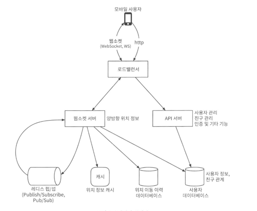

레디스 쓰고
위치 이동은 데이터베이스에 넣음

데이터 모델

### 3단계: 상세 설계
얼마나 많은 레디스 펍/섭 서버가 필요한가?

메모리 사용량
모든 활성 사용자 1억 - 구독자 한명 20바이트 200GB
100GB의 메모리를 설치할 수 있는 최신 서버 두 대면 된다.

CPU 사용량
초당 1400만건 기가비트 네트워크 카드를 탑재한 현대적 아키텍처의 서버 한 대로 감당 가능한 구독자의 수는 100,000 정도
140대 가 필요

본 설계안이 풀어야 하는 문제의 규모를 감당하려면 분산 레디스 펍섭 클러스터가 필요

서비스 탐색 컴포넌트를 도입 - etcd, 주키퍼 등
펍/섭 서버 교체 알고리즘

친구 추가/삭제
친구가 많은 사용자
주변의 임의 사용자

레디스 펍/섭 이외에 얼랭이 해결책이 될 수 있다.

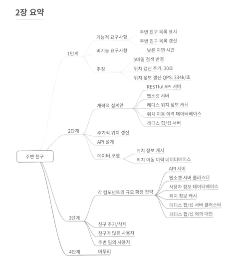

## 3장 구글 맵

### 기능 요구사항

- 사용자위치갱신
- 경로 안내서비스(ETA 서비스 포함)
- 지도표시

비기능 요구사항
- 정확도: 사용자에게 잘못된 경로를 안내 하면 안된다.
- 부드러운 경로표시: 클라이언트를 통해 제공되는 경로안내 용도의 지도는 화면에 아주 부드럽게 표시 되고 갱신 되어야한다.
- 데이터 및 배터리 사용량 : 클라이언트는 가능한 한 최소한의 데이터와 배터리를 사용
- 일반적으로 널리 통용되는 가용성 및 규모 확장성 요구사항을 만족

지오코딩
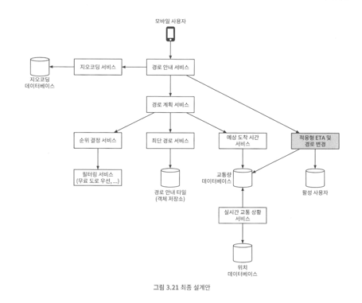

## 4장 분산 메시지 큐

- 결합도 완화
- 규모 확장성 개선
- 가용성 개선
- 성능 개선

데이터 장기 보관, 메시지 반복 소비

### 기능 요구사항
- 생산자는 메시지 큐에 메시지를 보낼 수 있어야 한다.
- 소비자는 메시지 큐를 통해 메시지를 수신할 수 있어야 한다.
- 메시지는 반복적으로 수신할 수도 있어야 하고, 단 한 번만 수신하도록 설정 될 수 있음
- 오래된 이력 데이터는 삭제될 수 있다.
- 메시지 크기는 킬로바이트 수준
- 메시지가 생산된 순서대로 소비자에게 전달할 수 있어야 한다.
- 메시지 전달 방식은 최소 한 번, 최대 한 번, 정확히 한 번 가운데 설정

### 비기능 요구사항
- 높은 대역폭과 낮은 전송 지연 가운데 하나를 설정
- 규모 확장성, 메시지 양이 급증해도 처리 가능
- 지속성 및 내구성

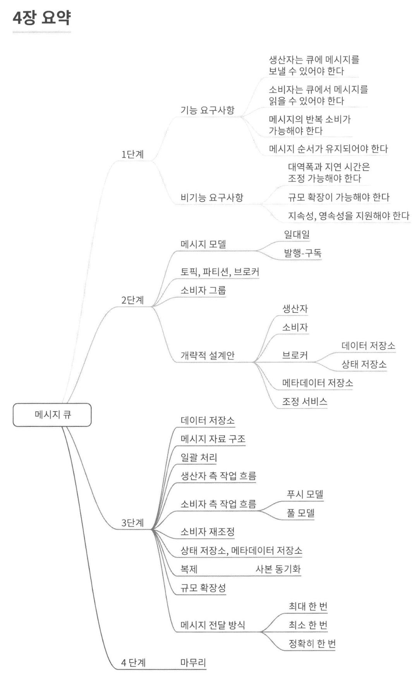

## 5장 지표 모니터링 및 경보 시스템

## 개략적 요구사항
- 대규모 인프라를 모니터링
  - 일간 능동 사용자 수 1억명
  - 서버 풀 1000개, 풀당 서버 수 100개, 서버당 100개의 운영 지표
  - 데이터 보관 기간은 1년
  - 수집한 그대로 데이터를 보관하는 기간은 일주일, 그 뒤에는 1분 다누이 데이터로 변환한 후에 30일간 보관 그뒤에 1시간 단위로 1년간 보관
- CPU 사용률, 요청수, 메모리 사용량, 메시지 큐 내의 메시지 수

## 비기능 요구사항
- 낮은 응답 지연
- 안정성
- 유연성

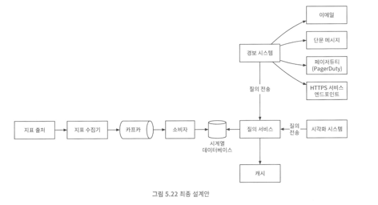

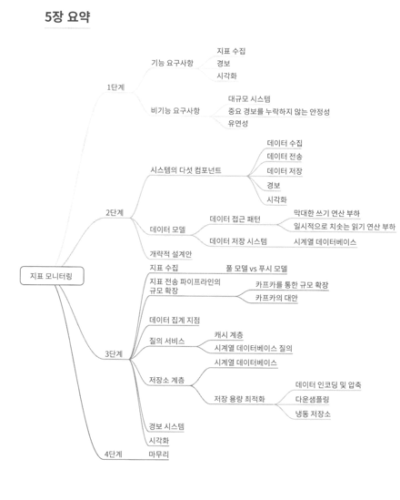

## 6장 광고 클릭 이벤트 집계

디지털 광고의 핵심 프로세스는 RTB(Real-Time Bidding)

### 기능 요구사항
- 지난 M분 동아느이 ad_id 클릭 수 집계
- 매분 가장 많이 클릭된 상위 100개 광고 아이디를 반환
- 다양한 속성에 따른 집계 필터링을 지원
- 데이터의 양은 페이스북이나 구글 규모

### 비기능 요구사항
- 집계 결과 정확성은 데이터가 RTB 및 광고 과금에 사용되므로 중요
- 지연되거나 중복된 이벤트를 적절히 처리할 수 있어야 함
- 견고성: 부분적인 장애는 감내
- 지연 시간 요구사항: 전체 처리 시간은 최대 수 분을 넘지 않아야 함

### 개략적 추정
- DAU 10억명
- 하루 1개 광고 ㅋ르릭
- TPS 10,000QPS
- 최대 50,000QPS
- 이벤트 하나당 일간 0.1KB 면 100GB, 월간 3TB

원시 데이터는 백업 데이터, 평소에는 집계 결과 데이터를 사용

원시 데이터는 쓰기 및 시간 범위 질의에 최적화된 카산드라나 InfluxDB를 사용하는 것이 바람직

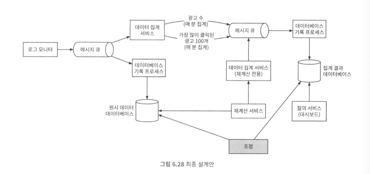

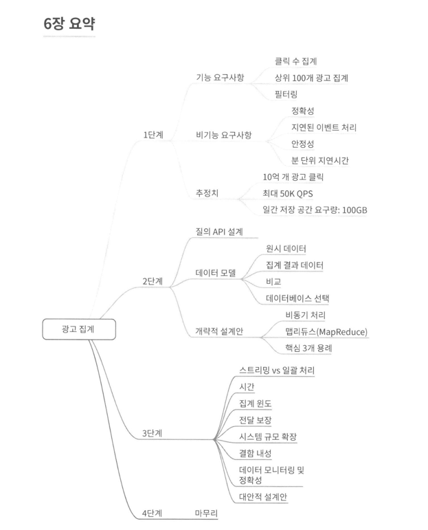

## 7장 호텔 예약 시스템

### 비기능 요구사항
- 높은 수준의 동시성 지원: 성수기, 대규모 이벤트 기간에는 일부 인기 호텔의 특정 객실을 예약하려는 고객이 많이 몰릴 수 있다.

### 개략적 규모 추정
- 5000개 호텔, 100만 개의 객식
- 편균적으로 객실의 70% 사용 중, 평균 투숙 기간은 3일
- 일일 예상 예약 건수,  1백만 * 0.7 / 3 = 233,333
- 초당 예약 건수 3TPS

객실 상세 페이지 QPS = 300
예약 상세 페이지 QPS = 30
객실 예약 페이지 QPS = 3

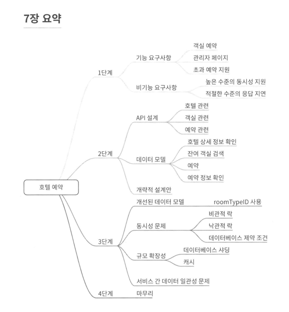

## 8장 분산 이메일 서비스

### 비기능 요구사항
- 안정성: 이메일 데이터는 소실되면 안 됨
- 가용성: 장애 발생해도 시스템 계속
- 확장성: 사용자 많아도 성능 저하 X
- 유연성과 확장성: 새 컴포넌트, 성능 개선 유연하게

### 개략적 규모
- 10억 명의 사용자
- 하루 10건 100,000 QPS
- 메타데이터 10억명 * 40건 * 365일 * 50KB = 730PB

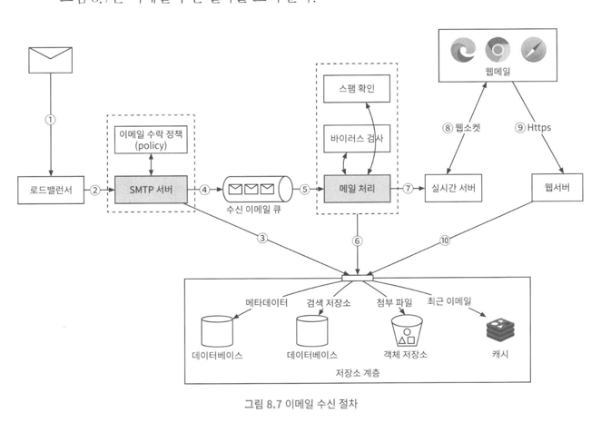

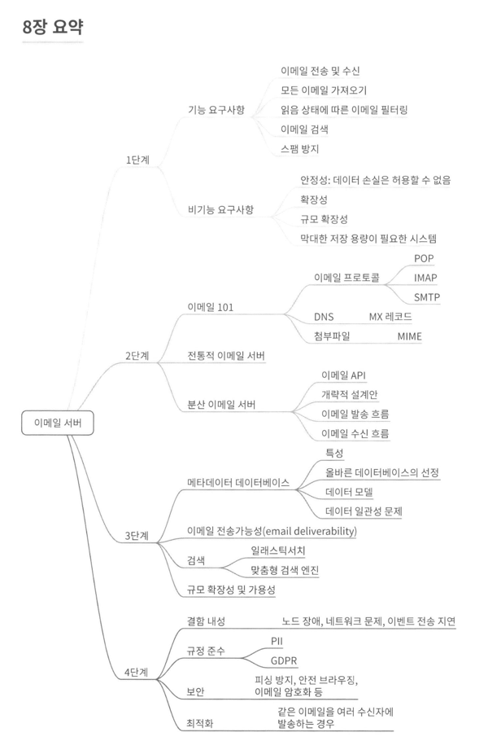

## 9장 S3와 유사한 객체 저장소

### 비기능
- 100PB 데이터
- six nines 수준의 데이터 내구성
- four nines 수준의 서비스 가용성
- 저장소 효율성

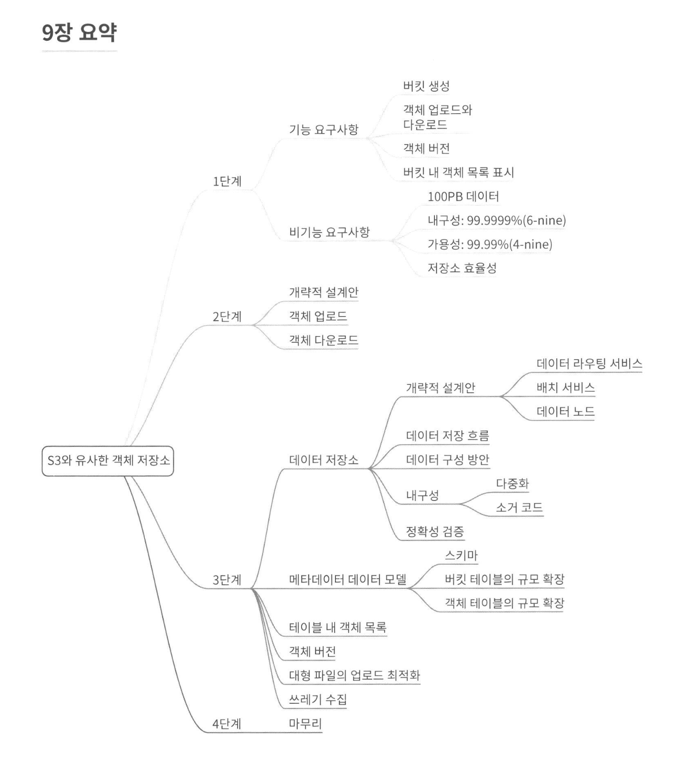

## 10장 실시간 게임 순위표

### 기능 요구사항
- 순위표 상위 10명의 플레이어를 표시
- 특정 사용자의 순위를 표시
- 어떤 사용자보다 4순위 위 아래에 있는 사용자를 표시

### 비기능 교수사항
- 점수 업데이트는 실시간으로 순위표에 반영한다.
- 일반적인 확장성, 가용성 및 안정성 요구사항

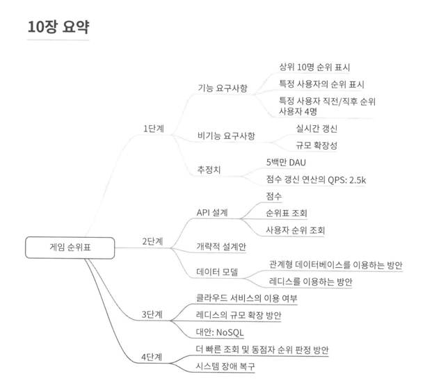

## 11장 결제 시스템

### 기능 요구사항
- 대금 수신(pay-in) 흐름: 결제 시스템이 판매자를 대신하여 고객으로부터 대금을 수령한다.
- 대금 정산(pay-out) 흐름: 결제 시스템이 전 세계의 판매자에게 제품 판매 대금을 송금한다.

### 비기능 요구사항
- 신뢰성 및 내결함성: 결제 실패는 신중하게 처리해야 한다.
- 내부 서비스(결제 시스템, 회계 시스템)와 외부 서비스(결제 서비스 제공업체)간의 조정 프로세스: 시스템 간의 결제 정보가 일치하는지 비동기적으로 확인한다.

### 개략적인 규모
100만건 /10^5초 = 10TPS

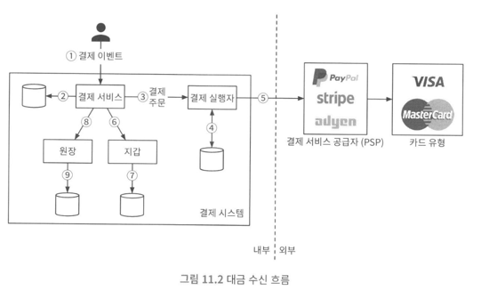

### 복식부기 원장 시스템
복식 부기는 모든 결제 시스템에 필수 요소이며 정확한 기록을 남기는 데 핵심적 역할을 한다.
모든 결제 거래를 두 개의 별도 원장 계좌에 같은 금액으로 기록한다.
한 계좌에서는 차감 다른 계좌에는 입금이 이루어진다.

### PSP 결제

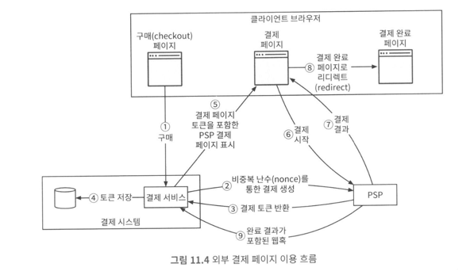

### 조정
원장과 지갑의 상태가 같은지 확인할 수 있음

### 실패처리, 정확히 한 번 전달이 중요

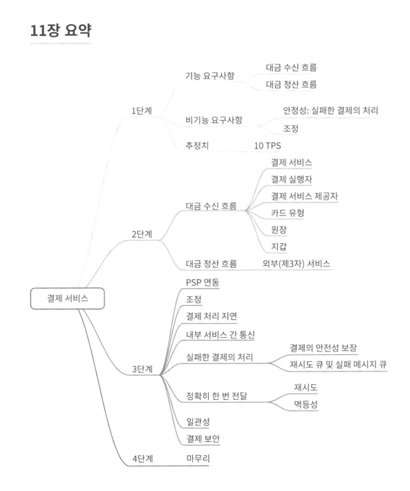

## 12장 전자 지갑

지갑 간 이체를 지원하는 전자 지갑 애플리케이션의 백엔드를 설계 요청

### 개략적 설계안
- API 설계

- 메모리 기반(원자성 부족) >
- 데이터베이스 기반 분산 트랜잭션(2단계 커밋, 단계별 상태 테이블, 사가) >
- 재현성을 갖춘 이벤트 소싱 솔루션
명령과 이벤트의 차이점
1. 이벤트는 검증된 사실로 실행이 끝난 상태
2. 명령에는 무작위성이나 I/O가 포함될 수 있지만 이벤트는 결정론적이다.
이벤트를 FIFO 큐에 저장
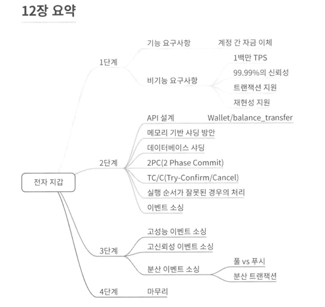

## 13장 증권 거래소

- 가용성, 결함내성, 지연시간, 보안

### 개량적 규모
- 100가지 주식, 하루 10억 건
- QPS = 10억 / (6.5시간 * 3600) = 43000
- 최대 QPS = 5 * QPS

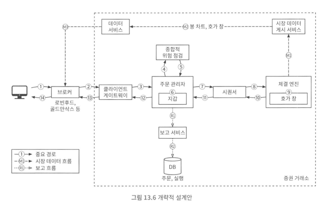

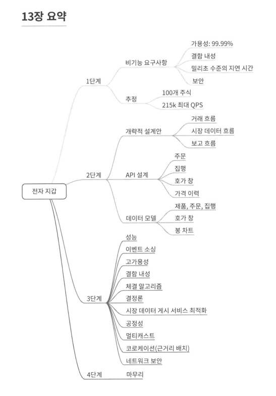

