# 마이크로서비스 패턴

## 1장 모놀리식 지옥에서 벗어나라

### 1.1 서서히 모놀리식 지옥에 빠져들다
대금 지불은 스트라이프(Stripe), 메시지 전송은 트윌리오(Twilio), 이메일 발송은 AWS SES(Simple Email Service) 등 서드 파티 웹서비스를 활용
시간이 흐를수록 점점 커지면서 애플리케이션이 복잡해졌음

#### 1.1.1 FTGO 애플리케이션 아키텍처

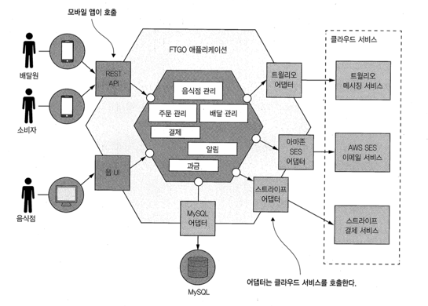

논리적으로는 모듈화한 아키텍처임에도 애플리케이션은 WAR 파일 하나로 패키징했음

#### 1.1.2 모놀리식 아키텍처의 장점
- 개발이 간단
- 애플리케이션을 쉽게 변경: 코드, db, 스키마 변경
- 테스트하기 쉽다.
- 배포하기 쉽다.
- 확장하기 쉽다: 뒷면에 애플리케이션 인스턴스를 여러 개 실행

#### 1.1.3 모놀리식 지옥의 일상

- 개발이 더딤
- 커밋부터 배포까지 험난하다.
- 확장하기 어렵다
- 모놀리스는 확실하게 전달하기 어렵다
- 갈수록 기술 스택에 발목이 붙잡힌다.

### 1.2 이 책의 대상 독자
- 3계층, 애플리케이션 설계, 객체 지향, RDBMS 사용법, 메시지 브로커, 인증/인가 보안 개념을 잘 알아야함

### 1.3 이 책의 학습 내용
- 마이크로서비스 장단점, 분산 데이터 관리 패턴, 효과적인 테스트, 배포 옵션, 리팩터링
- 아키텍처링, 서비스 로직 개발, 사가를 이용한 데이터 일관성, 여러 서비스에 걸친 쿼리, 효율적 테스트

### 1.4 마이크로서비스 아키텍처가 답이다

#### 1.4.1 확장 큐브와 마이크로서비스
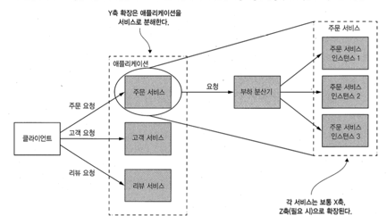

#### 1.4.2 마이크로서비스는 모듈성을 갖고 있다.
#### 1.4.3 서비스마다 DB가 따로 있따

#### 1.4.4 FTGO 마이크로서비스 아키텍처
- 주문서비스
- 배달 서비스
- 음식점 서비스
- 주방 서비스
- 회계 서비스

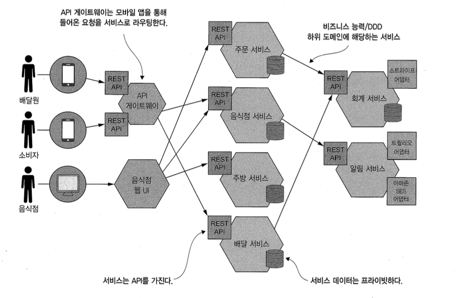

#### 1.4.5 마이크로서비스 아키텍처와 SOA

### 1.5 마이크로서비스 아키텍처의 장단점
- CI/CD, 관리하기 쉬움, 배포 확장, 팀이 자율적, 결함 격리, 새로운 기술 도입하기 쉬움

- 딱 맞는 서비스 찾기 쉽지 않음
- 분산 시스템은 너무 복잡 개발, 테스트, 배포가 어려움
- 여러 서비스 걸친 기능을 잘 조정, 도입 시점 결정 어려움


### 1.6 마이크로서비스 아키텍처 패턴 언어

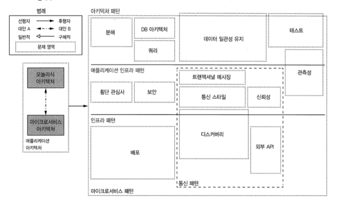

### 1.7 마이크로서비스 너머: 프로세스와 조직


## 2 분해전략

### 2.1 마이크로서비스 아키텍처란 무엇인가?
마이크로서비스 아키텍처는 관리성, 테스트성, 배포성이 높은 애플리케이션을 구축하는 아키텍처 스타일

#### 2.1.1 소프트웨어 아키텍처의 정의와 중요성
컴퓨팅 시스템의 소프트웨어 아키텍처는 소프트웨어 엘리먼트와 그들 간의 관계,
그리고 이 둘의 속성으로 구성된 시스템을 추론하는 데 필요한 구조의 집합

계층형, 육각형 아키텍처 스타일

서비스란 무엇인가?
서비스는 어떤 기능이 구현되어 단독 배포가 가능한 소프트웨어 컴포넌트

서비스 규모는 별로 중요하지 않다
작고 느슨하게 결합된 서비스로 유지보수성, 테스트성, 배포성 등 개발 단계의 품질 속성이 개선된것


### 2.2 마이크로서비스 아키텍처 정의
아키텍처를 정의하는
- 1단계는 애플리케이션 요건을 핵심 요청으로 추출
- 2단계 어떻게 여러 서비스로 분해할지 결정
- 서비스별로 API를 정의하는 일


## 3 프로세스 간 통신

메서드 호출 > REST API나 클라우드 서비스 연계 모듈 (Inter-Process Communication, IPC)

3장에서는 다양한 IPC 옵션과 트레이드오프 설명
- 서비스 디스커버리 및 부분실패 처리
- 비동기 중복 메시지 걸러내기, 메시징에 트랜잭션 걸기


### 3.1 마이크로서비스 아키텍처 IPC 개요

### 3.1.1 상호 작용 스타일
1.
- 일대일(각 클라이언트 요청을 한 서비스)
- 다대다(각 클라이언트 요청을 여러 서비스)

2.
- 동기(서비스가 제시간에 응답을 기대 블로킹)
- 비동기(응답은 즉시 전송되지 않아도 됨)

### 3.1.2 마이크로서비스 API 정의
API와 인터페이스는 소프트웨어 개발의 핵심

잘 설계된 인터페이스는 유용한 기능은 표출하되 그 구현체는 감추어져 있기 때문에 클라이언트에 영향을 미치지 않고 코드를 고칠 수 있음
서비스 API를 IDL (Interface Definition Languate)로 정확하게 정의해야 함

### 3.1.3 API 발전시키기
마이크로서비스 애플리케이션은 클라이언트를 다른 서비스 팀이 개발한 경우가 대부분이기 때문에 서비스 API를 변경하기가 무척 어려움

- 시맨틱 버저닝 MAJOR(하위 호환되지 않음), MINOR(하위 호환), PATCH(하위 호환 오류 수정)
```
GET /orders/xyz HTTP/1.1
Accept: application/vnd.example.resourcetjson; version=1
```

### 3.1.4 메시지 포맷
메시지 포맷은 크게 텍스트와 이진 포맷으로 분류
XML 문서 구조는 XML 스키마로 명시
JSON도 이런게 있음

```
{
  "productId": 1
}

{
  "$schema": "https://json-schema.org/draft/2020-12/schema",
  "$id": "https://example.com/product.schema.json",
  "title": "Product",
  "description": "A product from Acme's catalog",
  "type": "object",
  "properties": {
    "productId": {
      "description": "The unique identifier for a product",
      "type": "integer",
      "exclusiveMinimum": 1
    }
  },
  "required": [ "productId" ]
}
```

이진 포맷은 프로토콜 버퍼와 아브로가 유명하고
IDL을 제공 컴파일러는 직렬화/역질렬화 코드를 생성

### 3.2 동기 RPI 패턴 응용 통신
RPI(Remote Procedure Invocation)

#### 3.2.1 동기 RPI 패턴: REST
HTTP로 소통하는 IPC
REST라고 주장하지만 아닌 경우가 많음

REST 성숙도 모델
레벨 3 GET요청으로 반환된 리소스 표현형에 그 리소스에 대한 액션의 링크도 함께 태워 보냄

```
{
    "account": {
        "account_number": 12345,
        "balance": {
            "currency": "usd",
            "value": 100.00
        },
        "links": {
            "deposits": "/accounts/12345/deposits",
            "withdrawals": "/accounts/12345/withdrawals",
            "transfers": "/accounts/12345/transfers",
            "close-requests": "/accounts/12345/close-requests"
        }
    }
}
```

- REST의 장단점
  - 단순, 간편 테스트, 방화벽 친화적,
  - 가용성이 떨어짐, url을 알아야함, 여러 리소스를 가져오기 어려움, 다중 업데이트 작업을 HTTP 동사에 매칭하기 어려움


#### 3.2.2 동기 RPI 패턴: gRPC

- gRPC의 장단점
  - 다양한 업데이트 작업이 포함된 API 설계가 쉬움
  - 클라이언트가 하는 일이 많음

#### 3.2.3 부분 실패 처리: 회로 차단기 패턴

- 견고한 RPI 프록시 설계
  - 네트워크 타임아웃
  - 미처리 요청 개수 제한
  - 회로 차단기 패턴

- 불능 서비스 복구: 미리 정해진 응답을 줌

#### 3.2.4 서비스 디스커버리

### 3.3 비동기 메시징 패턴 응용 통신
메시징은 서비스가 메시지를 서로 비동기적으로 주고받는 통신 방식

#### 3.3.1 메시징 개요
- 메시지 : 헤더와 본문으로 구성, 문서 커맨드, 이벤트
- 메시지 채널 : 메시지는 채널을 통해 교환
  - point-to-point, publish-subscribe

#### 3.3.2 메시징 상호 작용 스타일 구현

- 단방향 알림, 발행/구독, 발행/비동기 응답

#### 3.3.3 메시징 기반 서비스의 API 명세 작성
문서화 표준이 없으므로 자유롭게 기술

#### 3.3.4 메시지 브로커
브로커리스 메시징 : 운영 복잡도가 낮음, 송수신자 실행중이어야함, 전달보장 메커니즘 어려움
브로커 기반 메시징 : 메시지 순서, 전달 보장, 영속화, 내구성, 확장성, 지연시간등을 검토해야함

#### 3.3.5 수신자 경합과 메시지 순서 유지
주문별 이벤트는 각각 동일한 샤드에 발행되고, 어느 한 컨슈머 인스턴스만 메시지를 읽기 때문에 메시지 처리 순서가 보장

#### 3.3.6 중복 메시지 처리
적어도 한 번 이상 메시지를 전달
- 멱등한 메시지 핸들러를 작성
- 메시지를 추정하고 중복을 솎아 냄 (db에 id 저장 등)

#### 3.3.7 트랜잭셔널 메시징
- DB 테이블을 메시지 큐로 활용 (트랜잭셔널 아웃박스 패턴)
- 이벤트 발행: 풀링 발행기 패턴
- 이벤트 발행: 트랜잭션 로그 테일링 패턴

#### 3.3.8 메시징 라이브러리/프레임워크


### 3.4 비동기 메시징으로 가용성 개선

#### 3.4.1 동기 통신으로 인한 가용성 저하
서비스의 가용성이 99.5라면
세 서비스의 전체 가용성은 98.5로 더 낮음


#### 3.4.2 동기 상호 작용 제거

- 비동기 상호 작용 스타일 (서비스에 동기 API가 있는 경우 데이터를 복제하면 가용성을 높일 수 있음)
- 데이터 복제 

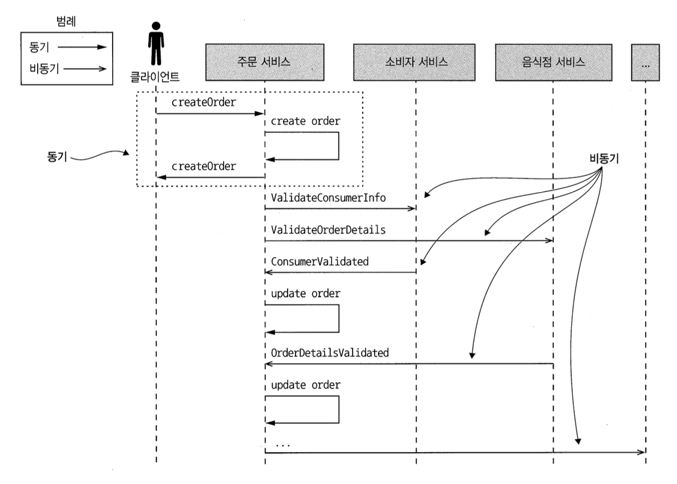

## 4 트랜잭션 관리 : 사가

여러 서비스에 걸친 작업의 데이터 일관성을 유지하려면 ACID 트랜잭션 대신 사가라는 메시지 주도 방식의 로컬 트랜잭션을 사용해야 한다.

많은 애플리케이션이 성능을 높이기 위해 하위 트랜잭션 격리 수준을 사용한다. 은행 계좌 간 송금처럼 중요한 비즈니스 프로세스에 최종 일관성을 적용한 경우도 많고,
스타벅스조차 2단계 커밋을 쓰지 않는다.

choreography, orchestration

### 4.1 마이크로서비스 아키텍처에서의 트랜잭션 관리

#### 4.1.1 분산 트랜잭션의 필요성
createOrder()는 소비자 서비스, 주문 서비스, 주방 서비스, 회계 서비스 등 여러 서비스에 있는 데이터에 접근해야 한다.
서비스마다 DB가 따로 있기 때문에 여러 DB에 걸쳐 데이터 일관성을 유지할 수 있는 수단을 강구해야 한다.

#### 4.1.2 분산 트랜잭션의 문제점
XA 2단계 커밋을 이용 커밋 or 롤백을 보장

분산 트랜잭션은 참여한 서비스가 모두 가동 중이어야 커밋할 수 있다.
마이크로서비스 아키텍처에서 데이터 일관성을 유지하려면, 느슨하게 결합된 비동기 서비스 개념을 토대로 뭔가 다른 메커니즘이 절실. 이것이 바로 사가

#### 4.1.3 데이터 일관성 유지 : 사가 패턴

사가와 ACID 트랜잭션은 두 가지 중요한 차이점이 있음
1. 격리성이 사가에는 없다.
2. 사가는 로컬 트랜잭션마다 변경분을 커밋하므로 보상 트랜잭션을 걸어 롤백해야 한다.


### 4.2 사가 편성

#### 4.2.1 코레오그래피 사가
사가 참여자가 서로 이벤트를 구독해서 그에 따라 반응하는 것
- 사가 참여자가 자신의 DB를 업데이트하고, DB 트랜잭션의 일부로 이벤트를 발행하도록 해야한다.
- 사가 참여자는 자신이 수신한 이벤트와 자신이 가진 데이터를 연관 지을 수 있어야 한다.

#### 4.2.2 오케스트레이션 사가

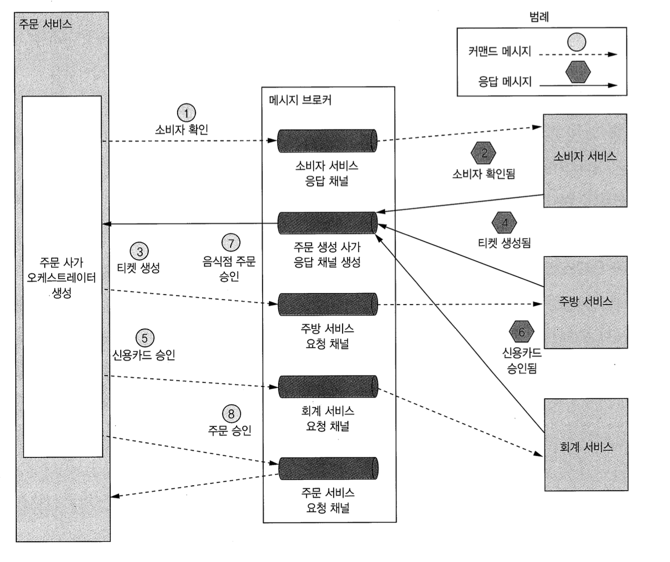

사가 오케스트레이터를 상태 기계로 모델링
- 상태 간 전이는 사가 참여자가 로컬 트랜잭션을 완료하는 시점에 트리거
- 로컬 트랜잭션의 상태와 결과에 따라 상태 전이를 어떻게 하고 어떤 액션을 취할지 결정
- 상태 기계는 효율적으로 테스트할 수 있기 때문에 상태 기계를 이용하여 사가르 모델링하면 설계, 구현, 테스트를 더 쉽게 진행할 수 있다.

### 4.3 비격리 문제 처리
사가는 격리성이 빠져 있음, 한 사가가 업데이트를 하기 이전 데이터를 다른 사가가 읽을 수 있음
사가를 동시 실행한 결과와 순차 실행한 결과가 달라질 수 있음!

#### 4.3.1 비정상 개요
- 소실된 업데이트, 더티 읽기, 퍼지/반복 불가능한 읽기

#### 4.3.2 비격리 대책
- PENDING 상태를 둠 (시맨틱 락 대책)
- 교환적 업데이트, 비관적 관점, 값 다시 읽기, 버전 파일, 값에 의한

### 4.4 주문 서비스 및 주문 생성 사가 설계

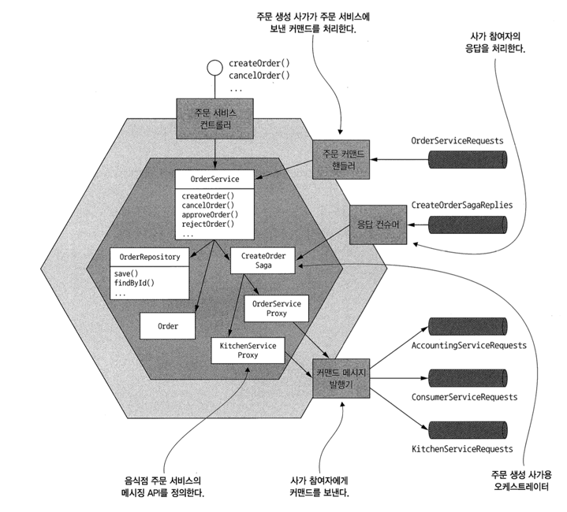


## 5 비즈니스 로직 설계

### 5.1 비즈니스 로직 구성 패턴

주문 서비스는 중심에 비즈니스 로직이 있고 인바운드/아웃바운드 어댑터가 주변을 감싼 육각형 아키텍처 구조
인바운드 어댑터는 클라이언트 요청을 받아 비즈니스 로직을 호출하고, 비즈니스 로직은 다시 아웃바운드 어댑터를 호출하여 다른 서비스 및 애플리케이션을 실행

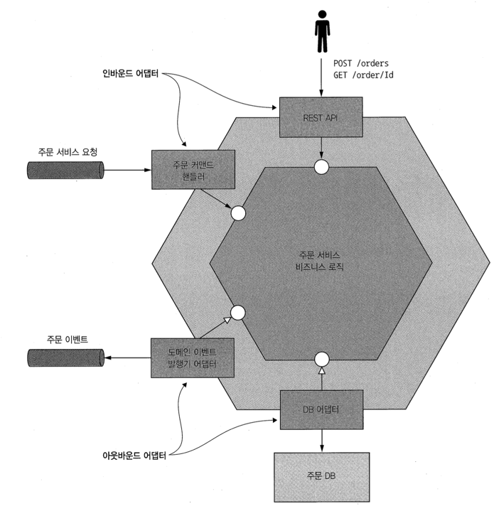

#### 5.1.1 비즈니스 로직 설계 : 트랜잭션 스크립트 패턴
비즈니스 로직을 요청 타입별로 하나씩 매핑된 절차적 트랜잭션 스크립트 뭉치로 구성

#### 5.1.2 비즈니스 로직 설계 : 도메인 모델 패턴
비즈니스 로직을 상태와 동작을 가진 클래스로 구성된 객체 모델로 구성한다.

#### 5.1.3 도메인 주도 설계 개요
DDD 방식으로 설계하면 각 서비스는 자체 도메인 모델을 가지며, 애플리케이션 전체 도메인 모델의 문제점을 방지할 수 있다.

### 5.2 도메인 모델 설계 : DDD 애그리거트 패턴

#### 5.2.1 불분명한 경계 문제
개념적으로도 모호하지만 경계가 분명하지 않으면 비즈니스 객체를 업데이트할 때 문제가 생길 수 있다.

#### 5.2.2 애그리거트는 경계가 분명하다.
도메인 모델을 여러 애그리거트로 구성한다. 각 애그리거트는 한 단위로 취급 가능한 객체망이다.
애그리거트는 일관된 경계, 애그리거트를 식별하는 일이 관건

#### 5.2.3 애그리거트 규칭
- 애그리거트 루트만 참조하라
- 애그리거트 간 참조는 반드시 기본키를 사용
- 하나의 트랜잭션으로 하나의 애그리거트를 생성/수정

#### 5.2.4 애그리거트 입도
도메인 모델에서 각 애그리거트의 크기를 결정하는 일은 매우 중요, 일단 애그리거트는 작으면 작을수록 좋다.

#### 5.2.5 비즈니스 로직 설계 : 애그리거트
서비스 비즈니스 로직은 대부분 애그리거트로 구성, 나머지는 도메인 서비스와 사가에 위치

### 5.3 도메인 이벤트 발행
DDD 맥락에서 도메인 이벤트는 애그리거트에 발생한 사건

#### 5.3.1 변경 이벤트를 발행하는 이유
- 코레오그래피 사가를 이용하여 여러 서비스에 걸쳐 데이터 일관성을 유지
- 레플리카를 둔 서비스에 소스 데이터가 변경되었음을 알림
- 다음 단계를 진행하도록 다른 애플리케이션에 알림
- 애플리케이션이 제대로 작동되고 있는지 도메인 이벤트를 모니터링하면서 확인
- 사용자 행동을 모델링하기 위해 이벤트를 분석

#### 5.3.2 도메인 이벤트란 무엇인가?
도메인 이벤트는 과거 분사형 동사로 명명한 클래스

#### 5.3.3 이벤트 강화
이벤트 강화 기법은 컨슈머를 단순화한다. 필요한 정보도 다 주기 때문에

#### 5.3.4 도메인 이벤트 식별

1. 이벤트 브레인스토밍
2. 이벤트 트리거 식별
3. 애그리거트 식별

#### 5.3.5 도메인 이벤트 생성 및 발행

- 개념적으로 도메인 이벤트는 애그리거트가 발행한다.
- 도메인 이벤트를 확실하게 발행하는 방법 (서비스는 DB에서 애그리거트를 업데이트하는 트랜잭션의 일부로 이벤트를 발행하기 위해 트랜잭셔널 메시지을 사용해야 한다)

#### 5.3.6 도메인 이벤트 소비
도메인 이벤트는 결국 메시지로 바뀌어 아파치 카프카 같은 메시지 브로커에 발행
DomainEventDispatcher 같은 고수준 API를 써서 도메인 이벤트를 적절한 핸들러 메서드로 디스패치하는 것이 더 간편

### 5.4 주방 서비스 비즈니스 로직

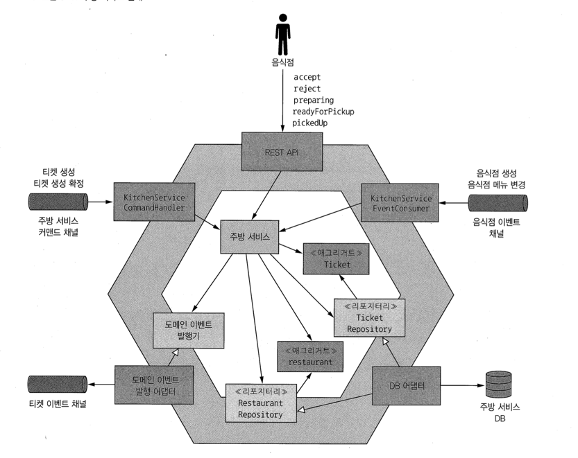

### 5.5 주문 서비스 비즈니스 로직

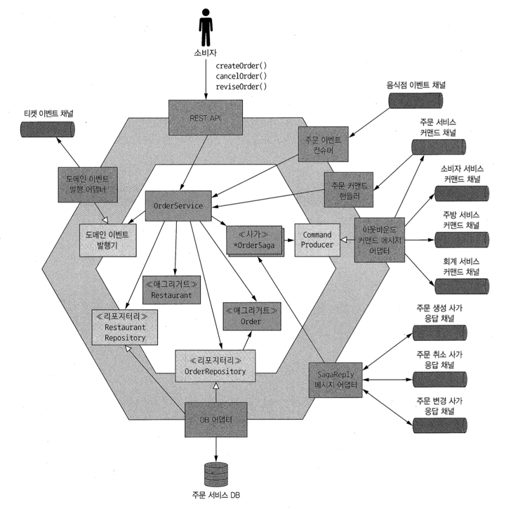


## 6 비즈니스 로직 개발 : 이벤트 소싱

이벤트 소싱을 잘 활요하면 애그리거트가 생성/수정될 때마다 무조건 이벤트를 발행해서 프로그래밍 오류를 제거할 수 있다.

### 6.1 이벤트 소싱 응용 비즈니스 로직 개발
상태 변화를 나타내는 일련의 도메인 이벤트로 애그리거트를 저장한다

이벤트 소싱은 비즈니스 로직을 구성하고 애그리거트를 저장하는 또 다른 방법. 애그리거트를 일련의 이벤트 형태로 저장
이벤트는 각 애그리거트의 상태 변화를 나타냄. 애플리케이션은 이벤트를 재연하여 애그리거트의 현재 상태를 재생성
애그리거트 이력이 보존되므로 감사/통제 용도로도 가치가 있고, 도메인 이벤트를 확실하게 발행할 수 있어서 마이크로서비스 아키텍처에서 특히 유용.
이벤트 저장소를 쿼리하기가 쉽지 않아 CQRS를 적용해야 한다.


#### 6.1.1 기존 영속화의 문제점
- 객체 관계 임피던스 부정합
- 애그리거트 이력이 없음
- 감사 로깅을 구현하기가 번거롭고 에러가 잘 남
- 이벤트 발행 로직이 비즈니스 로직에 추가


#### 6.1.2 이벤트 소싱 개요
이벤트 소싱은 이벤트를 위주로 비즈니스 로직을 구현하고, 애그리거트를 DB에 일련의 이벤트로 저장하는 기법

- 이벤트를 이용하여 애그리거트를 저장 (event_id, event_type, entity_type, entity_id, event_data)
- 이벤트는 곧 상태 변화
- 애그리거트 메서드의 관심사는 오직 이벤트

#### 6.1.3 동시 업데이트: 낙관적 잠금
Version 이용
#### 6.1.4 이벤트 소싱과 이벤트 발행
이벤트 소싱은 애그리거트를 여러 이벤트로 저장하며, 이 이벤트를 가져와 현재 애그리거트의 상태를 다시 구성

- 이벤트 발행: 폴링
- 이벤트 발행: 트랜잭션 로그 테일링


#### 6.1.5 스냅샷으로 성능 개선
스냅샷을 사용할 경우, 애그리거트 인스턴스는 기본 생성자가 아닌 스냅샷을 이요하여 재생성할 수 있다.

#### 6.1.6 멱등한 메시지 처리
메시지 브로커가 동일한 메시지를 여러 번 전송할 가능성이 있으므로 메시지 컨슈머는 멱등하게 개발해야 한다.

#### 6.1.7 도메인 이벤트 발전시키기
이벤트 소싱은 적어도 개념적으로는 이벤트를 영구 저장하지만 사실 이것은 양날의 검과 같다
- 이벤트 스키마, 업캐스팅을 통한 스키마 변화 관리

#### 6.1.8 이벤트 소싱의 장점
- 도메인 이벤트를 확실하게 발행한다.
- 애그리거트 이력이 보존된다.
- O/R 임피던스 불일치 문제를 대부분 방지할 수 있다.
- 개발자에게 타임 머신을 제공한다.

#### 6.1.9 이벤트 소싱의 단점
- 새로운 프로그래밍 모델을 배우는 데 시간이 걸린다.
- 메시징 기반 애플리케이션은 복잡
- 이벤트를 개량하기가 까다롭다.
- 데이터를 삭제하기가 어렵다.
- 이벤트 저장소를 쿼리하기가 만만찮다.

### 6.2 이벤트 저장소 구현
이벤트 소싱 애플리케이션은 이벤트 저장소에 이벤트를 저장. 이벤트 저장소는 DB와 메시지 브로커를 합한 것

#### 6.2.1 이벤추에이트 로컬 이벤트 저장소의 작동 원리
- 이벤추에이트 로컬의 이벤트 DB 스키마
- 이벤추에이트 로컬의 이벤트 브로커를 구독하여 이벤트를 소비
- 이벤추에이트 로컬 이벤트 릴레이가 이벤트를 DB에서 메시지 브로커로 전파

#### 6.2.2 자바용 이벤추에이트 클라이언트 프레임워크
애그리거트 커맨드 정의
도메인 이벤트 정의
도메인 이벤트 구독

### 6.3 사가와 이벤트 소싱을 접목

## 7 마이크로서비스 쿼리 구현
마이크로서비스는 여러 서비스, 여러 DB에 분산된 데이터를 조회해야 하는데, 기존 분산 쿼리 메커니즘은 기술적으로 가능하다 해도 캡슐화에 위배되기 때문에 사용할 수 없다.

- API 조합 패턴
- CQRS 패턴 : 쿼리만 지원하는 하나 이상의 뷰 전용 DB를 유지하는 패턴

### 7.1 API 조합 패턴 응용 쿼리

findOrder() 여러 서비스에 있는 데이터를 조회하는 쿼리 작업이 있음

#### 7.1.1 findOrder() 쿼리
orderId를 받아 데이터를 받는다.
주문 서비스, 주방 서비스, 배달 서비스, 회계 서비스

#### 7.1.2 API 조합 패턴 개요
- API 조합기 : 서비스를 쿼리하여 데이터를 조회
- 프로바이더 서비스 : 최종 결과로 반환할 데이터의 일부를 갖고 있는 서비스

#### 7.1.3 API를 조합 패턴으로 findOrder() 쿼리 구현
4개의 API를 각각 호출함

#### 7.1.4 API 조합 설계 이슈
- 어느 컴포넌트를 쿼리 작업의 API 조합기로 선정할 것인가
  - 클라이언트, API 게이트웨이, API조합기 스탠드얼론 서비스
- 어떻게 해야 효율적으로 취합 로직을 작성

##### API 조합기는 리액티브 프로그래밍 모델을 사용해야 한다.
분산 시스템을 개발할 때 지연 시간을 최소화하는 문제가 중요
순차/병렬 서비스 호출이 뒤섰인 실행 로직을 잘 작성해야함 (CompletableFuture, RxJava)

#### 7.1.5 API 조합 패턴의 장단점
- 오버헤드 증가, 가용성 저하 우려, 데이터 일관성 결여


### CQRS 패턴
여러 서비스에 있는 데이터를 가져오는 쿼리는 이벤트를 이용하여 해당 서비스의 데이터를 복제한 읽기 전용 뷰를 유지한다.

#### 7.2.1 CQRS의 필요성
##### findOrderHistory() 쿼리 구현
- 데이터 전부 가져와서 인메모리 조합
- API 조합기로 주문, 주방 데이터를 조회하고 ID를 이용하여 다른 서비스에 있는 데이터를 요청 (대량 조회 API를 제공해줘야함)

##### 어려운 단일 서비스 쿼리 : findAvailableRestaurants()
- 데이터를 가진 서비스에 쿼리를 구현하는 것이 부적절한 경우
- 서비스 DB가 효율적인 쿼리를 지원하지 않기 때문
-> 음식점 데이터의 레플리카를 전혀 다른 종류의 DB에 저장하면 된다.

##### 관심사를 분리할 필요성
findAvailableRestaurants 쿼리는 다른팀이 구현하고 음식점 데이터만 제공하는 구조가 좋다.

#### 7.2.2 CQRS 개요

- CQRS는 커맨드와 쿼리를 서로 분리한다.
- CQRS와 쿼리 전용 서비스

#### 7.2.3 CQRS의 장점
- 마이크로서비스 아키텍처에서 쿼리를 효율적으로 구현
- 다양한 쿼리를 효율적으로 구현
- 이베느 소싱 애플리케이션에서 쿼리가 가능
- 관심사가 더 분리

#### 7.2.4 CQRS의 단점
- 아키텍처가 더 복잡
- 복제시차를 처리해야 한다.

### 7.3 CQRS 뷰 설계

#### 7.3.1 뷰 DB 선택
SQL vs NoSQL DB

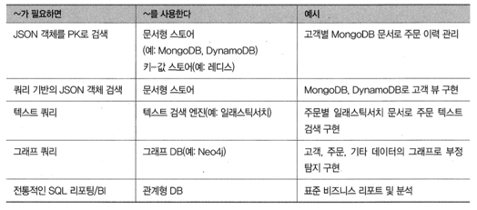

#### 7.3.2 데이터 접근 모듈 설계
- 동시성 처리
- 멱등한 이벤트 핸들러
이벤트 핸들러가 모든 이벤트 ID를 일일이 기록할 필요는 없고
max(eventId)를 각레코드에 저장하면 된다.
- 클라이언트 애플리케이션이 최종 일관된 뷰를 사용할 수 있다.

#### 7.3.3 CQRS 뷰 추가 및 업데이트
- 아카이빙된 이벤트를 이용하여 CQRS 뷰 구축 (AWS s3)
- CQRS 뷰를 단계적으로 구축 (주기적 스냅샷을 둠)

### 7.4 CQRS 뷰 구현 : AWS DynamoDB 응용
- 쿼리 결과 페이지네이션
- 주문 업데이트
- 중복 이벤트 감지


## 8 외부 API 패턴

API 게이트웨이, BFF 및 그 설계/구현 방법을 설명

### 8.1 외부 API 설계 이슈

#### 8.1.1 API 설계 이슈 : FTGO 모바일 클라이언트
- 서비스 API가 잘게 나뉘어져 있어서 클라이언트가 필요한 데이터를 가져오려면 여러 번 요청을 해야 하고, 그만큼 효율이 떨어지고 UX는 나빠짐
- 클라이언트가 API를 알아야 하는 구조라서 캡슐화가 되지 않고, 아키텍처와 API를 바꾸기도 어려움
- 클라이언트가 사용하기에 불편하거나 실용적이지 못한 IPC를 서비스에서 사용 중인 경우가 있다.

#### 8.1.2 API 설계 이슈 : 다른 종류의 클라이언트
- 웹 어블리케이션, 브라우저 기반의 자바스크립트 어플리케이션, 서드파티 애플리케이션
장기간 하위 호화성을 관리할 책임을 백엔드 서비스 개발자에게 지우기란 현실적으로 어렵다.

### 8.2 API 게이트웨이 패턴
마이크로서비스 애플리케이션에 외부 API 클라이언트의 진입점에 해당하는 서비스를 구현한다.

#### 8.2.1 API 게이트웨이 패턴 개요
퍼사드처럼 API 게이트웨이도 내부 애플리케이션 아키텍처를 캡슐화하고 자신의 클라이언트에는 API를 제공한다.
인증, 모니터링, 사용량 제한 등 부수적인 일도 담당

- 요청 라우팅, API 조합, API 게이트웨이는 클라이언트마다 적합한 API를 제공
- 엣지 기능 구현 (인증, 인가, 사용량 제한, 캐싱 지표 수집, 요청 로깅)
- API 게이트웨이 소유권 모델 ESB팀이 ESB 개발을 전담

프론트엔드 패턴을 위한 백엔드 (BFF)
각 클라이언트 종류마다 API 게이트웨이를 따로 구현한다.

#### 8.2.2 API 게이트웨이의 장단점
장점
- API 게이트웨이의 가장 큰 장접은 애플리케이션의 내부 구조를 캡휼화하는 것이다.
- 클라이언트마다 최정의 API를 제공하므로 클라이언트-애플리케이션 간 왕복 횟수도 줄고 클라이언트 코드 역시 단순해짐

단점
개발, 배포, 관리를 해야하는 고가용 컴포넌트가 하나 더 늘어남
API 병목 지점이 될 우려도 있다.


#### 8.2.3 API 게이트웨이 사례 : 넷플릭스

넷플릭스는 기기별 API가 따로 구현된 API 게이트웨이를 사용하며, API 구현 코드는
클라이언트 기기 팀이 소유/개발한다.
지금도 node.js로 모듈을 개발한다

#### 8.2.4 API 게이트웨이 설계 이슈
- 성능과 확장성 (논블로킹 I/O를 쓰는 것을 고려)
- 리액티브 프로그래밍 추상체를 이용하여 관리 가능한 코드 작성 (콜백 지옥, 프라미스 RxJS)
- 부분 실패 처리 (circuit breaker)
- 애플리케이션 아키텍처에서 선량한 시민 되기 (서비스 디스커버리)

### 8.3 API 게이트웨이 구현
API 게이트웨이의 역할
- 요청 라우팅, API 조합, 엣지 기능, 프로토콜 변환, 선량한 시민

API 게이트웨이 개발법
- 기성 API 게이트웨이 활용 (AWS API 게이트웨이)
- API 게이트웨이 프레임워크 또는 웹 프레임워크를 기반으로 API 게이트웨이를 직접 개발 (넷플릭스 주울, 스프링 클라우드 게이트웨이)
- GraphQL : 클라이언트가 반환 데이터를 제어할 수 있음, 개발 수고를 덜 수 있다.


## 9 마이크로서비스 테스트 1부


