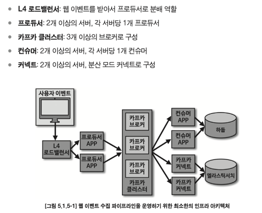

# 아파치카프카애플리케이션프로그래밍

링크드인 개발자들이 최초로 배치성 데이터와 실시간 이벤트 스트리밍 데이터를 혼합하여 처리하 는 독특한 로직의 플랫폼을 만들어냈고, 이것이 아파치 카프카의 탄생이다.

- 카프카를 왜 써야 하는가?
- 카프카의 브로커는 어떤 역할을 할까?
- 컨슈머와 프로듀서란 무엇인가?
- 카프카 스트림즈란 무엇인가?
- 카프카 커넥트와 커넥터란 무엇인가?
- 스프링 카프카란 무엇인가?
- 미러메이커2란 무엇인가?
- 클라우드 기반 카프카는 무엇이 있고, 어떻게 사용하는가?

### 1 들어가며

#### 1.1 카프카의 탄생

링크드인 아키텍처는 거대해졌고 소  애플리케이션과 타깃 애플리케이션의 개수가 점점 많아지면서 문제가 생겼다. 
데이터를 전송하는 라인이 기하급수적으로 복잡해지기 시작했다.

카프카는 각각의 애플리케이션끼리 연결하여 데이터를 처리하는 것이 아니라 한 곳에 모아 처리할 수 있도록 중앙집중화했다.
카프카를 통해 웹사이트, 애플리케이션, 센서 등에서 취합한 데이터 스트림을 한 곳에서 실시간으로 관리할 수 있게 된 것이다.

큐에 데이터를 보내는 것이 프로듀서이고 큐에서 데이터를 가져가는 것이 컨슈머다.
카프카는 직렬화, 역직렬화를 통해 ByteArray로 통신하기 때문에 자바에서 선언 가능한 모든 객체를 지원한다.

서버 3대 이상으로 이루어지기 떄문에 안전하고, 데이터를 묶음 단위로 처리하는 배치 전송을 통해 낮은 지연과 높은 데이터 처리량도 가진다.

#### 1.2 빅데이터 파이프라인에서 카프카의 역할

안정적이고 확장성이 높은 데이터 파이프라인(Extracting, Transforming, Loading)을 구축하는 것은 빅데이터를 활용하는 기업에게 필수적

- 높은 처리량 : 묶음 단위, 파티션 분배 병렬추리, 컨슈머 개수를 늘려 시간당 데이터 처리량 늘림
- 확장성 : 데이터가 많아지면 클러스터의 브로커 개수를 자연스럽게 늘려 스케일 아웃할 수 있음
- 영속성 : 카프카는 데이터를 파일 시스템에 저장 (페이지 캐시 사용)
- 고가용성 : 클러스터로 이루어진 카프카는 데이터의 복제를 통해 고가용성의 특징을 가지게 되었

#### 1.3 데이터 레이크 아키텍처와 카프카의 미래
데이터 레이크 아키텍처
(람다 아키텍처, 카파 아키텍처)

로그는 배치 데이터를 스트림을 표현하기에 적합 (변환 기록을 시간 순서대로 기록, 스냅샷 데이터를 저장하지 않아도 배치 데이터를 표현할 수 있음)

### 2 카프카 빠르게 시작해보기

#### 2.1 실습용 카프카 브로커 설치
aws (MSK : Managed Service Kafka, EC2)

분산 코디네이션 서비스를 제공하는 주키퍼

#### 2.2 카프카 커맨드 라인 툴
토픽을 생성하는 2가지 방법
첫 번째 카프카 컨슈머 또는 프로듀서가 카프카 브로커에 생성되지 않은 토픽에 대해 데이터를 요청할 떄
두 번째 커맨드 라인 툴로 명시적으로 토픽을 생성

### 3 카프카 기본 개념 설명

#### 3.1 카프카 브로커, 클러스터, 주키퍼

카프카 브로커는 카프카 클라이언트와 데이터를 주고받기 위해 사용하는 주체이자, 데이터를 분산 저장하여 장애가 발생하더라도
안전하게 사용할 수 있도록 도와주는 애플리케이션이다. 하나의 서버에는 한 개의 카프카 브로커 프로세스가 실행된다.

##### 데이터 저장, 전송
프로듀서로부터 데이터를 전달받으면 카프카 브로커는 프로듀서가 요청한 토픽의 파티션에 데이터를 저장하고 컨슈머가 데이터를 요청하면 파티션에 저장된 데이터를 전달한다.
카프카는 메모리나 데이터베이스에 저장하지 않으며 따로 캐시메모리를 구현하여 사용하지도 않는다.
파일시스템은 일반적으로 처리 속도가 느림 카프카는 페이지 캐시를 사용하여 디스크 입출력 속도를 높여서 이 문제를 해결

##### 데이터 복제, 싱크
데이터 복제는 카프카를 장애 허용 시스템으로 동작하도록 하는 원동력이다. 복제의 이유는 클러스터로 묶인 브로커 중 일부에 장애가 발생하더라도
데이터를 유실하지 않고 안전하게 사용하기 위함이다.

카프카의 데이터 복제는 파티션 단위로 이루어진다. 
프로듀서 또는 컨슈머와 직접 통신하는 파티션을 리더, 나머지 복데 데이터를 가지고 있는 파티션을 팔로워라고 부른다.

##### 컨트롤러
클러스터의 다수 브로커 중 한 대가 컨트롤러의 역할을 한다. 컨트롤러는 다른 브로커들의 상태를 체크하고 브로커가 클러스터에서 빠지는 경우 해당 브로커에 존재하는 리더 파티션을 재분배한다.
카프카는 지속적으로 데이터를 처리해야 하므로 브로커의 상태가 비정상이라면 빠르게 클러스터에서 뺴내는 것이 중요하다. 만약 컨트롤러 역할을 하는 브로커에 장애가 생기면 다른 브로커가 컨트롤러 역할을 한다.

##### 데이터 삭제
카프카는 다른 메시징 플랫폼과 다르게 컨슈머가 데이터를 가져가더라도 토픽의 데이터는 삭제되지 않는다.
또한, 컨슈머나 프로듀서가 데이터 삭제를 요청할 수도 없다. 오직 브로커만이 데이터를 삭제할 수 있다.
데이터 삭제는 파일 단위로 이루어지는 이 단위를 로그 세그먼트라고 부른다.
닫힌 세그먼트 파일은 옵션에 설정값이 넘으면 삭제된다. 

##### 컨슈머 오프셋 저장
컨슈머 그룹은 토픽이 특정 파티션으로부터 데이터를 가져가서 처리하고 이 파티션의 어느 레코드까지 가져갔는지 확인하기 위해 오프셋을 커밋한다.

##### 코디네이터
클러스터의 다수 브로커 중 한 대는 코디네이터의 역할을 수행한다. 
코디네이터는 컨슈머 그룹의 상태를 체크하고 파티션을 컨슈머와 매칭되도록 분배하는 역할을 한다. 
컨슈머가 컨슈머 그룹에서 빠지면 매칭되지 않은 파티션을 정상 동작하는 컨슈머로 할당하여 끊임없이 데이터가 처리되도록 도와준다.

#### 3.2 토픽과 파티션
토픽은 카프카에서 데이터를 구분하기 위해 사용하는 단위이다.

토픽은 1개 이상의 파티션을 소유하고 있다. 파티션에는 프로듀서가 보낸 데이터들이 들어가 저장되는데 이 데이터를 레코드라고 부른다.
파티션은 카프카의 병렬처리의 핵심으로써 그룹으로 묶인 컨슈머들이 레코드를 병렬로 처리할 수 있도록 매칭된다.
파티션은 큐와 비슷한 구조, 파티션의 레코드는 컨슈머가 가져가는 것과 별개로 관리되어 여러 컨슈머 그룹들이 토픽의 데이터를 여러번 가져갈 수 있음

의미 있는 토픽 이름 작명 방
- <환경>.<팀-명>.<애플리케이션-명>.<메시지-타입>
ex) prd.marketing-team.sms-platform.json
- <프로젝트-명>.<서비스-명>.<환경>.<이벤트-명>
ex) commerce.payment.prd.notification
- <환경>.<서비스-명>.<JIRA-번호>.<메시지-타입> 
ex) dev.email-sender.jira-1234.email-vo-custom
- <카프카-클러스터-명>.<환경>.<서비스-명>.<메시지-타입>
ex) aws-kafka.live.marketing-platform.json

#### 3.3 레코드
레코드는 타임스탬프, 메시지 키, 메시지 값, 오프셋으로 구성되어 있다.
프로듀서가 생성한 레코드가 브로커로 전송되면 오프셋과 타임스탬프가 지정되어 저장된다.
브로커에 한번 적재된 레코드는 수정할 수 없고 로그 리텐션 기간 또는 용량에 따라서만 삭제된다.

#### 3.4 카프카 클라이언트

##### 3.4.1 프로듀서 API

카프카 클러스터에 명령을 내리거나 데이터를 송수신하기 위해 카프카 클라이언트 라이브러 리는 카프카 프로듀서, 컨슈머, 어드민 클라이언트를 제공하는 카프카 클라이언트를 사용하여 애플리케이션을 개발한다.
카프카 클라이언트는 라이브러리이기 때문에 자체 라이프사이클을 가진 프레임워크나 애플리케이션 위에서 구현하고 실행해야 한다.

프로듀서 중요 개념
프로듀서는 카프카 브로커로 데이터를 전송할 때 내부적으로 파티셔너, 배치 생성 단계를 거친다.

##### 3.4.2 컨슈머 API
프로듀서가 전송한 데이터는 카프카 브로커에 적재된다. 
컨슈머는 적재된 데이터를 사용하기 위해 브로커로부터 데이터를 가져와서 필요한 처리를 한다.
예를 들어, 마케팅 문자를 고객에 게 보내는 기능이 있다면 컨슈머는 토픽으로부터 고객 데이터를 가져와서 문자 발송 처리를 하게 된다.

##### 3.4.3 어드민

#### 3.5 카프카 스트림즈
카프카 스트림즈는 토픽에 적재된 데이터를 실시간으로 변환하여 다른 토픽에 적재하는 라이브러리이다.
스트림즈 애플리케이션 또는 카프카 브로 커의 장애가 발생하더라도 정확히 한번할 수 있도록 장애 허용 시스템(fault tolerant system)을 가지고 있어서 데이터 처리 안정성이 매우 뛰어나다.

#### 3.5.1 스트림즈 DSL
스트림즈DSL에는 레코드의 흐름을 추상화한 3가지 개 념인 KStream, KTable, GlobalKTable이 있다.

KStream
KStream은 레코드의 흐름을 표현한 것으로 메시지 키와 메시지 값으로 구성되어 있다. KStream 으로 데이터를 조회하면 토픽에 존재하는(또는 KStream에 존재하는) 모든 레코드가 출력된다.

KTable
KTable은 KStream과 다르게 메시지 키를 기준으로 묶어서 사용한다. KStream은 토픽의 모든 레코드를 조회할 수 있지만 KTable은 유니크한 메시지 키를 기준으로 가장 최신 레코드를 사용한다.

GlobalKTable
GlobalKTable은 KTable과 동일하게 메시지 키를 기준으로 묶어서 사용된다. 그러나 KTable로 선언된 토픽은 1개 파티션이 1개 태스크에 할당되어 사용되고, GlobalKTable 로 선언된 토픽은 모든 파티션 데이터가 각 태스크에 할당되어 사용된다는 차이점이 있다.

#### 3.6 카프카 커넥트
카프카 커넥트는 카프카 오픈소스에 포함된 툴 중 하나로 데이터 파이프라인 생성 시 반복 작업을 줄이고 효율적인 전송을 이루기 위한 애플리케이션이다.

파이프라인 생성 시 자주 반복되는 값들을 파라미터로 받는 커넥터를 코드로 작성하면 이후에 파이프라인을 실행할 때는 코드를 작성할 필요가 없기 때문이다.

##### 3.6.1 소스 커넥터
소스 커넥터는 소스 애플리케이션 또는 소스 파일로부터 데이터를 가져와 토픽으로 넣는 역할을 한다.

##### 3.6.2 싱크 커넥터
싱크 커넥터는 토픽의 데이터를 타깃 애플리케이션 또는 타깃 파일로 저장하는 역할을 한다.

#### 3.7 카프카 미러메이커2
카프카 미러메이커2는 서로 다른 두 개의 카프카 클러스터 간에 토픽을 복제하는 애플리케이션이다.

### 4 카프카 상세 개념 설명 

#### 4.1 토픽과 파티션

토픽은 카프카의 시작과 끝, 카프카를 사용하는 것은 토픽을 만들면서 시작된다. 토픽을 삭제하면 데이터는 삭제되고 파이프라인은 중단된다.

##### 4.1.1 적정 파티션 개수
토픽의 파티션 개수는 카프카의 성능과 관련이 있다.

토픽 생성 시 파티션 개수 고려사항
- 데이터 처리량
- 메시지 키 사용 여부
- 브로커, 컨슈머 영향도

파티션은 카프카의 병렬처리의 핵심이다. 파티션의 개수가 많아지면 많아질수록 1:1 매핑되는 컨슈머 개수가 늘어나기 때문이다.

데이터 처리 속도를 올리는 방법은 2가지다. 첫 번째는 컨슈머의 처리량을 늘리는 것이고 두 번째는 컨슈머를 추가해서 병렬처리량을 늘리는 것이다.

> 프로듀서 전송 데이터량 < 컨슈머 데이터 처리량 x 파티션 개수

파티션 개수가 달라지는 순간 에는 메시지 키를 사용하는 컨슈머는 특정 메시지 키의 순서를 더는 보장받지 못한다.
메시지 키를 사용하고 컨슈머에서 메시지 처리 순서가 보장되어야 한다면 최대한 파티션의 변화가 발생하지 않는 방향으로 운영해야 한다.

카프카에서 파티션은 각 브로커 의 파일 시스템을 사용하기 때문에 파티션이 늘어나는 만큼 브로커에서 접근하는 파일 개수가 많아진다. 
그런데 운영체제에서는 프로세스당 열 수 있는 파일 최대 개수를 제한하고 있다. 
그러므로 카프카 브로커가 접근하는 파일 개수를 안정적으로 유지하기 위해서는 각 브로커당 파티션 개수를 모니터링해야 한다.

##### 4.1.2 토픽 정리 정책

토픽의 데이터는 시간 또는 용량에 따라 삭제 규칙을 적용할 수 있다.
또는 삭제를 원치 않는다면 카프카 클러스터가 살아있는 한 토픽의 데이터를 삭제하지 않도록 설정할 수도 있다.

##### 4.1.3 ISR(In-Sync-Replicas)
ISR은 리더 파티션과 팔로워 파티션이 모두 싱크가 된 상태를 뜻한다.

#### 4.2 카프카 프로듀서
프로듀서는 카프카에 데이터를 저장하는 첫 단계이다.
카프카 클러스터는 3대 이상의 브로커로 이루어져 있어서 일부 브로커에 이슈가 생기더라도 데이터의 유실을 막을 수 있다.

##### 4.2.1 acks 옵션
acks 카프카 복제 개수 옵션

##### 4.2.2 멱등성 프로듀서
멱등성이란 여러 번 연산을 수행하더라도 동일한 결과를 나타내는 것을 뜻한다. 
이러한 의미에서 멱등성 프로듀서는 동일한 데이터를 여러 번 전송하더라도 카프카 클러스터에 단 한 번만 저장됨을 의미한다.

##### 4.2.3 트랜잭션 프로듀서
카프카의 트랜잭션 프로듀서는 다수의 파티션에 데이터를 저장할 경우 모든 데이터에 대해 동일한 원자성(atomic)을 만족시키기 위해 사용된다. 
원자성을 만족시킨다는 의미는 다수의 데 이터를 동일 트랜잭션으로 묶음으로써 전체 데이터를 처리하거나 전체 데이터를 처리하지 않 도록 하는 것을 의미한다.

#### 4.3 카프카 컨슈머
컨슈머는 카프카에 적재된 데이터를 처리한다. 컨슈머를 통해 데이터를 카프카 클러스터로부 터 가져가고 처리해야 한다.

#### 4.4 스프링 카프카
스프링 카프카(Spring kafka)는 카프카를 스프링 프레임워크에서 효과적으로 사용할 수 있도록 만들어진 라이브러리다.
기존 카프카 클라이언트 라이브러리를 래핑하여 만든 스프링 카프카 라이브러리는 카프카 클라이언트에서 사용하는 여러 가지 패턴을 미리 제공한다.
예를 들어, 컨슈머를 멀티 스레드로 운영하기 위한 스레드 풀 로직은 스프링 카프카를 사용하면 concurrency 옵션 하나만 추가하면 어렵지 않게 구현할 수 있다.

### 5 카프카 실전 프로젝트

#### 5.1 웹 페이지 이벤트 적재 파이프라인 생성
카프카는 이러한 웹 이벤트 수집 파이프라인을 만들고 운영하기에 최적화되어 있다.

카프카는 예상치 못한 데이터의 급격한 증가가 발생하더라도 안정적으로 운영하는 데에 강 점이 있다. 
예를 들어, 선거, 천재지변, 크리스마스 등과 같은 상황으로 인해 웹 페이지의 사용자 이벤트가 상당히 많이 발생하더라도 발생한 이벤트들은 모두 카프카의 토픽에 쌓이기 때문이다.

##### 5.1.1 요구 사항
이름을 입력하고 자신이 좋아하는 색상을 고르는 버튼을 누르면 해당 이벤트와 유저 에이전트 정보를 카프카 토픽으로 전달하고 최종적으로 하둡과 엘라스틱서치에 적재되는 것을 목표로 한다.

하둡은 대용량 데이터를 분석 처리할 수 있다. HDFS는 대용량 파일을 하둡에 안정적으로 저 장할 수 있게 하는 파일 시스템이다. 사용자의 이벤트를 HDFS에 적재하면 사용자 이벤트가 기하급수적으로 늘어나는 상황에서도 안정적으로 적재하고 분석할 수 있다.
엘라스틱서치는 아파치 루씬(Apache Lucene) 기반 오픈소스 분산 검색 엔진이다. 엘라스틱 서치에 데이터를 쌓아서 방대한 양의 데이터를 저장, 검색, 분석할 수 있다. 사용자의 이벤트를 엘라스틱서치에 쌓아서 키바나를 통해 데이터를 시각화하고 분석할 수 있다.

##### 5.1.2 정책 및 기능 정의

적재 정책
적재는 프로듀서부터 컨슈머를 넘어 최종적으로 하둡이나 엘라스틱서치까지 데이터가 저 장되는것을의미한다.

파이프라인 정책
- 일부 데이터의 유실 또는 중복 허용
- 안정적으로 끊임없이 적재
- 갑작스럽게 발생하는 많은 데이터양을 허용

데이터 포맷을 선택할 때 두 가지를 우선적으로 생각
- 스키마의 변화의 유연성
- 명령어를 통한 디버기의 편리성

프로듀서
ack, 파티셔너, 재시도, 압축 옵션

토픽
파티션 개수, 메시지 키 사용 여부, 복제 개수
데이터를 순 서대로 적재하지 않더라도 하둡과 엘라스틱서치에서 데이터를 조회할 때 시간 순서대로 조회 할 수 있다. 바로, 이벤트가 발생할 때 이벤트 발생 시간을 데이터에 같이 조합해서 보내는 것 이다.

컨슈머
컨슈머 API 개발, 커넥트를 사용

##### 5.1.3 기능 구현
##### 5.1.4 테스트

##### 5.1.5 상용 인프라 아키텍처
상용환경의 웹 이벤트 수집 파이프라인을 구축하기 위해서는 요구사항과 리소스(사용하고 있 는 인프라, 자금, 인적 요소 등)를 충분히 고려하여 진행해야 한다.

#### 5.2 서버 지표 수집 파이프라인 생성과 카프카 스트림즈 활용
서버를 관리하기 위한 중요 모니터링 정보로서 서버의 CPU, 메모리, 네트워크, 디스크 지표를 수집하는 일은 매우 중요하다.
이번 챕터에서는 서버의 지표들을 카프카로 수집하는 데이터 파이프라인을 만들고 적재된 데이터를 실시간 처리하는 로직을 개발한다.
카프카는 불특정 다수의 서버의 지표를 수집하는 데에 아주 적합하다. 
서비스하고 있고 모니터링해야 하는 서버들의 개수는 상황에 따라 줄어들고 늘어나곤 하는데, 카프카를 사용하면 클러스터를 스케일 아웃하거나 파티션을 늘림으로써 변화하는 데이터양에 유연하게 대응하여 스트리밍 데이터 처리를 할 수 있다.

##### 5.2.1 요구 사항

컴퓨터의 서버 지표 중 CPU와 메모리 데이터를 수집해서 토픽으로 전송한다.
토픽에 전송된 전체 지표 데이터는 분기처리하여 CPU와 메모리 토픽에 각각 저장한다.
로컬 컴퓨터 CPU 사 용량이 50%가 넘을 경우에는 지표 데이터 중 hostname과 timestamp 정보를 비정상 CPU 토픽으로 전송한다.

##### 5.2.2 정책 및 기능 정의
파이프라인 정책
- 일부 데이터 유실 또는 중복 허용
- 안정적으로 끊임없는 적재

토픽
필요한 토픽은 전체 서버의 지표들을 저장하는 토픽, CPU 지표만 저장하는 토픽, 메모리 지표만 저장하는 토픽, 비정상 CPU 지표 정보를 저장하는 토픽 총 4개이다. 토픽에 저장된 지표를 저장하고 사용할 때 메시지 키는 별도로 사용하지 않는다.

데이터 포맷
메트릭비트가 서버 지표들을 전송할 때 사용하는 포맷은 JSON이다. 

트릭비트
메트릭비트에서는 데이터 수집을 위해 다양한 모듈(module)을 지원한다. 그중 서버의 지표를 수집하기 위해서는 시스템 모듈(system module)을 사용하면 된다. 

카프카 스트림즈
수집된 서버의 지표 데이터를 분기처리하고 필터링하는 동작은 카프카 스트림즈가 최적이다.

##### 5.2.3 기능 구현
##### 5.2.4 테스트

##### 5.2.5 상용 인프라 아키텍쳐

#### 미러메이커2를 사용한 토픽 미러링

