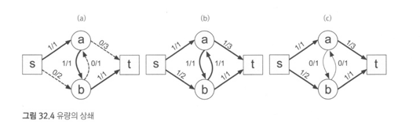

# 알고리즘 문제해결전략

## 1 문제 해결과 프로그래밍 대회

프로그래밍 대회 : 컴퓨터 과학 전반에 걸쳐 널리 쓰이는 각종 알고리즘과 자료 구조들을 이용해 주어진 문제들을 해결하고 구현하는 능력을 겨루는 대회
- 알고리즘 설계 기법과, 자료 구조를 이해하고 알고리즘 문제 해결 능력을 키울 수 있도록 구성

### 1.1 도입
프로그래밍은 문제 해결
좋은 프로그래머가 되기 위한 나은 방법은?

### 1.2 프로그래밍 대회

프로그래밍 대회에서 배울 수 있는 것들
1. 텍스트 파일을 읽고 출력함.
2. 명시적인 시간 제한과 메모리 제한이 있음
3. 정답과 오답의 여부가 명확함
4. 실행 시간과 메모리 사용량 관련 정보가 실시간으로 제공되기 때문에 작은 변경이 프로그램의 효율성에 미치는 영향을 체험해 볼 수 있음
5. 문제를 풀때마다 처음부터 다시 짜게하여 작은 부분에 집중하게 함
6. 여러 사람이 경쟁하는 환경에서 코드를 작성함

### 1.3 이 책을 읽는 방법
이 책의 구성 : 방법론, 코딩, 디버깅 주의사항,
필요한 배경 지식 : 수학, 기본적 자료구조
입문자를 위한 권장 사항 : 기초적인 주제 소화 후 다시 읽기

대회 참여, 준비할 것

## 2 문제 해결 개관

### 2.1 도입

### 2.2 문제 해결 과정
1. 문제를 이해한다.
2. 익숙한 용어로 재정의한다. (추상화)
3. 어떻게 풀지 계획을 세운다.
4. 계획을 검증한다.
5. 프로그램으로 구현한다.
6. 어떻게 풀었는지 돌아보고, 개선할 방법이 있는지 찾아본다.

### 2.3 문제 해결 전략

- 직관과 체계적인 접근
- 체계적인 접근을 위한 질문들
  - 비슷한 문제 풀어봤나?
  - 단순한 방법에서 시작할 수 있을까?
  - 내가 문제를 푸는 과정을 수식화할 수 있을까?
  - 문제를 단순화할 수 없을까?
  - 그림으로 그려볼 수 있을까?
  - 수식으로 표현할 수 있을까?
  - 문제를 분해할 수 있을까?
  - 뒤에서부터 생각해서 문제를 풀 수 있을까?
  - 순서를 강제할 수 있을까?
  - 특정 형태의 답만을 고려할 수 있을까?

## 3 코딩과 디버깅에 관하여

### 3.1 도입 : 코딩의 중요성을 간과하지 말라
프로그래밍 대회에서 좋은 성적을 올리기 위한 비결은 당장 빨리 코드를 작성하기보다 읽기 쉬운 코드를 작성하는 것
간결하고 효율적인 프로그램을 작성하는 능력은 프로그래밍 대회에서 얻어 갈 수 있는 가장 큰 소득

### 3.2 좋은 코드를 짜기 위한 원칙
- 간결한 코드를 작성하기
- 적극적으로 코드 재사용하기 (모듈화)
- 표준 라이브러리 공부하기
- 항상 같은 형태로 프로그램을 작성하기
- 일관적이고 명료한 명명법 사용하기
- 모든 자료를 정규화해서 저장하기 (각도, UTC 시간, 분수)
- 코드와 데이터를 분리하기

### 3.3 자주 하는 실수
- 산술 오버플로
- 배열 범위 밖 원소에 접근
- 일관되지 않은 범위 표현 방식 사용하기
- Off-by-one
- 컴파일러가 잡아주지 못하는 상수 오타
- 스택 오버플로
- 다차원 배열 인덱스 순서 바꿔 쓰기
- 잘못된 비교 함수 작성
- 최소, 최대 예외 잘못 다루기
- 연산자 우선순위 잘못 쓰기 (&의 우선순위는 ==보다 낮음)
- 너무 느린 입출력 방식 선택
- 변수 초기화 문제

### 3.4 디버깅과 테스팅
디버깅
- 작은 입력에 대해 제대로 실행되나 확인
- 단정문을 씀
- 프로그램의 계산 중간 결과를 출력
테스트

### 3.5 변수 범위의 이해
- 산술 오버플로
- 너무 큰 결과
- 너무 큰 중간 값
- 너무 큰 무한대 값
- 오버플로 피해가기
- 자료형의 프로모션

### 3.6 실수 자료형의 이해
- 실수 연산의 어려움
- 실수와 근사 값
- IEEE 754 표준 (이진수를 실수로, 부동 소수점, 무한대, 비정규 수)
- 실수의 이진법 표기
- 실수 비교하기
  - 비교할 실수의 크기들에 비례한 오차 한도를 정함
  - 상대 오차를 이용
  - 대소 비교
  - 정확한 사칙연산
  - 코드의 수치적 안정성 파악하기
  - 경고
  - 실수 연산 아예 하지 않기

# 알고리즘 분석

알고리즘을 평가하는 두 가지의 큰 기준은 알고리즘의 시간과 공간

## 4 알고리즘의 시간 복잡도 분석

### 4.1 도입

반복문이 지배한다. 전체의 대소를 좌지우지하는 것을 지배한다고 표현

### 4.2 선형 시간 알고리즘
이동 평균 계산하기

### 4.3 선형 이하 시간 알고리즘
이진 탐색

### 4.4 지수 시간 알고리즘
다항 시간 알고리즘
지수 시간 알고리즘

### 4.5 시간 복잡도
점근적 시간 표기 : O 표기

### 4.6 수행 시간 어림짐작하기

### 4.7 계산 복잡도 클래스 : P, NP, NP-완비

NP문제, NP 난해 문제
NP문제란 답이 주어졌을 때 이것이 정답인지를 다항 시간 내에 확인할 수 있는 문제
마스터 정리 : 어떤 함수의 수행 시간이 특정 형태의 함수로 표현될 때 이 함수의 O표기법을 쉽게 계산할 수 있음

## 5 알고리즘의 정당성 증명

### 5.1 도입
알고리즘의 정당성 증명

### 5.2 수학적 귀납법과 반복문 불변식
- 단계 나누기, 첫 단계 증명, 귀납 증명
- 반복문 진입시 불변식 성립함을 보인다, 반복문 내용이 불변식을 깨뜨리지 않음을 보인다. 종료시 불변식이 성립하면 항상 우리가 정답을 구했다.
  - 단정문을 이용해 반복문 불변식 강제하기

### 5.3 귀류법
우리가 원하는 바와 반대되는 상황을 가정하고 논리를 전개해서 결론이 잘못됐음을 찾아내는 증명 기법

### 5.4 다른 기술들
- 비둘기집의 원리
- 동전 뒤집기
- 순환소수 찾기 (비둘기집의 원리를 이용 a%b의 결과는 언제나 [0,b-1]의 범위를 가짐)
- 구성적 증명 (답이 있음을 보여줌)
- 안정적 결혼 문제

# 알고리즘 설계 패러다임

알고리즘 설계 패러다임이란 주어진 문제를 해결하기 위해 알고리즘이 채택한 전략이나 관점을 말한다.

## 6 무식하게 풀기

### 6.1 도입
프로그래밍 대회에서 대부분의 사람들이 가장 많이 하는 실수는 쉬운 문제를 어렵게 푸는 것
brute-force 

### 6.2 재귀 호출과 완전 탐색
문제의 분할, 기저 사례의 선택, 구현, 시간 복잡도 분석

완전 탐색 레시피
1. 완전 탐색의 걸리는 시간은 답의 수에 정확히 비례
2. 조각이 하나밖에 남지 않는 경우 혹은 하나도 남지 않은 경우에는 답을 생성 기저 사례로 선택

시계 맞추기

## 7 분할 정복

- divide
- merge
- base case

행렬의 거듭제곱
A^m = A^(m/2) * A*(m/2)

두 수의 곱 (카라츠바 알고리즘)

```
int hugs(const string& members, const string& fans) {
  int N = members.size(), M = fans.size();
  vector<int> A(N), B(M);
  
  for (int i=0; i<N; i++) A[i] = (members[i] == 'M');
  for (int i=0; i<M; i++) B[M-i-1] = (fans[i] == 'M');
  
  vector<int> C = karatsuba(A,B);
  int allHugs = 0;
  for (int i =N-1; i<M;i++) {
    if(C[i] ==0) {
     allHugs++;
    }
  }
  
  return allHugs;
}

```

## 8 동적 계획법

동적 계획법에서 어떤 부분 문제는 두 개 이상의 문제를 푸는데 사용될 수 있기 때문에,
이 문제의 답을 여러 번 계산하는 대신 한 번만 계산하고 계산 결과를 재활용함으로써 속도의 향상을 꾀할 수 있다.

```
int bino(int n, int r) {
    if (r==0||n==r) return 1;
    return bino(n-1, r-1) + bino(n-1, r);
}

//

int cache[30][30];
int bino2(int n, int r) {
  if (r==0 || n==r) return 1;
  if (cache[n][r] != -1) {
    return cache[n][r];
  }
  
  return cache[n][r] = bino2(n-1, r-1) + bino2(n-1, r);
}
```
메모이제이션은 참조적 투명 함수의 경우메만 적용할 수 있다.
입력이 같은데도 외부 요소에 따라 다른 값이 반환된다면 캐싱을 할 수가 없다.

int someObscureFunction(int a, int b);
한 번 계산하는데 굉장히 시간이 오래 걸리는 문제

(존재하는 부분 문제의 수) * (한 부분 문제를 풀 때 필요한 반복문의 수행 횟수)

## 9 동적 계획법 테크닉
예제 다시 읽어보기

## 10 탐욕법
탐욕법은 각 단계마다 지금 당장 가장 좋은 방법만을 선택한다.
탐욕법을 사용하는 이유는 동적 계획법에 필요한 메모리나 시간이 과도하게 클때

탐욕적 알고리즘 레시피
1. 문제의 답을 만드는 과정을 여러 조각으로 나눈다.
2. 각 조각마다 어떤 우선순위로 선택을 내려야 할지 결정, 이에 대한 직과능ㄹ 얻기 위해서는 예제 입력이나 그 외의 작은 입력을 몇 개 손으로 풀어보는 것이 효율적
3. 어떤 방식이 동작할 것 같으면 두 가지의 속성을 증명
   - 탐욕적 선택 속성 : 항상 각 단계에서 우리가 선택한 답을 포함하는 최적해가 존재함을 보인다.
   이 증명은 대개 우리가 선택한 답과 다른 최적해가 존재함을 가정하고, 이것을 조작해서 우리가 선택한 답을 포함하는 최적해로 바꿀 수 있음을 보이는 형태로 이루어짐
   - 최적 부분 구조 : 각 단계에서 항상 최적의 선택만을 했을 때 전체 최적해를 구할 수 있는지 여부를 증명, 다행히도 대개의 경우 이 속성이 성립하는지 아닌지는 자명하게 알 수 있음


## 11 조합 탐색

완전 탐색 알고리즘은 대개 답을 만드는 과정을 여러 개의 선택으로 나눈 뒤, 재귀 호출을 이용해 각각의 선택지를 채워가는 형태로 구현되곤 한다.
이때 부분 답과 완성된 답의 집합을 탐색 공간이라고 부른다. 

조합 탐색 최적화 기법
- 가지치기 : 탐색 과정에서 최적해로 연결될 가능성이 없는 부분들을 잘라낸다.
- 좋은 답을 빨리 찾아내는 기법들은 탐색의 순서를 바꾸거나, 탐색 시작 전에 탐욕법을 이용해 적당히 좋은 답을 우선 찾아낸다. 완전 탐색의 경우 답을 어떤 순서로 찾아내건 상관없지만, 가지치기와 함께 사용할 경우 더 좋은 답을 알고 있으면 좀더 일찍 탐색을 중단할 수 있기 떄문에 탐색의 효율이 좋아진다.

### 11.2 조합 탐색 기법들
- 최적해보다 나빠지면 그만두기
- 간단한 휴리스틱을 이용한 가지치기
- 메모이제이션하기


## 12 최적화 문제 결정 문제로 바꿔 풀기
최적화 문제의 반환 값은 대개 실수나 정수이므로 답의 경우의 수가 무한한 데 반해, 결정 문제는 두 가지 답만이 있을 수 있다.

```
bool decision(const Graph& g, double x) {
  return optimize(g) <= x;
}
```

유명한 알고리즘들

## 13 수치 해석

### 13.1 도입
수치 해석은 직접 풀기 힘든 수학 문제를 근사적으로 푸는 알고리즘과 이들의 수치적 안정성, 오차의 범위 등을 연구하는 전산학의 한 분야로, 공학, 과학, 금융공학 등 다양한 범위에 널리 사용

### 13.2 이분법

#### 이분법의 정의
이분법은 주어진 범위 [lo, hi] 내에서 어떤 함수 f(x)의 값이 0이 되는 지점을 수치적으로 찾아내는 기법이다.

### 절대 오차를 이용한 종료 판정
이분법에서 가장 중요한 부분은 바로 while 문의 종료 조건, while문을 많이 수행할수록 오차가 줄어들 테지만,
알고리즘을 영원히 수행할 수는 없는 노릇이니 우리는 정확도와 수행 속도 사이에서 적절히 타협하는 종료 조건을 선택하야 한다. 

### 상대 오차를 이용한 종료 판정

### 정해진 횟수만큼 반복하기
while를 for문 100번으로 으로 바꾸면
오차는 최대 = |lo - hi| / 2^101 (|lo - hi|가 10^20 미만 수이면 오차는 항상 10^-7 보다 작다.) 

## 14 정수론

### 14.1 도입
컴퓨토의 동작과 이산 수학은 떼려야 뗼 수 없는 관계이기 떄문에, 이와 연관된 정수론에 관련되 문제들도 프로그래밍 대회에 자주 등장한다.

### 14.2 소수

#### 소수 판별
sqrt까지, 홀수만 나눔
에라토스테네스의 체

#### 소인수 분해

### 14.5 유클리드 알고리즘
유클리드 알고리즘은 두수 p,q (p>q)의 공약수의 집합은 p-q와 q의 공약수 집합과 같다
gcd(6,15) = gcd(9,6) = gcd(3,6) = gcd (3,3) = gcd(0,3)
0과 3의 최대공약수는 3이므로 6과 15의 최대공약수도 3이다.

```java
int gcd(int p, int q) {
    if (p < q) {
        swap(p, q);
    }
    if (q==0) {
        return p;
    }
    
    return gcd(p-q, q);
}
```


### 14.8 모듈러 연산
디오판틴 방정식을 통해서 모듈러 나눗셈 문제를 풀 수 있음.

#### 14.9 더 읽을거리

확장 유클리드 알고리즘
중국인 나머지 정리
루카스의 정리

### 15 계산 기하

#### 15.1 도입
점, 선, 다가형과 원 등 각종 기하학적 도형을 다루는 알고리즘을 계산 기하 알고리즘이라고 한다.
계산 기하는 3D 그래픽이나 캐드, 로보틱스 등 다양한 분야의 기반이 되기 때문에 전산학에서 중요한 역할을 차지한다.

#### 15.2 계산 기하의 도구들
- 벡터의 구현 struct vector
- 점과 직선, 선분의 표현
- 벡터의 내적과 외적

#### 15.3 교차와 거리, 면적
면적, 내외부 판별

## 기초 자료구조

모든 자료 구조는 이 두 가지 목적을 이루기 위해 고안 된 것들이다. 추상화와 최적화

- 현실 세계의 추상화 : 추상화란 현실 세계에 존재하는 개념이나 구조를 간결화해 컴퓨터 프로그램에 사용되는 자료 구조로 표현하는 과정을 가리킨다
- 최적화 : 자료 구조를 설계하는 다른 목적인 최적화는 프로그램의 동작 속도를 빠르게하기 위한 것이다.

### 16 비트마스크

정수의 이진수 표현을 자료 구조로 쓰는 기법을 비트마스크라고 부른다.

장점
- 더 빠른 수행 시간 : 비트마스크 연산은 O(1)에 구현되는 것이 많다.
- 더 간결한 코드 : 다양한 집합 연산들을 반복문 없이 한 줄에 쓸 수 있다.
- 더 작은 메모리 사용량
- 연관 배열을 배열로 대체 : int[]를 사용해 같은 정보를 나타낼 수 있다.

- 비트 연산자
  - AND & , OR | , XOR ^, NOT ~, 왼쪽 시프트 a<<b, 오른쪽 시프트 a>>b
  - 비트 연산자는 ==, != 보다 우선순위가 낮음
  - 1은 32비트 64비트랑 비교할떄 조심

#### 16.2 비트마스크를 이용한 집합의 구현

- 피자집 예제 : 토핑 넣기 / 넣지 않기
- 공집합과 꽉 찬 집합 구하기 : int fullPizza = (1<<20) - 1;
- 원소 추가 : toppings |= (1 << p);
- 원소의 포함 여부 : if (toppings & (1 << p)) cout << "pepperoni is in" << endl;
- 원소의 삭제 : toppings &= ~(1 << p);
- 원소의 토글 : toppings ^= (1 << p);
- 두 집합에 대해 연산하기
  - int added = (a | b);
  - int intersection = (a & b);
  - int removed = (a & ~b);
  - int toggled = (a ^ b);
- 집합의 크기 구하기
```
int bitCount(int x) {
  if (x == 0) return 0;
  return x % 2 + bitCount(x / 2);
}
```
- 최소 원소 찾기 : int firstTopping = (toppings & -toppings);
- 최소 원소 지우기 : toppings &= (toppings - 1);
- 모든 부분 집합 순회하기
```
for(int subset = pizza; subset; subset = ((subset-1) & pizza))
```

#### 16.3 비트마스크의 응용 예제

- 지수 시간 동적 계획법
  - 에라토스테네스의 체 unsigned char sieve[(MAX_N)+7 / 8];
  - 우선 순위 큐 O(1)


### 17 부분 합

#### 17.1 도입
- 부분합 구하기
psum[b] - psum[a-1]
반복문을 통해 구간 합을 구하기 위해 최대 O(N)의 시간이 걸리므로, 구간 함을 두 번 이상 구할 때는 대부분의 경우 부분 합을 사용하는 것이 좋다.
- 부분 합으로 분산 계산하기
- 2차원으로 확장


### 18 선형 자료 구조

#### 18.1 도입
동적 배열과 연결 리스트, 이 두 자료 구조는 배열과 연결 리스트

#### 18.2 동적 배열
배열의 특징 : 원소들은 메모리의 연속된 위치에 저장, 주어진 위치의 원소를 반환하거나 변경하는 동작을 O(1)에 할 수 있음
동적 배열 추가 특징 : resize() 연산 가능, 주어진 원소를 배열의 맨 끝에 추가함으로써 크기를 1 늘리는 append()연산을 지원 상수 시간 걸림
#### 18.3 연결 리스트


### 19 큐와 스택, 데크
- 연결 리스트를 통한 구현
- 동적 배열을 이용한 구현

### 20 문자열
#### 20.1 도입
KMP(Knuth-Morris-Pratt) 알고리즘, 접미사 배열
KMP 알고리즘(Knuth-Morris-Pratt Algorithm)은 문자열 검색 알고리즘으로, 검색하려는 문자열(Pattern)과 검색 대상 문자열(Text)을 비교하는 효율적인 방법을 제공
패턴의 접두사와 접미사의 일치를 활용해 불필요한 비교를 줄이는 것이 특징


```
public class KMPAlgorithm {

    // KMP 알고리즘을 사용하여 패턴을 검색하는 메서드
    public static void KMPSearch(String pat, String txt) {
        int M = pat.length();
        int N = txt.length();

        // 패턴을 위한 LPS(Longest Prefix Suffix) 배열을 생성
        int[] lps = new int[M];
        int j = 0; // 패턴의 인덱스

        // LPS 배열을 계산
        computeLPSArray(pat, M, lps);

        int i = 0; // 텍스트의 인덱스
        while (i < N) {
            if (pat.charAt(j) == txt.charAt(i)) {
                j++;
                i++;
            }

            if (j == M) {
                System.out.println("패턴이 " + (i - j) + " 인덱스에서 발견되었습니다.");
                j = lps[j - 1];
            }

            // 불일치가 발생한 경우
            else if (i < N && pat.charAt(j) != txt.charAt(i)) {
                // j가 0이 아니면 LPS 배열을 참고
                if (j != 0) {
                    j = lps[j - 1];
                } else {
                    i++;
                }
            }
        }
    }

    // 패턴에 대한 LPS 배열을 계산하는 메서드
    public static void computeLPSArray(String pat, int M, int[] lps) {
        int len = 0; // 가장 긴 접두사와 접미사가 일치하는 부분의 길이
        int i = 1;
        lps[0] = 0; // 첫 번째 인덱스의 LPS 값은 항상 0

        // 패턴을 순회하면서 LPS 배열을 계산
        while (i < M) {
            if (pat.charAt(i) == pat.charAt(len)) {
                len++;
                lps[i] = len;
                i++;
            } else {
                if (len != 0) {
                    len = lps[len - 1];
                } else {
                    lps[i] = 0;
                    i++;
                }
            }
        }
    }

    // 메인 메서드: 실행 예시
    public static void main(String[] args) {
        String txt = "ABABDABACDABABCABAB";
        String pat = "ABABCABAB";
        KMPSearch(pat, txt);
    }
}
```


## 5 트리

### 21 트리의 구현과 순회
- 트리의 구성 요소 : 트리는 자료가 저장된 노드들이 간선으로 서로 연결되어 있는 자료 구조를 말한다.
- 트리와 노드의 속성 : 루트에서 어떤 노드에 도달하기 위해 거쳐야 하는 간선의 수를 해당 노드의 깊이라고 한다.
- 트리의 재귀적 속성 : 트리가 유용하게 사용되는 큰 이유 중 하나는 트리가 재귀적인 성질을 갖고 있기 때문이다.
- 트리의 표현

#### 21.2 트리의 순회
트리의 루트가 주어질 때 루트를 방문한 뒤 각 서브트리를 재귀적으로 방문하는 함수를 만들어 트리의 모든 노드를 순회할 수 있다.

### 22 이진 검색 트리

#### 22.1 도입
검색 트리는 연결 리스트나 큐처럼 자료들을 담는 컨테이너지만, 자료들을 일정한 순서에 따라 정렬한 상태로 저장해 둔다.

#### 22.2 이진 검색 트리의 정의와 조작
이진 트리란 각 노드가 왼쪽과 오른쪽, 최대 두 개의 자식 노드만을 가질 수 있는 트리를 의미한다.
이진 검색 트리는 이진 탐색에서 아이디어를 가져와서 만든 트리

- 순회 : 이진 검색 트리를 중위 순회하면 크기 순서로 정렬된 원소의 목록을 얻을 수 있다. 작은 왼소는 왼쪽, 큰 원소는 오른쪽 서브트리에 있기 때문
- 자료의 검색 : 이진 검색 트리에서는 아주 간단하게 특정 원소가 존재하는지 확인할 수 있음
- 조작 : 이진 검색 트리가 진가를 드러내는 곳은 집합에 원소를 추가하거나 삭제할 때, 삭제는 어려울 수 있음

#### 22.3 시간 복잡도 분석과 균형 잡힌 이진 검색 트리
모든 연산의 시간 복잡도가 트리의 높이 O(h)라고 할 수 있음

#### 22.6 균형 잡힌 이진 검색 트리 직접 구현하기 : 트립
표준 라이브러리의 이진 검색 트리는 대부분 X보다 작은 원수의 수를 계산하거나 k번째 원소를 찾는 연산을 지원하지 않음

- 트립의 정의 : 트립은 입력이 특정 순서로 주어질 때 그 성능이 떨어진다는 이진 검색 트리의 단점을 해결하기 위해 고안된 일종의 랜덤화된 이진 검색 트리

### 23 우선순위 큐와 힙

#### 23.2 힙의 정의와 구현
힙은 특정한 규칙을 만족하도록 구성된 이진 트리로, 단순히 최대 원소를 가능한 한 빠르게 찾을 수 있는 방법으로 설계되었기 때문에 더 단순한 알고리즘으로도 효율적으로 동작할 수 있음
힙이 갖는 가장 중요한 규칙은 부모 노드가 가진 원소는 항상 자식 노드가 가진 원소 이상이라는 것


### 24 구간 트리 (segment tree)

#### 24.1 구간 트리 : 구간에 대한 질문 대답하기
구간 트리는 흔히 일차원 배열의 특정 구간에 대한 질문을 빠르게 대답하는데 사용한다.
구간 트리의 기본적인 아이디어는 주어진 배열의 구간들을 표현하는 이진트리를 만드는 것이다.

- 구간 트리의 표현 : 구간 트리를 설명하기 위한 문제의 예로 특정 구간의 최소치를 찾는 문제를 들 수 있다. (구간 최소 트리, RMQ)
- 구간 트리는 비교적 꽉 찬 이진 트리이다.
- 구간 트리의 초기화
- 구간 트리의 질의 처리
- 구간 트리의 갱신 
```
// 배열의 구간 최소 쿼리(RMQ) 문제를 해결하기 위한 구간 트리의 초기화
const int INT_MAX = numeric_limits<int>::max();

struct RMQ {
    // 배열의 길이
    int n;
    // 각 구간의 최소치
    vector<int> rangeMin;
    
    RMQ(const vector<int>& array) {
        n = array.size();
        rangeMin.resize(n * 4);
        init(array, 0, n - 1, 1);
    }

    // node 노드가 array[left..right] 배열을 표현할 때
    // node를 루트로 하는 서브트리를 초기화하고, 이 구간의 최소치를 반환한다.
    int init(const vector<int>& array, int left, int right, int node) {
        if (left == right)
            return rangeMin[node] = array[left];
        int mid = (left + right) / 2;
        int leftMin = init(array, left, mid, node * 2);
        int rightMin = init(array, mid + 1, right, node * 2 + 1);
        return rangeMin[node] = min(leftMin, rightMin);
    }
    
    // node가 표현하는 범위 array[nodeLeft..nodeRight]가 주어질 때
    // 이 범위와 array[left..right]의 교집합의 최소치를 구한다.
    int query(int left, int right,
              int node, int nodeLeft, int nodeRight) {
        // 두 구간이 접치지 않으면 아주 큰 값을 반환한다: 무시됨
        if (right < nodeLeft || nodeRight < left) return INT_MAX;
        // node가 표현하는 범위가 array[left..right]에 완전히 포함되는 경우
        if (left <= nodeLeft && nodeRight <= right)
            return rangeMin[node];
        // 양쪽 구간을 나눠서 푼 뒤 결과를 합친다.
        int mid = (nodeLeft + nodeRight) / 2;
        return min(query(left, right, node*2, nodeLeft, mid),
                   query(left, right, node*2+1, mid+1, nodeRight));
    }

    // query()를 외부에서 호출하기 위한 인터페이스
    int query(int left, int right) {
        return query(left, right, 1, 0, n-1);
    }
    
    // array[index] = newValue로 바뀌었을 때 node를 루트로 하는
    // 구간 트리를 갱신하고 노드가 표현하는 구간의 최소치를 반환한다.
    int update(int index, int newValue,
               int node, int nodeLeft, int nodeRight) {
        // index가 노드가 표현하는 구간과 상관없는 경우엔 무시한다.
        if (index < nodeLeft || nodeRight < index)
            return rangeMin[node];
        // 트리의 리프까지 내려온 경우
        if (nodeLeft == nodeRight) return rangeMin[node] = newValue;
        int mid = (nodeLeft + nodeRight) / 2;
        return rangeMin[node] = min(
            update(index, newValue, node*2, nodeLeft, mid),
            update(index, newValue, node*2+1, mid+1, nodeRight)
        );
    }

    // update()를 외부에서 호출하기 위한 인터페이스
    int update(int index, int newValue) {
        return update(index, newValue, 1, 0, n-1);
    }
};

```

#### 24.6 펜윅 트리 : 빠르고 간단한 구간 합
구간 트리의 가장 흔한 사용 예는 바로 구간 합을 빠르게 구하는 것이다. 이 경우 구간 트리 대신 쓸 수 있는 구간 트리의 궁극적인 진화 형태로 펜위 트리 혹은 이진 인덱스 트리라고 불리는 것이 있다.

```
struct FenwickTree {
    vector<int> tree;

    FenwickTree(int n) : tree(n + 1) {}

    int sum(int pos) {
        ++pos;
        int ret = 0;
        while (pos > 0) {
            ret += tree[pos];
            pos &= (pos - 1);
        }
        return ret;
    }

    void add(int pos, int val) {
        ++pos;
        while (pos < tree.size()) {
            tree[pos] += val;
            pos += (pos & -pos);
        }
    }
};
```

### 25 상호 배타적 집합

Union-Find
- 초기화
- 합치기
- 찾기

``` c++
struct OptimizedDisjointSet{
	vector<int> parent, rank;
	OptimizedDisjointSet(int n): parent(n), rank(n,1){
		//n개의 원소가 각각의 집합에 표현되어 있도록 초기화
		for(int i = 0; i < n; ++i)
			parent[i] = i;
	} 
	//u가 속한 트리의 루트 번호 반환
	int find(int u) {
		//부모가 자기 자신을 가리키는 경우 u는 루트 노드
		if(u == parent[u]) return u;
        //경로 압축(path compression) 최적화 구현
		return parent[u] = find(parent[u]);
	}
	//u가 속한 트리와 v가 속한 트리를 합친다
	void merge(int u, int v){
		u = find(u); v = find(v);
		//u와 v가 이미 같은 트리에 속하는 경우 return
		if(u == v) return;
		//랭크에 의한 합치기(union-by-rank) 최적화 구현
		if(rank[u] > rank[v]) swap(u, v);
		//rank[v]가 항상 rank[u] 이상이므로
		//v를 루트로 하는 트리의 자손으로 u를 루트로 하는 트리를 넣는다
		parent[u] = v;
		//rank[u]와 rank[v]가 같은 경우 결과 트리의 높이를 1 늘려준다
		if(rank[u] == rank[v]) ++rank[v];
	}
};
```

### 26 트라이

#### 26.1
트라이의 중요한 속성은 루트에서 한 노드까지 내려가는 경로에서 만나는 글자들을 모으면 해당 노드에 대응되는 접두사를 얻을 수 있따는 것이다.

```cpp
#include <iostream>
#include <cstring>

const int ALPHABETS = 26;

int toNumber(char ch) { 
    return ch - 'A'; 
}

struct TrieNode {
    TrieNode* children[ALPHABETS];
    bool terminal;

    TrieNode() : terminal(false) {
        memset(children, 0, sizeof(children));
    }

    ~TrieNode() {
        for (int i = 0; i < ALPHABETS; ++i) {
            if (children[i]) {
                delete children[i];
            }
        }
    }

    // 트라이에 문자열 key를 추가
    void insert(const char* key) {
        if (*key == 0) {
            terminal = true;
        } else {
            int next = toNumber(*key);
            if (children[next] == NULL) {
                children[next] = new TrieNode();
            }
            children[next]->insert(key + 1);
        }
    }

    // 트라이에서 문자열 key를 검색
    TrieNode* find(const char* key) {
        if (*key == 0) return this;
        int next = toNumber(*key);
        if (children[next] == NULL) return NULL;
        return children[next]->find(key + 1);
    }
};

```

## 그래프

### 27 그래프의 표현과 정의

#### 27.1 도입
그래프는 현실 세계의 사물이나 추상적인 개념 간의 연결 관계를 표현한다.
여러 도시들을 연결하는 도로망, 사람들 간의 지인 관계, 웹사이트 간의 링크 관계 등이 우리 주변에서 찾을 수 있는 연결 구조의 예라고 할 수 있다.

- 그래프의 정의
그래프 G(V,E)는 어떤 자료나 개념을 표현하는 정점들의 집합 V와 이들을 연결하는 간선들의 집합 E로 구성된 자료 구조이다.

- 그래프의 종류
방향 그래프, 유향 그래프 (directed graph)
무향 그래프 (undirected graph)
가중치 그래프 (weighted graph)
단순 그래프 : 두 정점 사이에 최대 한 개의 간선만 있는 그래프
이분 그래프 : 그래프의 정점들을 겹치지 않는 두 개의 그룹으로 나눠서 서로 다른 그룹에 속한 정점들 간에만 간선이 존재하도록 만들 수 있는 그래프
사이클 없는 방향 그래프 (DAG)


- 그래프의 경로
path
경로 중 한 정점을 최대 한 번만 지나는 경로를 단순 경로 (simple path)라고 부른다.
시작한 점에서 끝나는 경로를 사이클 혹은 회로라고 부른다.


#### 27.2 그래프의 사용 예
- 철도망의 안정성 분성
- 소셜 네트워크 분석
- 인터넷 전송 속도 계산
- 한 붓 그리기
- 외환 거래 (arbitrage) : 최단 거리 알고리즘 가중치의 합이 음수인 사이클

#### 27.3 암시적 그래프 구조들
할 일 목록 정리
15-퍼즐
게임판 덮기
회의실 배정

#### 27.4 그래프의 표현 방법
인접 리스트 표현
vector<list<int>> adjacent;

인접 행렬 표현
vector<vector<bool>> adjacent;


### 28 그래프의 깊이 우선 탐색
DFS
시간 복잡도 O(|V| + |E|)

위상정렬 : 위상 정렬은 의존성이 있는 작업들이 주어질 떄, 이들을 어떤 순서로 수행해야 하는지 계산
```
vector<int> seen, order;

void dfs(int here) {
    seen[here] = 1;
    for (int there = 0; there < adj.size(); ++there)
        if (adj[here][there] && !seen[there])
            dfs(there);
    order.push_back(here);
}

// adj에 주어진 그래프를 위상정렬한 결과를 반환한다.
// 그래프가 DAG가 아니라면 빈 벡터를 반환한다.
vector<int> topologicalSort() {
    int n = adj.size();
    seen = vector<int>(n, 0);
    order.clear();
    for (int i = 0; i < n; ++i)
        if (!seen[i]) dfs(i);
    reverse(order.begin(), order.end());

    // 만약 그래프가 DAG가 아니라면 정렬 결과에 역방향 간선이 있다.
    for (int i = 0; i < n; ++i)
        for (int j = i + 1; j < n; ++j)
            if (adj[order[j]][order[i]])
                return vector<int>();

    // 없는 경우만 깊이 우선 탐색에서 얻은 순서를 반환한다.
    return order;
}

```

#### 28.4 오일러 서킷
그래프의 모든 간선을 정확히 한 번씩 지나서 시작점으로 돌아오는 경로를 찾는 문제를 오일럿 서킷이라고 부른다.

1. u != v, 항상 v는 홀수 개의 간성관 인접해 있다.
2. u = v 인 경우 v 에 인접한 간선의 수는 항상 짝수다.

방향 그래프에서의 오일러 서킷 : 각 정점에 들어오는 간선의 수와 나가는 간선의 수가 같아야만 한다.

오일러 서킷/트레일의 존재 여부 확인

#### 28.7 이론적 배경과 응용

SCC 알고리즘 : 타잔 알고리즘
```
#include <iostram>
#include<vector>
#include<stack>
#define MAX 10000
int id = 1, P[MAX]; //id: 정점번호, P: 
bool finished[MAX]; //SCC에 속한 정점 체크
vector<int> A[MAX]; //정점x와 인접한 정점들을 가지는 리스트
stack<int> S; //DFS에 사용될 스택
vector<vector<int>> SCC; //찾은 SCC들을 저장

//정점x에서부터 DFS를 진행해서 SCC를 찾는다.
//각 정점마다 한번씩 실행.
int findSCCusingDFS(int x, int& id, int (& P)[MAX], bool(&finished)[MAX],
	stack<int> &S, vector<int> (& A)[MAX], vector<vector<int>>& SCC) {
	P[x] = id++;
	S.push(x);

	//1. 정점x와 인접한 정점들의 부모노드를 결정
	//사이클이돌면(1-> 2-> 3-> 1 같은경우) 
	//findSCCusingDFS의 호출(1-1)을 멈추고 1-2번을 체크후 밑의 2번과정을 실행하게됨
	int parent = P[x];
	for (int i = 0; i < A[x].size(); i++) {
		int y = A[x][i]; //다음 요소
		//1-1. 아직 방문하지않은 정점X의 이웃정점들
		if (P[y] == 0)
			//ex) 1 -> 2 -> 3 까지 findSCC를 호출하면 각각 parent = 1, 1, 1로 고정되다가
			//3 -> 1 을 호출하면  P[x] != 0이니 아래 else if 로 넘어감
			parent = std::min(parent, findSCCusingDFS(y, id, P, finished, S, A, SCC)); 
		//1-2. 방문을 했으나 아직 SCC로 추출되지않은 정점X의 이웃정점들
		else if (!finished[y])
			//위에서 3 -> 1을 호출한상태면 아직 밑의 2번과정이 실행안되서
			//finished[1]=false이고 따라서 parent=1, P[y]=P[1]=1 인상태로 최솟값인 1이채택
			parent = std::min(parent, P[y]); 
	}
	//2. 찾은 부모노드가 자기자신인경우 SCC를 찾은것이니
	//자기자신이 나올떄까지 Stack 에서 POP
	//ex) 1 -> 2 -> 3 -> 1 인경우 위 1번과정에서 
	//findSCCusingDFS(1), findSCCusingDFS(2), findSCCusingDFS(3)을 실행했으나
	//이중에서 findSCCusingDFS(1)에서만 2번과정을 실행시키기 위한 조건이 parent == P[x]
	if (parent == P[x]) {  //부모정점에서만 SCC를 추출하는 2번과정을 실행시킨다.
		vector<int> scc;
		while (x) {
			int y = S.top(); 
			S.pop(); //스택에서 하나씩 POP
			scc.push_back(y); //뽑은 정점을 하나의 scc로 추가
			finished[y] = true; //POP한 정점이 SCC에 속해있음을 체크
			if (y == x) break; //자기자신이 나오면 멈춤
		}
		std::sort(scc.begin(), scc.end()); //찾은 scc내 원소들 정렬
		SCC.push_back(scc); //찾은 scc를 저장
	}
	return parent;
}

int main(void) {
	A[1].push_back(2); //현재 그래프 상태대로 A를 작성해줍니다.
	A[2].push_back(3);
	A[3].push_back(1);
	A[4].push_back(5);
	A[5].push_back(3);
	A[5].push_back(4);
	A[5].push_back(6);
	A[5].push_back(10);
	A[6].push_back(7);
	A[7].push_back(8);
	A[8].push_back(9);
	A[9].push_back(6);
	A[10].push_back(11);
	for (int i = 1; i <= 11; i++) {
		//방문하지않은 모든 정점(P[x] == 0)에 대해 DFS를 수행
		if (P[i] == 0) findSCCusingDFS(i, id, P, finished, S, A, SCC);
	}
	//SCC의 상태를 출력해봅시다.
	printf("SCC의 갯수 : %d\n", SCC.size());
	for (int i = 0; i < SCC.size(); i++) {
		printf("[%d]번 SCC 요소들 :  {", i + 1);
		for (int j = 0; j < SCC[i].size(); j++) {
			if(j != SCC[i].size() - 1)
				printf("%d , ", SCC[i][j]);
			else
				printf("%d", SCC[i][j]);
		}
		printf("}\n"); 
	}

	return 0;
}
```

### 29 그래프의 너비 우선 탐색

- 최단 경로 전략
- 양방향 탐색 : 최단 거리를 정방향은 양수 역방향은 음수로 하여 서로 부호가 다르면 가운데서 만남을 확인

### 30 최단경로 알고리즘

- 다익스트라 알고리즘
```
// 정점의 개수
int V;

// 그래프의 인접 리스트. (연결된 정점 번호, 간선 가중치) 쌍을 담는다.
vector<pair<int, int>> adj[MAX_V];

vector<int> dijkstra(int src) {
    vector<int> dist(V, INF);  // 거리 배열 초기화
    dist[src] = 0;  // 시작 정점의 거리를 0으로 설정

    // 우선순위 큐 (거리, 정점 번호)
    priority_queue<pair<int, int>> pq;
    pq.push(make_pair(0, src));

    while (!pq.empty()) {
        int cost = -pq.top().first;  // 최단 거리
        int here = pq.top().second;  // 현재 정점
        pq.pop();

        // 만약 지금 꺼낸 것보다 더 짧은 경로를 알고 있다면 지금 꺼낸 것을 무시한다.
        if (dist[here] < cost) continue;

        // 인접한 정점들을 모두 검사한다.
        for (int i = 0; i < adj[here].size(); ++i) {
            int there = adj[here][i].first;         // 인접한 정점
            int nextDist = cost + adj[here][i].second; // 다음 정점까지의 거리

            // 더 짧은 경로를 발견하면, dist를 갱신하고 우선순위 큐에 넣는다.
            if (dist[there] > nextDist) {
                dist[there] = nextDist;
                pq.push(make_pair(-nextDist, there));
            }
        }
    }
    return dist;
}

```
정점의 수가 적거나 간선의 수가 매우 많은 경우에는 우선순위 큐를 사용하지 않는것이 빠를 수 있다.

- 벨만-포드의 최단 경로 알고리즘
```
// 정점의 개수
int V;

// 그래프의 인접 리스트. (연결된 정점 번호, 간선 가중치) 쌍을 담는다.
vector<pair<int, int>> adj[MAX_V];

// 음수 사이클이 있을 경우 빈 배열을 반환
vector<int> bellmanFord(int src) {
    // 시작점을 제외한 모든 정점까지의 최단 거리 상한을 INF로 둔다.
    vector<int> upper(V, INF);
    upper[src] = 0;
    bool updated;

    // V-1번 순회한다
    for (int iter = 0; iter < V; ++iter) {
        updated = false;
        for (int here = 0; here < V; ++here) {
            for (int i = 0; i < adj[here].size(); i++) {
                int there = adj[here][i].first;
                int cost = adj[here][i].second;

                // (here, there) 간선을 따라 완화를 시도한다.
                if (upper[there] > upper[here] + cost) {
                    // 성공
                    upper[there] = upper[here] + cost;
                    updated = true;
                }
            }
        }
        // 모든 간선에 대해 완화가 실패했을 경우 V-1번도 돌 필요 없이 곧장 종료한다.
        if (!updated) break;
    }

    // V번째 순회에서도 완화가 성공했다면 음수 사이클이 있다.
    if (updated) upper.clear();
    return upper;
}

```

- 플로이드 알고리즘

```
// 정점의 개수
int V;

// 그래프의 인접 행렬 표현.
// adj[u][v] = u에서 v로 가는 간선의 가중치. 간선이 없으면 아주 큰 값을 넣는다.
int adj[MAX_V][MAX_V];

// via[u][v] = u에서 v까지 가는 최단 경로가 경유하는 점 중 가장 번호가 큰 정점
// -1로 초기화해 둔다.
int via[MAX_V][MAX_V];

// 플로이드의 모든 쌍 최단 거리 알고리즘
void floyd2() {
    for (int i = 0; i < V; ++i) adj[i][i] = 0;  // 자기 자신으로 가는 거리는 0으로 설정
    memset(via, -1, sizeof(via));  // via 배열을 -1로 초기화

    for (int k = 0; k < V; ++k)
        for (int i = 0; i < V; ++i)
            for (int j = 0; j < V; ++j)
                if (adj[i][j] > adj[i][k] + adj[k][j]) {
                    via[i][j] = k;  // 경유 정점을 k로 설정
                    adj[i][j] = adj[i][k] + adj[k][j];  // 최단 거리 갱신
                }
}

// u에서 v로 가는 최단 경로를 계산해 path에 저장한다.
void reconstruct(int u, int v, vector<int>& path) {
    // 기저 사례
    if (via[u][v] == -1) {
        path.push_back(u);
        if (u != v) path.push_back(v);
    } else {
        int w = via[u][v];
        reconstruct(u, w, path);    // u에서 w까지 경로 재귀적으로 찾기
        path.pop_back();            // 중복을 피하기 위해 마지막 정점을 제거
        reconstruct(w, v, path);     // w에서 v까지 경로 재귀적으로 찾기
    }
}

```

### 31 최소 스패닝 트리

```
// 정점의 개수와 간선의 개수
int V, E;

struct Edge {
    int u, v, cost;
    bool operator < (const Edge& other) const {
        return cost < other.cost;
    }
};

// 부모 배열과 순차 배열 (유니온-파인드를 위한)
int parent[MAX_V], rank[MAX_V];

// 유니온-파인드에서 사용하는 경로 압축 함수
int find(int u) {
    if (u == parent[u]) return u;
    return parent[u] = find(parent[u]);
}

// 유니온-파인드에서 사용하는 합집합 함수
void unionSets(int u, int v) {
    u = find(u);
    v = find(v);
    if (u != v) {
        if (rank[u] > rank[v]) swap(u, v);
        parent[u] = v;
        if (rank[u] == rank[v]) rank[v]++;
    }
}

// 크루스칼 알고리즘
int kruskal(vector<Edge>& edges) {
    // 간선들을 비용 기준으로 정렬
    sort(edges.begin(), edges.end());
    
    // 부모 배열 초기화 (자기 자신을 부모로 설정)
    for (int i = 0; i < V; ++i) {
        parent[i] = i;
        rank[i] = 0;
    }
    
    int mst_cost = 0; // MST의 총 비용
    vector<Edge> mst; // MST에 포함된 간선들
    
    for (const auto& edge : edges) {
        // 현재 간선이 MST에 포함되어 있지 않다면 추가
        if (find(edge.u) != find(edge.v)) {
            unionSets(edge.u, edge.v);
            mst_cost += edge.cost;
            mst.push_back(edge);
        }
    }
    
    // MST의 총 비용 반환
    return mst_cost;
}

```


### 32 네트워크 유량

#### 32.1 도입
경로의 길이 외에도 그래프에 대해 정의할 수 있는 중요한 개념은 용량이다.

큰 파일을 다운로드할 경우 최단 경로로만 1초에 1MB를 전송받는 것보다, 패킷을 여러 경로로 나누어 보내 그중 일부가 좀더 먼길을 돌아오더라도 초당 10MB 전송받는 것이 이득이다.

각 간선이 용량을 갖는 그래프에서 두 정점 사이에 얼마나 많은 흐름혹은 유량을 보낼 수 있는지를 계산하는 문제를 네트워크 유량문제라고 한다.
네트워크 유량은 굉장히 강력한 최적화 문제로, 그래프와 별 상관이 없어 보이는 다양한 최적화 문제들을 푸는 데도 이용할 수 있다.

- 유량 네트워크
유량 네트워크란 각 간선에 용량이라는 추가 속성이 존재하는 방향 그래프를 말한다.
이때 각 간선은 유량을 흘려보낼 수 있는 파이프 역할을 한다.

정점 u에서 v로 가는 간선의 용량을 c(u, v), 실제 흐르는 유량을 f(u, v)라고 쓸 때, 네트워크의 유량은 항상 다음 세 가지 속성을 만족해야 한다.
용량 제한 속성 : f(u, v) <= c(u, v)
유량의 대칭성 : f(u, v) = -f(v, u)
유량의 보존 : Σf(u, v) = 0 각 정점에 들어오는 유량과 나가는 유량의 양은 정확히 같아야 한다.

소스는 유량이 시작되는 정점, 싱크는 유량이 도착하는 정점

#### 32.2 포드-폴커슨 알고리즘
유량 네트워크의 모든 간선의 유량을 0으로 두고 시작해, 소스에서 싱크로 유량을 더 보낼 수 있는 경로를 찾아 유량을 보내기를 반복한다.

잔여용량 r(u, v) = c(u, v) - f(u, v)


포드-폴커슨 알고리즘의 구현

```
const int INF = 987654321;
int V;
// capacity[u][v] = u에서 v로 보낼 수 있는 용량
// flow[u][v] = u에서 v로 흐르는 유량 (반대 방향인 경우 음수)
int capacity[MAX_V][MAX_V], flow[MAX_V][MAX_V];
// flow[][]를 계산하고 총 유량을 반환한다.
int networkFlow(int source, int sink) {
    // flow를 0으로 초기화한다.
    memset(flow, 0, sizeof(flow));
    int totalFlow = 0;
    while(true) {
        // 너비 우선 탐색으로 증가 경로를 찾는다.
        vector<int> parent(MAX_V, -1);
        queue<int> q;
        parent[source] = source;
        q.push(source);
        while(!q.empty() && parent[sink] == -1) {
            int here = q.front(); q.pop();
            for(int there = 0; there < V; ++there)
                // 잔여 용량이 남아 있는 간선을 따라 탐색한다.
                if(capacity[here][there] - flow[here][there] > 0 && parent[there] == -1) {
                    q.push(there);
                    parent[there] = here;
                }
        }
        // 증가 경로가 없으면 종료한다.
        if(parent[sink] == -1) break;
        // 증가 경로를 통해 유량을 얼마나 보낼지 결정한다.
        int amount = INF;
        for(int p = sink; p != source; p = parent[p])
            amount = min(capacity[parent[p]][p] - flow[parent[p]][p], amount);
        // 증가 경로를 통해 유량을 보낸다.
        for(int p = sink; p != source; p = parent[p]) {
            flow[parent[p]][p] += amount;
            flow[p][parent[p]] -= amount;
        }
        totalFlow += amount;
    }
    return totalFlow;
}

```

Min-cut Max-flow Theorem 