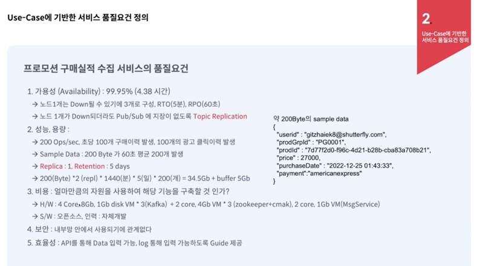

# 초격차패키지

## 비동기 프로그래밍 구현해보기

- CorePoolSize
- MaxPoolSize
- WorkQueue
- KeepAliveTime

## UseCase 기반한 Kafka 서비스 요구사항 정의

프로모션 노출 로직 실시간 변경서비스 - 실시간 프로모션 구매 포션 확인 서비스

- promotion click 여부를 user behavior topic에서 확인할 수 있음
- 구매 transaction이 발생된 후 몇 초 이내에 데이터가 재발행되어야 하는가
- 재발행 해야하는 포맷
- 구매내역 attribute중 포함되어야 하는 정보
- 실시간 구매로그가 추후 다른 곳에 쓰일 수 있는가?
- 저장공간의 문제 발생 시 서비스에서 보장해야 하는 데이터 보관기능
- 이력을 넘겨주는 방식
- 노출되지 않아야 할 개인정보 : id, 카드 정보

Kafka에서 Topology : 프로세스와 토픽등이 연결된 모습, 메세지의 흐름, 기본적 처리 내용
kafka stream이란? 프로세스 내부적으로 pipeline을 구성하기 위해 사용

kafka란? distributed message platform
장점 : 고가용성, 빠른 처리
단점 : 순서보장이 어렵다. 아주 작게 사용이 어렵다.
producer, consumer
zookekper는 broker간의 분산처리 정보가 관리된다.

### kafka objects
topic: 폴더
partition: 하위폴더
replica: leader의 장애를 대응하기 위해 만들어놓는 복사본
producer: data를 publishing하는 주체
consumer: data를 subscribe하는 주체
offset: 책갈피

## E-Commerce

1. 상품의 개수 많음
2. 상품의 다양성
3. 통제의 어려움 존재 (일관된 상품의 정보를 요구)
4. 판매자의 정보 관리, 지표화 (policy, margin, quantity, quality)
5. 즉각적 - 검색을 위한 keyword, 연관 데이터
6. 이력 데이터가 엄청나게 많음
7. 파레토 vs 롱테일
8. 같은 데이터를 다른 용도로 많이 쓴다 -> 용도에 따라 저장소나 저장방식을 다르게 가져간다 (elastic, redis, mongodb, rdb)

### traffic
1. promotion
2. 새벽시간에 traffic 이 많이 줄어든다
3. 외부, 내부 traffic handling (inbound 되는 주소지가 내부인지 외부인지에 따라 제어방향이 다르고, 수준이 다름)

keyword
bigdata, log, catalog, governance, longtail, variation, immediacy, duplication, scalability, optimization, control, policy

MSA
microservice 구조의 서비스가 훨씬 장점이 많다
Payment, Shopping cart, inventory, promotion
서비스의 잦은 변경, 기능별 유연한 scailing, 신규 기능 발생, 여러가지 코드를 사용

### redis (기간한정, 빠른방환)
- 장바구니
- temporary user 정보 - 로그인과 동시에 caching
- 할인정보 : 할인기간 종료 후 소멸
- 쿠폰정보 : 로그아웃이나 쿠폰행사 종료 시 소멸
- 배송정보
- 토큰정보, 세션정보 : 로그인 후 소멸, 로그아웃 시 소멸
- 광고 : 광고계약시점 이후 소멸
- 채팅 정보 : 채팅시 ~ 채팅 종료시까지
- 그 밖의 cache

### kafka (이동, trigger)
- page tracking
- 광고 클릭 정보
- 에러
- 구매정보
- 내/외부 api keyword 정보
- 서버 로그정보
- 장바구니 정보
- 결제정보

