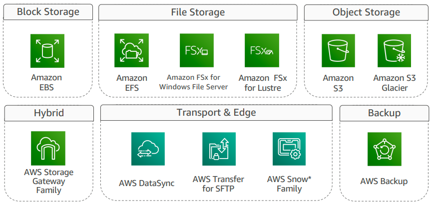

AWS-SAP

# VPC
하나의 region은 최소 3개의 AZ(Availability Zones) 로 구성
Region 간에는 AWS 백본망으로 구성이 되어 서로 통신 가능한 상태

프라이빗 서브넷에서도 인터넷 통신이 가능하게 하기 위해서는 NAT(Network Address Translation) Gateway를 사용
포트 포워딩을 지원하지 않는다.

# EC2
Security 그룹
기본값: EC2에서 외부로 나가는건 가능하지만, 외부에서 들어오는건 불가능

Inbound 룰을 추가하면, 외부에서 해당 포트로 들어 올 수 있게 된다
Security group은 stateful 방화벽 이다. 어떤 트래픽을 막을래 라는 설정은 불가능하다. 나가는게 있으면 들어오는걸 자동으로 열어준다.

# NACLs (Network Access Control Lists)
각 인스턴스 개별이 아니라 서브넷 전체를 제한 하는 역할
룰 개수의 제한이 있다. (INBOUND 40개, OUTBOUND 40개)

# Endpoints
## Gateway endpoints
S3의 프라이빗 통신을 위해서 사용

## Interface endpoints
Kinesis나, Dynamo DB등의 리저널 서비스와 연결을 해준다.

## VPC Flow Logs
VPC나 Subnet의 덤프를 다 사용 가능.
S3와 CloudWatch 둘다 사용 가능. 클라우드 워치가 더 비싸지만, 콘솔에서 직접 조회 가능해서 더 편리하다. S3의 경우 파일단위로 저장하고 아테나로 조회 해야 한다.

## VPC Peering
용도에 따라서 VPC를 나눌 경우, VPC간에 통신이 필요. 그럴 경우 Peering
VPC Peering이라는 것을 생성 후, 라우팅 테이블에 각자의 vpc방향으로 가는 룰을 만들어야 한다.

## VPN Connectivity
VPC와 온프레미스 ipsec으로 연결

BGP나 스태틱 라우팅 사용, 스태틱은 AWS 들어오는 패스 선택할 수 없음
Border Gateway Protocol(BGP)은 인터넷에서 데이터를 전송하는 데 가장 적합한 네트워크 경로를 결정하는 일련의 규칙

IPSEC을 통해서 redundant ipsec tunnels구성. 터널은 기본적으로 2개이다. bgp를 사용할 경우 한 터널에 문제가 생기면 자동으로 다른 하나로 넘어간다.

## Direct Connect

VIF virtual interface

Transit Gateway 또는 Direct Connect Gateway를 이용해서 vpc를 한번에 관리 가능하다.

## Traffic Mirroring
## VPC Reachability Analyzer
분석

## EC2
8xlarge = 2 * 4xlarge

## EC2 키페어
키페어 동작 방식
EC2 인스턴스에 접근하기 위한 인증 방식
ID/비밀번호 인증보다 안전한 인증 방식
AWS는 공개키만 보관. 인스턴스가 시작할 때 내부로 복사
시작(Launch)시 Public Key를
~/.ssh/authorized_keys에 추가
개인키는 사용자가 안전하게 보관 및 관리

## ELB
ELB는 다수 EC2 Instance로 인입되는 Application Traffic을 자동으로 분산/분배 (L4 Switch)

CLB (Classic)
서비스 별로 Classic Load Balancer 구성
ELB별 DNS Record 등록

ALB (Application)
다양한 서비스를 하나의 Application Load Balancer로 통합 (URL Path 기반 라우팅 적용)
모든 서비스에 대하여 하나의 DNS Record만 필요

NLB (Network)
고정 IP 제공
매우 낮은 Latency

## Auto Scaling

## Storage

EBS (Elastic Block Store)

EFS (Elastic File System)

S3

Storage Gateway

## Database

RDS

Aurora
(MySQL과 PostgreSQL 호환성 제공)

DW - Redshift

Dynamo DB

DocumentDB

Elastic Cache

Opensearch 
로그 분석, 어플리케이션 모니터링, full-text 검색
Logstash, Kibana를 제공하며 Elasticsearch의 표준 API 사용 가능

## CloudWatch
고해상도 경보, 로그 및 매트릭 상관 관계, 이상 탐지, ServiceLens, Synthetics Canary

MSK - aws kafka

키워드 리스트
https://velog.io/@joyfulbean/AWS-SAP-Dump-%EB%AC%B8%EC%A0%9C
https://sedurm.notion.site/AWS-Certified-Solutions-Architect-Professional-26e2106bacd94cfca6e1879c6ff06736

