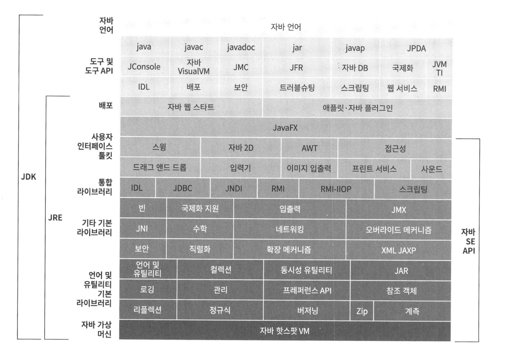
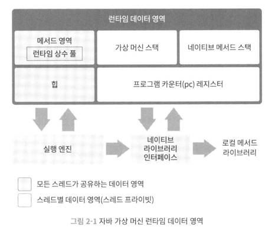

# JVM 밑바닥까지 파헤치기

## 1부 자바와 친해지기

### 1장 자바 기술 시스템 소개

#### 1.1 들어가며

자바의 특징
- 하드웨어 플랫폼이라는 족쇄를 제거하여 "한 번 작성하면 어디서든 실행된다"라는 이상을 실현
- 상당히 안전한 메모리 관리 시스템을 갖춘 덕에 메모리 누수 문제와 엉뚱한 메모리를 가리키는 문제 대부분을 피할 수 있다.
- 런타임에 핫 코드를 감지, 컴파일하고 최적화하여 자바 애플리케이션이 최상의 성능을 내도록 도와준다.
- 표준 API 자체가 풍부할 뿐 아니라 수많은 기업과 오픈 소스 커뮤니티에서 제공하는 다양한 기능의 서드 파티 라이브러리를 활용할 수 있다.


#### 1.2 자바 기술 시스템
- 자바 프로그래밍 언어, 자바 가상 머신 구현, 클래스 파일 포맷, 자바 클래스 라이브러리 API, 다른 기업과 오픈 소스 커뮤니테이서 제공하는 서드 파티 클래스 라이브러리


#### 1.3 자바의 과거와 현재
#### 1.3.1 자바의 탄생
제임스 고슬링

#### 1.3.5 모던 자바의 시작
2014년: JDK 8
- JEP 126: 람다식 지원
- JEP 104: 자바스크립트 엔진 내장
- JEP 150: 새로운 시간 및 날짜 API
- JEP 122: 핫스팟에서 영구 세대 완전 제거

#### 1.4 자바 가상 머신 제품군
다양한 VM 들이 있었음

#### 1.5 자바 기술의 미래
그랄VM, 발할라, 앰버, 파나마 등
지속적으로 발전중 : var, switch, Pattern Matching, Records, Sealed Classes

#### 1.6 실전: 내 손으로 빌드하는 JDK

## 2부 자동 메모리 관리

### 2장 자바 메모리 영역과 메모리 오버플로

#### 2.1 들어가며
자바 개발자는 가상 머신이 제공하는 자동 메모리 관리 메커니즘 덕에 메모리 할당과 해제를 짝지어 코딩하지 않아도 메모리 누수나 오버플로 문제를 거의 겪지 않는다.
하지만 통제권을 위임했기 때문에 문제가 한번 터지면 가상 머신의 메모리 관리 방식을 이해하지 못하는 한 해결하기가 상당히 어렵다.

#### 2.2 런타임 데이터 영역
JVM은 자바 프로그램을 실행하는 동안 필요한 메모리를 몇 개의 데이터 영역으로 나눠 관리한다.
어떤 영역은 프로세스의 시작과 동시에 만들어지며, 어떤 영역은 사용자 스레드의 시작/종료에 맞춰 생성/삭제된다.



##### 2.2.1 프로그램 카운터 (pc)
**프로그램 카운터 레지스터**는 작은 메모리 영역으로, 현재 실행 중인 스레드의 '바이트코드 줄 번호 표시기'라고 생각
바이트코드 인터프리터는 이 카운터의 값을 바꿔 다음에 실행할 바이트코드 명령어를 선택하는 식으로 동작한다.
프로그램의 제어 흐름, 분기, 순환, 점프 등을 표현하는 것이다. 예외 처리나 스레드 복원 같은 모든 기본 기능이 바로 이 표시기를 활용해 이루어진다.

자바 가상 머신에서의 멀티스레딩은 CPU 코어를 여러 스레드가 교대로 사용하는 방식으로 구현되기 때문에 특정 시각에 각 코어는 한 스레드의 명령어만 실행하게 된다.
따라서 스레드 전환 후 이전에 실행하다 멈춘 지점을 정확하게 복원하려면 스레드 각각에는 고유한 프로그램 카운터가 필요하다. 따라서 각 스레드의 카운터는 서로 영향을 주지 않는 독립된 영역에 저장된다.
이 메모리 영역을 **스레드 프라이빗 메모**라고 한다.

스레드가 자바 메서드를 실행 중일 때는 실행 중인 바이트코드 명령어의 주소가 프로그램 카운터에 기록된다.
한편 스레드가 네이티브 메서드를 실행 중일 때 프로그램 카운터 값은 Undefined다. 프로그램 카운터 메모리 영역은 OutOfMemoryError조건이 명시되지 않는 유일한 영역

##### 2.2.2 자바 가상 머신 스택

프로그램 카운터처럼 자바 가상 머신 스택도 '스레드 프라이빗'하며, 연결된 스레드와 운명을 같이 한다.
각 메서드가 호출될 때마다 자바 가상 머신은 스택 프레임을 만들어 지역 변수 테이블, 피연산자 스택, 동적 링크, 메서드 반환값 등의 정보를 저장한다.
그런 다음 스택 프레임을 가상 머신 스택에 푸시하고, 메서드가 끝나면 팝하는 일을 반복한다.

자바의 메모리 영역을 힙 메모리와 스택 메모리로 구분하는 사람이 많다. c++ 메모리 구조에서 기인한 것이다.
스택이라고 하면 보통 지역 변수 테이블을 가리킬 때가 많다. 지역 변수 테이블에는 자바 가상 머신이 컴파일타임에 알 수 있는 다양한 기본 데이터 타입, 객체 참조, 반환 주소 타입을 저장한다.
지역 변수 테이블에서 이 데이터 타입들을 저장하는 공간을 지역 변수 슬롯이라 한다. 일반적으로 슬롯 하나의 크기는 32비트다.
double 타입은 64, 나머지 타입은 모두 슬롯 하나에 저장된다. 지역 변수 테이블을 구성하는데 필요한 데이터 공간은 컴파일 과정에서 할당된다.
자바 메서드는 스택 프레임에서 지역 변수용으로 할당받아야 할 공간의 크기가 이미 완벽하게 결정되어 있다.
메서드 실행 중에는 절대 변하지 않는다. 

스택 메모리 영역에서 두 가지 오류가 발생할 수 있는데
- 스레드가 요청한 스택 깊이가 가상 머신이 허용하는 깊이보다 크다면 StackOverflowError
- 스택 용량을 동적으로 확장할 수 있는 자바 가상 머신에서는 스택을 확장하려는 시점에 여유 메모리가 충분하지 않다면 OutOfMemoryError


##### 2.2.3 네이티브 메서드 스택

네이티브 메서드 스택은 가상 머신 스택과 매우 비슷한 역할을 한다. 차이점이라면 가상 머신 스택은 자바 메서드를 실행할때 사용하고,
네이티브 메서드 스택은 네이티브 메서드를 실행할 때 사용한다는 것이다. 네이티브메서드 스택에서 메서드를 어떤 구조로 어떻게
표현해야 하는지와 관련하여 아무것도 명시하지 않았다. 따라서 가상 머신 구현자가 원하는 형태로 자유롭게 표현할 수 있다.
가상 머신 스택처럼 네이티브 메서드 스택도 StackOverflowError, OutOfMemoryError 를 던질 수 있따.

##### 2.2.4 자바 힙

자바 힙은 자바 애플리케이션이 사용할 수 있는 가장 큰 메모리다. 자바 힙은 모든 스레드가 공유하며 가상 머신이 구동될 때 만들어진다. 이 메모리 영역의 유일한 목적은 객체 인스턴스를 저장하는 것이고,
자바 세계의 거의 모든 객체 인스턴스가 이 영역에 할당되나. <자바 가상 머신 명세>에는 '거의' 모든 객체 인스턴스와 배열은 힙에 할단된다라고 적혀있다.
JIT 컴파일 기술이 발전하면서, 스택 할당과 스칼라 치환 최적화 방식이 살짝 달라졌다.

자바 힙은 가비지 컬렉터가 관리하는 메모리 영역이기 때문에 어떤 문헌에서는 GC 힙이라고도 한다.
메모리 회수 관점에서 대다수 현대적인 GC는 세대별 컬렉션 이론을 기초로 설계됐다.
new generation, old generation, permanent generation, eden space, from survivor space, to survivor space
등을 반복해서 이야기할 것
G1 컬렉터가 등장한 2010년 전후로 핫스팟 가상 머신은 업계에서 확고한 주류가 되었음,
메모리 할당 관점에서 자바 힙은 모든 스레드가 공유한다. 따라서 객체 할당 효율을 높이고자 스레드 로컬 할당 버퍼 여러 개로 나뉜다. 하지만 자바 힙에 저장된다는 사실은 달라지지 않는다.
자바 힙을 작게 구분하는 목적은 오직 메모리 회수와 할당을 더 빠르게 하기 위함이다.

<자바 가상 머신 명세>에 따르면 자바 힙은 물리적으로 떨어진 메모리에 위치해도 상관없으나 논리적으로는 연속되어야 한다.
자바 힙은 크기를 고정할 수도, 확장할 수도 있게 구현할 수 있다. -Xmx, -Xms 새로운 인스턴스에 할당해 줄 힙 공간이 부족하고 힙을 더는 확장할 수 없다면
OutOfMemoryError 를 던진다.

##### 2.2.5 메서드 영역
메서드 영역도 자바 힙처럼 모든 스레드가 공유한다. 메서드 영역은 가상 머신이 읽어 들인 타입 정보, 상수, 정적 변수 그리고 JIT 컴파일러가 컴파일한 코드 캐시등을 저장하는 데 이용된다.
<자바 가상 머신 명세>에서는 메서드 영역도 논리적으로 힙의 한 부분으로 기술하지만 자바 힙과 구분하기 위해 논힙이라 부르기도 한다.

<자바 가상 머신 명세>는 메서드 영역에 제약을 거의 두지 않았다. 자바 힙과 마찬가지로 연속될 필요가 없으며, 크기를 고정할 수도 있고, 확장 가능하게 만들 수 있다.
또한 메서드 영역이 꽉 차서 필요한 만큼 메모리를 할당할 수 없다면 OutOfMemoryError 를 던진다.

##### 2.2.6 런타임 상수 풀

런타임 상수 풀은 메서드 영역의 일부다. 상수 풀 테이블에는 클래스 버전, 필드, 메서드, 인터페이스 등 클래스 파일에 포함된 설명 정보에 더해 컴파일타임에 생성된 다양한 리터럴과 심벌 참조가 저장된다.
가상 머신이 클래스를 로드할 때 이러한 정보를 메서드 영역의 런타임 상수 풀에 저장한다.

자바 가상 머신은 클래스 파일의 각 영역별로 엄격한 규칙을 정해 놓았다. 예컨대 가상 머신이 클래스 파일을 로드해 실행하려면 각 바이트에는 명세가 요구하는 데이터가 들어 있어야 한다.
다만 런타임 상수 풀에 대해서는 <자바 가상 머신 명세>가 요구 사항을 상세하게 정의하지 않아서 가상 머신 제공자가 입맛에 맞게 구현할 수 있다.

클래스 파일의 상수 풀과 비교해 런타임 상수 풀의 중요한 특징은 동적이라는 점이다. 자바 언어에서는 상수가 꼭 컴파일타임에 생성되어야 한다는 규칙이 없다.
즉 상수 풀의 내용 전부가 클래스 파일에 미리 완벽하게 기술되어 있는 게 아니가. 런타임에도 메서드 영역의 런타임 상수 풀에 새로운 상수가 추가될 수 있다.
String, intern() 메서드

런타임 상수 풀은 메서드 영역에 속하므로 자연스럽게 메서드 영역을 넘어서까지 확장될 수는 없다. 그래서 상수 풀의 공간이 부족하면 OutOfMemoryError를 던진다.

##### 2.2.7 다이렉트 메모리
다이렉트 메모리는 <자바 가상 머신 명세>에 정의된 영역도 아니지만 자주 쓰이는 메모리이며 OutOfMemoryError의 원인이 될 수 있다ㅏ.
JDK 1.4에서 NIO가 도입되면서 채널과 버퍼 기반 I/O 메서드가 소개됐다. NIO는 힙이 아닌 메모리를 직접 할당할 수 있는 네이티브 함수 라이브러리를 이용하며
이 메모리에 저장되어 있는 DirectByteBuffer 객체를 통해 작업을 수행할 수 있다.
따라서 자바 힙과 네이티브 힙 사이에서 데이터를 복사해 주고받이 않아도 돼서 일부 시나리오에서 성능을 크게 개선했다.
물리 메모리를 직접 할당하기 때문에 자바 힙 크기의 제약과는 무관하지만 이역시 메모리라는 사실에는 변함이 없다.
따라서 하부 기기의 총 메모리 용량과 프로세서가 다룰 수 있는 주소 공간을 넘어설 수는 없다. 사용되는 모든 메모리 영역의 합이 물리 메모리 한계를 넘어서면 동적 확장을 시도할 때 
OutOfMemoryError가 발생한다.

#### 2.3 핫스팟 가상 머신에서의 객체 들여다보기

##### 2.3.1 객체 생성
언어 수준에서 객체 생성은 보통 단순히 new 키워드를 쓰면 끝난다. 그렇다면 가상 머신 수준에서는 과연 어떤 과정을 거쳐 객체가 생성될까?
자바 가상 머신이 new 명령에 해당하는 바이트코드를 만나면 이 명령의 매개 변수가 상수 풀 안의 클래스를 가리키는 심벌 참조인지 확인한다.
그런 다음 이 심벌 참조가 뜻하는 클래스가 로딩, 해석, 초기화 되었는지 확인한다. 준비되지 않은 클래스라면 로딩부터
로딩이 완료된 클래스라면 새 객체를 담을 메모리를 할당한다. 객체용 메모리 공간 할당은 자바 힙에서 특정 크기의 메모리 블록을 잘라 주는 일
자바 힙이 규칙적이냐 아니냐에 따라 달라지며, 자바 힙이 규칙적이냐는 사용하는 가비지 컬렉터가 컴팩트를 할 수 있느냐에 달렸다.
따라서 시리얼과 파뉴처럼 모으기가 가능한 컬렉터를 사용하는 시스템이라면 단순하고 효율적인 포인터 밀치기 방식의 할당 알고리즘을 채택하고
이론상의 CMS처럼 스윕 알고리즘을 적용한 컬렉터를 쓰는 시스템은 더 복잡한 여유 목록 방식을 채택할 것이다.

가상 머신에서 객체 생성은 매우 빈번하고, 멀티스레딩 환경에서는 여유 메모리의 시작 포인터 위치를 수정하는 단순한 일도 스레드 안전하지 않기 떄문에
여러 스레드가 동시에 객체를 생성하려고 할 때 문제가 생길 수 있다.

해법은 두 가지
첫 번째는 메모리 할당을 동기화하는 방법 실제로 CAS 실패 시 재시도 방식의 가상 머신은 갱신을 원자적으로 수행한다.
두 번째는 스레드마다 다른 메모리 공간을 할당하는 방법 TLAB, 각 스레드는 로컬 버퍼에서 메모리를 할당 받아 사용하다가 버퍼가 부족해지면 그때 동기화를 해 새로운 버퍼를 할당 받음
-XX:+/-UseTLAB

메모리 할당을 받으면 가상 머신은 할당받은 공간을 0으로 초기화
다음으로는 각 객체에 필요한 설정을 해 줌 : 어느 클래스의 인스턴스, 클래스의 메타 정보 찾는 법, 객체의 해시코드, GC 나이
이런 정보가 각 객체의 객체 헤더에 저장


##### 2.3.2 객체의 메모리 아웃
핫스팟 가상 머신은 객체를 세 부분으로 나눠 힙에 저장
헤더 : 객체 자체의 런타임 데이터
인스턴스 데이터 : 객체가 실제로 담고 있는 정
길이 맞추기용 정렬 패딩 : 특별한 의미 없이 자리를 확보

##### 2.3.3 객체에 접근하기
대다수 객체는 다른 객체 여러 개를 조합해 만들어짐
<자바 가상 머신 명세>는 참조 타입을 단지 객체를 가리키는 참조라고만 정했다. 주로 핸들이나 다이렉트 포인터를 사용해 구현

#### 2.4 실전 : OutOfMemoeryError 예외
<자바 가상 머신 명세>에 따르면 프로그램 카운터 외에도 가상 머신 메모리의 여러 런타임 영역에서 OutOfMemoryError가 날 수 있음

메모리 누수라면 도구를 이용해 누수된 객체로부터 GC 루트까지의 참조 사슬을 살표보고 어느 GC루트와 연결되어 있기에 가비지 컬렉터가 회수하지 못했는지 확인
메모리 누수가 아니라면, 모든 객체가 다 살아 있어야 한다면 자바 가상 머신의 힙 매개 변수 설정 -Xmx -Xms와 컴퓨터의 가용 메모리를 비교하여 가상 머신에 메모리를 더 많이 할당할 수 있는지 알아본다.
그다음에는 코드에서 수명 주기가 너무 길거나 상태를 너무 오래 유지하는 객체는 없는지, 공간 낭비가 심한 데이터 구조를 쓰고 있지는 않은지 살표 프로그램이 런타임에 소비하는 메모리를 최소로 낮춘다.

##### 2.4.2 가상 머신 스택과 네이티브 메서드 스택 오버플로
스택 크기는 오직 -Xss 매개 변수로만 변경할 수 있다.
StackOverFlowError, OutOfMemoryError 확인

##### 2.4.3 메서드 영역과 런타임 상수 풀 오버플로
영구 세대의 크기는 
JDK 7 이하 -XX:PermSize, -XX:MaxPermSize 매개 변수로 조절 할 수 있고 이는 상수 풀 용량에도 간접덕으로 영향을 준다.
JDK 8 이상 -XX:MetaspaceSize, -XX:MaxMetaspaceSize, -XX: MinMetaspaceFreeRatio

```java
public class RuntimeConstantPoolOOM {
    public static void main(String[] args) {
        String str1= new StringBuilder("컴퓨터").append(" 소프트웨어").toString();
        System.out.println(strl.intern() == str1); 
    }
}
```
jdk 6 false 처음은 영구 세대의 문자열 상수 풀에 복사, StringBuilder로 생성한 문자열 객체의 인스턴스는 자바 힙에 존재
jdk 7 이상 true intern() 문자열 상수 자바 힙

JDK 8 부터는 영구 세대가 사라지고, 메타스페이스를 이용


##### 2.4.4 네이티브 다이렉트 메모리 오버플로

-XX:MaxDirectMemorySize 따로 설정하지 않았다면 기본적으로 -Xmx로 설정한 자바 힙의 최댓값과 같음
메모리 오버플로로 생성된 덤프 파일이 매우 작고 프로그램에서 DirectMemory를 직접 또는 간접적 (NIO) 사용했다면,
다이렉트 메모리에서 원인을 찾아야한다.


