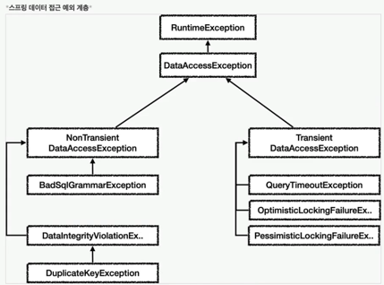

## 스프링 기본

WAS -> Dispatcher Servlet -> (Pre Handler, Handler Adapter - Controller, PostHandler) -> afterCompletion -> WAS

- 클라이언트의 요청을 디스패처 서블릿이 받음
- 요청 정보를 통해 요청을 위임할 컨트롤러를 찾음
- 요청을 컨트롤러로 위임할 핸들러 어댑터를 찾아서 전달함
- 핸들러 어댑터가 컨트롤러로 요청을 위임함
- 비지니스 로직을 처리함
- 컨트롤러가 반환값을 반환함
- 핸들러 어댑터가 반환값을 처리함
- 서버의 응답을 클라이언트로 반환함


### 서블릿, 서블릿 필터


로그인 서블릿 필터 제한
```java
HTTP 요청 -> WAS -> 필터 -> 서블릿 -> 컨트롤러 //로그인 사용자
HTTP 요청 -> WAS -> 필터(적절하지 않은 요청이라 판단, 서블릿 호출X) //비 로그인 사용자
```
필터에서 적절하지 않은 요청이라고 판단하기 좋음

> ApplicationFilter는 등록해두면 재귀적으로 작동함 (coroutine같이)

> 필터(Filter)는 서블릿이 제공하는 기술이므로 서블릿 컨테이너에 의해 생성되며 서블릿 컨테이너에 등록이 된다. 그렇기 때문에 스프링의 빈으로 등록도 불가능했으며, 빈을 주입받을 수 없었다.
> 하지만 필터에서도 DI와 같은 스프링 기술을 필요로 하는 상황이 발생하면서, 스프링 개발자는 필터도 스프링 빈을 주입받을 수 있도록 대안을 마련하였는데, 그것이 바로 DelegatingFilterProxy이다. 


### 스프링 인터셉터

- 스프링 인터셉터는 디스패처 서블릿과 컨트롤러 사이에서 컨트롤러 호출 직전에 호출 된다.
- 스프링 인터셉터는 스프링 MVC가 제공하는 기능이기 때문에 결국 디스패처 서블릿 이후에 등장하게 된다. 스프링 MVC의 시작점이 디스패처 서블릿이라고 생각해보면 이해가 될 것이다.
- 스프링 인터셉터에도 URL 패턴을 적용할 수 있는데, 서블릿 URL 패턴과는 다르고, 매우 정밀하게 설정할 수 있다.


HandlerInterceptor (request, response, handler)

- 서블릿 필터의 경우 단순하게 doFilter() 하나만 제공된다. 인터셉터는 컨트롤러 호출 전( preHandle ), 호출 후( postHandle ), 요청 완료 이후( afterCompletion )와 같이 단계적으로 잘 세분화 되어 있다.
- 서블릿 필터의 경우 단순히 request , response 만 제공했지만, 인터셉터는 어떤 컨트롤러( handler )가 호출되는지 호출 정보도 받을 수 있다. 그리고 어떤 modelAndView 가 반환되는지 응답 정보도 받을 수 있다.

[로깅 interceptor, aop ?](https://velog.io/@miot2j/Spring-Filter-Interceptor-AOP-%EC%B0%A8%EC%9D%B4-%EB%B0%8F-AOP%EB%A5%BC-%EC%82%AC%EC%9A%A9%ED%95%98%EC%97%AC-Logging%EC%9D%84-%EA%B5%AC%ED%98%84%ED%95%9C-%EC%9D%B4%EC%9C%A0)


### HandlerMethodArgumentResolver

```kotlin
@Retention(value = AnnotationRetention.RUNTIME)
@Target(AnnotationTarget.VALUE_PARAMETER)
annotation class LogInUser

class LoginArgumentResolver(
    private val userRepository: UserRepository
) : HandlerMethodArgumentResolver {
    override fun supportsParameter(methodParameter: MethodParameter): Boolean {
        return methodParameter.getParameterAnnotation(LogInUser::class.java) != null
    }

    override fun resolveArgument(
        parameter: MethodParameter, mavContainer: ModelAndViewContainer?,
        webRequest: NativeWebRequest, binderFactory: WebDataBinderFactory?
    ): Any {
        return userRepository.findByIdOrThrow(CoinheimContext.userId())
    }
}

```

### converter

```java
package org.springframework.core.convert.converter;

public interface Converter<S, T> {
    T convert(S source);
}
```


ㅡㅡㅡㅡㅡㅡㅡㅡㅡㅡㅡㅡㅡㅡㅡㅡㅡㅡㅡㅡㅡ

## 스프링 고급

### thread local
ThreadLocal<UserInfo> local = ThreadLocal<>(); 

### proxy - 대리자

Client -> ServerInterface
            ^(proxy)   ^(server)
proxy 를 적용해도 실제 서버처럼 작동해야한다.

- 접근 제어
  - 권한에 따른 접근 차단
  - 캐싱
  - 지연 로딩
- 부가 기능 추가
- 프록시 체인


### 동적 프록시 기술

자바가 기본으로 제공하는 jdk 동적 프록시 기술이나 CGLIB 같은 프록시 생성 오픈소스 기술을 활용하면 프록시 객체를 동적으로 만들어낼 수 있다.
리플랙션 기술을 사용하여 클래스 메서드의 메타정보를 동적으로 획득하고 코드도 동적으로 호출할 수 있다.
(람다를 사용하면 공통화 가능하긴함, 내부클래스는 $)

```java
void test() throws Exception {
    Class classHello = Class.forName("Hello");

    Hello target = new Hello();

    Method methodHello = classHello.getMethod("callA");
    dynamicCall(methodHello, tartget)
}

private void dynamicCall(Method method, Object target) throws Exception {
    log.info("start");
    Object result = method.invoke(target);
    log.info("result: {}", result);
}
```
-> 클래스나 메소드 정보를 동적으로 변경할 수 있음 : 런타임시 동작하기 때문에 컴파일시 오류를 잡기 어려움

자바 프록시는 interface가 있어야함 - invocationHandler

### CGLIB - 바이트코드를 조작해서 동적으로 클래스를 생성하는 기술을 제공하는 라이브러리

MethodInterceptor - 성능상 methodProxy 쓰면 좋음
```java
Enhancer enhancer = new Enhancer();
enhancer.setSuperclass(대상 class);
enhancer.serCallback(interceptor);

enhancer.create(); // 프록시 생성
```

final 붙으면 상속 불가능하기 때문에 CGLIB 예외 발생

### 스프링 프록시
InvocationHandler, MethodInterceptor 를 중복 없이 사용하려고 할때

ProxyFactory 인터페이스 있으면 jdk 동적 프록시 구체 클래스만 있으면 cglib 프록시

프록시 팩토리 사용하면 Advice(로직)를 호출하는 전용 InvocationHandler, MethodInterceptor를 내부에서 사용한다.
Pointcut이라는 개념을 도입해서 이 문제를 일관성 있게 해결한다.

> invocation.proceed() 를 호출하면 target클래스 호출하고 결과 받음

- 포인트컷 : 어디에 부가 기능을 적용하거나 하지 않을지 필터링 한다.
- 어드바이스 : 부가 기능을 정의한다.
- 어드바이저 : 포인트컷 + 어드바이스

하나의 target 에 여러 AOP가 동시에 적용되어도, 스프링의 AOP는 target 마다 하나의 프록시만 생성한다.


### 빈 후처리기

PostProcessor
빈 후처리기를 이용하면 컴포넌스 스캔을 사용하는 빈까지 프록시를 적용할 수 있다.

ㅡㅡ
AnnotationAwareAspectJAutoProxyCreator

어드바이저만 빈 등록하면 됨

AspectJExpressionPointcut

### @Aspect AOP

@Aspect, @Around, 메소드는 advice, joinPoint.proceed 하면 됨
어드바이저 캐싱도 함


### 스프링 AOP
애스펙트를 사용한 프로그래밍 방식을 관점 지향 프로그래밍 AOP
AOP는 OOP를 대체하기 위한 것이 아니라 횡단 관심사를 깔끔하게 처리하기 어려운 OOP의 부족한 부분을 보조하는 목적으로 나왔음

핵심 기능 - 해당 객체가 제공하는 고유의 기능
부가 기능 - 핵심 기능을 보조하기 위해 제공되는 기능 (로그 추적 로직, 트랜잭션 기능)

AOP의 대표적인 구현으로 AspectJ 프레임워크

### AOP 적용하는 법

컴피일 시점 - 위빙 
클래스 로딩 시점 - jvm 저장하기 전에 java instrumentation (모니터링 툴들이 이런식으로 java -javaagent) 로드 조작기를 지정해줘야함
런타임 시점(프록시) - 스프링 같은 컨테이너의 도움을 받음

조인 포인트 - AOP 적용할 수 있는 모든 지점, 스프링은 메소드를 호출해야 사용할 수 있음
포인트 컷 - 어드바이스가 적용될 위치
타겟 - 어드바이스를 받는 객체
어드바이스 - 부가기능
애스팩트 - 어드바이스 + 포인트컷을 모듈화한 것
위빙 - 결정한 타겟 조인 포인트에 어드바이스를 적용하는 것
AOP프록시 - jdk 동적 프록시 또는 CGLIB 프록시


joinPoint 그냥 할 때 -> ProceedingJoinPoint는 proceed 해야함

@Pointcut
@Around
pointcut signature

-> pointCut 따로 모아두고 쓰기도 함

### 어드바이스 순서
기본적으로 순서를 보장하지 않는다. 클래스별로 순서를 할 수 있음
내부 클래스로 만들면 됨

### 어드바이스 종류
@Around, @Before, @AfterReturning, @AfterThrowing, @After

ProceedingJoinPoint는 around에서만 사용할 수 있음

### execution 매칭 조건

접근제어자, 반환타입, 선언타입, 메서드이름, 파라미터, 예외(생략)
execution(* *(..));

.은 정확
..은 하위도 가능

execution은 인터페이스 선정이 가능하다. within은 정확하게 타입이 맞아야한다.

### args : 인자가 주어진 타입의 인스턴스인 조인 포인트로 매칭

### @target, @within 은 타입에 있는 애노테이션으로 AOP 적용 여부를 판단한다.
### @annotation, @args, bean, args, this(proxy), target(실제 대상 구현체)


메소드 내부 호출에 프록시를 적용할 수 없음


대안 1 - 자기자신 주입 (setter) proxyInstance이기 때문에 해결됨
대안 2 - 자기 주입 (지연 조회) applicationContext이용해서 나중에 꺼냄 거대하니 ObjectProvider 이용
대안 3 - 구조변경 class 분리


프록시 기술과 한계 - 타입 캐스팅
proxyTargetClass=false jdk 동적 프록시를 사용해서 인터페이스 기반 프록시 생성 -> 프록시를 인터페이스로 변경 성공 -> 구체 타입으로 캐스팅하지 못 함
proxyTargetClass=true CGLIB 구체 타입으로 캐스팅 변경 성공

cglib를 쓰게 됨
하지만 문제점 -> 해결 (스프링 4.0, 부트 2.0)
- 대상 클래스 기본 생성자 필수 (objenesis - 생성자 호출 없이 객체를 생성할 수 있게 해줌)
- 생성자 2번 호출 문제 (objenesis - 한 번만 호출하게 해줬음)
- final 키워드, 메서드 사용 불


## 스프링 DB

### JDBC(Java Database Connectivity)
자바에서 데이터베이스에 접속할 수 있도록 하는 자바 API

- java.sql.Connection - 연결
- java.sql.Statement - SQL을 담은 내용
- java.sql.ResultSet - SQL 요청 응답

JDBC 코드는 변경하지 않아도 되지만 SQL은 해당 데이터베이스에 맞도록 변경해야한다.

### SQL Mapper vs ORM
JdbcTemplate, MyBatis : JPA

### 커넥션풀
DataSource 커넥션을 획득하는 방법을 추상화 -> DBCP2, HikariCP, DriverManagerDataSource


### 트랜잭션 이해
ACID
Atomicity - 트랜잭션 내에서 실행한 작업들은 마치 하나의 작업인 것처럼 모두 성공 하거나 모두 실패해야 한다.
Consistency - 모든 트랜잭션은 일관성 있는 데이터베이스 상태를 유지해야 한다. (데이터베이스에서 정한 무결성 제약 조건을 만족)
Isolation - 동시에 실행되는 트랜잭션들이 서로에게 영향을 미치지 않도록 격리한다.
Durability - 트랜잭션을 성공적으로 끝내면 그 결과가 항상 기록되어야 한다.


#### isolation level
- read uncommitted
  - dirty read

- read committed
  - 트랜잭션-1이 commit 한 이후 아직 끝나지 않는 트랜잭션-2가 다시 테이블 값을 읽으면 값이 변경됨을 알 수 있다.
    하나의 트랜잭션내에서 똑같은 SELECT 쿼리를 실행했을 때는 항상 같은 결과를 가져와야 하는 REPEATABLE READ의 정합성에 어긋난다.
    이러한 문제는 주로 입금, 출금 처리가 진행되는 금전적인 처리에서 주로 발생한다.
    데이터의 정합성은 깨지고, 버그는 찾기 어려워 진다.

- repeatable read
  - MySQL에서는 트랜잭션마다 트랜잭션 ID를 부여하여 트랜잭션 ID보다 작은 트랜잭션 번호에서 변경한 것만 읽게 된다.
    Undo 공간에 백업해두고 실제 레코드 값을 변경한다.
    백업된 데이터는 불필요하다고 판단하는 시점에 주기적으로 삭제한다.
    Undo에 백업된 레코드가 많아지면 MySQL 서버의 처리 성능이 떨어질 수 있다.
    이러한 변경방식은 MVCC(Multi Version Concurrency Control)라고 부른다.
  - 다른 트랜잭션에서 수행한 변경 작업에 의해 레코드가 보였다가 안 보였다가 하는 현상
    이를 방지하기 위해서는 쓰기 잠금을 걸어야 한다.

- serializable

### DB락 

조회 시점에 락이 필요한 경우
- 트랜잭션 종료 시점까지 해당 데이터를 다른 곳에서 변경하지 못하도록 강제로 막아야 할 때 사용

트랜잭션을 사용하는 동안 같은 커넥션을 유지해줘야함

### 트랜잭션 추상화
PlatformTransactionManager (DataSourceTransactionManager, JpaTransactionManager)

- 트랜잭션 추상화
- 리소스 동기화 (ThreadLocal 이용해서 동기화해줌) TransactionalSynchronizationManager

스프링 언체크 예외가 발생하면 롤백
체크는 디폴트 커밋

### 트랜잭션 aop를 이용해서 해결하기 

advisor - BeanFactoryTransactionAttributeSourceAdvisor
pointcut - TransactionAttributeSourcePointcut
advice - TransactionInterceptor

### 예외 사용
- 기본적으로 런타임 예외를 사용
- 체크 예외는 비즈니스 로직상 너무 중요해서 의도적으로 던지는 예외에만 사용 (후처리가 필요할 때)
  - 계좌 이체 실패 예외
  - 결제시 포인트 부족 예외
  - 로그인 ID, PW 불일치 예외
- 개발자기 실수로 예외를 놓치면 안된다고 판달할 때

처음 자바를 설계할 당시에는 체크 예외가 많았는데 처리해야 하는 예외가 많아져서 런타임을 많이 씀
런타임을 필요한 경우 잡아서 처리하고 그렇지 않으면 자연스럽게 던지도록 둠

### 스프링과 문제 해결 - 예외 처리, 반복

SQLException을 잡아서 RuntimeException으로 변경 

체크 예외를 발생하려면 인터페이스에서도 던져야하게 됐음 -> 순수한 인터페이스가 아님 -> RuntimeException 으로 변경
오류 코드를 받아서 커스텀 런타임 익셉션을 만들 수 있음 (키 중복 오류, SQL 문법 오류)
SQLErrorCodeSQLExceptionTranslator 이 dataSource 에러 확인해서 반환해줌




jdbc 반복문제 -> jdbcTemplate


### spring db

JpaException 바꿔주는 것이 있음
EntityManagerFactoryUtils.convertJpaAccessExceptionIfPossible()

- 추상화도 비용이 든다.

복잡한 통계 쿼리를 작성하는 프로젝트는 jpa 보다 MyBatis가 나을 수 있음

JpaTransactionManager이 DataSourceTransactionManager가 제공하는 기능도 대부분 제공
! 같이 쓸때 jpa flush를 해줘야 할 수 있음

PlatformTransactionManager에서 해줌

- 스프링에서 우선순위는 항상 더 구체적이고 자세한 것이 높은 우선순위를 가진다.
- 스프링 초기화 중에는 트랜잭셔널 프록시가 적용 안 될 수 있다 @PostConstruct -> ApplicationReadyEvent 이후에 하자
- 스프링 트랜잭션은 public에서 작동 private 쓰려면 설정이 많이 필요함


### option
- rollbackFor -> exception
- noRollbackFor
- propagation
- isolation


### transaction propagation

트랜잭션 매니저는 트랜잭션 도기화 매니저를 통해서 기존 트랜잭션이 존재하는지 확인한다.
- 이미 기존 트랜잭션이 있으면 참여

물리 트랜잭션은 논리 트랜잭션이 모두 성공해야 커밋함
물리 트랜잭션은 외부 트랜잭션이 종료 될 때까지 유지 되어야한다.

### 외부 롤백
내부 트랜잭션 아무것도 안 하고 롤백 됨
### 내부 롤백
내부 트랜잭션은 물리 트랜잭션에 영향을 주지 않는데 어떻게 전체 롤백할 것인가
UnexpectedRollbackException 발생 - 롤파 전용 마크가 표시


### REQUIRES_NEW
새로운 물리 트랜잭션을 생성

- REQUIRED
- SUPPORT(없으면 없는대로 있으면 있는대로)
- NOT_SUPPORT(없이 진행)
- MANDATORY(기존 트랜잭션 없으면 예외)
- NEVER(트랜잭션 있으면 예외)
- NESTED(중첩 트랜잭션, 내부는 외부에 영향을 주지 않지만, 외부는 내부에 영향을 줌)


