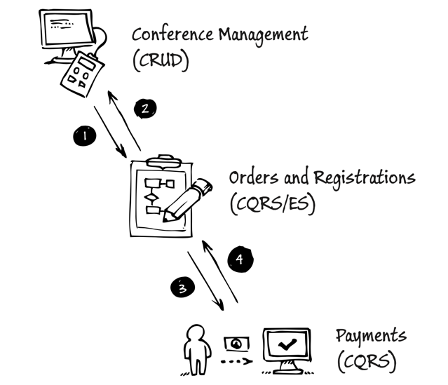

# CQRS Journey

CQRS
Martin Fowler -> 읽기 모델, 쓰기 모델을 분리하는 것?
Greg Young -> 읽기 담당 오브젝트, 쓰기 담당 오브젝트를 분리하는 것

The CQRS Pattern and event sourcing are not mere simplistic solutions to the problems associated with large-scale,
distributed systems.

## Journey 1 - Our Domain: Conference Management System

multi-tenancy 여러 고객에게 서비스를 제공하는 아키텍처

DDD는 써봄, CQRS는 경험해본 사람은 없다고 가정

### Overview of the system
- Manage the sale of different seat types for the conference
- Create a conference and define characteristics of that conference

### Selling seats for a conference
### Creating a conference

### NonFunctional Requirements

Scalability,
Flexibility,

## Journey 2 - Decomposing the domain

### Definition used in this chapter

- Domain
- Bounded context
- Context Map

### Bounded contexts in the conference management system
#### Order and Registration (CQRS/ES)
- Order
  - reservation, payment, registration items (order 1 : N orderItems)
- Reservation
  - seat, ordering process (reservation 1 : N seat)
- If the registrant does not pay for the tickets with 15 minutes, 
the system deletes the reservation and the seats become available for other registrants to reserve 

#### Conference Management (CRUD)
- The name, description, and slug
- The start and end dates of the conference
- The different types and quotas of seats available at the conference

#### Payment (CQRS)

#### Discount Policy, Occasionally Disconnected, Submissions and schedule

### The Context map for the consoto conference management system
1. Events that report when conference have been created, updated, or published. Events that report when seat types have been created or updated
2. Events that report when orders have been created or updated. Events that report when attendees have been assigned to seats.
3. Requests for a payment be made.
4. Acknowledgement of the success or failure of the payment.

## Journey 3 - Orders and Registration Bounded Context

### Domain
- attendee
- registrant
- user
- seat assignment
- order
- order item
- seat
- reservation
- seat availability
- conference site

### Pattern and concepts

1. two separate aggregates
2. a single aggregate
3. using a process manager

first not use event sourcing

> the system must
> check that sufficient seats are available
> record detail of the registration
> update the total number of seats booked for the conference

Validation, Transaction Boundaries, Concurrency, Aggregate and aggregate roots 

### High level architecture
1. Querying the read model
2. issuing commands -> asynchronously and once only to a single recipient
3. handling commands
4. initiating business logic in the domain
5. persisting the changes
6. polling the read model

command model
command > fire and forget

### Impact on testing

We might have a set of tests that we can use to test our domain objects, and all of those tests might be passing.
We might also have a set of tests to verify that our ORM layer can save and retrieve objects successfully.

## Journey 4
