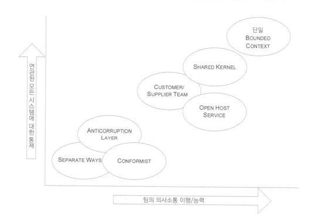
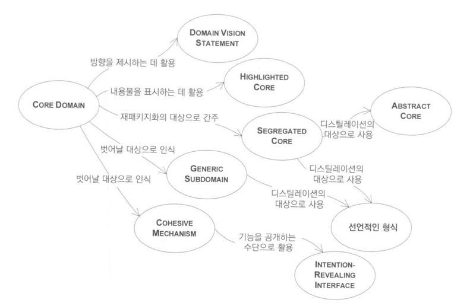

# DDD

1부 동작하는 도메인 모델 만들기 - 도메인 주도 설계의 기본적인 목표 (도메인을 이용해서 작동하는 것을 만들기)
2부 모델 주도 설계의 기본 요소 - (도메인)모델 주도 설계, 모델과 소프트사이의 갭을 줄이기 위해
3부 더 심층적인 통찰력을 향한 리팩터링 - 
4부 전략적 설계 - 복잡한 시스템, 더 큰 조직, 외부 시스템 및 기존 시스템과의 상호작용에서 발생하는 상황


ㅡㅡㅡㅡㅡㅡㅡㅡㅡㅡㅡㅡㅡㅡㅡㅡㅡㅡㅡㅡㅡㅡㅡㅡㅡㅡㅡㅡ

생산 계획이 있으면 재고 관리하고 했음
부품에 재고가 언제쯤 없어진다. 언제쯤 주문하는 것들을 정함

MOQ Minimum Order Quantity
LeadTime 등

기존에 하던 업무를 자동화해주는 것이였음

공장, 증권사, 현금 관리

왜 설계라는 말을 썼나 보며?
Eric Evans (Software Designer)

소프트웨어자체가 디자인이 됐다.
책이 나온 20년 전과 지금은 무엇이 다른가?

> 도메인 주도 설계라고 칭하는 하나의 철학이 나타났음

철학이라 이 책이 어렵다

MS
> Domain-Driven Design(DDD) is a collection of principles and patterns that help developers craft elegant object systems. 
> Properly applied it can lead to software abstractions called domain models. 
> These models encapsulate complex business logic, closing the gap between business reality and code.

반 버논
> DDD will help you to see how you should model software according to the unique business needs that your company has.

마틴 파울러
> Domain-Driven Design is an approach to software development that centers the development on programming a domain model that has a rich understanding of the processes and rules of a domain

모델링, DDD, UML, OOAD, 도메인 모델

DDD -> 도메인 모델(객체 지향 모델링)을 잘 만들자, 중요하다

도메인 모델 빌딩 블럭스

Bounded Context 가 틀어질 수 있으니 자주 모여서 continuous integration 해야함

DDD 한다.
도메인 모델 어디있음? 도메인 통합을 어떻게 하는 것인가?
이걸 대답 못하면 practice를 차용한 것이다.

도메인 모델링

도메인 : 해결하고자 하는 문제 영역
도메인 모델 : 특정 문제와 관련된 모든 주제의 개념 모델, 엔티티, 속성, 역할, 관계, 제약, 솔루션은 기술하지 않음
ㅡㅡㅡㅡㅡㅡㅡㅡㅡㅡㅡㅡㅡㅡㅡㅡㅡㅡㅡㅡㅡㅡㅡㅡㅡㅡㅡㅡㅡ


## 1부 동작하는 도메인 모델 만들기

도메인 : 사용자가 프로그램을 사용하는 대상 영역
모델 : 지식을 선택적으로 단순화하고 의식적으로 구조화한 형태 (단순화, 추상화)
도메인 모델 : 어떤 특정한 다이어그램이 아닌 다이어그램이 전달하고자 하는 아이디어 (중요하다고 생각하는 것을 선택하고 구조화시킨 결과물)
도메인 모델링 : 어떤 목적에 따라 제약에 구애받지 않고 현실을 표현하는 영화 제작에 가까움 (기본적인 UML 그리는 정도는 할 수 있어야 한다.)
[UML](https://creately.com/blog/diagrams/uml-diagram-types-examples/)
[GML](http://wiki.c2.com/?GalacticModelingLanguage)

#### 도메인 주도 설계에서의 모델의 유용성
1. 모델과 핵심 설계는 서로 영향을 주며 구체화된다. - 모델을 의미 있게 만들고 모델의 분석이 최종 산출물인 동작하는 프로그램에 적용되게끔 보장하는 것은 모델과 구현 간의 긴밀한 연결
2. 모델은 모든 팀 구성원이 사용하는 언어의 중추. - 모델과 구현이 긴밀하므로 개발자와 도메인 전문가가 의사소통하는데 별도의 번역 절차가 필요하지 않음
3. 모델은 지식의 정수만을 뽑아낸 것이다. - 모델은 도메인 지식을 조직화하고 가장 중요한 요소를 구분하는 팀의 합의된 방식

#### 소프트웨어의 본질
소프트웨어의 사용자를 위해 도메인에 관련된 문제를 해결하는 능력에 있음

기술적으로 완벽하지 못하다고 영화의 본질이 사라진 예시가 있음

> 팀의 리더가 도메인의 중심이 되는 개념을 알고 있어야 해당 도메인의 심층적인 이해를 반영하는 모델 개발이 갈피를 잡지 못할 때 소프트웨어 프로젝트를 올바른 방향으로 되돌려 놓을 수 있다.

### 1장 지식 탐구

새로운 정보를 체계화하고 더 빠르게 배우게 하며, 무엇이 중요하고 중요하지 않은가를 더 잘 추측할 수 있게 해주며 PCB 예시 같은 엔지니어와 더 원할하게 의사소통하게 만들어줄 틀이 된다.

#### 효과적인 모델링의 요소

1. 모델과 구현의 연계 - 프로토타입을 토대로 본질적인 연결 고리를 만든다.
2. 모델을 기반으로 하는 언어 정제 - 누구라도 모델에서 바로 용어를 끄집어내어 모델의 구조와 일관되게 문장을 구성할 수 있게 된다.
3. 풍부한 지식이 담긴 모델 개발 - 모델은 복잡한 문제를 해결하는 데 필수불가결, 모델에는 다양한 지식이 포함돼 있다.
4. 모델의 정제 - 모델이 완정해지면서 중요한 개념이 더해지고, 중여하지 않다고 판면된 개념에 제거 됐다.
5. 브레인스토밍과 실험

#### 지식 탐구

도메인 전문가들은 자신이 알고 있는 지식의 정수만을 추출해내야 하므로 스스로 이해하는 바를 자주 정제함으로써 소프트웨어 프로젝트에서 요구하는 개념적 엄밀함을 이해하게 된다.
모델관 관계없는 것은 가려내고 모델을 더욱 유용한 형태로 고쳐 만든다.

#### 지속적인 학습
도메인 전문가에게서 모두 똑같이 지식을 얻고 의사소통 체계를 공유하며, 구현을 거쳐 피드백 고리를 완성하는 일을 모두 효과적으로 수행하는 지식 탐구 프로세스를 궤도에 올려야한다.

#### 풍부한 지식이 담긴 설계

Voyage - Cargo 예제

1. 코드가 복잡하면 개발자의 도움이 있더라도 업무 전문가가 코드를 읽고 규칙을 검증하지 못함
2. 해당 업무에 종사하지 않고 기술적인 측면만 담당하는 사람은 코드와 요구사항을 결부시키기 어려움


1. 특정 부분이 계산에 불과한 것이 아닌 중요한 업무 규칙임을 알 수 있도록 표현한다.
2. 업무 전문가에게 그들이 이해할 수 있는 수준에서 기술적 산출물, 심지어 코드까지도 보여줄 수 있다.


### 심층 모델

ㅡㅡㅡㅡㅡㅡㅡㅡㅡㅡㅡㅡㅡㅡㅡㅡㅡㅡㅡㅡㅡㅡㅡㅡㅡㅡㅡㅡㅡㅡㅡ

대기업 전물 컨설팅 외주 업체들은 프로젝트가 폭포수 모델로 많이 진행 됨

업무 자동화를 하려면 BPR (Business process reengineering) - 회계사들이 했음?
BPR이 없이 자동화를 넣으면 회사 전체적 자동화가 어렵다.
-> IT consultant (enterprise -> software architecture) (대충하고 넘어감, 무엇을 설계했는지 모르게 됨)
-> UML, model 설계
-> SI 회사들이 개발 
(모델이 잘못 되었는데 변경 요구하는데 -> 변경책임을 개발자한테 넘김 -> 적당히 요구사항만 맞게함) (요구사항이 바뀌니 db, jsp만 바꿔서 함)

> 결국 도메인 전문가는 사용자, 모델링을 전문적으로 하는 사람들 전부 모여서 도메인 모델을 만들자 

!! 유비쿼터스 랭귀지 - 현업과 개발자의 언어를 맞춰가자

도메인 중요 로직이 무엇인지 알게된다.

그래서 모델을 어떻게 그리고 업데이트 할 것인가?
-> 이벤트스토밍이 나왔음

!!! 도메인 이벤트를 넣어서 아이디어의 중요 포인트를 찾아내는 것들이 추상화가 잘 되어 있다는 생각이 듬
!!! 이벤트 스토밍 - 워크샾 다 모여서함, 여기에만 집중할 수 있는 환경 (큰 회사는 TFT 하기도 함)
ㅡㅡㅡㅡㅡㅡㅡㅡㅡㅡㅡㅡㅡㅡㅡㅡㅡㅡㅡㅡㅡㅡㅡㅡㅡㅡㅡㅡㅡㅡㅡㅡ

### 2장 의사소통과 언어 사용

모델은 - 도메인에 대한 통찰력을 반영하는 용어와 관계로 표현된다.

프로젝트에서 사용하는 언어가 분열되면 심각한 문제가 발생
번역은 의사소통을 무디게 하고 지식 탐구를 빈약하게 함

언어의 변화는 도메인 모델의 변화로 인식

> 모델을 언어의 근간으로 사용하고 팀 내 모든 의사소통과 코드에서 해당 언어를 끊임없이 적용하는데 전념해야한다.
> 다이어그램과 문서, 말할 때 동일한 언어를 사용
> 개발자는 설계를 어렵게 만드는 모호함과 불일치를 찾아내는 데 촉각을 곤두세워야한다.


#### 크게 소리내어 모델링하기

시스템에 관해 이야기를 주고받을 때 모델을 사용하라. 모델의 요소와 상호작용을 이용하고 모델이 허용하는 범위에 개념을 조합하면서 시나리오를 큰 소리로 말해보라.
표현해야 할 것을 더 쉽게 말하는 방법을 찾아낸 다음 그렇나 새로운 아이디어를 다이어그램과 코드에 적용하라.

#### 문서와 다이어그램
설계의 생생한 세부사항은 코드에 담긴다.

#### 글로 쓴 설계 문서
문서는 코드와 말을 보완하는 역할을 해야한다.
문서는 코드가 이미 잘 하고 있는 것을 하려고 해서는 안 된다.
문서는 프로젝트 활동과 관련을 맺고 있어야 한다.


#### 설명을 위한 모델
하나의 모델이 구현, 설계, 의사소통의 기초가 돼야한다.

설명을 위한 모델에서는 특정 주제에 맞춰 훨씬 더 전달력이 높은 의사소통 방식을 만들어 낼 수 있다.


ㅡㅡㅡㅡㅡㅡㅡㅡㅡㅡㅡㅡㅡㅡㅡㅡㅡㅡㅡㅡㅡㅡㅡㅡㅡㅡㅡㅡㅡㅡㅡㅡㅡㅡㅡㅡㅡㅡㅡㅡㅡㅡㅡㅡㅡ

자기한테 익숙한 표현으로 쓰는 경우

핵심 도메인 모델을 중심에 두고 설계도 모델을 기반으로 하고 구현도 모델 기반으로하고
테스트까지 일관적으로 해야한다.

도메인 모델을 어떻게 표현할 것인지가 가장 큰 고민임
모델을 그려놓고 풀어나가는 것이 줄었다.

개발자와 전문가가 용어를 맞춰가는 과정 - 유비쿼터스 랭귀지

테이블 컬럼명이 각기 다르다.

ㅡㅡㅡㅡㅡㅡㅡㅡㅡㅡㅡㅡㅡㅡㅡㅡㅡㅡㅡㅡㅡㅡㅡㅡㅡㅡㅡㅡㅡㅡㅡㅡㅡㅡㅡㅡㅡㅡㅡㅡㅡㅡㅡㅡㅡ

### 3장 모델과 구현의 연계

소프트웨어 개발 프로젝트의 맥락에 한정해서 생각해봐도 모델은 다양한 형태로 나타나고 여러 역할을 수행한다. 도메인 주도 설계에서는 초기 분석 단계에 도움될 뿐 아니라
설계의 기반이 되는 모델이 필요하다.

> 코드와 그것의 기반이 되는 모델이 긴밀하게 연결되면 코드에 의미가 부여되고 모델과 코드가 서로 대응하게 된다.

설계 혹은 설계의 주된 부분이 도메인 모델과 대응하지 않는다면 그 모델은 그다지 가치가 없으며 소프트웨어의 정확함도 의심스러워진다.
동시에 모델과 설계 긴으 사이의 복잡한 대응은 이해하기 힘들고, 실제로 설계가 변경되면 유지보수가 불가능해진다. 분석과 설계가 치명적으로 동떨어지고, 그에 따라
각자의 활동에서 얻은 통찰력이 서로에게 전해지지 않는다.

도메인 모델을 설계에 밀접하게 연관시키는 원칙을 강제하면 가능한 각종 모델 가운데 좀더 유용한 것을 선택하는 또 하나의 기준이 만들어진다.
이를 위해서는 많은 고민이 필요하고 보통 수차례의 걸친 반복주기와 상당한 양의 리팩터링이 따르지만
관련성 있는 모델이 만들어진다.


#### 모델링 패러다임과 도구 지원

C는 MODEL-DRIVEN DESIGN 적용이 어려움

예제 - 절차적인 방식에서 모델 주도적인 방식으로

기계적인 설계 -> 파일이 형식이 다르게 된다면 처음부터 다시 작업을 해야할 것

모델 주도 설계 -> 가져오기/내보내기 로직은 간결한 서비스로 캡슐화한다.
> 각 서비스와 리포지터리는 단위 테스트가 가능하고, 핵심적인 도메인 로직을 테스트할 수 있다.

연산이 하나라면 스크립트 기반 접근법이 가장 적합할지 모르지만 현실은 20개 이상의 스크립트가 존재하므로
MODEL-DRIVEN DESIGN 은 쉽게 규모를 확장할 수 있고 제약조건을 포함할 수 있다.
-> 한 번에 나타나는 것이 아닌 도메인의 중요한 개념만 추출해서 간결하고 예리한 모델로 표현하려면 리펙터링과 지식 탐구의 과정을 반복해야한다.

#### 내부 드러내기

MODEL-DRIVEN DESIGN 에서는 오로지 하나의 모델을 다룰 것을 요구한다.

#### HANDS-ON MODELER
모든 팀원에게는 각기 전문화된 역할이 있지만 분석과 모델링, 설계, 프로그래밍에 대한 책임을 지나치게 구분하는 것은 MODEL-DRIVEN DESIGN과 상충

코드의 변경이 곧 모델의 변경이라는 점을 개발자가 인식하지 못하면 리팩터링은 모델을 강화하기보다는 약화시킨다.

> 모델에 기여하는 모든 기술자는 프로젝트 내에서 수행하는 일차적 역할과는 상관없이 코드를 접하는 데 어느 정도 시간을 투자해야만 한다.
> 코드를 변경하는 책임이 있는 모든 이들은 코드를 통해 모델을 표현하는 법을 반드시 배워야 한다. 모든 개발자는 모델에 관한 일정 수준의 토의에 깊이 관여해야 하고
> 도메인 전문가와도 접촉해야 한다. 다른 방식을 모델에 기여하는 사람들은 의식적으로 코드를 접하는 사람들과 UBIQUITOUS LANGUAGE를 토대로 모델의 아이디어를 나누는데 적극 참여해야한다.

ㅡㅡㅡㅡㅡㅡㅡㅡㅡㅡㅡㅡㅡㅡㅡㅡㅡㅡㅡㅡㅡㅡㅡㅡㅡㅡㅡㅡㅡㅡㅡㅡㅡㅡㅡㅡ

모델링 -> 설계 -> 구현
으로 하던 시기에는 모델링을 하고 도망갔음 갭이 크다

모델과 개발은 같이 가야한다. -> (패턴과 용어가 앞으로 나올 것)
설계와 구현이 같이간다.

모델과 디자인을 연결시켜야한다.

1장 모든 사람이 도메인 모델 만들기 참여
2장 모델 언어에 근간을 해라 - 유비쿼터스 랭귀지
3장 모델을 잘 만드는 이유는 모델을 실제와 코드까지 이어지게 한다.

DDD가 모든 개발에 적합한 것은 아니다

패러다임 - (명령형) 객체지향, 절차지향 | (선언형) 함수형 - (기술하다, 선언하다) html, xml | (논리형) 프로그래밍 프롤로그 prolog

2부에서는 각각 다르게 할 수 있지만 유용한 도구들에 대한 내용이 나온다.

모델 아키텍처와 코드는 같이감

> HANDS-ON MODELER 은 코드에 관심을 가져야하고
> 개발자는 도메인 모델에 관여해야한다.

ㅡㅡㅡㅡㅡㅡㅡㅡㅡㅡㅡㅡㅡㅡㅡㅡㅡㅡㅡㅡㅡㅡㅡㅡㅡㅡㅡㅡㅡㅡㅡㅡㅡㅡㅡㅡㅡ

## 2부 모델 주도 설계의 기본 요소

표준 패턴들을 공유하면 설계에 체계가 생겨 팀 구성원이 각기 다른 구성원의 업무를 더욱 쉽게 이해할 수 있다.

### 4장 도메인의 격리

시스템에서 도메인과 관련이 적은 기능으로부터 도메인 객체를 분리할 필요가 있으며, 그렇게 해서 도메인 개념을 다른 소프트웨어 기술에만 관련된 개념과 혼동하거나,
또는 시스템이라는 하나의 큰 덩어리 안에서 도메인을 전혀 바라보지 못하는 문제를 방지할 수 있다.

도메인에 관련된 코드가 상당한 양의 도메인과 관련이 없는 다른 코드를 통해 널리 확산될 경우 도메인에 관련된 코드를 확인하고 추론하기가 힘들어진다.
기술과 로직이 모두 각 활동에 포함돼 있다면 프로그램을 매우 단순하게 유지해야하며, 그렇지 않으면 프로그램을 이해하기가 불가능해진다.

매우 복잡한 작업을 처리하는 소프트웨어를 만들 경우 관심사의 분리가 필요하며 이로써 격리된 상태에 있는 각 설계 요소에 집중할 수 있다.

계층화의 가치는 각 계층에서 컴퓨터 프로그램의 특정 측면만을 전문적으로 다룬다는 데 있다. 이러한 전문화를 토대로 각 측면에서는 더욱 응집력 있는 설계가 가능해지며,
이로써 설계를 훨씬 더 쉽게 이해할 수 있다.

하위 수준의 객체가 상위 수준의 객체와 소통해야 할 경우 콜백이나 옵저버 패턴처럼 계층 간에 관계를 맺어주는 아키텍처 패턴을 활용할 수 있다.


#### 아키텍처 프레임워크

가장 바람직한 아키텍처 프레임워크라면 도메인 개발자가 모델을 표현하는 것에만 집중하게 해서 복잡한 기술적 난제를 해결한다.

프레임 워크의 목적은 도메인 모델을 표현하고 해당 도메인 모델을 이용해 중요한 문제를 해결하는 구현을 만들어내는데 있다.

#### 도메인 계층은 모델이 살아가는 곳

SMART UI 는 안티 패턴으로 간주될 수 있음
장점
- 애플리케이션이 단순한 경우 생산성이 높고 효과가 즉각적으로 나타난다.
- 다소 능력이 부족한 개발자도 약간의 교육으로 이러한 방식으로 업무를 진행할 수 있다.
- 요구사항 분석 단계에서 결함이 발생하더라도 사용자에게 프로토타입을 배포한 후 요구에 맞게 제품을 변경해서 문제를 해결할 수 있다.
- 애플리케이션이 서로 분리되므로 규모가 작은 모듈의 납기 일정을 비교적 정확하게 계획할 수 있다. 부가적이고 간단한 작업만으로도 시스템을 확장하기가 수월할 수 있다.
- 관계형 데이터베이스와 잘 어울리고 데이터 수준의 통합이 가능하다.
- 4세대 언어 도구와 잘 어울린다.
- 애플리케이션을 인도했을 때 유지보수 프로그래머가 이해하지 못하는 부분을 신속하제 재 잡업할 수 있다. 이는 변경의 효과가 특정 UI에 국한되기 때문이다.

단점
- 데이터베이스를 이용하는 방식 말고는 여러 애플리케이션을 통합하기가 수월하지 않다.
- 행위를 재사용하지 않으며 업무 문제에 대한 추상화가 이뤄지지 않는다. 업무 규칭이 적용되는 연산마다 업무 규칭이 중복된다.
- 신속한 프로토타입 작성과 반복주기가 SMART UI가 지닌 태생적인 한계에 도달하게 된다. 추사황의 부재로 리팩터링의 여지가 제한되기 때문이다.
- 복잡성에 금방 압도되어 애플리케이션의 성장 경로가 순전히 부가적인 단순 응용으로만 향한다. 우아한 방법으로 더욱 풍부한 행위를 갖출 수 있는 방법은 없다.


아키텍처에서 응집력 있는 도메인 설계가 시스템의 다른 부분과 느슨하게 결합될 수 있게 도메인 관련 코드를 격리한다면 아마 그러한 아키텍처는 도메인 주도 설계를 지원할 수 있을 것이다.


ㅡㅡㅡㅡㅡㅡㅡㅡㅡㅡㅡㅡㅡㅡㅡㅡㅡㅡㅡㅡㅡㅡㅡㅡㅡㅡㅡㅡㅡㅡㅡㅡㅡㅡㅡㅡㅡㅡㅡㅡ
boot를 쓰기 전에는

dispatcher servlet 같은 것을 기계적으로 넣었어야함

컨트롤러 전략을 무엇으로 할지 결정해야했다.

DB를 사용한다고하면 datasource도 직접 정의해야했음, datasource 빈 등록하고 커넥션 풀 라이브러리 설정함
JPA를 쓰면 entity manage factory 설정함
View 엔진도 결정해야함

-> db stored procedure 에서 로직 처리하는 것에 익숙했었음 (plsql)
db에서 제약조건 줘서 정합성 판단했었음

client (visual basic, power builder, 델파이) 윈도우에서 사용하는 비쥬얼 컴포넌트가 많이 지원 됐었음

미들웨어 중간에 서버를 두는 쪽으로 많이 흘러갔음

원티어 - 화면에 입력하면 바로 서버에감,
투티어 - 화면, DB,
쓰리티어 - 화면, 서버, DB (json, xml도 없어서 string 포멧 있었음)

jdbc 하면서 service에서 가져오는 코드가 있었음


!! 도메인에서 흩어진 것들을 모으고 침범하지 않도록 하자

배민, 쿠팡, 빗썸도 php 제로보드 붙여서 만듬

> active record 패턴 도메인에서 자기 자신을 save 할 수 있음
> transaction script 패턴 서비스 하나가 비즈니스 트랜직션을 다 담음

컨트롤러에 http를 서비스로 넘기지 않음

java agent 코드가 돌아다니면서 실행이 됨

스프링 2.0에서 aspecJ 를 이용해서 엔티티에서 infra structure 호출할 수 있도록 해야한다.

(콜백, 옵저버 패턴처럼 계층 간에 관계를 맺어주는 패턴을 사용할 수 있음)

ㅡㅡㅡㅡㅡㅡㅡㅡㅡㅡㅡㅡㅡㅡㅡㅡㅡㅡㅡㅡㅡㅡㅡㅡㅡㅡㅡㅡㅡㅡㅡㅡㅡㅡㅡㅡㅡㅡㅡㅡㅡ


### 5장 소프트웨어에서 표현되는 모델

모든 설계 관련 의사결정은 도메인에 부여된 통찰력을 바탕으로 내려야 한다는 사실을 알 수 있따. 기술적인 측정 수단으로 여겨지는 높은 응집도와 낮은 결합도라는
개념은 도메인 개념에도 적용할 수 있다.


#### 연관관계

모델 내의 모든 탐색 가능한 연관관계에 대해 그것과 동일한 특성을 지닌 매커니즘이 소프트웨어에도 있다.

연관관계를 좀더 쉽게 다루는 방법으로는 다음 세 가지가 있다.

1. 탐색 방향을 부여한다.
2. 한정자를 추가해서 사실상 다중성을 줄인다.
3. 중요하지 않은 연관관계를 제거한다.

다대다 연관관계의 탐색 방향을 제약하면 해당 연관관계는 사실상 훨씬 더 구현하기 쉬운 일대다 연관관계로 줄어든다.


#### ENTITY

어떤 객체를 일차적으로 해당 객체의 식별성으로 정의할 경우 그 객체를 ENTITY라 한다.
ENTITY에는 모델링과 설계상의 특수한 고려사항이 포함돼 있다. ENTITY는 자신의 생명주기동안 형태와 내용이 급격하게 바뀔 수도 있지만 연속성은 유지해야 한다.
또한 사실상 ENTITY를 추적하려면 ENTITY에 식별성이 정의돼 있어야 한다. ENTITY의 클래스 정의와 책임, 속성, 연관관계는 ENTITY에 포함된 특정 속성보다
ENTITY의 정체성에 초점을 맞춰야 한다. ENTITY가 그렇게까지 급격하게 변경되지 않거나 생명주기가 복잡하지 않더라도 의미에 따라 ENTITY를 분류한다면 모델이
더욱 투명해지고 구현은 견고해질 것이다.


한 객체가 속성보다는 식별성으로 구분될 경우 모델 내에서 이를 해당 객체의 주된 정의로 삼아라. 클래스 정의를 단순하게 하고 생명주기의 연속성과 식별성에 집중하라.
객체의 형태나 이력에 관계없이 각 객체를 구별하는 수단을 정의하라. 객체의 속성으로 객체의 이치 여부를 판단하는 요구사항에 주의하라. 각 객체에 대해 유일한 결과를 반환하는 연산을 정의하라.
이러한 연산은 객체에 유일함을 보장받는 기호를 덧붙여서 정의할 수 있을지도 모른다. 이 같은 식별 수단은 외부에서 가져오거나 시스템에서 자체적으로 만들어 내는 임의의 식별자일 수도 있지만,
모델에서 식별성을 구분하는 방법과 일치해야 한다. 모델은 동일하다는 것이 무슨 의미인지 정의해야 한다.


#### ENTITY 모델링

ENTITY의 속성이나 행위에 집중하기 보다는 ENTITY 별도로 분리돼 있을 때 자신의 책임을 가장 잘 수행한다.
ENTITY의 속성이나 행위에 집중하기보다는 ENTITY 객체를 해당 ENTITY 객체의 가장 본질적인 특징만으로 정의한다. 개념에 필수적인 행위만 추가하고 그 행위에 필요한
속성만 추가한다. 그 밖의 객체는 행위와 속성을 검토해서 가장 중심이 되는 ENTITY가 될 것이다. 또 어떤 것은 이어서 소개할 패턴인 VALUE OBJECT가 될 것이다.

#### 식별 연산의 설게

두 객체가 동일하다는 것이 무엇을 의미하는거? 라는 근원적 문제를 놓치기 쉬움

#### VALUE OBJECT

ENTITY의 식별성을 관리하는 일은 매우 중요하지만 그 밖의 객체에 식별성을 추가한다면 시스템의 성능이 저하되고, 분석 작업이 필요하며, 모든 객체를 동일한 것으로 보이게 해서 모델이 혼란스러워짐

#### VALUE OBJECT를 포함한 연관관계 설계

모델에 포함된 연관관계의 수가 더 적고 연관관계가 단순할수록 더 나은 모델이라 할 수 있음

VALUE OBJECT 간의 양방향 연관관계는 완전히 제거하도록 노력해야한다.

#### SERVICE

도메인의 개념 가운데 객체로는 모델에 어울리지 않는 것이 있다. 필요한 도메인 기능을 ENTITY나 VALUE에서 억지로 맡게 하면 모델에 기반을 둔 객체의 정의가 왜곡되거나,
또는 무의미하고 인위적으로 만들어진 객체가 추가될 것이다.

잘 만들어진 SERVICE는 다음 세 가지 특징이 있다.
1. 연산이 원래부터 ENTITY나 VALUE OBJECT의 일부를 구성하는 것이 아니라 도메인 개념관 관련돼 있다.
2. 인터페이스가 도메인 모델의 외적 요소의 측면에서 정의된다.
3. 연산이 상태를 갖지 않는다.

#### MODULE

MODULE로 쪼개지는 것은 코드가 아닌 개념이다. 

서로 독립적으로 이해하고 논리적으로 추론할 수 있다는 의미에서 낮은 결합도가 달성되도록 노력해야한다. 높은 수준의 도메인 개념에 따라 모델이 분리되고 그것에 대응되는
코드도 분리될 때까지 모델을 정제해야한다.
MODULE의 이름은 도메인에 통찰력을 줄 수 있어야한다.

#### 패러다임이 혼재할 때 MODEL-DRIVEN DESIGN 고수하기

- 구현 패러다임을 도메인에 억지로 맞추지 않는다.
- 유비쿼터스 언어에 의지한다.
- UML에 심취하지 않는다.
- 회의적이어야 한다.

ㅡㅡㅡㅡㅡㅡㅡㅡㅡㅡㅡㅡㅡㅡㅡㅡㅡㅡㅡㅡㅡㅡㅡㅡㅡㅡㅡㅡㅡㅡㅡㅡㅡㅡㅡㅡㅡㅡ
모델링과 구현에 다 사용할 수 있는 기본 요소

1. 예전 VALUE OBJECT : dto, 엔티티 빈(데이터 원격 JPA 같은 것)
value object 패턴 - 데이터를 한방에 가져오자

2. 마틴 파울러 요즘 VO : 계층 내부에서 사용되는 데이터
식별자 없고 불변 (재사용 가능함)

> Money datetime VO로 만들고 연산 기능을 집어 넣음

block chain 정보는 BigInteger

여기서 말한 서비스는 도메인 서비스임
엔티티나 VO로 나타낼 수 없는 것 Policy 같은 것
check or 결정

policy가 세 개가 있다고 fix 하는 방법이 없고


service에서 로직을 하는 경우도 있음
multiple bean 등록하고 di를 적절하게 해서
collection을 순회하면서 적절한 것 찾아내는 방법이 있다.

이런 설계를 하는 것이 실력이라고 할 수 있다.


서비스는 상태를 나타내지 않고 덩치가 커져서
hexagonal에서는 useCase가 많아짐

자바 9에 강력하게 외부에서 접근을 막는 모듈이 나옴 
ㅡㅡㅡㅡㅡㅡㅡㅡㅡㅡㅡㅡㅡㅡㅡㅡㅡㅡㅡㅡㅡㅡㅡㅡㅡㅡㅡㅡㅡㅡㅡㅡㅡㅡㅡㅡㅡㅡ

### 6장 도메인 객체의 생명주기

한 객체는 생성되어 다양한 상태를 거친 후 결국 저장되거나 삭제되면서 소멸한다.
다른 객체와 상호의전성을 맺는데 이때 갖가지 불변식이 적용된다.

1. 생명주기 동안의 무결성 유지하기
2. 생명주기 관리의 복잡성으로 모델이 난해해지는 것을 방지하기

팩터리를 이용해 복잡한 객체와 AGGREGATE를 재구성함으로써 그것들의 내부 구조를 캡슐화하는 것에 관해 살펴보겠다.


#### AGGREGATE

데이터베이스에서 Person 객체를 삭제한다고 해보면
이름, 생년월일, 작업 설명이 따른다. 하지만 주소는 다른 사람이 사용할 수 있음

동일한 객체에 여러 클라이언트가 동시에 접근하는 시스템에서 매우 심각해짐

> 모델 내에서 복잡한 연관관계를 맺는 객체를 대상으로 변경의 일관성을 보장하기란 쉽지 않다.
> 그 까닭은 단지 개별 객체만이 아닌 서로 밀접한 관계에 있는 객체 집합에도 불변식이 적용돼야 하기 때문이다.
> 그렇다고 변경의 일관성을 보장하고자 신중 잠금 기법을 쓴다면 다수의 사용자가 서로 부적절하게 간섭해야 시스템이 사용할 수 없는 상태가 될 것이다.


문제의 근원은 모델에 경계가 정의돼 있지 않다는 데 있다.

여러 AGGREGATE에 걸쳐 존재하는 규칙이 언제나 최신 상태로 유지되는 것은 아니다. 다른 의존 관계는 이벤트 처리, 배치 처리, 혹은 다른 갱신 메커니즘을 토대로 특정 시간 내에 해결될 수 있다.
반면 한 AGGREGATE에 적용된 불변식은 각 트랜잭션이 완료될 때 이행될 것이다.


ENTITY와 VALUE OBJECT를 AGGREGATE로 모으고 각각에 대해 경계를 정의하라.
한 ENTITY를 골라 AGGREGATE의 루트로 만들고 AGGREGATE 경계 내부의 객체에 대해서는 루트를 거쳐 접근할 수 있게하라.

AGGREGATE는 업무 관행에 맞는 구매주문과 구매주문의 각 주문품목에 대한 소유권을 부여한다. 구매주문과 구매주문의 주문품목의 생성과 삭제는 자연스럽게 함께 묶이는
반면 품목의 생성과 삭제는 독립적으로 이뤄진다.


### FACTORY

어떤 객체나 전체 AGGREGATE를 생성하는 일이 복잡해지거나 내부 구조를 너무 많이 드러내는 경우 FACTORY가 캡슐화를 제공해준다.

어떤 객체를 생성하는 것이 그 자체로도 주요한 연산이 될 수 있지만 복잡한 조립 연산은 생성된 객체의 책임으로 어울리지 않는다.
이런 책임을 클라이언트에 두면 이해하기 힘든 볼품없는 설계가 만들어질 수 있다. 클라이언트에서 직접 필요로 하는 객체를 생성하면 클라이언트 설계가 지저분해지고 조립되는 객체나
AGGREGATE의 캡슐화를 위반하여, 클라이언트와 생성된 객체의 구현이 지나치게 결합된다.

복잡한 객체와 AGGREGATE의 인스턴스를 생성하는 책임을 별도의 객체로 옮겨라. 이 객체자체는 도메인 모델에서 아무런 책임도 맡지 않을 수도 있지만 여전히
도메인 설계의 일부를 구성한다. 모든 복잡한 객체 조립 과정을 캡슐화하는 동시에 클라이언트가 인스턴스화되는 객체의 구상 클래스를 참조할 필요가 없는 인터페이스를 제공하라.
전체 AGGREGATE를 하나의 단위로 생성해서 그것의 불변식이 이행되게 하라

#### FACTORY와 FACTORY의 위치 선정

FACTORY는 해당 FACTORY에서 만들어내는 객체와 매우 강하게 결합돼 있으므로 FACTORY는 자신의 생성물과 가장 밀접한 관계에 있는 객체이 있어야 한다.
구상 구현체나 생성 과정의 복잡성과 같은 것을 감춰야 한다면 비록 자연스로운 곳으로 보이지는 않더라도 전용 FACTORY 객체나 SERVICE를 만들어야 한다.

#### 생성자만으로 충분한 경우

- 클래스가 타입인 경우 클래스가 어떤 계층구조의 일부를 구성하지 않으며, 인터페이스를 구현하는 식으로 다형적으로 사용되지 않는 경우
- 클라이언트가 STRATEGY를 선택하는 한 방법으로서 구현체에 관심이 있는 경우
- 클라이언트가 객체의 속성을 모두 이용할 수 있어서 클라이언트에게 노출된 생성자 내에서 객체 생성이 중첩되지 않는 경우
- 생성자가 복잡하지 않은 경우
- 공개 생성자가 FACTORY와 동일한 규칙을 반드시 준수해야 하는 경우 이때 해당 규칙은 생성된 객체의 모든 불변식을 충족하는 원자적인 연산이어야 한다.


#### 인터페이스 설계
- 각 연산은 원자적이어야 한다.
- FACTORY는 자신에게 전달된 인자와 결합될 것이다.

#### 불변식 로직의 위치

ENTITY가 생성되고 나면 해당 식별성은 불변이라면 FACTORY에게 불변식을 두는 것이 타당

### ENTITY FACTORY와 VALUE OBJECT FACTORY

#### 저장된 객체의 재구성

1. 재구성에 사용된 ENTITY FACTORY는 새로운 ID를 할당하지 않는다.
2. 객체를 재구성하는 FACTORY는 불변식 위반을 다른 방식으로 처리할 것이다.

### REPOSITORY

클라이언트는 이미 존재하는 도메인 객체의 참조를 획득하는 실용적인 수단을 필요로 한다.
인프라스트럭처에서 도메인 객체의 참조를 쉽게 획득할 수 있게 해준다면 클라이언트 측을 개발하는 개발자들이 좀더 탐색 가능한 연관관계를 추가해 모델을 엉망으로
만들어 버릴지도 모름.


- REPOSITORY는 영속화된 객체를 획득하고 해당 객체의 생명주기를 관리하기 위한 단순한 모델을 클라이언트에게 제시한다.
- REPOSITORY는 영속화 기술과 다수의 데이터베이트 전략, 또는 심지어 다수의 데이터 소스로부터 애플리케이션과 도메인 설계를 분리해준다.
- REPOSITORY는 객체 접근에 관한 설계 결정을 전해준다.
- REPOSITORY를 이용하면 테스트에서 사용할 가짜 구현을 손쉽게 대체할 수 있다.

#### REPOSITORY 구현

- 타입을 추상화한다.
- 클라이언트와 분리를 활용한다.

ㅡㅡㅡㅡㅡㅡㅡㅡㅡㅡㅡㅡㅡㅡㅡㅡㅡㅡㅡㅡㅡㅡㅡㅡㅡㅡ
도메인 오브젝트의 생명 주기
관련된 문제는 두 가지 범주로 나뉜다.

잘 돌아가다가 나중에 무결성을 깨지는 오류가 더 찾고 해결하기 어렵다.

AGGREGATE ROOT에 ENTITY
ROOT를 통해서만 넘어갈 수 있어야한다.

ENTITY 식별성을 가진 것
지역 식별성을 가진 것이 application level에서는 그것을 찾으면 안 된다.
!지역 식별성은 AGGREGATE 내에서만 구분 되면 됨 

데이터 성능을 떨어뜨리는 것 아닌가?

불변식 변경에 전파 단위를 어느 정도로 할 것인가?

주문과 주문 아이템 사이에는 강한 연관관계가 있는데 불변식이 틀어진다고 생각하기 때문에 같은 시간에 같은 수정이 일어난다.
성능상에 저하가 있을 수 있다.

객체 지향적인 코드는 class가 많아질 수 있지만 응집도 높은 코드를 작성할 수 있게 된다.
어디까지 Aggregate를 사용할 것인가?

애그리거트는 가능한 작게 만들어라 (애그리거트를 떨어트릴까 뭉칠까에 결정) - 반 버논

Factory, Abstract Factory, Factory Method Builder

AGGREGATE를 타고 다른 객체를 탐색하기 위한 REPOSITORY
JPA는 OneToMany, ManyToMany, ManyToOne, OneToOne을 지원한다.

도메인이 자신과 연관된 도메인을 탐험하기 위해 작성한다.

어디서 relation을 끊어 내고 새롭게 id를 가지고 탐색할 것인가가 중요해짐

CQRS 조회용 오브젝트와 변경용 오브젝트를 분리하자
더 나아가 데이터 베이스까지 분리하기도 한다.

ㅡㅡㅡㅡㅡㅡㅡㅡㅡㅡㅡㅡㅡㅡㅡㅡㅡㅡㅡㅡㅡㅡㅡㅡㅡㅡ

## 7장 언어의 사용(확장 예제)

#### 도메인 격리 : 응용 기능 소개
1. Tracking Query(추적 질의) : 특정 화물의 과거와 현재 처리 상태에 접근
2. Booking Application(예약 애플리케이션) : 새로운 Cargo를 등록하고 등록된 화물 처리를 준비
3. Incident Logging Application(사건 기록 애플리케이션) : 각 Cargo의 처리 내역을 기록 (Tracking Query로 찾은 정보를 제공)

#### ENTITY와 VALUE OBJECT의 구분
- Customer
- Cargo
- Handling Event와 Carrier Movement
- Location
- Delivery History
- Delivery Specification

##### 역할과 그 밖의 속성
역할은 그것이 한정하는 연관관계에 관한 사항을 전해주지만 이력이나 연속성을 지니고 있지는 않다. 따라서 역할은 VALUE OBJECT이며,
서로 다른 VALUE OBJECT이며, 서로 다른 Cargo/Customer로 구성된 연관관계 사이에서 공유할 수 있다.

시간/날짜나 이름과 같은 그 밖의 속성은 VALUE OBJECT다.

#### 해운 도메인의 연관관계 설계
양방향 연관관계는 설계에서 문제를 일으킬 수 있다. 또한 탐색 방향은 종종 통찰력을 포착해서 도메인에 반영함으로써
모델 자체를 심층적으로 만들기도 한다.

순환 참조는 논리적으로 여러 도메인에 존재하며 간혹 설계에도 필요하지만 순환 참조를 유지하는 데는 신중을 기해야 한다.


#### AGGREGATE의 경계

Custome와 Location Carrier Movement는 자체적인 식별성을 지니고 여러 Cargo 사이에서 공유되므로 그것들은 자체적인 AGGREGATE의 루트가 되어야 한다.

#### REPOSITORY의 선정
AGGREGATE의 루트인 ENTITY가 5개 있으므로 고려해야 할 사항을 여기에 맞게 한정할 수 있다.

#### 시나리오 연습
화물의 목적지 변경, 반복 업무

### 객체 생성
#### Cargo에 대한 FACTORY와 생성자
#### HandlingEvent 추가


#### 리팩터링할 시간: Cargo AGGREGATE의 설계 대안

Handling Event에 진입하는 것은 신속하고 단속하게 처리돼야 할 운영 활동이며, 따라서 중요한 애플리케이션 요구사항 하나는 바로 경합을 겪지 않고도
Handling Event에 진입할 수 있다.

Delivery History의 Handling Event 컬렉션을 질의로 교체하면 Handling Event는 자체적인 Aggregate 외부에 아무런 무결성 문제를 일으키지 않고도 추가될 수 있다.
만약 수많은 Handling Event가 입력돼 있고 비교적 질의의 수가 적다면 이 설꼐가 더 효율적이다.

Delivery History에 자주 접근한다면 화물의 현재 상태를 추론하기 위해 단순히 관련 Handling Event만을 반환하는 질의를 고안할 수도 있다.
그리고 특정 Carrier Movement에 적재된 모든 화물을 찾는 질의가 필요하다면 그것 역시 손쉽게 추가할 수 있다.


ㅡㅡㅡㅡㅡㅡㅡㅡㅡㅡㅡㅡㅡㅡㅡㅡㅡㅡㅡㅡㅡㅡㅡㅡㅡㅡ
스터디 정리

1. 도메인 격리 아마 윈도우를 가지고 사용했던 프로그램이었을 것이다.

2. 모델의 구성요소를 구체화,

배송 이력까지는 엔티티
배송 명세는 (처음에 세팅되면 바뀌지 않음 배송 조건 같은 것) : 여기에서는 내용으로만 의미가 있다.

간단하게 머할 때 머 필요하다 간단하게 만들고 연관관계를 확인해 어떻게 참조할 것인지 정함
(화살표 방향, multiplication 도메인에서 어떤 의미를 나타내는 것인지가 중요하다.)

3. 연관관계를 설계할 때 양방향 연관관계를 잘 생각하고 해결해야함 참조를 어떻게 할 것인가

Object로 할 것이냐, Entity로 할 것이냐, Enum으로 할 것이냐 (모두 고려해!)

4. 경계를 어떻게 잡을 것인가
id들이 다 있지만 어떤 것을 root로 하는가
(진행해보면서 참조하는 것이 직접 참조는 없었는지 확인이 필요하다. 참조 했다면 root로 올려야 하는 것은 아닌가?)

5. 리포지토리는 루트를 통해서

6. 시나리오 연습
만들어진 것을 계속 테스팅하고 검증하고 수정함

7. 객체 생성 - 팩토리 정리

8. 시퀀스 다이어 그램을 그림

9. 리팩토링하면서 Handling Event가 신속하게 처리되어햐 하는데 추가되면서 Cargo 내부를 수정하지 않았음
엔티티로 등록할 필요가 없는 Delivery History는 그냥 조회할때 가져오면 됨

10. 새로운 기능 도입 : 할당량 검사
계속 모델을 설계하고 시스템 규모가 커지다 보면 의존관계 구조가 계속 다듬어져야한다.
좋았던 것이 바뀔 가능성이 있음 (고객과 현업과 계속 이야기해야한다.)
성능에 대한 관점으로 최적화할 수도 있을 것이다.


! 변경에서 중요한 것은 같은 트랜잭션인 것도 중요하겠지만 
어떤 제약조건이나 계산식에 관련이 있는 것도 좋음


DDD는 비싼 작업을 요구한다. 메모리에 많은 것을 올리게 됨 
그러면 전통적으로 데이터를 이용한 절차적인 방식을 이용하는 것이 좋을 수 있음
(옛날에는 비트 연산을 이용해서 flag를 체크해서 하는 경우도 있었음, 비트 바이트를 줄이는 것이 중요한 시절이 있었음, varchar을 만들기도 했음 메모리를 지정하지 않는)

어드민에서는 쿼리에 최적화된 모델로 분리 될 수 있음 (그래서 나온 것이 조회는 따로 만들면 되지 않을까해서 나왔다 계속 나오는 CQRS!)

ANTI CORRUPTION LAYER
동일한 의미 체계를 공유하지 않는 다른 하위 시스템 간에 외관 또는 어댑터 레이어를 구현합니다. 이 레이어는 하나의 하위 시스템의 요청을 다른 하위 시스템으로 변환합니다. 이 패턴을 사용하여 애플리케이션의 디자인이 외부 하위 시스템에 대한 종속성으로 제한되지 않도록 할 수 있습니다. 이 패턴은 도메인 중심 디자인에서 Eric Evans가 처음으로 설명

Enterprise segments
Sometimes we have a few different entities, with their internal data and their associated logic,
and we have a process that deals with a few instances of those different entities. 
Maybe there’s even some coordination needed between those entities, although not necessarily.

ㅡㅡㅡㅡㅡㅡㅡㅡㅡㅡㅡㅡㅡㅡㅡㅡㅡㅡㅡㅡㅡㅡㅡㅡㅡㅡ


## 제 3부 더 심층적인 통찰력을 향한 리팩터링

1. 정교한 도메인 모델은 만들 수 있으며, 노력을 들일 만한 가치가 있다.
2. 해당 도메인을 학습하는 개발자와 도메인 전문가의 긴밀한 참여와 반복적인 리팩터링 과정 없이 유용한 모델을 개발하기란 쉽지 않다.
3. 유용한 모델을 효과적으로 구현하고 사용하려면 정교한 설계 기술이 필요할지도 모른다.


#### 리팩터링 수준

리팩터링이란 소프트웨어의 기능을 수정하지 않고 설계를 다시 하는 것을 의미한다.
자동화된 단위 테스트 스위트가 구비돼 있따면 비교적 안전하게 리팩터링을 수행할 수 있다.

시스템의 생존력에 가장 큰 영향을 미치는 리팩터링은 도메인에 대한 새로운 통찰력을 얻었을 때 수행하거나 코드를 사용해서 모델이 표현하고자 하는 바를 명확하게 드러내고자 수행하는 경우다.
더 통찰력을 갖추기 위한 리팩터링

#### 심층모델

심층 모델이란 도메인의 피상적인 측면은 배제하고 도메인 전문가의 주요 관심사와 가장 적절한 지식을 알기 쉽게 표현하는 모델이다. 이 정의가 추상화를 의미하는 것은 아니다.
도메인과 조화를 이루는 모델에서는 융통성, 단순함, 설명력을 얻을 수 있다.

#### 심층 모델/유연한 설계

MODEL-DRIVEN DESIGN을 지탱하는 두 개의 축이 있다.
심층 모델은 설계에 표현력을 부여한다. 그와 동시에 개발자가 여러 가지 시도를 할 수 있을 정도로 설계가 유연하고 개발자가 무슨 일이 일어나고 있는지 파악할 수 있을 만큼
설계가 명확하다면 설계는 모델의 발견 과정에 통찰력을 제공할 수 있다. 이런 피드백 고리의 한 측면은 필수 불가결한 것이라고 할 수 있는데, 우리가 찾고 있는 모델이 단순히
훌륭한 아이디어의 집합이 아니라 구축하게 될 시스템의 기반이 되기 때문이다.


### 8장 도약
Loan Adjustment를 추가하였는데 몇 페니의 금액이 어딘가 증발해버리는 반올림 문제가 발생했다.
(다양한 경우를 적용하려다보면 모델이 불안정해진다. 기존 예제와 안 맞는 누더기 모델이 발생할 수 밖에 없다.)

Facility와 Loan 지분을 밀접하게 결부시켜 놓았기 때문에 발생했음

#### 더 심층적인 모델
Share Pie (Percent Pie, Amount Pie)

너무 기술적이라고 지적 되었던 다이어그램이 새로운 모델 다이어그램으로 완벽하게 바뀌었다.

#### 냉정한 결정
테스트 코드가 없다면 정상적으로 변경 되었다고 확신할 수 없으므로 추가하였다.

#### 기본에 집중하라
유비쿼터스 랭귀지에 집중해야한다.

### 9장 암시적인 개념을 명확하게

개발자들이 토의 중에 단서를 얻거나 설계상에 암시적으로 존재하는 개념을 인지하면 도메인 모델과 관련 코드를 대량으로 변환하게 되며, 그 후 하나 이상의 객체와
객체 간의 관계를 활용해 모델 내에 해당 개념을 명확하게 표현하게 된다.

#### 개념 파헤치기

- 언어에 귀 기울여라
도메인 전문가가 사용하는 언어에 귀 기울여라. 복잡하게 뒤얽힌 개념들을 간결하게 표현하는 용어가 있는가? 여러분이 선택한 단어를 고쳐주는가?
여러분이 특정 문구를 이야기할 때 도메인 전문가의 얼굴에서 곤혹스러운 표정이 사라지는가? 이 모두가 바로 모델에 기여하는 개념의 실마리에 해당한다.

- 모순점에 대해 깊이 고민하라
- 서적을 참고하라
- 시도하고 또 시도하라

#### 다소 불명확한 개념을 모델링하는 법

명시적인 제약조건, 객체가 가지고 있는 상태값이나 불변식을 이용해 걸어둔다.
제약조건과 관련된 것을 분리하는 것이 유용한 경우가 있다.

Policy

제약 조건이 여러 객체의 걸쳐서 나타나는 경우
OverbookingPolicy와 같이 분리한다. 항상 다형성이 적용될 가능성이 높다.
~~한 조건이 있으면 ~~를 한다. (Spring Security - Chainable response ability!!)


Specification (Spec)
- 프로세스를 수행하는 방법이 한 가지 이상일 때 접근법을 알고리즘 자체 또는 그것의 일부를 하나의 객체로 만드는 것

- 객체가 어떤 요건을 충족시키거나 특정 목적으로 사용할 수 있는지 가늠하고자 객체를 검증
- 컬렉션 내의 객체를 선택(이를테면, 기한이 만료된 송장 목록을 조회)
- 특정한 요구사항을 만족하는 새로운 객체의 생성을 명시

도메인에서 나오는 규칙 자체를 객체로 만드는 것을 Specification

```
Jpa Specifications
To be able to define reusable Predicates we introduced the Specification interface that is derived from concepts introduced in Eric Evans’ Domain Driven Design book.
```

ㅡㅡㅡㅡㅡㅡ
평소에 명확한 것들 엑셀에 기록하고 하는 것들은 모델링하기도 쉽다.
하지만 추상화 되어 있는 것들을 뽑아 내는 것은 어렵다. (제약조건, 프로세스, 명세)

### 10장 유연한 설계

유연한 설계는 심층 모델링을 보완한다. 암시적인 개념을 찾아내서 이를 명확하게 표현했다면 일단 심층 모델을 만들 원재료는 갖춘 셈이다.
반복주기를 거쳐 핵심 관심사를 단순하고도 명확하게 표현하는 모델을 계발하고, 클라이언트 개발자가 모델을 실제 작동 가능한 코드로 만들어 낼 수 있는 설계를 구성함으로써
이 재료를 유용한 형태로 만든다.

단순한 모델을 창조하거나 심지어 사용하자면 상대적으로 복잡한 설계 솜씨가 필요하다.


#### INTENTION-REVEALING INTERFACE

개발자가 컴포넌트를 사용하기 위해 컴포넌트의 구현 세부사항을 고려해야 한다면 캡슐화의 가치는 사라진다.
원래의 개발자가 아닌 다른 개발자가 구현 내용을 토대로 객체나 연산의 목적을 추측해야 한다면 새로운 개발자는 우연에 맡긴 채 연산이나 클래스의 목적을 짐작할 가능성이 있다.
추측한 바가 원래의 취지에 어긋난다면 당장은 코드가 정상적으로 동작했다고 하더라도 설계의 개념적 기반은 무저지고 두 개발자는 서로 의도가 어긋난 상태로 일하게 된다.

수행 방법에 관해서는 언급하지 말고 결과와 목적만을 표현하도록 클래스와 연산의 이름을 부여하라. 이렇게 하면 클라이언트 개발자가 내부를 이해해야 할 필요성이 줄어든다.
이름은 팀원들이 그 의미를 쉽게 추측할 수 있게 UBIQUITOUS LANGUAGE에 포함된 용어를 따라야 한다.
클라이언트 개발자의 관점에서 생각하기 위해 클래스와 연산을 추가하기 전에 행위에 대한 테스트를 먼저 작성하라.

> public 하게 외부로 노출한 method function 을 나타냄
> 순수함수

#### SIDE-EFFECT-FREE FUNCTION

다수의 규칙에 따라 상호작용하거나 여러 가지 계산을 조합하면 극도로 예측하기가 어려워진다. 연산을 호출하는 개발자가 결과를
예상하려면 연산 자체의 구현뿐 아니라 연산이 호출하는 다른 연산의 구현도 이해해야 한다. 개발자가 베일에 가려진 구현과 관련된 세부사항도 함께 이해해야 한다면
인터페이스 추상화로 얻을 수 있는 유용성이 제한된다. 안전하게 예측할 수 있는 추상화가 마련돼 있지 않다면 개발자가 연산을 조합해서 사용하는 데 제약이 따르며, 따라서 행위를 풍부하게 할 수 있는 가능성이 낮아진다.

가능한 한 많은 양의 프로그램 로직을 관찰 가능한 부수효과 없이 결과를 반환하는 함수 안에 작성하라.
명령을 도메인 정보를 반환하지 않는 아주 단순한 연산으로 엄격하게 분리하라. 한 걸음 더 나아가 책임에 적합한 어떤 개념이 나타난다면
복잡한 로직을 VALUE OBJECT로 옮겨서 부수효과를 통제하라.

> Pigment Color 값이 같으면 chche를 할 수 있음

#### ASSERTION

연산의 부수효과가 단지 구현에 의해서만 함축적으로 정의될 때 다수의 위임을 포함하는 설계는 인과 관계로 혼란스러워진다.
프로그램을 이해하려면 분기 경로를 따라 실행 경로를 추적하는 수밖에 없다. 이렇게 되면 캡슐화의 가치가 사라지고, 구체적인 실행 경로를 추적해야 한다는 필요성으로 추상화가 무의미해진다.

연산의 사후조건과 클래스 및 AGGREGATE의 불변식을 명시하라. 프로그래밍 언어를 사용해서 프로그램 코드에 직접 ASSERTION을 명시할 수 없다면 자동화된 단위 테스트를 작성해서 ASSERTION의 내용을 표현하라
프로젝트에서 사용 중인 개발 프로세스의 형식에 맞는 적절한 문서나 다이어그램으로 ASSERTION을 서술하라.

개발자들이 의도된 ASSERTION을 추측할 수 있게 인도하고, 쉽게 배울 수 있고 모순된 코드를 작성하는 위험을 줄이는 응집도 높은 개념이 포함된 모델을 만들려고 노력하라.

> 값을 불러와서 무엇인 가를 처리하기 위해 불변식 확인을 하고 시작할 수 있을 것이다. (디비 수정을 했을 때)

#### CONCEPTUAL CONTOUR (개념적 윤곽)

모델 또는 설계를 구성하는 요소가 모놀리식 구조에 묻혀 있을 경우 각 요소의 기능이 중복된다. 클라이언트는 외부 인터페이스로부터 유용한 정보의 일부만 파악할 수 있을 뿐이다.
서로 다른 개념이 뒤죽박죽으로 섞여 있기 때문에 의미를 파악하기도 어렵다.

반면 클래스와 메서드를 잘게 나누면 클라이언트 객체가 무의미하게 복잡해진다. 이는 클라이언트 객체가 작은 부분들의 협력 방식을 이해하고 있어야 하기 때문이다.
절반의 우라늄 원자는 우라늄이 아니다. 물론 중요한 것은 입자의 크기가 아니라 입자가 어디에서 움직이고 있느냐다.

도메인을 중요 영역을 나누는 것과 관련한 직관을 감안해서 설계 요소를 응집력 있는 단위로 분해하라. 계속적인 리팩터링을 토대로 변경되는 부분과 변경되지 않는 부분을 나누는 중심 축을 식별하고,
변경을 분리하기 위한 패턴을 명확하게 표현하는 개념적 윤곽을 찾아라. 우선적으로 확실한 지식 영역을 구성하는 도메인의 일관성 있는 측면과 모델을 조화시켜라.

> 어떻게든 응집도 있는 그룹이 만들어져야지 윤곽이 보이기 시작한다.

#### STANDALONE CLASS (독립형 클래스)

의존성은 동시에 다른 클래스를 고려해야 하므로 경계해야한다.

MODULE 내에서조차 의존성이 증가할수록 설계를 파악하는 데 따르는 어려움이 가파르게 높아진다.
이는 개발자에게 정신적 과부화를 줘서 개발자가 다룰 수 있는 설계의 복잡도를 제한한다. 아울러 명시적인 참조에 비해 암시적인 개념이 훨씬 더 많은 정신적 과부하를 초래한다.

낮은 결합도는 객체 설계의 기본 원리다. 가능한 한 늘 결합도를 낮추고자 노력하라. 현재 상황과 무관한 모든 개념을 제거하라.
그러면 클래스가 완전히 독립적으로 바뀌고 단독으로 검토하고 이해할 수 있을 것이다. 그러한 독립적인 클래스는 MODULE을 이해하는데 따르는 부담을 상당히 덜어준다.

> 최대한 의존성을 낮추면 좋다.

#### CLOSURE OF OPERATION (연산의 닫힘)

적절한 위치에 반환 타입과 인자 타입이 동일한 연산을 정의하라. 구현자가 연산에 사용되는 상태를 포함하고 있다면 연산의 인자로 구현자를 사용하는 것이 효과적이므로
인자의 타입과 반환 타입을 구현자의 타입과 동일하게 정의한다. 이런 방식으로 정의된 연산은 해당 타입의 인스턴스 집합에 닫혀 있다.
닫힌 연산은 부차적인 개념을 사용하지 않고도 고수준의 인터페이스를 제공한다.

- 선언적 설계
- 도메인 특화 언어

> 연산 값과 반화 값이 같아야 한다. -> return 타입이 느슨해지면 안 된다. string -> object가 되면 위험한 코드가 된다.

#### 선언적인 형식의 설계
- SPECIFICATION을 선언적인 형식으로 확장하기 (논리 연산을 이용한 SPECIFICATION 조합)

```kotlin
interface Specification {
    fun isSatisfiedBy(candidate: Object): Boolean
    
    fun and(other: Specification) : Specification
    fun or(other: Specification) : Specification
    fun not() : Specification
}
```

```kotlin
class ContainerSpecification(
    val requiredFeature: ContainerFeature
) : Specification {
    fun isSatisfiedBy(candidate: Object) {
        if (!candidate is Container) return false
        
        return (Container)candidate.getFeatures().contains(requiredFeature)
    }
    
}
```

> 선언적인 형식의 설계는 도메인 특화 언어 (domain-specific language)로 특화되기 쉬워진다.
> gradle 같은 것도 하나의 언어로 이해해야할 필요가 있고 확장하기가 어려워진다. 추상화 단계가 높으면 변경 확장시 오히려 부하가 걸릴 수 있다.
> external dsl 새로운 언어를 만듬, internal dsl 해당 언어로 만든 코드인데 dsl 처럼 느껴지게 하는 것이다.

#### 받음각

하위 도메인으로 분할하라
전체 영역을 피상적으로 수정하기보다는 하나의 영역에 집중해서 그 부분의 설계가 매우 유연해지도록 개선하는 편이 유익하다.

가능하다면 정립된 정형화를 활용하라

SharePie 개선

- 복잡한 로직을 SIDE-EFFECT-FREE FUNCTION이 포함된 특화된 VALUE OBJECT내부로 캡슐화했음
- 상태를 변경하는 연산은 단순하며 ASSERTION을 사용해서 부수효과를 기술했다
- 모든 개념 간의 결합도를 낮췄다. (연산이 다른 타입과 최소한의 관계만 맺는다.)
- 이미 익숙한 정형화로 규약을 이해하기가 쉬워졌다.


### 11장 분석 패턴의 적용

분석 패턴 업무 모델링 과정에서 발견되는 공통적인 구조를 표현하는 개념의 집합이다.
분석 패턴은 단 하나의 도메인에 대해서만 적절할 수도 있고 여러 도메인에 걸쳐 적용이 가능할 수도 있다.

분석 패턴을 회계 모델의 적용하는 예시

#### 분석 패턴은 참고할 수 있는 지식이다.

운 좋게 적용 가능한 분석 패턴을 알고 있더라도 분석 패턴이 현재의 특정 요구사항에 딱 들어맞는 경우는 거의 없다.
그럼에도 분석 패턴은 도메인을 파악하는 과정에서 훌륭한 길잡이 역할을 하며 깔끔하게 추상화된 어휘집을 제공한다. 이뿐만 아니라 구현할 때 고려해야 할 영향력에
대한 지침을 제공함으로써 장차 겪게 될 고통을 덜어주기도 한다.

ㅡㅡㅡㅡㅡㅡㅡㅡㅡㅡㅡㅡㅡㅡㅡㅡㅡㅡㅡㅡㅡㅡㅡㅡㅡ
분석을 통해 도메인 모델을 만들 때 참고할만함
책이 쓰여질 때는 OOAD가 유행했었음 
ㅡㅡㅡㅡㅡㅡㅡㅡㅡㅡㅡㅡㅡㅡㅡㅡㅡㅡㅡㅡㅡㅡㅡㅡㅡㅡ

### 12장 모델과 디자인 패턴의 연결

패턴에 대한 시각은 어떤 것이 패턴이고 어떤 것이 아닌가를 분석하는 데 영향을 준다. 어떤 사람에게는 패턴인 것이 다른 사람에게는 기본적인 요소일 수도 있다.
이 책에서는 일정 수준의 추상화를 갖춘 패턴에 전념했다. 디자인 패턴은 클래스로 코딩되는 연결 리스트와 해시 테이블에 관한 설계를 패턴화하는 것이 아니다. 그렇다고 애플리케이션 전체나 하나위
시스템을 지원하는 복잡한 설계에 대한 패턴도 아니다. 이 책에서 논의하는 디자인 패턴은 특정한 상황에서 일반적인 설계 문제를 해결하고자 상호 교류하는 수정 가능한 객체와 클래스에 관해 설명한 것이다.

#### STRATEGY 전략

도메인 모델에는 기술적인 이유로 필요한 것이 아니라 실제적으로 문제 도메인 관점에서 의미 있는 프로세스가 존재한다.
여러 종류의 프로세스 중 하나를 선택해야 할 경우 적절한 프로세스를 선택하는 데 따르는 복잡성과 다수의 프로세스가 존재한다는 사실 자체에 내포된 복잡성이 결합되어 결국 감당하기 어려운 지경에 이르고 만다.

-> 프로세스에서 변화하는 부분을 별도의 전략 객체로 분리해서 모델에 표현하라. 프로세스의 규칙과 프로세스를 제어하는 행위를 서로 분리하라.
STRATEGY 디자인 패턴에 따라 규칙이나 대체 가능한 프로세스를 구현하라. 다양한 방식으로 변형된 전략 객체는 프로세스의 서로 다른 처리 방식을 표현한다.

#### COMPOSITE

중첩돼 있는 복합 객체 간의 관련성을 모델에 반영하지 않을 경우 계층구조상의 각 수준에 공통적인 행위를 중복시킬 수밖에 없으며 복합 객체 내에 객체들을 중첨할 수 있는 유연성이
손상된다.(예를 들면, 복합 객체는 동일한 수준에 위치한 다른 복합 객체를 내부에 중첩할 수 없으며 중첩할 수 있는 수준의 수는 고정적이다.) 계층구조상의 각 수준에서 다루는 개념에 차이가 없더라도
클라이언트는 서로 다른 수준을 처리하기 위해 각기 다른 인터페이스를 사용해야 한다. 집계 정보를 산출하고자 계층구조를 재귀적으로 탐색하는 작업은 매우 복잡하다.

-> COMPOSITE 내부에 포함된 모든 구성요소를 포괄하는 추상 타입을 정의하라. 컨테이너에 포함된 항목의 집계 정보를 반환할 수 있게 정보를 제공하는 메서드를 컨테이너에 구현하라.
단말 노드의 경우 자신의 값을 기반으로 정보를 제공하는 메서드를 구현하라. 클라이언트는 추상 타입만을 사용하므로 컨테이너와 단말 노드를 구분하지 않아도 된다.

#### 그렇다면 FLYWEIGHT는?

장점 앱에 유사한 객체가 많다면 메모리를 절약할 수 있습니다.

단점 Flyweight 메서드를 호출할 때마다 존재하는 데이터 검색 등 런타임 비용이 발생할 수 있습니다. 이는 메모리 절약으로 발생하는 문제이므로 상쇄되긴 하지만 Flyweight 객체가 많이 존재하게 될수록 비용이 증가합니다.
코드가 복잡해집니다.

ㅡㅡㅡㅡㅡㅡㅡㅡㅡㅡㅡㅡㅡㅡㅡ
디자인 패턴 - 공통적 문제에 대해 재사용 가능한 해결책 (의사소통이 빨리짐, 모든 패턴은 intent[purpose]가 있음)
설계를 재사용할 수 있음

DDD 책에 나오는 패턴과 다를 수 있음 (1. 객체 지향 디자인 패턴, 2. [Catalog of Patterns of Enterprise Application Architecture](https://martinfowler.com/eaaCatalog/))

전략 패턴 - 알고리즘을 구현하지 않고 위임하는 것
템플릿 패턴 - 데이터 읽어 들이는 부분과, sorting하는 부분 어떤 특정 부분만 교체하고 싶을 때 사용한다. 훅을
interface에 전략패턴에서 하나만 있는 것 callback pattern (lambda로 교체 가능함)

Composite pattern - directory와 파일을 넣고 혼재해도 괜찮고 다 받을 수 있음

ㅡㅡㅡㅡㅡㅡㅡㅡㅡㅡㅡㅡㅡㅡㅡㅡ


### 13장 더 심층적인 통찰력을 향한 리팩터링

1. 활동의 근거지를 도메인으로 삼는다.
2. 현상과 사물을 다른 방식으로 바라보도록 노력한다.
3. 도메인 전문가와 지속적으로 대화한다.

시작 > 조사팀 > 선행 기술 > 개발자를 위한 설계 > 타이밍 > 위기를 기회로

ㅡㅡㅡㅡㅡㅡㅡㅡㅡㅡㅡㅡㅡㅡㅡㅡㅡㅡ
DDD와 DDD 아닌 것
계속 반복하고 개선해나가는 여정을 DDD라고 하는 것 같다.
ㅡㅡㅡㅡㅡㅡㅡㅡㅡㅡㅡㅡㅡㅡㅡㅡㅡㅡ

## 4부 전략적 설계

모놀리식 형태의 전체를 포괄하는 도메인 모델은 비대해서 다루기 힘들고 미묘한 중복과 모순된 부분을 포함한다.

전략적 설계 원칙은 모델에 초점을 맞춰 시스템의 개념적 핵심, 즉 시스템의 비전을 포착해야 한다.
아울러 그러한 전략적 설계 원칙은 프로젝트를 교착상태에 빠뜨리지 않으면서 이 모든 것들을 수행해야 한다. 이러한 목표를 달성하는 데 
도움을 주고자 4부에서는 컨텍스트, 디스틸레이션, 대규모 구조라는 세 가지 광범위한 주제를 다룬다.

컨텍스트는 설계 원칙 가운데 가장 분명하게 드러나지는 않지만 실제로는 가장 근본적인 원칙에 해당한다.
성공적인 모델은 규모와는 상관없이 모순되거나 정의가 겹치지 않고 처음부터 끝까지 논리적인 일관성을 지녀야 한다.
-> 모델이 적용되는 BOUNDED CONTEXT를 분명하게 정의하고, 필요하다면 다른 컨텍스트와의 관계를 정의해서 모델의 품질을 유지할 수 있다.

디스틸레이션은 혼란을 줄이고 적절히 주의를 집중시킨다.
전략적 디스틸레이션은 규모가 큰 모델에 명확함을 가져다 줄 수 있고 더욱 명확한 시각을 보유하게 되어 CORE DOMAIN의 설계가 더욱 유용해질 수 있다.

대규모 구조는 전체 그림을 완성한다.
대규모 구조에 대한 일부 접근법을 개괄적으로 설명하고 구조를 사용하는 것에 내포된 의미를 파악하고자 RESPONSIBILITY LAYER와 같은
패턴을 깊이 있게 살표본다. 필요하면 EVOLVING ORDER와 같은 프로세스를 토대로 새로운 것을 고안하거나 기존 것을 변경한다.
일부 이와 같은 구조는 설계에 통일성을 부여해서 개발을 촉진하고 통합을 개선해준다.


### 14장 모델의 무결성 유지

문제는 두 팀에서 서로 다른 모델을 보유했지만 그것을 아무도 알아차리지 못한 것이다.
자신들만의 맥락에서만 유효한 요금 속성을 대상으로 가정을 세웠다.

Customer Charge Class 와 Supplier Charge Class
규칙없는 모델의 내적 일관성을 단일화해야한다.
(대규모 시스템의 도메인 모델을 완전하게 단일화한다는 것은 타당하지 않거나 비용 대비 효과적이지 않을 것이다)

1. 한 번에 지나치게 많은 레거시를 교체하려 할지도 모른다.
2. 대규모 프로젝트에서는 능력에 비해 조율에 드는 비용이 너무 커서 난관에 처할지도 모른다.
3. 특화된 요구사항이 있는 애플리케이션에서는 요건을 완전하게 충족하지 못해 애플리케이션의 행위를 다른 곳에 둘 수밖에 없는 모델을 사용해야 할지도 모른다.
4. 이와 반대로 단일 모델로 모두를 만족시키려 해서 모델을 사용하기 어렵게 만드는 복잡한 대안으로 이어질지도 모른다.

14장에서는 모델과 다른 모델과의 관계가 지닌 한계를 인식하고 전달하며 선택하는 기법을 설명한다.
그 기법은 현 프로젝트 분야를 매핑하는 것에서부터 출발한다. 
- CONTEXT MAP이 프로젝트의 컨텍스트와 각 컨텍스트 간의 관계의 전체적인 개관을 제공해 주는 반면 BOUNDED CONTEXT는 각 모델의 적용가능성의 범위를 정의한다.
- 일단 컨텍스트가 제한되면 프로세스를 토대로 모델의 단일화를 유지할 수 있을 것이다.

#### BOUNDED CONTEXT

규모가 큰 플젝트에서는 다수의 모델이 사용되기 마련이다. 그러나 개별적인 모델을 기반으로 작성된 코드가 한데 섞이면 많은 버그가 발생하고 신뢰성이 떨어지며 이해하기 힘든 소프트 웨어가 만들어진다.
아울러 팀 구성원 간의 의사소통이 혼란스러워진다. 종종 어떤 컨텍스트에서 어떤 모델을 사용해서는 안 되는지 불분명한 경우도 있다.

모델을 올바른 상태로 유지하는 데 실패했는가는 결국 실행 중인 코드가 정상적으로 동작하지 않을 때 드러나지만 문제의 원인은 팀이 조직되는 방식과 사람들이 상호작용하는 방식에 있다.
그러므로 모델의 컨텍스트를 명확하게 만들려면 프로젝트와 산출물(코드, 데이터베이스 스키마 등)을 모두 살펴봐야 한다.


! 모델이 적용되는 컨텍스트를 명시적으로 정의하라. 컨텍스트의 경계를 팀 조직, 애플리케이션의 특정 부분에서의 사용법, 코드 기반이나 데이터 베이스 스키마와 같은 물리적인 형태의 관점에서 명시적으로 설정하라.
이 경계 내에서는 모델을 엄격하게 일관된 상태로 유지하고 경계 바깥의 이슈 때문에 초점이 흐려지거나 혼란스러워져서는 안 된다.

> 경계는 특별한 곳이다. BOUNDED CONTEXT와 이웃하는 BOUNDED CONTEXT간의 관계는 보살핌과 주의가 필요하다. 일부 패턴이 CONTEXT간의 관계는 보살핌과 주의가 필요하다.
> 일부 패턴이 CONTEXT간의 다양한 관계의 특성을 정의하는 반면 CONTEXT MAP은 여러 CONTEXT가 차지하는 영역을 보여준다. 또한 CONTINUOUS INTEGRATION 프로세스는 BOUNDED CONTEXT 내에 존재하는 모델의 단일성을 유지해준다.

ㅡㅡ
배포 단위가 다르다.

bounded context - 내적인 일관성, 모델의 무결성 

bounded context 둘에 팀이 하나인 경우, 팀이 하나이고 bounded context가 2개인 경우 (별로)

ㅡㅡ


#### BOUNDED CONTEXT 안의 균열 인식

정의된 인터페이스가 있다. 언어를 혼동한 상태로 구사한다.

뚜렷이 구분되는 모델요소를 결함할 경우 두 가지 종류의 문제가 일어나게 되는데, 바로 중복된 개념과 허위 동족 언어다.

중복된 개념 
- 실제로 같은 개념을 나타내는 두개의 모델요소고 존재하는 것
- 새로운 지식으로 여러 객체 중 한 객체가 바뀔 때마다 다른 하나도 다시 분석하고 바꿔야 한다. 동기화 뿐만 아니라 같은 일을 하는 데도 두 가지 방법을 세워야한다.

허위 동족 언어
- 같은 용어를 사용하는 두 사람이 서로 같은 것을 이야기하고 있다고 생각하지만 실제로는 그렇지 않은 경우를 말한다.

위에 나타난 문제를 해결해주는 것이 14장의 나머지 패턴이 다루는 주제에 해당한다.

#### CONTINUOUS INTEGRATION 
(예전에 적어도 하루에 한 번 개발자들이 모여서 코드를 합치고 리뷰하는 것, 빌드 잘 시키고 통합했더니 테스트가 잘 동작함)
DDD 잘한다. -> CI -> Test -> MDD를 잘해야한다 -> DDD 잘한다

다수의 사람이 동일한 BOUNDED CONTEXT 내에서 작업할 경우 모델이 단편화될 가능성이 높다. 팀의 규모가 커지면 문제도 증폭되지만 서너 명 정도에 달하는 소수의 인원으로 구성된 팀도 심각한 문제에 마주칠 수 있다.
그렇다고 시스템을 더 작은 CONTEXT로 분할한다면 결국 가치 있는 수준의 통합과 응집성을 잃게 되는 결과가 초래된다.

-> 의사소통을 촉진하고 복잡도를 줄일 방법이 필요하다. 아울러 기존 코드를 망가뜨릴지도 모른다는 두려움에 코드를 중복시키는 등의 소심한 행위를 방지해줄 안정망이 필요하다.
익스트림 프로그래밍이 진가를 발휘한다.
- 단계적이고 재생 가능한 병합/빌드 기법
- 자동화된 테스트 스위트
- 수정사항이 통합되지 않은 상태로 존재할 수 있는 시간을 적당히 짧게 유지하는 규칙

- 모델과 애플리케이션에 관해 논의할 때 UBIQUITOUS LANGUAGE를 지속적으로 사용

단편화가 발생했다는 사실을 빠르게 알려줄 수 있는 자동화된 테스트와 함께 모든 코드와 그밖의 구현 산출물을 빈번하게 병합하는 프로세스를 수립하라.
개념이 각자의 머릿속에서 발전해감에 따라 모델에 관한 시각의 차이를 해소하기 위해 끊임없이 UBIQUITOUS LANGUAGE를 사용하라.

CONTINOUS INTEGRATION은 하나의 BOUNDED CONTEXT 내에서만 필수적이다.
여러 BOUNDED CONTEXT가 공존한다면 BOUNDED CONTEXT 간의 관계를 결정하고 필요한 인터페이스를 설계해야한다.

#### CONTEXT MAP

다른 팀에 속한 사람들은 CONTEXT 간의 경계를 인식하지 못할 것이며, 따라서 자신도 모르는 사이에 CONTEXT의 경계를 흐리게 하거나 연결되는 방식을 복잡하게 바꿀 것이다.
서로 다른 CONTEXT를 연결해야 하는 경우 CONTEXT는 서로에게 스며드는 경향이 있다.

관리자와 팀 구성원 모두에게는 현재 진행 중인 소프트웨어 모델과 설계의 개념적인 분할을 명확하게 바라볼 수 있는 뷰가 필요하다.

프로젝트 상의 유요한 모델을 식별하고 각 BOUNDED CONTEXT를 정의하라. 여기에는 비 객체지향적인 하위 시스템에 대한 암시적인 모델도 포함된다.
각 BOUNDED CONTEXT에 이름을 부여하고 이 이름을 UBIQUITOUS LANGUAGE에 일부로 포함시키라.

의사소통을 위해 컨텍스트 간의 번역에 대한 윤곽을 명확하게 표현하고 컨텍스트 간에 공유해야 하는 정보를 강조함으로써 모델과 모델이 만나는 경계 지점을 서술하라.

각 컨텍스트의 현재 영역을 나타내는 지도를 작성하라. 컨텍스트의 배치를 바꾸는 일은 나중에 해라.

ㅡㅡ
요청 api(orchestration), 이벤트 발행(choreography) 

각자 책임을 다하고 있고 요청하거나 구독해서 처리한다. - 런타임시 동작하는 매커니즘
왜 MSA로 전환하다가 망했는가 발표가 많아짐 -> 모델이 발전하는 동안 내 모델과 다른 모델은 어떻게 변경해 나가는지에 대한 고민이 필요함

경계에 대한 번역이 들어가야한다.
ㅡㅡ


##### CONTEXT 경계에서의 테스트
다른 BOUNDED CONTEXT와 접촉하는 지접은 테스트할 때 특히 중요하다. 대개 테스트는 컨텍스트의 경계에 존재하는 번역의 미묘한 차이와 낮은 수준의 의사소통을 보완하는 데 기여한다.
테스트는 귀중한 조기경보체계의 역할을 할 수 있으며, 특히 여러분이 통제할 수 없는 모델의 세부사항에 의존할 때는 안심할 수 있게 만들어준다.

##### CONTEXT MAP의 조직화와 문서화
CONTEXT MAP을 조직화하고 문서화할 때는 아래의 두 가지 사항이 중요하다.

1. BOUNDED CONTEXT의 이름은 해당 BOUNDED CONTEXT에 관해 이야기할 수 있는 것이라야 한다. 그러한 이름은 팀의 UBIQUITOUS LANGUAGE에 포함되어야 한다.
2. 모든 이들이 경계에 어디에 위치하는지 알아야 하며, 어떠한 코드나 환경의 CONTEXT도 인식할 수 있어야 한다.

팀의 모둔 구성원이 서로 동일한 방식으로 개념적 경계를 이해하도록 개념적 경계에 관해 활발히 의사소통하는 것이 중요하다.

#### SHARED KERNEL
기능 통합에 한계가 있는 경우 CONTINUOUS INTEGRATION에 따르는 비용이 너무 높다고 판단할 수 있다.

밀접하게 연관된 애플리케이션을 대상으로 작업 중인 팀 간의 협력이 조율되지 않는다면 잠시 동안은 작업을 진행할 수 있겠지만 각 팀이 만들어낸 결과물을 함께 조합하기는 쉽지 않을 것이다.
결국 처음부터 CONTINUOUS INTEGRATION을 적용했을 때보다 더 많은 시간을 번역 계층을 개발하고 구조를 개선하는 데 허비하게 될 것이며, 동시에 공통 UBIQUITOUS LANGUAGE를 구축하는 작업이 중복되고 UBIQUITOUS LANGAUAGE로 얻을 수 있는 이점을 잃어버릴 것이다.

모델과 코드 기반 전체를 동기화하는 작업에는 매우 높은 비용이 들지만 신중하게 선택된 부분 집합을 동기화하는 작업은 적은 비용으로도 상당한 이익을 얻을 수 있다.

두 팀 간에 공유하기로 한 도메인 모델의 부분집합을 명시하라. 물론 여기에는 모델의 부분집합뿐 아니라 모델 요소와 연관된 코드나 데이터베이스 설계의 부분집합까지도 포함된다. 명시적으로 공유하는 부분들은 특별한 상태를 가지며, 다른 팀과의 협의 없이는 변경할 수 없다.

기능 시스템을 자주 통합하라. 하지만 개별 팀에서 수행하는 CONTINUOUS INTEGRATION 빈도보다는 더 적은 빈도로 통합하라. 통합할 때는 양 팀에서 작성한 테스트를 모두 실행하라.

> SHARED KERNEL은 CORE DOMAIN 이거나 GENERIC SUBDOMAIN의 일부, 또는 양쪽 모두인 경우가 대부분이지만 두 팀에 모두 필요한 부분이라면 모델의 어떤 부분이라도 SHARED KERNEL이 될 수 있다.
> 목표는 중복을 줄이고 두 하위 시스템 간의 통합을 비교적 용이하게 만드는 것이다.


### CUSTOMER/SUPPLIER DEVELOPMENT TEAM

종종 한 하위 시스템이 다른 시스템에 본질적으로 데이터를 공급할 때가 있다. 하류 컴포넌트는 상류 컴포넌트에 피드백을 거의 제공하지 않는 분석 작업이나 여타 다른 기능을 수행하며, 모든 의존성은 단방향으로 흐른다.
두 하위 시스템은 일반적으로 매두 다른 사용자 집단에 서비스를 제공하는데 이러한 사용자 집단은 수행하는 업무가 상이하고 서로 다른 모델을 사용하는 편이 낫다. 도구 집합도 다를 수 있으므로 프로그램 코드를 공유할 수 없다.

상류 하위 시스템과 하류 하위 시스템은 자연스럽게 두 개의 BOUNDED CONTEXT로 나뉜다. 특히 두 컴포넌트를 개발하는 데 상이한 기술을 사용하거나 구현에 각기 다른 도구 집합이 필요하다면 더욱 그렇다.
번역은 오직 한 방향으로만 이뤄지게끔 만드는 것이 더 쉽다. 하지만 두 팀 간의 정치적인 관계에 따라 문제가 발생할 소지가 있다.

변경에 대한 거부권이 하류 팀에 있거나 변경 요청 절차가 지나치게 복잡하다면 상류 팀이 자유롭게 개발을 진행하는데 하류 팀에 속박당할 여지가 있다. 심지어 상류 팀은 하류 시스템이 잘못될 것을 염려해서 개발 자체를 억제할지도 모른다.
동시에 하류 팀은 상류 팀의 우선순위에 따라 좌지우지되기 때문에 무력해질 수 있다.

두 팀 간에 명확한 고객/공급자 관계를 확립하라. 계획 회의에서 하류 팀이 상류 팀에 대한 고객 역할을 맡게 하라. 하류 요구사항에 대한 작업을 협상하고 이에 대한 예산을 책정해서 모든 이들이 일정과 약속을 이해할 수 있게 하라.

결과로 예상되는 인터페이스를 검증하게 될 자동화된 인수 테스트를 함께 개발하라. 이 테스트를 상류 팀의 테스트에 추가해서 지속적인 통합의 일부로 실행되게 하라. 이러한 테스트를 토대로 상류 팀은 하류 시스템에서 발생할지도 모르는 부수효과를 두려워하지 않고 자유로이 코드를 변경할 수 있을 것이다.

### CONFORMIST (준수자)

두 개발 팀이 상류/하류 관계를 맺고 있고 상류 팀이 하류 팀의 필요성을 충족시킬 충분한 동기를 느낄 수 없다면 하류 팀은 속수무책으로 무력해질 수밖에 없다.

맹목적으로 상류 팀의 모델을 준수해서 BOUNDED CONTEXT 간의 번역에 따른 복잡도를 제거하라.
CONFORMIST를 따를 경우 하류 팀 설계자들의 설계 형식이 상류 팀에 속박되고 애플리케이션을 위한 이상적인 모델을 만들지는 못해도 통합 자체는 매우 단순해질 수 있다.
또한 SUPPLIER 팀과 UBIQUITOUS LANGUAGE를 공유할 수 있다. SUPPLIER가 주도적인 위치에 있으므로 SUPPLIER를 위해 의사소통을 용이하게 하는 것이 좋다.
SUPPLIER가 여러분과 정보를 공유하게 하는 데 필요한 것은 이타주의 정도면 충분할 것이다.

ㅡㅡ
UBIQUITOUS LANGAUAGE를 사용할 수 있다.
ㅡㅡ

### ANTICORRUPTION LAYER (오류 방지 계층) - ACL

다른 시스템과 상호작용하기 위한 거대한 인터페이스를 보유한 새로운 시스템을 구축할 경우 두 모델을 연계하는 데 따르는 어려움 떄문에 임시방편으로 새로운 모델을 다른 시스템의 모델과 유사해지게끔 수정해서 새로운 모델의 의도가 전체적으로 매몰돼 버릴 수 있다.
레거시 시스템의 모델을 취약하고, 심지어 예외적으로 잘 설계된 경우라도 현재 프로젝트의 필요에 적합하지 않은 경우가 대부분이다.
그러나 통합을 거쳐 커다란 가치를 얻을지도 모르고 어떤 경우에는 통합이 절대적인 요구사항인 경우도 있따.

클라이언트 고유의 도메인 모델 측면에서 기능을 제공할 수 있는 격리 계층을 만들어라. 격리 계층은 기존에 이미 존재하는 인터페이스를 거쳐 다른 시스템과 통신하므로 다른 시스템을 거의 수정하지 않아도 된다.
해당 계층에서는 내부적으로 필요에 따라 두 모델을 상대로 양방향으로 번역을 수행한다.

ANTICORRUPTION LAYER는 개념적인 객체와 행위를 하나의 모델과 프로토콜에서 다른 모델과 프로토콜로 변환하기 위한 매커니즘에 해당한다.

#### ANTICORRUPTION LAYER의 인터페이스 설계

우리의 모델 관점에서 응집력 있는 책임을 맡는 여러 개의 SERVICE를 사용하는 것이 최선의 방법이다.

#### ANTICORRUPTION LAYER의 구현

- FACADE는 하위 시스템에 대한 클라이언트의 접근을 단순화하고 더 쉽게 하위 시스템을 사용할 수 있게 만들어주는 대안 인터페이스에 해당한다.
- ADAPTER는 행위를 구현하는 측에서 이해한 것과 다른 프로토콜을 클라이언트에서 사용하게 해주는 래퍼에 해당한다.
우리가 정의하는 각 SERVICE에는 SERVICE의 인터페이스를 지원하고 다른 시스템이나 해당 시스템의 FACADE에 상응하는 요청을 수행하는 법을 알고 있는 어댑터가 필요하다.

> 단일 BOUNDED CONTEXT 내의 CONTINUOUS INTEGRATION에서부터 SHARED KERNEL 이나 CUSTOMER/SUPPLIER DEVELOPMENT TEAM의 좀더 저조한 참여를 거쳐,
> CONFORMIST의 편향성과 ANTICORRUPTION LAYER의 방어적인 태도에 이르기까지 모든 통합에는 비용이 수반되기 마련이다.

ㅡㅡ
유스케이스 계층에서 외부 호출을 넣었는데 그쪽 제공하는 서비스가 우리 코드내에 영향을 줄 수 있음
코드 레벨에서 중간계층을 만들어준다.

외부 서비스와 ACL 두는 것을 주지 않고 목을 사용하면 쉽게 테스트가 가능했다. 사실 문제 해결은 추상화된 방식으로하면 stub mock 을 줄 수 있음
ㅡㅡ


### SEPARATE WAYS (각자의 길)

통합에는 언제나 비용이 많이 든다. 때로는 통합의 혜택이 적은 경우도 있다.

BOUNDED CONTEXT가 다른 것과 아무런 관계도 맺지 않도록 선언해서 개발자들이 이 작은 범위 내에서 단순하고 특화된 해결책을 찾을 수 있게하라.

### OPEN HOST SERVICE (공개 호스트 서비스)

어떤 하위 시스템을 다른 여러 하위 시스템과 통합해야 할 경우 각 하위 시스템에 대한 번역기를 조정한다면 팀 전체가 교착 상태에 빠질 수 있다.
변경이 발생할 때는 유지보수하고 걱정해야 할 일이 더욱 더 많은 법이다.

하위 시스템 접근과 관련된 프로토콜을 일련의 SERVICE로 정의하라. 프로토콜을 공개해서 개발 중인 시스템과 통합하고자 하는 모든 이들이 해당 프로토콜을 사용할 수 있게 하라.
새로운 통합 요구사항을 처리하게끔 프로토콜을 개선하고 확장하되 특정한 한 팀에서 요청해 오는 독특한 요구사항을 제외하라. 그와 같은 특수한 경우에는 일회성 번역기로 프로토콜을 보강해서 공유 프로토콜을 단순하고 일관되게 유지하라.

### PUBLISHED LANGUAGE (공표된 언어)

기존 도메인 모델로 직접 번역하거나 기존 모델에서 직접 번역해 오는 것은 좋은 해결책이 아닐지도 모른다. 그러한 모델은 지나치게 복잡하거나 아니면 제대로 도출된 것이 아닐 수도 있으며,
아마 문서화돼 있지 않을 것이다. 한 모델을 데이터 교환 언어로 사용한다면 해당 모델은 본질적으로 굳어질 테고 새로운 개발 요구사항에 대응하지 못할 것이다.

필요한 도메인 정보를 표현할 수 있는 적절히 문서화된 공유 언어를 공통의 의사소통 매개체로 사용해서 필요에 따라 해당 언어로, 또는 해당 언어로부터 번역을 수행하라

-> 다수의 서로 대립되는 도메인 모델을 인식하는 것이야말로 현실을 직시하는 것이다.

ㅡㅡ
published 붙으면 변경은 못 함
ㅡㅡ

### 모델의 컨텍스트 전략 선택

- 팀 의사결정 또는 그 이상
- 우리 자신을 컨텍스트에 배치하기
- 경계의 변형
  - 규모가 큰 BOUNDED CONTEXT가 선호되는 경우
  - 규모가 작은 BOUNDED CONTEXT가 선호되는 경우
- 변경할 수 없다는 사실을 인정하기 : 외부 시스템의 묘사
- 외부 시스템과의 관계
- 설계 중인 시스템
- 개별 모델의 특수한 요구사항 충족하기
- 배치
- 타협점
- 프로젝트가 이미 진행 중일 때
- 변형
    - CONTEXT 병합: SEPARATE WAYS -> SHARED KERNEL
    - CONTEXT 병합: SHARED KERNEL -> CONTINUOUS INTEGRATION
    - 레거시 시스템의 단계적 폐기
    - OPEN HOST SERVICE -> PUBLISHED LANGUAGE




### 15장 디스틸레이션

디스틸레이션은 혼합된 요소를 분리해서 본질을 좀더 값지고 유용한 형태로 뽑아내는 과정이다.

1. 팀원들이 시스템의 전체 설계와 해당 설계가 어떻게 조화될지 파악하게끔 돕는다.
2. UBIQUITOUS LANGUAGE 의 일부가 될 수 있게 관리 가능한 크기의 핵심 모델을 식별해서 의사소통을 촉진한다.
3. 리팩터링을 이끈다.
4. 가장 중요한 모델 영역의 업무에 초점을 맞춘다.
5. 아웃소싱, 기성 컴포넌트의 활용, 할당에 관한 의사결정을 돕는다.



#### CORE DOMAIN
규모가 큰 시스템을 설계할 떄는 시스템에 기여하는 구성요소가 무수히 많은데, 모두 복잡하고 성공에 절대적이어서 진정한 업무 자산에 해당하는 도메인의 본질적인 측면이 가려지거나 방치 될 수 있다.

현실의 가혹한 측면은 설계의 모든 부분이 모두 동일하게 정제되지는 않는다는 것이다. 그러므로 각 설계 측면에 우선순위를 매겨야 한다. 도메인 모델을 가치 있는 자산으로 만들려면 모델의 핵심적인 측면을 다루기 수월해야 하고 애플리케이션의 기능성을 만들어내는 데 충분히 활용할 수 있어야 한다.
그런데 드물지만 고급 기술을 갖춘 개발자가 기술적인 인프라스트럭처나 특별한 도메인 지식 없이도 이해할 수 있는 명료하게 정의된 도메인 문제만 다루려고 할 때가 있다.

모델을 요약하라. CORE DOMAIN을 찾아 그것을 지원하는 다수의 모델과 코드로부터 쉽게 구별할 수 있는 수단을 제공하라. 가장 가치 있고 전문화된 개념을 부각시켜라. CORE를 작게 만들어라.

CORE DOMAIN에 가장 재능 있는 인력을 할당하고 그에 따라 인력을 채용하라. 시스템의 비전을 수행하기에 충분한 심층 모델을 찾고 유연한 설계를 개발할 수 있게 CORE에 노력을 쏟아라.
다른 부분에 대한 투자는 해당 부분이 어떻게 정수가 추출된 CORE를 보조할 수 있는냐로 정당화하라.


#### GENERIC SUBDOMAIN
모델의 일부는 전문 지식을 포착하거나 전달하지 않고 복잡성을 더하곤 한다. 부수적인 요소는 CORE DOMAIN을 식별하고 이해하는 일을 더욱 어렵게 만든다. 모델은 일반 원칙이나 세부사항 탓에 정체된다.
그럼에도 아무리 일반적이더라도 이러한 그밖의 요소는 시스템이 기능을 수행하고 모델을 완전히 표현하는 데 중요하다.

패키지 개발 선택 사항
1. 기성 솔루션
2. 공표된 설계나 모델
3. 외주제작된 구현
4. 사내 구현

> 재사용을 목표로 설계할 일은 거의 없더라도 일반 개념의 범위 내에서 설계를 유지하는 것과 관련해서는 엄격해야 한다.

#### DOMAIN VISION STATEMENT
프로젝트 초기에는 대개 모델이 존재조차 하지 않지만 모델의 개발에 집중해야 할 필요성은 이미 거기에 있다. 개발이 후반부에 이르면 모델을 심층적으로 연구하지 않아도 되는 시스템의 가치를 설명할 필요가 생긴다.
또한 도메인 모델의 핵심적인 측면이 다수의 BOUNDED CONTEXT에 걸쳐 있을지도 모르지만 정의상 이러한 개별 모델은 자신의 공통적인 초점을 보이게끔 구조화될 수 없다.

#### HIGHLIGHTED CORE
팀원들이 대체로 무엇이 CORE DOMAIN을 구성하는지 안다고 해도 사람들은 제각기 아주 유사한 구성요소를 고르지는 않을 테고 심지어 같은 사람이라도 이틀 연속으로 일관되게 선택하지는 못할 것이다.
끊임없이 모델을 걸러서 핵심적인 부분을 파악하는 정신적인 노동은 설계를 위한 사고에 유용한 집중력을 받아들이고 모델의 포괄적 지식을 필요로 한다. CORE DOMAIN은 더 잘 보이게끔 만들어져야한다.

#### COHESIVE MECHANISM
때때로 계산은 설계를 부풀리기 시작하는 수준의 복잡성에 이르기도 한다. 개념적인 무엇이 기계적인 어떻게 탓에 수렁에 빠진다. 문제 해결을 위한 알고리즘을 제공하는 수많은 메서드가 문제를 표현하는 메서드를 불분명하게 만드는 것이다.

개념적으로 COHESIVE MECHANISM 을 별도의 경량 프레임워크로 분할
프레임워크 핵심 로직을 담은 애플리케이션 코드가 발전해서 반복되는 문제를 해결하기 위해 사용 (객체 지향 방법론 -> 프레임워크)

프레임워크, 라이브러리 차이 (프레임워크는 뼈대를 제공하고 내가 작성한 코드를 사용함)
- 조영호 프레임워크 연재 시리즈 읽어보기

http://aeternum.egloos.com/2630624 http://aeternum.egloos.com/2635171 http://aeternum.egloos.com/2640343

#### SEGREGATED CORE
모델의 요소들은 부분적으로 CORE DOMAIN의 역할을 수행하고 또 부분적으로는 보조적인 역할을 수행한다. CORE 요소들은 일반화된 요소화 긴밀하게 결합돼 있을지도 모른다.
CORE의 개념적 응집성은 뚜렷이 나타나지 않거나 드러나지 않을지도 모른다. 이러한 모든 혼란과 얽힘은 CORE를 질식시킨다. 설계자가 가장 중요한 관계를 분명하게 볼 수 없다면 취약한 설계로 이어지는 결과가 나타난다.

#### ABSTRACT CORE
별도 MODULE의 하위 도메인 간에 상호작용이 활발한 경우 MODULE 간에 참조가 많이 만들어져야 해서 분할의 가치가 상당수 사라지거나, 또는 상호작용이 간접적으로 일어나야 해서 모델이 불분명해질 것이다.

모델의 가장 근본적인 개념을 식별해서 그것을 별도의 클래스나 추상 클래스, 또는 인터페이스로 추출하라. 이 추상 모델이 중요 컴포넌트 간에 발생하는 상호작용을 대부분ㅇ 표현할 수 있게끔 설계하라.
특화되고 세부적인 구현 클래스는 하위 도메인을 기준으로 정의된 자체적인 MODULE에 남겨둔 상태에서 이 추상적이면서 전체적인 모델을 자체적인 MODULE에 배치하라.

### 16장 대규모 구조

큰 시스템에 해당 시스템의 요소를 전체 설계에 걸친 패턴에서의 역할 측면에서 해석하게 할 수 있는 지배적인 원칙이 없다면 개발자들은 나무만 보고 숲을 보지 못한다.
우리는 전체의 세부 사항을 깊이 파고들지 않고도 전체의 각 부분이 담당하는 역할을 이해할 수 있어야 한다.

대규모 구조는 넓은 시각으로 시스템에 관해 토의하고 이해하게끔 돕는 언어다. 고수준 개념이나 규칙, 또는 둘 모드는 전체 시스템에 대한 설계 패턴을 확립한다.

전체 시스템을 포괄하고 각 부분의 책임을 자세히 알지 못해도 전체적인 관점에서 해당 부분의 위치를 어느 정도 이해하는 데 도움을 주는 규칙 또는 규칙과 관계의 패턴을 고안하라.

#### EVOLVING ORDER

아무나 설계할 수 있다면 누구도 전체적으로 이해할 수 없는 시스템이 만들어지고, 그렇게 만들어진 시스템은 유지보수하기 매우 어렵다. 그러나 아키텍처는 사전 설계와 관련한 가정을 둠으로써 프로젝트를 속박할 수 있고,
애플리케이션의 특정 부분에 대해 개발자/설계자의 권한을 너무 많이 앗아갈 수 있다. 이내 개발자들은 구조에 맞추려고 애플리케이션의 수준을 떨어뜨리거나 애플리케이션을 뒤엎는 식으로 아무런 구조도 없게 만들어
조율이 이뤄지지 않는 개발 과정에서 일어나는 문제가 다시금 초래될 것이다.

이러한 개념적인 대규모 구조가 애플리케이션과 함꼐 발전하게 해서 발전 과정에서 전혀 다른 형식의 구조로도 변화할 수 있게 해라. 반드시 세부적인 지식을 토대로 내려야 할 세부적인 설계 및 모델과 관련된 의사결정을 과도하게 제약해서는 안 된다.

대규모 구조는 어떤 구조가 모델을 개발하는 데 부자연스러운 제약조건을 강제하지 않고도 시스템을 굉장히 명확하게 만드는 것으로 판명될 때 적용해야 한다.
맞지 않는 구조는 차라리 없느니만 못하므로 종합적인 구조를 얻으려 애쓰기보다는 발생한 문제를 해결하는 최소한의 집한을 찾는편이 가장 낫다. 적을수록 더 많은 법이다.


#### SYSTEM METAPHOR

소프트웨어 설계는 매우 추상적이고 파악하기 힘든 경향이 있다. 개발자와 사용자 모두 시스템을 이해하고 시스템을 전체적으로 바라보는 시각을 공유할 구체적인 수단이 필요하다.

어떤 시스템의 구체적인 비유가 나타나 팀원의 상상력을 포착하고 유용한 방향으로 사고를 이끄는 것으로 보인다면 그것을 대규모 구조로 채택하라. 이러한 은유를 중심으로 설계를 구성하고 그것을 UBIQUITOUS LANGUAGE로 흡수하라.
SYSTEM METAPHOr는 시스템에 관한 의사소통을 촉진하고, 더불어 해당 시스템의 개발도 이끌 것이다. 이렇게 되면 시스템의 여러 부분과, 심지어 여러 BOUNDED CONTEXT에 걸쳐 일관성이 증대된다.
그러나 모든 은유는 부정확하므로 지속적으로 은유가 지나치거나 적절치 못한가를 재점검하고, 방해가 된다면 언제든 버릴 준비를 한다.


#### RESPONSIBILITY LAYER

각 개별 객체에 손수 만든 책임이 할당돼 있다면 가이드라인도 없고, 균일함도 없고, 넓은 범위에 걸친 도메인을 동시에 다룰 능력도 없는 셈이다. 큰 모델에 응집력을 부여하려면
그러한 책임 할당에 특정 구조를 도입하는 것이 도움이 된다.

모델에 존재하는 개념적 의존성과 도메인의 여러 부분에 대한 다양한 변화율과 변화의 근원을 검토하라. 도메인에서 자연적인 층을 식별하면 그것을 광범위한 추상적 책임으로 간주하라.
이러한 책임은 시스템의 높은 수준에서의 목적과 설계에 관한 이야기를 들려줄 것이다. AGGREGATE, MODULE과 같은 각 도메인 객체의 책임이 한 계층의 책임 안에서 말끔히 맞아떨어지도록 모델을 리팩터링하라.

#### KNOWLEDGE LEVEL

ENTITY 간의 역할과 관계가 각 상황마다 다양하게 작용하는 애플리케이션에서는 복잡성이 폭발적으로 증가할 수 있다. 완전히 일반화된 모델이나 고도록 맞춤화가 가능한 모델도
사용자의 욕구를 충족하지 못한다. 결국 객체는 다양한 경우를 다루고자 다른 타입을 참조하거나, 아니면 각종 상황에서 여러 가지 방법으로 쓰일 속성을 갖게 된다.
데이터와 행위가 동일한 클래스가 단지 다양한 조립 규칙을 수용할 목적으로 크게 늘어날지도 모른다.

기본적인 모델의 구조와 행위를 서술하고 제약하는 데 쓸 수 있는 별도의 객체 집합을 만들어라. 이러한 관심사를 두 가지 "수준"으로 분리해서 하나는 매우 구체적으로 만들고 다른 하나는
사용자나 관리자의 맞춤화가 가능한 규칙과 지식을 반영하게 만들어라

#### PLUGGABLE COMPONENT FRAMEWORK

모두 같은 추상화에 기반을 두지만 서로 독립적으로 설계돼 있는 다양한 종류의 애플리케이션이 상호운용돼야 할 때 여러 BOUNDED CONTEXT 사이의 번역 때문에 통합이 제한된다.
SHARED KERNEL은 서로 긴밀하게 일하지 않는 팀에는 맞지 않다. 중복과 단편화는 개발과 설치 비용을 높이고 상호운용성은 매우 달성하기 어려워진다.

인터페이스와 상호작용에 대한 ABSTRACT CORE를 정제하고 그러한 인터페이스의 다양한 구현이 자유롭게 대체될 수 있는 프레임워크를 만들어라. 이와 마찬가지로 컴포넌트가 ABSTRACT CORE의 인터페이스를
통해 정확히 작동하는 한 어떠한 애플리케이션에서도 그러한 컴포넌트를 사용할 수 있게 하라.

### 17장 전략의 종합

#### 대규모 구조와 디스틸레이션과의 결합

- 평가먼저
  1. CONTEXT MAP을 그림, 일관된 CONTEXT MAP을 그릴 수 있는가
  2. 프로젝트상의 언어를 쓰는 데 힘써라. UBIQUITOUS LANGUAGE를 가 있는가, 풍부한가
  3. 무엇이 중요한지 이해하라. CORE DOMAIN을 식별했는가? DOMAIN VISION STATEMENT 가 있는가?, 작성할 수 있는가
  4. 프로젝트에 사용하는 기술이 MODEL-DRIVEN DESIGN에 유리한가
  5. 팀 내 개발자가 필요한 기술 역량을 갖췄는가
  6. 개발자들이 도메인을 잘 알고 있는가 개발자들이 도메인에 관심이 있는가

#### 전략적 설계 결정을 위한 6가지 필수 요소

- 의사결정은 팀 전체에 퍼져야 한다.
- 의사결정 프로세스는 피드백을 흡수해야 한다.
- 계획은 발전을 감안해야 한다.
- 아키텍처 팀에서 가장 뛰어나고 똑똑한 사람들을 모두 데려가서는 안 된다.
- 전략적 설계에는 최수주의와 겸손이 필요하다.
- 객체는 전문가, 개발자는 다방면에 지식이 풍부한 사람

- 멍청이들을 위한 프레임워크를 작성하지 마라

