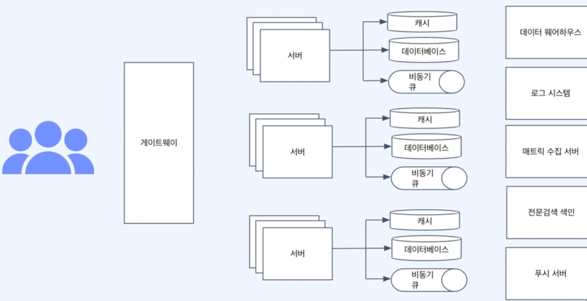
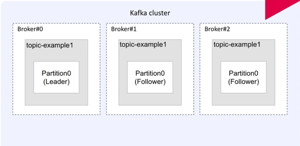
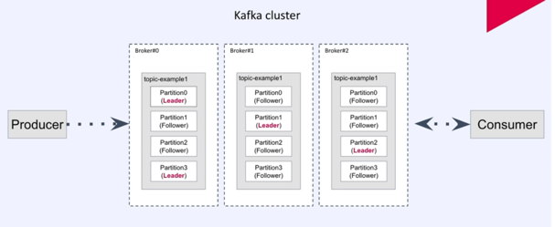

## Part 1 대용량 처리를 위한 MySQL 이해

부하테스트를 꼭 해보자 ngrinder, jmeter



MySQL 서버 (MySQL 엔진 -> 스토리지 엔진 -> 운영체제 -> 디스크)

MySQL 엔진
- 쿼리파서
  - SQL을 파싱하여 Syntax Tree를 만듬
  - 이 과정에서 문법 오류 검사가 이루어짐
- 전처리기
  - 쿼리파서에서 만든 Tree를 바탕으로 전처리 시작
  - 테이블이나 컬럼 존재 여부, 접근권한 등 Semantic오류 검사
- 옵티마이저
  - 쿼리를 처리하기 위한 여러 방법들을 만들고, 각 방법들의 비용정보와 테이블의 통계정보를 이용해 비용을 산정
  - 테이블 순서, 불필요한 조건 제거, 통계정보를 바탕으로 전략을 결정
  - 옵티마이저가 어떤 전략을 결정하느냐에 따라 성능이 많이 달라진다.
  - 가끔식 성능이 나쁜 판단을 해 개발자가 힌트를 사용해 도움을 줄 수 있다.
- 쿼리실행기
  - Handler API (Handler API를 만족하는 storage 엔진을 만들 수 있으면 사용할 수 있다.)
  - 쿼리 캐시 (소프트 파싱: SQL 실행계획을 캐시에서 찾아 옵티마이저 과정을 생략, 하드 파싱: 옵티마이저 무조건 실행)
  - 데이터가 변경 되면 캐시가 변경 되어야함 (Oracle, MySQL 캐시의 범위가 다) 
- 스토리지 엔진
  - 디스크에서 데이터를 가져오거나 저장하는 역할
  - Handler API만 맞추면 직접 구현 가능
    (InnoDB : Clustered Index, Redo-Undo, Buffer pool)

### 정규화

정규화, 비정규화
중복을 제거하고 한 곳에서 관리, 중복을 허용
데이터 정합성 유지가 쉬움, 데이터 정합성 유지가 어려움
읽기시 참조 발생, 참조없이 읽기 가능

> 테이블 설계관점에서 조회와 쓰기 사이의 트레이드 오프

simpleJdbc, sqlParameterSource(BeanPropertySqlParameterSource, MapSqlParameterSource)

메모리에 데이터 유실을 고려해 WAL(Write Ahead Log)을 사용한다.
쓰기도 곧 바로 디스크에 쓰지 않고 메모리에 쓴다.

메모리에 올라온 데이터로 최대한 요청을 처리하는 것 => 메모리 캐시 히트율을 높임
인덱스의 핵심은 탐색 범위를 최소화 하는 것
데이터베이스 성능에 핵심은 디스크의 랜덤 I/O을 최소화 하는 것

MySQL은 PK의 사이즈가 인덱스의 사이즈를 결정
-> B+Tree 사용

jpa 는 saveAll이 loop 돌면서 들어감
jdbcTemplate으로 batchInsert 하는 경우도 있음

인덱스
- 인덱스를 가공해서 조회하면 작동하지 않는다.
- 복합 인덱스 두 가지를 엮어서 인덱스를 먹이면 순서가 중요하다, Cardinality가 높은 것으로해라
- 하나의 쿼리에는 하나의 인덱스만 탄다. (index merge hint 사용할 수 있긴함)
- 의도대로 인덱스가 동작하지 않을 수 있음 explain
- 인덱스도 비용이다. 쓰기를 희생하고 조회를 얻는 것
- 인덱스로만 해결할 수 있는 문제인가? (CQRS, 캐싱) 

### 페이지네이션

페이지네이션 (size offset), 무한 스크롤

#### 오프셋 기반
```sql
select * from posts order by id where memberId = :memberId limit :size offset :offset;

PageImpl(posts, pageRequest, getCount(memberId))
```
오스셋 기반 문제 - 마지막 페이지를 구하기 위해 전체 갯수를 알아야함
offset이 커질 수록 문제가 커짐

#### 커서 기반
key 4, size 2


#### 커버링 인덱스
테이블에 접근하지 않고 인덱스로만 내려줘도 되지 않을까?
MySQL에서는 PK가 클러스터 인덱스기 때문에 커버링 인덱스에 유리함

커버링 인덱스를 어떻게 페이지네이션에 효과를 줄 수 있을까?
```sql
with 커버링 as (
    select id
    from 회원
    where 나이 < 30
    limit 2
)
```
order by offset limit 절로 인한 불필요한 데이터 블록 접근을 커버링 인덱스를 통해 최소화

sns 타임라인 구현 흐름

시간 복잡도 : log(Follow 전체 레코드) + 해당회원의 Following * log(Post 전체 레코드)

Fan Out On Read(Pull Mode) : 사용자가 매번 홈에 접속할 때마다 부하가 발생
Fan Out On Write(Push Mode) : 게시물 작성시, 해당 회원을 팔로우하는 회원들에게 데이터를 배달한다. 조회 부하를 -> 쓰기 부하로 치환

Timeline rdb 말고 다른 저장소 사용 또는 비동기로 처리할 수 있음


## Part 3 고성 서비스를 위한 Redis 활용 및 아키텍처

- Redis가 무엇인지 특성 중심으로 설명할 수 있게 된다.
- 세션 스토어, 캐시와 같은 Redis의 주요한 활용 방법을 익히고 구현할 수 있게 된다.
- 클러스터 구성, 백업과 장애 복구 등 실제 Redis 운영에 필요한 지식을 갖춘다.
- Redis를 활용하는 다양한 애플리케이션 아키텍처들을 익힌다.


### Redis의 정의
- Remote Dictionary Server
- Storage: 데이터 저장소
- Database: 전통적인 DBMS의 역할을 수행 (영속성 관점)
- Middleware: 애플리케이션이 이용할 수 있는 유용한 기능을 제공하는 소프트웨어

### Redis로 할 수 있는 것?
- 아주 빠른 데이터 저장소로 활용
- 분산된 서버들간의 커뮤니케이션(동기화, 작업 분할 등), 세션
- 내장된 자료구조를 활용한 기능 구현, sorted set (ranking), pubsub, stream

In-memory DB
- 데이터를 디스크에 저장하지 않음
- 휘발성인 RAM에 저장
- 빠른 속도

HDD -> SSD(3HDD) -> RAM(40SSD)

빠른 속도와 휘발성의 절충
- 용도에 맞게 DB와 Redis 사용
- 혼합해서 사용(Cache)
- Redis의 영속성 확보(백업 등)

DB(영속성 데이터), Redis(단기 사용 데이터) 나눔

### Key-value store로서의 Redis

데이터 저장소의 구조
- 프로그램 언어에서의 데이터 구조 (Array, List, Map)
- DB의 데이터 모델 관점에서의 구조 (네트워크 모델, 계층형 모델(Tree), 관계형 모델)

key-value store?
- 특정 값을 key로 해서 그와 연관된 데이터를 value로 저장(Map과 같음)
- 가장 단순한 데이터 저장 방식
- 단순한 만큼 빠르고 성능이 좋음

장점
- 단순성에서 오는 쉬운 구현과 사용성
- Hash를 이용해 값을 바로 읽으므로 속도가 빠름(추가 연산이 필요 없음)
- 분산 환경에서의 수평적 확작성
단점
- Key를 통해서만 값을 읽을 수 있음
- 범위 검색 등의 복잡한 질의가 불가능

활용
- 언어의 자료구조(Java의 HashMap)
- NoSQL DB(Redis, Riak, AWS DynamoDB)
- 단순한 구조의 데이터로 높은 성능과 확장성이 필요할 때 사용

### Redis의 등장과 활용
- 서버를 개발하며 Redis를 사용하지 않는 기업을 찾기가 어려움
- Session Store
- Cache
- Limit Rater (분당 호출 수 제한)
- Job queue
-> 별도로 구현해야 했던 공통적인 기능들을 Redis를 사용하면 쉽게 구현 가능하다.

### 관계형 DB의 이해
관계형 DB(관계형 데이터 모델 사용)
NoSQL(다른 데이터 모델 사용)

장점
- 데이터 무결성을 유지에 용이함(정규화를 통해 중복을 제거)
- SQL을 통해 복잡한 질의를 수행 가능
단점
- 고정된 스키마를 정의해야 함
- Join으로 인한 성능 문제
- 데이터들이 복잡한 관계를 맺고 있기 때문에 수평적 확장성이 떨어짐

NoSQL이란?
- Not Only SQL 또는 No SQL
- 관계형 DB에서 사용하는 SQL을 사용하지 않는다는 의미
- 비 관계형 데이터베이스를 지칭할 때 사용

개발 환경의 변화
- 스토리지 비용이 내려감(데이터 중복이 스토리지 용량 면에서는 큰 이슈가 아니게 됨)
- 다루는 데이터의 크기와 성능 요구사항이 커짐(고성능 데이터 모델이나 데이터 분할이 필요)
- 분산 환경의 대중화
- 단순한 대량의 데이터가 다루기 쉽다

종류
Key-value : Redis, Memcached, Riak, DynamoDB
Document: MongoDB, CouchDB
Wide Column: Cassandra, HBase, Google BigTable
Graph: Neo4J, OrientDB, AgensGraph

Redis는 DBMS인가?
- 데이터를 다루는 인터페이스를 제공하므로 DBMS의 성격이 있음
- 기본적으로 영속성을 위한 DB는 아님
- 영속성을 지원(백업)
- DBMS보다는 빠른 캐시의 성격으로 대표됨

특성
- 다양한 자료구조를 지원
- 기본적으로 NoSQL DB로 분류되는 key-value store

External Heap로서의 Redis
- Application이 장애가 나도 Redis의 데이터는 보존(단기)
- Application이 여러 머신에서 돌아도 같은 데이터를 접근 가능

Middleware로서의 Redis
- Redis가 제공하는 자료구조를 활용해 복잡한 로직을 쉽게 구현

명령어
```
redis-cli
set key banana
get key
keys * (위험)
dbsize
flushall
```

### Redis Data Type의 이해
- Strings
  - binary-safe, 바이너리로 변환할 수 있는 모든 데이터를 저장 가능(JPG와 같은 파일 등)
  - incr mycount, decr mycount (Integer 취급 1 증가, 감소) atomic 함 (게시글 좋아요) : 중복 누락 없음
  - MSET 여러 키에 대한 값을 한번에 저장한다, MGET

- Lists
  - Linked-list 형태의 자료구조(인덱스 접근은 느리지만 데이터 추가/삭제가 빠름)
  - Queue와 Stack으로 사용할 수 있음
  - LPUSH, RPUSH, LPOP, RPOP, LRANGE (LRANGE mylist 0 -1), LLEN

- Sets
  - 순서가 없는 유니크한 값의 집합 : 쿠폰 발급 받았는지 안 받았는지 (set에 id)
  - 검색이 빠름
  - 개별 접근을 위한 인덱스가 존재하지 않고, 집합 연산이 가능 (교집합, 합집합)
  - SADD, SREM, SCARD(count), SMEMBERS, SISMEMBER

- Hashes
  - 하나의 key 하위에 여러개의 field-value 쌍을 저장
  - 여러 필드를 가진 객체를 저장하는 것으로 생각할 수 있음
  - HINCRBY 명령어를 사용해 카운터를 활용 가능 (한 값을 숫자로 취급해서 변경할 수 있음)
  - HSET, HGET, HMGET, HINCRBY: HINCRBY user1 viewcount 10, HDEL
```
HSET user1 name bear age 10
HGET user1 name
HMGET user1 name age
HGETALL user1
```

- Sorted Sets
  - Sorted Set은 Set과 비슷하게 유니크한 값의 집합, 각각의 값에 score를 가지고 정렬되어 있음
  - 정렬된 상태이기에 빠르게 최소/최댓값을 구할 수 있음
  - 순위 계산, 리더보드 구현 등에 활용
  - ZADD, ZRANGE, ZRANK (특정 위치를 반환한다, 오름차순), ZREVRANK, ZREM

- Bitmaps
  - 비트 벡터를 사용해 N개의 Set을 공간 효율적으로 저장
  - 하나의 비트맵이 가지는 공간은 2^32-1 (2억명 방문할때 Integer하나 정도의 메모리)
  - 비트 연산 가능
  - SETBIT, GETBIT, BITCOUNT, BITOP (BITOP AND result yesterday_visit today_visit)

- HyperLogLog
  - 유니크한 값의 개수를 효율적으로 얻을 수 있음
  - 확률적 자료구조로서 오차가 있으며, 매우 큰 데이터를 다룰 때 사용
  - 2^64개의 유니크 값을 계산 가능
  - 12KB까지 메모리를 사용하며 0.81%의 오차율을 허용
  - PFADD, PFCOUNT, PFMERGE

보통 lettuce 사용
Spring Data Redis는 RedisTemplate이라는 Redis조작의 추상 레이어를 제공
> ValueOperations<String, String> ops = redisTemplate.opsForValue();


### 세션
- 네트워크 상에서 두 개 이상의 통신장치간에 유지되는 상호 연결
- 연결된 일정 시간 동안 유지되는 정보를 나타냄
- 적용 대상에 따라 다른 의미를 가짐

Web 로그인 세션
- Web상에서 특정 유저가 로그인했음을 나타내는 정보
- 브라우저는 Cookie를 서버는 해당 Cookie에 연관된 세션 정보를 저장
- 유저가 로그아웃하거나 세션이 만료될 때 까지 유지되어 유저에 특정한 서비스 가능

분산 환경에서의 세션 처리
- 여러 대라면 최초 로그인한 Server가 아닌 Server는 세션 정보를 알지 못함
- 세션 정보를 Server간에 공유할 방법이 필요(Session Clustering)

분산 환경에서의 세션 처리
- 세션 데이터는 영속성이 필요 없음
- 세션 데이터는 변경이 빈번하고 빠른 액세스 속도가 필요

### 캐시
- 성능 향상을 위해 값을 복사해놓는 임시 기억 장치
- Cache에 복사본을 저장해놓고 읽음으로서 속도가 느링 장치로의 접근 횟수를 줄임
- Cache의 데이터는 원본이 아니며 언제든 사라질 수 있음

네트워크 지연 감소, 서버 리소스 사용 감소, 병목현상 감소

캐싱 관련 개념
- 캐시 적중(Cache Hit), 캐시 미스(Cache Miss) 
- 캐시 삭제 정책(Cache Eviction Policy) : LRU, LFU, FIFO
- 캐시 전략 (Cache Aside, Write Through: 쓸때마다 cache update, Write Back: 캐시등록 후 일정 주기 DB 업데이트, 로그 같은 것)

Spring의 캐시 추상화
- CacheManager를 통해 일반적인 캐시 인터페이스 구현(다양한 캐시 구현체가 존재)
- 메소드에 캐시를 손쉽게 적용 가능 
  (@Cacheable(cacheNames="userAgeCache", key="#userId"): 메소드에 캐시를 적용Cache-Aside, @CacheEvict: 키값을 기반으로 캐시를 삭제, @CachePut: 메소드의 리턴값을 캐시에 설정)

> @EnableCaching, yml: redis 세팅, 

## Part 4 대용량 비동기 프로세스를 위한 Kafka 활용

Kafka의 기본 개념 - Kafka를 사용해야 하는 이유
- kafka의 기본개념과 대용량 서비스에서 비동기 프로세스
- kafka는 이벤트 스트리밍 플랫폼

메시지를 발행하는 시스템, 메시지를 수신하는 시스템은 카프카와의 관계만 신경 쓰면 된다.


대규모 회사는 거의 kafka 씀

### Kafka 브로커 - 토픽 등 서버구성 상세설명


토픽 이름 제약사항 (ex: member.registration, product.registration-v1, order.complete, inventory.changes)
- 249자 미만으로 생성
- 영어대소문자, 0-9 숫자, 마침표, 언더바, 하이픈 조합

partition replication factor 최소 3으로 설정하는 것이 좋다
partition : 실제 메시지를 저장하는 단위 broker 장애에 대응하게 됨

Leader은 쓰기와 읽기가 실행 되는 곳
Follower은 producer와 consumer을 직접 연결하고 있지 않지만 Leader 장애시 Follower가 Leader가 됨

ISR (In Sync Replica) 지속적으로 retry 함

### Kafka 파티션에 대해 이해하기

 

동시처리시 partition의 개수와 같다

partition에 데이터를 잘 처리하면 current offset이 넘어가게됨

기본적으로 라운드 로빈 순서를 보장하지 않음,
key를 동일한 partition에 할당하면 same key=>same partition (하나의 partition 내에서는 순서 보장) 

### kafka cluster 구성하기

### kafka 핵심개념 정화히 이해

retention.ms
request-required-acks
message-send-max-retries

consumer, consumer-groups

단일모드 connect (connect-standalone.properties)
file sink connect (connect-file-sink.properties) : 파일로 저장

### AWS Managed Kafka Service

트래픽 늘어나면, partition, cluster 추가 (multi IDC, 인증, SSL 필요할 수 있음)

관리형 서비스 MSK : Apache Kafka 제공

```
$ sudo yum install -y java-1.8.0-openjdk-devel.x86_64
$ wget https://archive.apache.org/dist/kafka/2.8.2/kafka_2.13-2.8.2.tgz
$ tar -zxf kafka_2.13-2.8.2.tgz
$ cd kafka_2.13-2.8.2
$ bin/kafka-topics.sh --create --topic topic4 --bootstrap-server ${MSK브로커endpoint}
첫번째 Message 발행
$ bin/kafka-console-producer.sh --topic topic4 --bootstrap-server ${MSK브로커endpoint} >First Message
>Second Message
새로운 터미널에서 Consumer 실행하여 Message 읽기
% bin/kafka-console-consumer.sh --topic topic4 --from-beginning --bootstrap-server ${MSK브로커endpoint}
```

