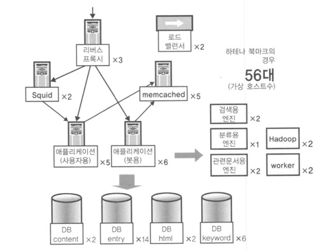

# 대규모 서비스를 지탱하는 기술

## 챕터 1 대규모 웹 서비스 개발 오리엔테이션

### 강의 0 이 책의 근간

사용자가 이용하고 있는 대규모 서비스에 변경을 가할 때 규모를 고려하지 않고 어중간하게 구현해서 적용하다 보면, 어이없게도 아주 간단히 시스템 정지를 초래할 수 있음

- 대규모 웹 서비스 개발이란?
- 대규모 데이터를 다룰 때의 과제, 다루기 위한 기본적인 사고방식과 요령 (OS의 캐시 기능, 대규모 데이터를 전제로 한 DB운용)
- 알고리즘과 데이터 구조 선택의 중요성, (대규모 데이터)
- RDBMS로 모두 다룰 수 없는 규모의 데이터 처리방법 (검색 엔진)
- 대규모 서비스가 될 것을 전제로 한 서버/인프라 시스템의 예와 개념

### 강의 1 대규모 서비스와 소규모 서비스

- 등록 사용자는 100만 명 이상, 1500만명 UU
- 수십 억 액세스/월
- 피크 시 회선 트래픽 430Mbps
- 하드웨어 서버 500대 이상


#### 소규모 서비스와 대규모 서비스의 차이

##### 확장성 확보, 부하분산 필요

스케일 아웃 - 서버를 횡으로 전개, 즉 서버의 역할을 분담하거나 대수를 늘림으로써 시스템의 전체적인 처리능력을 높여서 부하를 분산하는 방법
스케일 업 - 하드웨어의 성능을 높여 처리능력을 끌어올리는 방법

사용자로부터의 요청을 어떻게 분배할 것인가? 로드밸렂서
데이터의 동기화는 어떻게 할 것인가? DB를 분산시켰을 때 한족에 저장된 갱신 내용을 다른 한쪽 DB가 알지 못한다면 애플리케이션 비정상 사태가 발생
네트워크 통신의 지연시간을 어떻게 생각해볼 수 있을까? 작은 데이터라도 지연시간이 발생한다. 통신의 오버헤드를 최소한으로 줄여가면서 애플리케이션을 구성해갈 필요가 있다.


##### 다중성 확보

서비스가 대규모화되면 될수록 시스템 정지의 사회적 충격도 늘어나므로 더욱 더 다중성 확보가 필요해진다.
웹 서비스는 언제 어떠한 경우라도 고장에 대해 견고해야 한다.

##### 효율적 운용 필요

##### 개발자 수, 개발방법의 변화

프로그래밍 언어를 통일, 라이브러리나 프레임워크를 통일, 코딩 규약을 표준화가 필요
개발자 개개인과 팀에서 표준화 규칙이 지켜지고 있는지, 기술자 간 능력 차이에 따라 효율이 나쁜 부분은 생기지 않는지, 교육은 어떻게 할 것인지 팀 매니지먼트가 필요하다.

#### 대규모 데이터량에 대한 대처

데이터는 디스크 -> 메모리 -> 캐시 메모리 -> CPU와 같이 몇 단계를 경유해서 처리되어 간다.
메모리나 캐시 메모리와 비교하면 10^6 ~ 10^9배나 되는 속도차가 나게 된다.
이 속도차를 흡수하기 위해 OS는 이런저런 방법을 사용하게 되는데, 예를 들면 디스크로부터 읽어들인 데이터를 메모리에 캐싱해둠으로써 전반적으로 디바이스간ㄷ 속도차가
체감속도에 영향을 주지 않도록 하고 있다.
하지만 데이터량이 많아지면 처음부터 캐시 미스가 발생하게 되고, 이는 저속의 디스크 I/O를 발생시키게 된다.

어떻게 하면 데이터를 적게 가져갈 수 있을까, 여러 서버로 분산시킬 수 있을까, 필요한 데이터를 최소한의 횟수로 읽어들일 수 있을지 등이 과제가 된다.

### 강의 2 계속 성장하는 서비스와 대규모화의 벽

#### 웹 서비스의 어려움

소규모였던 서비스가 성장함에 따라 그 규모가 확대해간다.
라우터는 Linux 박스로 저가에 구축, HTTP 요청 분산은 아피치의 mod_rewrite로 대용, DB 분산은 MySQL의 레플리케이션을 이용

#### 데이터 센터로의 이전, 시스템 쇄신
사전에 기존 시스템의 부하상황을 정리, 병목 지점을 측정, 판정하고 I/O 부하가 높은 서버는 메모리를 중요시하고 CPU 부하가 높은 서버는 CPU를 중요시하는 형태로 서버 용도에 맞게 최적의 구성을 갖는 하드웨어를 준비
다중화의 경우 로드밸런서 + 가동감시 기능을 하는 오픈소스 LVS + keepalived를 도입
서버 교체는 서서히 OS 가상화도 진행하여 서버 가동률을 높임과 동시에 유지 보수성을 높임

독자적 서버 정보관리 시스템도 개발, 
애플리케이션의 각종 로직, DB 스키마 재검토 비효율 개선

### 강의 3 서비스 개발의 현장

#### 하테나의 기술팀 체제
서비스 개발부 : 하테나의 각종 서비스 구현을 담당하는 팀, 매일 애플리케이션 측면의 개선을 담당
인프라부 : 서버/인프라 시스템의 운용을 담당하는 팀, 서버 준비, 데이터 센터 운용, 부하 분산 등을 담당

서비스 개발부에서도 담당하고 있는 서비스의 성능을 트래킹하고, 주요한 페이지가 어느 정도의 응답시간에 응답하고 있는지 정량화해 매일 그것을 지표로 한계값을 밑돌지 않도록 목표를 설정해 개선한다.

#### 하테나에서의 커뮤니케이션 방법

하테나 위키, IRC, 서버 관리툴

#### 실제 서비스 개발

매일 미팅 > 담당자 정하고 태스크 구현 > 구현 + 테스트 프로그램 최대한 작성 > 커밋 > 코드 리뷰 (코딩 규약, 과부하 찾기) > 머지 개발 확인 운영 배포

- 페어 프로그래밍도 함, 전체적으로 애자일 개발 스타일

#### 개발에 사용하는 툴
##### 프로그래밍 언어
전체적으로는 Perl
검색 엔진 등 메모리 요건이 엄격하거나 속도가 요구되는 곳에는 일부 C/C++로 구현
웹은 JS

##### 주요 미들웨어
Linux, Apache, MySQL, memcached

##### 웹 애플리케이션 프레임워크
Ridge Perl 프레임워크
O/R 매퍼 

##### 주위 머신의 OS 및 에디터
에디터 자유, Linux 구동해서 개발, 코딩 규약은 지킨다.

##### 버전 관리는 git BTS(Bug tracking system)은 직접 만든 아시카
##### 개발 툴에 관해서

## 2. 대규모 데이터 처리 입문
(메모리와 디스크, 웹 애플리케이션과 부하)

### 대규모 데이터 특유의 환경 알기

### 강의 4 하테나 북마크의 데이터 규모

#### 하테나 북마크를 예로 본 대규모 데이터
select * from relword -> 3억 5천만건이 조회됨

#### 하테나 북마크의 데이터 규모
entry - 3GB
bookmark - 5.5GB
tag - 4.8GB
HTML 압축 - 200GB
relword - 10GB

구글, 야후는 (테라, 페타바이트)
#### 대뮤모 데이터로의 쿼리
select url from entry use index(hoge) where eid = 9615899; 200초 기다려도 결과가 출력되지 않음

### 강의 5 대규모 데이터 처리의 어려운 점(메모리와 디스크)

#### 대규모 데이터는 어떤 점이 어려운가? - 메모리 내에서 계산할 수 없음

> 대규모 데이터의 어려움은 메모리 내에서 계산할 수 없다는 점
- 메모리 내에서 계산할 수 없게 되면 디스크에 있는 데이터를 검색할 필요가 있다.
- 하지만 디스크는 느리므로 (I/O)에 시간이 걸린다.
- 어떻게 대처할 것인가 연구 대상

#### 메모리와 디스크의 속도차
메모리는 10^5 ~ 10^6배 이상 고속

#### 디스크는 왜 늦을까?
메모리는 전기적인 부품이므로 물리적 구조는 탐색속도와 그다지 관계 없음 - 마이크로초 단위로 포인터를 이동시킬 수 있음
디스크는 메모리와 달리 회전 등의 물리적인 동작을 수반하고 있음

##### 탐색속도에 영향을 주는 다양한 요인
디스크에서는 헤드의 이동과 원반의 회전이라는 두 가지 물리적인 이동이 필요함 (오버헤드가 있음)

#### OS 레벨에서의 연구
디스크는 느리지만 OS는 이것을 어느 정도 커버하는 작용을 한다.
비슷한 데이터를 비슷한 곳에 두어 1번의 디스크 회전으로 읽는 데이터 수를 많게 한다, 디스크의 회전횟수를 최소화한다.

#### 전송속도, 버스의 속도차
전송속도에서 100배 이상 차이가 난다.
메모리 : 7.5GB/s
디스크 : 58MB/s

- sudo /sbin/hdparm -t /dev/sda

(SSD가 나와 물리적인 회전이 아니라 탐색이 빠르지만 버스속도가 병목이 되거나 함)

Linux 단일 호스트의 부하
추측하지 말라, 계측하라(단일 호스트의 성능 끌어내기) > 병목 규명작업의 기본적인 흐름 (Load Average확인, CPU, I/O 병목 원인 조사)
OS 튜닝

## 챕터 2 계속 성장하는 서비스와 대규모화의 벽

### 강의 6 규모조정의 요소

#### 규모조정, 확장성
스케일 업보다는 스케일 아웃이 비용이 저렴하고 시스템 구성에 유연성이 있다.

#### 규모조정의 요소
스케일 아웃은 하드웨어를 나열해서 성능을 높이는, 즉 하드웨어를 횡으로 전개해서 확장성을 확보해가게 된다. 이떄 CPU 부하의 확장성을 확보하기는 쉽다.
한편 DB 서버 측면에서는 I/O qngkrk rjfflsek.

#### 웹 애플리케이션과 부하의 관계

웹 애플리케이션의 3단 구조는 프록시 > AP 서버 > DB 가 있다.
DB 지난 데이터와 동기화 문제 DB에 쓰인 내용을 어떻게 복사 DB에 옮길 것인가 문제가 있음

#### DB 확장성 확보의 어려움

CPU 부하의 규모조정은 간단
- 같은 구성의 서버를 늘리고 로드밸런서로 분산
- 웹, AP 서버, 크롤러

I/O 부하의 규모조정은 어렵다.
- DB
- 대규모 데이터

> 멀티태스킹 OS와 부하
> top의 출력 내용에는 Load Average라는 수치가 포함되어 있음
> load average는 1분, 5분, 15분 단위 시간당 대기된 태스크의 수를 나타냄
>
> Average가 보고하는 부하의 정체
> 하드웨어는 일정 주기로 CPU로 인터럽트 신호를 보냄 Load Average 값이 계산
>
> 처리를 실행하려고 해도 실행할 수 없어서 대기하고 있는 프로세스의 수
> CPU의 실행권한이 부여되기를 기다리고 있는 프로세스, 디스크 I/O가 완료하기를 기다리고 있는 프로세스

### 강의 7 대규모 데이터를 다루기 위한 기초지식

#### 프로그래머를 위한 대규모 데이터 기초
대규모 데이터는 메모리에서 처리하기 어렵고 디스크는 느림

#### 대규모 데이터를 다루는 세 가지 급소 (프로그램을 작성할 때의 요령)

- 메모리에서 처리를 마쳐야 하는 이유는 디스크 seek 횟수가 확장성, 성능에 영향을 주기 때문 (디스크 횟수 최소화, 국소성을 활용한 분산)
- 데이터량 증가에 강한 알고리즘을 사용한다. (Log order, 이분검색)
- 데이터 압축이나 검색기술과 같은 테크닉을 사용한다.
(데이터량을 줄이면 seek 횟수 줄고, 메모리 캐싱이 쉬워짐)

#### 대규모 데이터를 다루기 전 3대 전제지식

- OS 캐시
- 분산 고려 RDBMS
- 대규모 환경에서 알고리즘과 데이터 구조를 사용한다는 것

하테나는 AP 서버 10대, DB 서버 25대

AP 서버는 늘리면 늘릴수록 점점 빨리지지만 DB 서버는 늘리더라도 의미가 없는 경우가 자주 있음

## 챕터 3 OS 캐시와 분산 (대규모 데이터를 효율적으로 처리하는 원리)

### 대규모 데이터를 다룰 때의 포인트 - I/O 대책에 대한 기반은 OS에 있다.
OS 캐시로 제대로 처리할 수 없게 되었을 때 분산에 대해 고려해보게 된다. 

OS 캐시와 분산
- OS 캐시
- 캐시를 전제로 한 I/O 부하 줄이는 방법
- 캐시를 고려한 국소성을 살리는 분산

### 강의 8 OS의 캐시 구조

#### OS의 캐시 구조를 알고 애플리케이션 작성하기 - 페이지 캐시
메모리, 디스크, OS 캐시 구조
- 디스크와 메모리 간 속도차를 10^5 ~ 10^6 배 이상
- 메모리를 이용해서 디스크 액세스를 줄이고자 한다. -> OS는 캐시 구조를 갖추고 있다.

##### Linux(x86)의 페이징 구조를 예로
선형 어드레스
    |
    V
페이징 구조
    |
    V
물리 어드레스
- 가상 메모리 구조의 기반
- 논리적인 선형 어드레스를 물리적인 물리 어드레스로 변환

> 스왑은 가상 메모리를 응용한 기능 중 하나로 물리 메모리가 부족할 때 2차 기억장치(주로 디스크)를 메모리로 간주해서 외형상의 메모리 부족을 해소하는 원리이다.

##### 가상 메모리 구조
가상 메모리 구조가 존재하는 가장 큰 이유는 물리적인 하드웨어를 OS에서 추상화하기 위해서다.
- 프로세스는 메모리의 어느 부분을 사용하고 있는지 알고 싶어하지 않는다.
- 0x000과 같이 반드시 메모리의 특정 번지부터 시작한다고 정해져 있는 편이 프로세스에게는 다루기 쉽다.

유닉스의 공유 라이브러리는 프로세스 내의 지정된 주소로 할당되도록 되어 있다. 프로세스 내의 지정된 주소로 할당되도록 되어 있다.
(포인트는 OS라는 것은 메모리를 직접 프로세스로 넘기는 것이 아니라 일단 커널 내에서 메모리를 추상화한다는 것이다.)

메모리를 확보할때도 4KB 정도를 블록으로 확보해서 프로세스에 넘김

가상 메모리
- 프로세스에서 메모리를 다루기 쉽게하는 이점을 제공
- OS가 커널 내에서 메모리를 추상화하고 있다.
- 페이지: OS가 물리 메모리를 확보/관리하는 단위

#### Linux의 페이지 캐시 원리
OS는 확보한 페이지를 메모리상에 계속 확보해두는 기능을 갖고 있다.

이번 디스크 읽기는 끝나고 데이터는 전부 처리했으므로 더 이상 불필요하게 됐어도 해제하지 않고 남겨두는 것 -> 페이지 캐시
커널이 한 번 할당한 메모리를 해제하지 않고 계속 남겨두는 것이 페이지 캐시의 기본이다.

##### 페이지 캐시의 친숙한 효과
Linux에서는 디스크에 데이터를 읽으러 가면 꼭 한 번은 메모리로 가서 데이터가 반드시 캐싱된다. 현대의 OS는 대체로 페이지 캐시와 비슷한 구조를 갖추고 있다.
Windows 머신도 부팅 직후에는 캐시가 없으므로 디스크 I/O가 발생하기 쉬워 다소 버벅거리는 것처럼 느껴질 수 있다.

Linux의 페이지 캐시
- 디스크의 내용을 일단 메모리에 읽어들인다. -> 페이지가 작성된다.
- 작성된 페이지는 파기되지 않고 남긴다. -> 페이지 캐시
- 예외의 경우를 제외하고 모든 I/O에 투과적으로 작용한다. -> 디스크의 캐시를 담당하는 곳(VFS)

#### VFS
디스크의 캐시는 페이지 캐시에 의해 제공되지만, 실제 이 디스크를 조작하는 디바이스 드라이버와 OS 사이에는 파일시스템이 끼어 있다.
Linux에는 ext3, ext2, ext4, xfs 등 몇몇 파일시스템이 있는데 그 하위에 디바이스 드라이버가 있으며, 이 디바이스 드라이버가 실제로 하드디스크 등을 조작한다.
vfs의 역할은 파일시스템 구현의 추상화와 성능에 관련된 페이지 캐시 부분이다.

#### Linux는 페이지 단위로 디스크를 캐싱한다.
페이지 캐시인 이유는 OS는 읽어낸 블록 단위만으로 캐싱할 수 있는 범위가 정해진다.
여기서는 디스크상에 배치되어 있는 4KB 블록만을 캐싱하므로 특정 파일의 일부분만, 읽어낸 부분만을 캐싱할 수 있다.

페이지 = 가상 메모리의 최소단위

##### LRU
가장 오래된 것을 파기하고 가장 새로운 것을 남겨놓는 형태로 되어 있으므로 최근에 읽은 부분이 캐시에 남고 과거에 읽은 부분이 파기되어 간다.

##### 어떻게 캐싱할까?
어떤 파일의 어느 위치를 이라는 쌍으로 캐시의 키를 관리할 수 있다.
OS 내부에서 사용되고 있는 데이터 구조는 Radix Tree라고 하며, 파일이 아무리 커지더라도 캐시 탐색속도가 떨어지지 않도록 개발된 데이터 구조다.

#### 메모리가 비어 있으면 캐싱 - sar로 확인
Linux는 메모리가 비어 있으면 전부 캐싱
- 제한 없음 -> sar -r 로 확인

#### 메모리를 늘려서 I/O 부하 줄이기
메모리를 늘리면 캐시에 사용할 수 있는 용량이 늘어나고, 캐시에 사용할 수 있는 용량이 늘어나면 보다 많은 데이터를 캐싱할 수 있고, 많이 캐싱되면 디스크를 읽는 횟수가 줄어든다.

#### 페이지 캐시는 투과적으로 작용한다.

### 강의 9 I/O 부하를 줄이는 방법

#### 캐시를 전제로 한 I/O 줄이는 방법
캐시에 의한 I/O 경감효과는 매우 크다. 

첫 번째 포인트 
포인트는 데이터 규모에 비해 물리 메모리가 크면 전부 캐싱할 수 있으므로 이 점을 생각할 것 다루고자 하는 데이터의 크기에 주목한다.
또한 대규모 데이터 처리에는 데이터 압축이 중요하다고 했는데, 압축해서 저장해두면 디스크 내용을 전부 그대로 캐싱해둘 수 있는 경우가 많다.
LZ법 등 일반적인 압축 알고리즘의 경우 텍스트 파일을 대략 절반 정도로 압축할 수 있다. 

캐시를 전제로 한 I/O 줄이는 방법
- 데이터 규모 < 물리 메모리 이면 전부 캐싱할 수 있다.
- 경제적 비용과의 밸런스 고려 -> 현재 일반적인 서버 메모리 32GB 이상

#### 복수 서버로 확장시키기 - 캐시로 해결될 수 없는 규모일 경우
전부 캐싱할 수 없는 구조가 되면
- 복수 서버로 확장시키기
  - CPU 부하분산에는 단순히 늘린다.
  - I/O 분산에는 국소성을 고려한다

#### 단순히 대수만 늘려서는 확장성을 확보할 수 없다
단순히 데이터를 복사해서 대수를 늘리게 되면 애초에 캐시 용량이 부족해서 늘렸는데 그 부족한 부분도 그대로 동일하게 늘려가게 되는 것이다.

단순히 대수를 늘리는 것
- 캐싱할 수 없는 비율은 변함없이 그대로
  - 곧 다시 병목이 된다.

### 강의 10 국소성을 살리는 분산

#### 국소성(locality)을 고려한 분산이란?

캐시 용량을 늘리기 위해 어떻게 하면 여러 대의 서버로 확장시킬 수 있을까
국소성을 고려해서 분산한다.
액세스 패턴을 고려해서 분배하면 액세스 되지 않는 캐시영역을 다른 곳으로 돌릴 수 있다.

국소성을 고려해서 분산
- 액세스 패턴을 고려한 분산
- 캐싱할 수 없는 부분이 사라진다. -> 메모리는 디스크보다 10^6배나 빠르므로 그만큼 덕을 본다.

#### 파티셔닝 - 국소성을 고려한 분산 1

파티셔닝은 한 대 였던 DB 서버를 여러 대의 서버로 분할하는 방법, 
- 테이블 단위 분할 (같이 액세스하는 경우가 많을 때 같은 서버에 위치)
- 테이블 데이터 분할 a~c, d~f, g~i 이런식으로 서버를 나눔 (이 분할의 문제점은 분할의 입도를 크거나 작게 조절할 때 데이터를 한 번 병합해야 한다는 것)

국소성을 고려한 분산의 구체적인 예
- RDBMS의 테이블 단위 분할: 파티셔닝
- 테이블 데이터 분할: a~c, d~f, g~i 
- 용도별로 시스템을 섬으로 나눔

#### 요청 패턴을 섬으로 분할 - 국소성을 고려한 분산 2
HTTP 요청의 User-Agent나 URL 를 보고
사용자과, 검색 봇을 나눔 
- 검색 복은 특성상 오래된 웹 페이지에도 액세스하러 오기 때문에
- 사용자 액세스는 최상위 페이지나 인기 엔트리 페이지 등 최신, 인기 페이지에 집중됨

#### 페이지 캐시를 고려한 운용의 기본 규칙

첫 번째 포인트는 OS 기동 직후에 서버를 투입하지 않음 -> 캐시가 쌓여 있지 않기 떄문에
(OS를 시작해서 기동하면 자주 사용하는 DB의 파일을 cat 해줌) -> 그 후 로드밸런스에 편입

두 번째 포인트는 성능평가나 부하시험 -> 캐시가 최적화된 후에 실시하라

페이지 캐시를 고려한 운용의 기본 규칙
- OS 기동 후에 서버 곧바로 투입X
- 성능평가는 캐시가 최적화 되었을 때

- 분석은 국소성을 고려해서 실시
- 데이터 규모에 맞게 탑재 메모리를 조정 -> 메모리 증설로 대응할 수 없다면 분산

> 부하분산과 OS의 동작원리
> - OS 캐시
> - 멀티스레드나 멀티프로세스
> - 가상 메모리 구조
> - 파일시스템
> 
> 론 요청 분배 LVS 사용법, Apache나 MySQL 미들웨어 사용법, 

## 챕터 0ㅌ4 분산을 고려한 MySQL 운용


##### 분산된 시스템 알기 - 애플리케이션을 만들기 전에 알아두어야 할 MySQL 분산 노하우


DB 스케일아웃 전략
- 인덱스의 중요성
- MySQL 분산
- 스케일아웃과 파티셔닝

### 강의 11 인덱스를 올바르게 운용하기 - 분산을 고려한 MySQL 운용의 대전제

#### 분산을 고려한 MySQL 운용, 세 가지 포인트

분산을 고려한 MySQL 운용의 포인트
- OS 캐시 활용
- 인덱스를 적절하게 설정하기
- 확장을 전제로 한 설계

#### OS 캐시 활용

MySQL에서는 처음에 create table로 스키마를 결정, 보통 그다지 신경 쓰지 않고 원하는 대로 설계하는 사람도 많지만
하테나 북마크의 테이블 정도 규모가 되면 상당히 중요히진다.

하테나 북마크의 경우와 같이 3억 레코드 정도 되면 1레코드에 칼럼을 1개, 예를 들어 8바이트 정도의 칼럼을 추가하면 8*3억 바이트만큼의 데이터가 늘어난다.(3G)
스키마를 조금 변경하는 것만으로 기가바이트 단위로 데이터가 증감한다.

대량의 데이터를 저장하려는 테이블은 레코드가 가능한 작아지도록 컴팩트하게 설계해야한다. 정수형 int형은 32비트(4바이트) 문자열이 8비트니까 1바이트
데이터 량을 머리에 넣어두자

OS 캐시 활용
- 전체 데이터 크기에 주의
  - 데이터량 < 물리 메모리를 유지
  - 메모리가 부족할 경우에는 증설
- 스키마 설계가 데이터 크기에 미치는 영향을 고려해야한다.

정규화하면 필요없는 경우에서 뺄때 레코드만큼의 용량이 줄어들 수 있지만 경우에 따라서는 쿼리가 복잡해져서 속도가 떨어지는 경우가 있으므로
속도와 데이터 크기 간 상반관계와 같은 부분을 생각해야 한다.

#### 인덱스의 중요성 - B트리

알고리즘, 데이터 구조에서 탐색을 할 때는 기본적으로 트리가 널리 사용된다.
인텍스는 주로 탐색을 빠르게 하기 위한 것으로, 그 내부 데이터 구조로는 트리가 사용된다.

MySQL의 인덱스는 기본적으로 B+트리라는 데이터 구조다
B트리는 트리를 구성하는 각 노드가 여러 개의 자식을 가질 수 있는 '다분트리' 또한 데이터 삽입이나 삭제를 반복한 경우에도 트리의 형태에 치우침이 생기지 않는
'평형트리'이기도 하다. B트리는 하드디스크 상에 구축하기에 알맞은 데이터 구조이므로 DB에서 자주 사용된다.

트리의 높이는 데이터 건수 n에 대해 반드시 logN이 되므로 탐색시 계산량은 O(logN)이다.

##### 이분트리와 B트리 비교해보기
OS는 디스크에서 데이터를 읽을 때 블록 단위로 읽어냄 다시 말해 디스크를 찾을 때 seek이 발생
B트리의 경우 각 노드를 1블록에 모아서 저장되도록 구성할 수 있으므로 디스크 seek 발생횟수를 노드를 찾아갈 때만으로 최소화할 수 있다.
이분트리는 특정 노드를 모아서 1블록에 저장하는 등의 작업이 어려워서 검색하려면 여기저기 블록에 분산되어 있는 데이터를 읽어야하므로 seek이 많아짐

##### MySQL에서 인덱스 만들기
인덱스의 중요성
- 인덱스=색인
- B+트리
  - 외부기억장치 탐색 시에 Seek횟수를 최소화하는 트리 구조
  - 색인의 계산량: O(n) -> O(log n)

#### 인덱스의 효과
4000만 -> 최대 25.25번

인덱스의 효과
- 계산량 측면에서 개선될 뿐만 아니라 디스크 seek 횟수면에서도 개선된다.
  - 같은 트리라도 B트리와 다른 트리 간에는 서로 다름

##### 인덱스 효과의 예
데이터 건수가 1000건 정도면 트리 순회하는 오버헤드가 클 수 있지만 데이터가 커지면 인덱스 없이는 액세스할 수 없는 상황이 됨

##### 인덱스의 작용 - MySQL의 특성
url과 timestamp 각각 걸려 있으면 검색이나 정렬 중 한쪽 인덱스만 사용하므로
(url, timestamp)를 쌍으로 한 복합 인덱스를 설정해둘 필요가 있음

#### 인덱스가 작용하는지 확인하는 법 - explain 명령
```sql
explain select url from entry where eid = 9615899;
rows 1
```

```sql
explain select url from entry use index(cname) where eid = 9615899;
rows 9615899
```
인덱스가 필요없는 곳에 인덱스를 사용하면 필요없는 탐색이 이루어짐

##### explain 명령에서 속도에 유의하라
using where, using filesort, using temporary 
- using filesort, using temporary 나오면 별로 좋지 않음

##### 인덱스의 간과
O/R 매퍼가 SQL을 작성하는 경우가 있어 실행되는지 간과하고 커밋하는 경우가 많음
-> 감시방안을 늘리는 것이 좋음

### 강의 12 MySQL의 분산 - 확장을 전제로 한 시스템 설계

#### MySQL의 레플리케이션 기능

MySQL에는 기본 기능으로 레플리케이션 기능이 있다.
레플리케이션이란 마스터를 정하고 마스터를 뒤따르는 서버를 정해두면 마스터에 쓴 내용을 슬레이브가 폴링해서 동일한 내용으로 자신을 갱신하는 기능이다.

갱신은 반드시 마스터에서 이뤄지도록 함, 아울러서 슬레이브 앞단에 로드밸런서(LVS 등), MySQL Proxy와 같은 것을 사용한다.

MySQL의 레플리케이션 기능
- 마스터/슬레이브 구성
- 참조 쿼리는 슬레이브로, 갱신 쿼리는 마스터로
- O/R 매퍼로 제어한다.

#### 마스터/슬레이브의 특징 - 참조계열은 확장하고 갱신계열은 확장하지 않는다.

참조계열 쿼리는 슬레이브로 분산하면 되므로 분산할 수 있지만, 갱신계열 쿼리는 분산할 수 없지 않은가?
참조계열 쿼리는 확장을 위해 서버를 늘리면 되는데, 다만 서버를 늘린다고는 해도 앞서 말했듯이 대수를 늘리기보다도 메모리에 맞추는 것이 중요하다.

쓰기보다 읽기가 1000배정도 존재하므로 마스터가 병목이 되어 곤란한 상황이 발생하는 경우는 그렇게 많지 않음

##### 갱신/쓰기계열을 확장하고자 할 떄 - 테이블 분할, key-value 스토어

드물지만 마스터에 엄청난 쓰기작업이 발생하는 경우가 있다. 발자국 요청이 들어올때 마다 DB레코드를 쓰는 경우
-> 테이블을 분할해서 테이블 크기를 작게 해준다.

다음으로 처음부터 RDBMS를 사용하지 않는 방법도 생각해볼 수 있다. KVS를 사용하는 것 압도적으로 빠르며 확장하기 쉬움

마스터/슬레이브의 특징
- 참조계열 쿼리는 확장
  - 서버를 늘리기만 하면 된다.
  - 단, 대수를 늘리기보다도 메모리에 맞추는 것이 중요
- 마스터는 확장하지 않는다.
  - 갱신계열 쿼리가 늘어나면 험난해짐
  - 단, 웹 애플리케이션은 대부분 90% 이상이 참조쿼리
  - 마스터 부하는 테이블 분할이나 다른 구현 등으로 연구

### 강의 13 MySQL의 스케일아웃과 파티셔닝

#### MySQL의 스케일아웃 전략
MySQL의 스케일아웃 전략
- 데이터가 메모리에 올라가는 크기?
  - YES
- 메모리에 올린다
  - NO
- 메모리 증설
- 메모리 증설이 불가능하면 파티셔닝

#### 파티셔닝(테이블 분할)에 관한 보충
파티셔닝이란 테이블A와 테이블B를 서로 다른 서버에 놓아서 분산하는 방법이다.
파티셔닝은 국소성을 활용해서 분산할 수 있으므로 캐시가 유효하고 그래서 파티셔닝은 효과적이라는 얘기였다.

#### 파티셔닝을 전제로 한 설계
JOIN 쿼리는 대상이 되는 테이블을 앞으로도 서버 분할하지 않을 것이라고 보장할 수 있을 때에만 사용한다.

밀접하게 결합하지 않고, 데이터 크기를 볼 때 반드시 분할해야 한다는 것을 알고 있으므로 JOIN하지 않는 방침을 취하고 있다.

#### JOIN 배제 - where in 이용
entry bookmark inner join 해서 가져온 것을 -> 각각 조회하는 것이 빠르다. DBIx::MoCo는 join 하지 않고 기본적으로 where in을 사용한다.

#### 파티셔닝의 상반관계
국소성이 늘어나서 캐시 효과가 높아지지만 나쁜 점도 있다.

##### 운용이 복잡해진다.
표로 되어 있으면 알겠지만 장애가 발생했을 때나 혼란한 상황에 빠졌을 때 이 내용이 머릿속에 들어있지 않으면 민첩하게 대응하기가 어렵다.
-> 운용이 복잡해지면 결국 복구에 시간이 더 오래 걸린다.

##### 고장률이 높아진다.

##### 다중화에 필요한 서버 대수는 몇 대?
마스터 1대 슬레이브 3대 사용함 
1대 고장 1대 슬레이브가 동작하므로 다른 1대에 백업을 하려하면 멈추게 되므로 마스터 1대에 슬레이브 3대가 필요함

##### 애플리케이션의 용도와 서버 대수
크리티컬한 곳은 백업을 포함해 여러 대를 갖춰 놓음

##### 서버 대수와 고장률
똑같이 분할하더라도 어느 쪽이 더 저렴할지 어느 쪽이 더 운용하기 편한지를 빈틈없이 생각해봐야 한다.

파티셔닝의 상반관계
- 좋은 점
  - 부하가 내려감
  - 국소성이 증가해서 캐시 효과가 높아짐
- 나쁜 점
  - 운용이 복잡해진다. 고장확률이 높아진다.
  - 운용이 복잡해지면 그만큼 경제적인 비용이 든다.
- 파티셔닝은 어디까지나 마지막 카드

## 챕터 5 대규모 데이터 처리 실전 입문 - 애플리케이션 개발의 급소

### 굳이 대규모 데이터에 액세스하고자 하는 경우란? - 대규모 데이터 처리 애플리케이션의 사고방식과 대책
대규모 데이터를 처리하는 애플리케이션
- 용도특화형 인덱싱
- 이론과 실전 양측과 맞붙어 싸우기

### 강의 14 용도특화형 인덱싱 - 대규모 데이터를 능수능란하게 다루기
#### 인덱스와 시스템 구성 - RDBMS의 한계가 보일 때
배치 처리로 RDBMS에서 데이터를 추출해서 별도의 인덱스 서버와 같은 것을 만들고, 이 인덱스 서버에 웹 애플리케이션에서 RPC(Remote Procedure Call)등으로 액세스하는 방법을 사용한다.

##### RPC, 웹 API
DB에서 정기적으로 3시간에 1번처럼 cron등으로 데이터를 추출해서 인덱스 서버로 넘긴다.
AP서버에서는 인덱스를 갖고 있고 인덱스 서버에 RPC로 액세스한다.

RPC는 Remote Procedure Call
서버가 20대 가량 있을 경우 20대에 전부 인덱스를 갖고 있도록 하는 것도 큰일인 경우가 있음 -> 인덱스 전용 서버에 처리하도록 한다.

RDBMS로는 한계, 그럴 떄는
- 배치 처리로 데이터 추출
- 별도 인덱스 서버로 만들어서 웹 API등으로 쿼리

#### 용도특화형 인덱싱 - 튜닝한 데이터 구조 사용하기
용도특화형 인덱싱을 하면 RDBMS에서 어려운 일이 가능해짐
RDBMS는 데이터를 정렬하거나, 통계처리가 가능하거나 JOIN하는 등 범용적인 용도로 만들어져있음
뭔가 특정한 목적으로만 사용하고자 할 때에는 특정한 목적만으로 사용할 수 있도록 튜닝한 데이터 구조를 사용하면 압도적으로 빠르다.

검색에서 역 인덱스가 그 전형적인 예로, 자연언어처리와 같은 처리를 미리 한 다음 인덱스를 만들어두면 RDBMS 데이터를 전부 순회하지 않아도 순신간에 검색할 수 있음

용도특화형 인덱싱
- 데이터를 정기적으로 뽑아냄
- 뽑아낸 데이터에서 데이터 구조를 구축
  - 검색용 역 인덱스
  - 키워드 링크용 Trie등
- 구조화 데이터를 저장한 서브를 C++로 개발 RPC로 인덱스

##### 하테나 키워드에 의한 링크
특정 문서가 20만 이상의 키워드 중에 무엇을 포함하는지를 찾아야만 할 때 일일이 DB 내에 있는 키워드 목록과 사용자가 작성한 내용을 맞춰보게 되면 DB에 과부하가 걸리게 됨

그래서 배치 처리로 20만 건의 키워드를 추출해둔다. 10만 건의 정규표현식이 들어간 거대한 파일을 만들어서 이를 메모리에 읽어들인 후 매칭시켜 나아갔음
단 정규표현에는 오토마톤 중에 NFA 특성으로 인해 OR로 연결하면 매칭할 때 계산량이 상당히 방대해져서 속도가 나지 않는 문제가 있다.
정규표현만으로 힘들어서 안 되므로 현재는 Trie기반의 정규표현을 사용해서 Common Prefix Search를 수행한다. Trie와 Common Prefix Search 조합은 최고라서 자연언어처리를 하는 사람이라면 매우 잘 알 것

아울러서 Common Prefix Search를 할 때에는 Aho-Corasick법이나 Double Array Trie등 다양한 알고리즘/데이터 구조가 있다. 
알고리즘의 데이터 구조를 DB에서 사전에 추출해서 만들어두고 매칭하는 것이 키워드 링크의 방법이다.

##### 하테나 북마크의 텍스트 분류기
북마크 카테고리 분류 > Complement Naive Bayes 알고리즘을 이용해 자동으로 기계학습을 통해 분류함
Complement Naive Bayes 알고리즘을 사용할 때는 문서에 포함된 단어의 출현확률이 필요함 카테고리를 판정할 때 DB로 물어보면 오래걸리므로
출현확률, 실제로는 출현빈도만을 저장하는 서버를 가동해둠

##### 전문 검색 엔진
- 대량의 데이터에서 검색하고자 한다.
- 빠르게 검색하고자 한다.
- 좋은 느낌과 같은 문서를 상위로(스코어링)

RDBMS -> 정보검색
- RDB의 데이터를 배치로 얻기
- 역 인덱스를 만들어서 검색 알고리즘을 사용한다.

### 강의 15 이론과 실전 양쪽과의 싸움

#### 요구되는 기술적 요건 규명하기

##### 대규모 웹 애플리케이션에 있어서 이론과 실전
대규모 웹 애플리케이션을 개발, 운용하려고 하면 이론과 실전 모두를 하지 않으면 안 된다.

##### 컴퓨터의 문제에 이르는 길을 어떻게 발견할까?
알고리즘/데이터 구조로 무언가를 실행할 때 해당 알고리즘의 데이터 구조를 사용해서 어떤 게 가능한지를 어느 정도 머릿속에 넣어두지 않으면 이럴 때 딱 떠오르지 않는다.

- 기가바이트 단위의 데이터 처리
  - 테라바이트, 페타바이트는 또 다른 세게
- 메모리의 중요성
- 분산을 의식한 운용
- 적절한 알고리즘과 데이터 구조

## 챕터 6 압축 프로그래밍 - 데이터 크기, I/O 고속화와의 관계 인식하기

압축 프로그래밍
- 정수 데이터를 컴팩트하게 가져가기
- VB Code와 속도감각
- 과제에 대한 상세한 설명과 응답 사례


### 강의 16 정수 데이터를 컴팩트하게 가져가기
정수 데이터를 컴팩트하게 가져가기
- 큰 정수열을 컴팩트하게 만드는 방법을 안다.
- 컴팩트하게 만들려면
  - 디스크 I/O를 줄일 수 있다. -> 고속처리
  - RDBMS에 저장하면 아무래도 크기가 늘어나는 데이터를 최소한의 크기로 줄여서 다룰 수 있다.
- VB Code의 속도감을 파악한다.
  - 빠른 프로그램의 속도는 어느 정도일까?
- 데이터형의 크기 등에 의식을 갖는다.
- 응용
  - 검색엔진 개발
  - 기계 학습니아 데이터마이닝 등에서 거대한 정수열을 다룰 일이 굉장히 많다

### 강의 17 VB Code와 속도감각
#### VB Code - 정수 데이터를 컴팩트하게 저장하자
정수의 부호화알고리즘

#### 정렬 완료된 정수를 'GAP'으로 가져가기

정렬 후 차이를 저장함 -> 데이터 크기가 작아짐

- 바로 이전 값과의 Gap을 구함
- 작은 값이 많아지고 큰 값은 적어지는 분포가 된다
  - 이를 VB Code로 부호화한다.
    - 치우친 정도에 따라 압축효과가 얻어진다.

#### 압축의 기초
압축의 기초
  - 기호의 확률분포를 바탕으로 자주 나타나는 기호에는 짧은 부호를, 그렇지 않은 기호에는 긴 부호를 부여한다.
  - 모스 신호와 같은 원리

#### 대상이 정수인 경우 - 배경에 있는 이론

- 압축대상인 기호 자체가 정수로서 의미를 지니고 있따.
- 정수라는 특징을 잘 이용해서 압축한다.

### 강의 18 과제에 대한 상세설명과 응답 사례
- Perl의 내부데이터 구조
  - 머신 레벨의 바이트 데이터 출력, 반대는 unpack()
  - perldoc -f pack 참조

- VB Code로 바이트열을 생성하는 곳
  - 의사코드의 bytes[]는 unsigned char로 pack해서 단일 바이너리로 만든다.
- VB Code를 구현하기 전에 pack로 확인할 수 있다.

파일에 바이너리 데이터를 쓰고 읽기
- 데이터 구분자로 탭이나 개행문자를 사용할 수 없다
- 각 데이터의 길이를 함께 쓴다
  - 읽어들일 때에는 그 길이를 사용

## 챕터 7 알고리즘 실용화

알고리즘의 실용화
- 알고리즘과 평가
- 하테나 다이어리의 키워드 링크
- 하테나 북마크의 기사 분류

### 강의 19 알고리즘과 평가
#### 데이터 규모와 계산량 차이
대규모 데이터에서는 알고리즘이 중요

#### 알고리즘이란?
알고리즘은 어떤 값 또는 값의 집합을 입력으로하고 어떤 값 또는 값의 집합을 출력으로 하는, 명확하게 정의된 계산절차다.

#### 알고리즘을 배우는 의의 - 컴퓨터의 자원은 유한, 엔지니어의 공통언어
베이지안 필터, LOUDS 사전 데이터 등

- 컴퓨터 자원은 유한
- 엔지니어의 공통언어
- 알고리즘을 알아둠으로써 새로운 문제에도 대처 가능

#### 알고리즘의 평가 - Order 표기
알고리즘의 평가
- Order 표기
- 계산량
  - 시간계산량 (실행시간, 단계 횟수)
  - 공간계산량 (메모리 사용량)

#### 티슈를 몇 번 접을 수 있을 까? - O(log n)과 O(n)의 차이

##### 알고리즘에 있어서 지수적, 대수적 감각
#### 알고리즘과 데이터 구조 - 뗄래야 뗄 수 없다

알고리즘과 데이터 구조
- 데이터 구조
  - 배열, 트리, 힙
  - 알고리즘에서 자주 사용하는 조작에 맞춰 선택
- 알고리즘에서 자주 사용하는 조작에 맞춰 데이터 구조를 선택할 필요가 있음

#### 계산량과 상수항 - 역시 측정이 중요
O(n log n) 중에서도 퀵정렬이 빠름 -> 상수항

##### 구현 시 유의하고픈 최적화 이야기
알고리즘을 교체해 개선해야 할 것인지, 상수항을 줄일 것인지, 물리적 리소스가 부족해 하드웨어를 교환할지

#### 알고리즘의 실제 활용 - 단순한 게 나음?
IS(Induced-Sort) 데이터량이 많으면 어쩔 수 없다 하고 SQLite like로 했더니 오히려 빠름

#### 써드파티 소스를 잘 활용하자 - CPAN 등
라이브러리는 API가 우리가 원하는 사양으로 되어 있지 않거나, 오버스펙인 경우도 자주 있다.
우리가 필요한 부분만 구현하면 의외로 공수도 줄고 비용 대비 효과도 높아지는 경우도 있다.
적절한 밸런스가 중요하다.

#### 실제 사례를 보고 실전감각 익히기

### 강의 20 하테나 다이어리의 키워드 링크

입력된 전문에 대해 27만 단어를 포함하는 키워드 사전과 매칭해서 필요한 부분을 링크로 치환하는 것이 키워드 링크의 기능이다.

#### 최초 구현방법
(foo|bar|baz|...) 모든 단어를 OR 조건으로 잇는 정규표현을 만들어 사용했음

#### 문제발생 - 키워드 사전의 대규모화

키워드수가 많아짐에 따라 문제가 발생했음
- 정규표현을 컴파일하는 처리 
  - (정규표현을 만들어서 메모리나 디스크 상에 캐싱했음)
- 정규표현에서 패턴매칭하는 처리 
  - (새로 추가된 키워드를 키워드 링크에 반영하기 위해서는 캐시를 다시 구축해야했음 블로그 특성ㅎ상 캐시 효과를 나타내기 어려움)

#### 패턴매칭에 의한 키워드 링크의 문제점
정규표현은 패턴매칭 구현에 오토마톤을 사용 NFA (키워드 개수에 비례하는 계산량이 소요)

#### 정규표현 Trie - 매칭 구현 변경

Trie
- 문자열 집합을 트리구조로 해서 효율적으로 저장
- 탐색대상 데이터의 공통 접두사를 모아놓은 트리구조가 된다.

#### AC법 - Trie에 의한 매칭을 더욱 빠르게

(Aho-Corasick) 패턴매칭으로 매칭이 진행되다가 도중에 실패했을 경우, 되돌아오는 길의 엣지를 다시 Trie에 추가한 데이터 구조를 사용하는 방법

AC법
- 계산량이 사전 크기에 의존하지 않는 빠른 방법
- 사전 내에서 패턴매칭을 수행하는 오토마톤을 구축하고 입력 텍스트에 대해 선형 계산시간을 실현

#### Regexp::List로의 치환
qw/foobar fooxar foozap fooza/
-> foo(?:[bx]ar|zap?)로 변함

### 강의 21 하테나 북마크의 기사 분류

#### 기사 분류란?
새로 도착한 기사를 해당 기사의 내용을 기반으로 자동으로 분류해서 사용자에게 카테고리를 분류해서 보여주는 기능

##### 베이지안 필터에 의한 카테고리 판정
베이지안 필터는 텍스트 문서 등을 입력으로 받아들이고 거기에 나이브 베이즈 알고리즘을 적용해서 확률적으로 해당 문서가 어느 카테고리에
속하는지를 판정하는 프로그램이다.

#### 기계학습과 대규모 데이터
##### 하테나 북마크의 관련 엔트리
기사추천 알고리즘 Preferred Infrastructure의 엔진을 이용

#### 대규모 데이터와 웹 서비스 - The google Way of Science
Google 검색시 추천 검색어

#### 베이지안 필터의 원리
##### 나이브 베이즈에 근거한 카테고리 추정
베이즈 정리
P(B|A) = P(A|B)P(B)/P(A)

##### 손쉬운 카테고리 추정 실현
나이브 베이즈에서는 정해 데이터가 주어지면 해당 정해 데이터가 사용된 횟수나 단어 출현횟수와 같이 간단한 수치만 저장해두면 나중에 확률만 계산하면 카테고리를 추정할 수 있다는 것이다.

#### 알고리즘이 실용화되기까지 - 하테나 북마크의 실제 사례
- 분류 엔진은 C++로 개발, 이 엔진을 서버화
- 이 서버와 통신해서 결과를 얻는 Perl 클라이언트를 작성하고 웹 애플리케이션에서 호출
- 학습 데이터를 정기적으로 백업할 수 있또록 C++ 엔진에 데이터 덤프/로드 기능을 추가
- 학습 데이터 1000건을 수작업으로 준비
- 바람직한 정밀도가 나오는지를 추적하기 위한 통계 구조를 작성, 그래프화하며 튜닝
- 다중화를 고려해서 스탠바이 시스템을 구축, fail-over공수가 많이 소요되므로 백업에서 로드할 수 있도록
- 웹 애플리케이션에 사용자 인터페이스를 마련

##### 스펠링 오류 수정기능 만드는 법
1. 27만 단어의 정해 사전 - 정해 데이터로 하테나 키워드 사전을 사용
2. 검색쿼리와 사전 내의 어구 사이의 편집거리를 구해서 오류 정도를 정량화
3. 일정한 오류 정도를 기준으로 사전 내에 있는 단어군을 정해 후보로 얻어냄 (n-gram, bi-gram)
4. 정해 후보를 하테나 북마크 기사에서의 단어 이용빈도를 기준으로 정해에 가까운 순으로 정렬 (휴리스틱)
5. 가장 이용빈도가 높은 단어를 정해로 간주하고 이용자에게 제시

## 챕터 8 하테나 키워드 링크 구현

### 강의 22 하테나 키워드 링크 만들

### 강의 23 응답 사례와 사고방식
예제 코드

## 챕터 9 전문 검색기술 도전 - 대규모 데이터 처리의 노하우
전문 검색기술 도전
- 전문 검색기술의 응용범위
- 검색 시스템의 아키텍처
- 검색엔진의 내부구조

### 강의 24 전문 검색기술의 응용범위
#### 하테나의 데이터로 검색엔진 만들기

역 인덱스를 기반으로 검색엔진의 기본구조를 이해한다

#### 하테나 다이어리의 전문 검색 - 검색 서비스 이외에 검색 시스템 이용
하테나 다이어리를 대상으로 한 검색엔진이란, 하테나 다이어리의 전문을 검색 대상으로 해서 하테나 키워드로 이를 검색 가능하게 하는 시스템

##### RDB로 처리했었음
레코드 수가 너무 많음

##### 검색기술의 응용
검색 시스템을 검색 서비스 이외에 응용
- 하테나 다이어리의 '포함하는 블로그'
  - DB로 처리할 수 없다 -> 검색엔진 구현
  - 서비스에 특화된 사양도 포함시켜 고속화
  - C++로 구현, Thrift로 Perl과 통신

#### 하테나 북마크의 전문 검색 - 세세한 요구를 만족시키는 시스템
다이어리 전문 검색과 다른 점 -> 스니핏 (검색 결과 일부를 표시하는 기능)이 추가

대규모 데이터를 작게 나누어 검색
- 사용자별로 검색 인덱스를 만든다.
  - 컴팩트한 구현, 간단한 구현
  - 직접 구현함으로써 세세한 요구에 대응할 수 있음

### 강의 25 검색 시스템의 아키텍처
#### 검색 시스템이 완성되기까지

전문 검색이 가능하기까지
크롤링 > 저장 > 인덱싱 > 검색 > 스코어링 > 결과표시

#### 다양한 검색엔진
- grep, Namazu, Hyper, Estraier, apachi lucene 등등

#### 전문 검색의 종류
- grep형 -> grep, Shunsaku
- Suffix형 -> Sedue
- 역 인덱스형 -> Google도 씀

##### grep형
KMP -> O(m+n)
BM법 -> 최악 O(mn), O(n/m)

- 검색 대상을 처음부터 전부 읽음
- 즉시성이 좋고, 검색누락이 없으며, 병렬화나 쿼리 확장이 용이하다.

##### Suffix형
- 검색 가능한 형태로 검색 대상 전문을 보유
- Trie, Suffix Tree, Suffix Array 등이 있음
- 이론적으로는 가능
- 정보량이 크고 구현이 어렵다

##### 역 인덱스형
- term과 문서를 연관짓는다.
- 밸런스 좋은 아키텍처
  - 실제 시스템의 상당수가 역 인덱스를 채용
- 즉시성 측면에서 뛰어나지 않고 검색누락이 생길 수도 있는 결점도 있다.

### 강의 26 검색엔진의 내부구조

#### 역 인덱스의 구조 - dictionary + postings

역 인덱스
- term과 문서 연관짓기
- term
  - 문서 내의 단어
- 역 인덱스 = dictionary + postings
  - term을 포함하는 단어를 즉시 발견

#### dictionary 만드는 법 - 역 인덱스 작성법

dictionary의 구성
- 단어를 term으로 해서 다룬다.
  - 사전 + AC법으로 단어를 분리한다.
  - 형태소 분석을 수행한다.
- n-gram을 term으로 다룬다.

##### 언어의 단어를 term으로 하는 두 가지 방법

형태소 분석
- 품사를 추정
- 사전을 가지고 있다
- 사전에 없는 단어도 예측 가능
- 단어 배열을 고려
- 단어 배열을 기계학습
- 사전을 커스터마이징할 수 있다

재현률과 적합률
- 검색의 타당성 평가기준
- 올바른 결과를 반환했는가?
  - 적합률 = 올바른 결과의 수 / 반환환 결과 총수
- 이것저것 망라해서 반환했는가?
  - 재현률 = 올바른 결과의 수 / 적합한 결과 총수

#### Postings 작성법
출현위치도 저장하는 경우
  - Full Inverted Index
  - 스니핏, 스코어링, 필터링이 용이
문서 ID만 저장하는 경우
  - Inverted File Index
  - 크기가 작고 구현이 용이

### 강의 27 하테나 북마크 전문 검색 만들기
### 강의 28 응답 사례와 사고방식

## 챕터 11 대규모 데이터 처리를 지탱하는 서버/인프라 입문

하테나의 인프라스트럭처
- 웹 서비스의 인프라 특징과 하테나의 특징
- 각종 기술
  - 확장성
  - 다중화
  - 효율항상
  - 네트워크

### 강의 29 엔터프라이즈 vs 웹 서비스

#### 엔터프라이즈 vs 웹 서비스

##### 웹 서비스의 특징

엔터프라이즈 vs 웹 서비스
트래픽: 그다지 많지 않음, 굉장히 많음
성장성: 정당한 정도, 폭발적
신뢰성: 사수, 99%
트랜잭션: 많이 사용, 그다지 많이 사용하지 않음 

#### 웹 서비스의 인프라
- 저비용 고효율
  - 100% 신뢰성은 목표로 하지 않는 것으로 결론 지어라
- 설계
  - 확장성, 응답성이 중요
- 개발속도
  - 서비스에 대해 기동성 있게 리소스를 제공할 수 있어야 한다.

### 강의 30 클라우드 vs 자체구축 인프라

#### 클라우드 컴퓨팅
클라우드의 장단점
- 장점
  - 확장의 유연성
- 단점
  - 획일적인 호스트 사용
  - 애매한 로드밸런서
  - 때때로 멈춘다

#### 자체구축 인프라
1. 하드웨어 구성을 유연하게 할 수 있다.
2. 서비스로부터의 요청에 유연하게 대응할 수 있다.
3. 병목현상을 제어할 수 있다.



## 챕터 12 확장성 확보에 필요한 사고방식 - 규모 증대와 시스템 확장

확장성
- 계층과 확장성
- 부하 파악, 튜닝

### 강의 31 계층과 확장성

#### 확장성에 대한 요구 - 서버 1대에서 처리할 수 있는 트래픽 한계
확장성에 대한 요구
- 상당수의 서비스가 서버 1대로 동작한다.
  - 하테나 표준 서버: 4core CPU, 8GB RAM
    - 피크 시 성능은 수천 요청/분
    - 100만 PV/월
  - 고성능 서버: 4core CPU*2, 32GB RAM
    - 200만 PV/월
  - 하테나에서는 수억 PV/월
    - 대규모 서비스는 서버 1대로는 동작할 수 없다.

계층별 확장성
- AP 서버
  - 구성이 동일하고 상태를 갖지 않는다.
- 데이터 소스
  - read의 분산 -> 비교적 용이
    - 메모리를 많이 탑재, 기타
  - write의 분산 -> 어려움

### 강의 32 부하 파악, 튜닝

#### 부하 파악
서버관리툴을 이용

#### 부하를 측정하기 위한 항목 - Load Average, 메모리 관련, CPU 관련

Load Average란 이러한 프로세스가 언제든지 동작할 수 있는 상태이지만, 아직 실제 CPU가 할당되지 않아서
대기상태에 있는 프로세스 수의 평균치다.

#### 용도에 맞는 튜닝 - 사용자용 서버, 봇용 서버
사용자용은 부하를 낮게 유지한다.

#### 서비스 규모와 튜닝
튜닝
- 부하 파악
  - 서버관리툴
- 상태 감시
- 부하를 가시화해서 병목이나 이상현상을 파악할 수 있도록 한다.
- OS의 동작원리를 알고 서버 성능을 올바르게 이끌어낸다.

## 챕터 13 다중성 확보, 시스템 안정화
다중화와 가동률 - 시스템을 얼마나 멈추지 않도록 할 것인가

### 강의 33 다중성 확보

#### 다중성 확보 - AP 서버
- 서버를 여러 대 늘어놓는다.
  - 1,2대 정지하더라도 충분히 처리할 수 있도록 해둔다.
- 로드밸런서로 페일오버 / 페일백

#### 다중성 확보 - DB 서버
- DB 서버(슬레이브)
  - 서버 여러 대를 나열한다.
  - 1,2대 정지하더라도 충분히 처리할 수 있도록 해둔다.
- DB 서버(마스터)
  - 멀티 마스터
  - 상호간 레플리케이션
  - 전환 타이밍에 따라 동기가 맞지 않을 위험이 남아있다.
  - 현 상황에서는 깨끗이 받아들이고 수동으로 복구

#### 다중성 확보 - 스토리지 서버
MogileFS 사용함

### 강의 34 시스템 안정화

#### 시스템 안정화를 위한 상반관계
- 안정성 <-> 자원효율
- 안정성 <-> 속도
- 한계에 이를 때까지 메모리를 튜닝
  - 메모리 소비가 늘어난다 -> 성능 저하 -> 장애
- 한계에 이를 때까지 CPU 사용
  - 서버 1대가 다운 -> 전체 처리능력 초과 -> 장애

#### 시스템의 불안정 요인
애플리케이션/서비스의 불안정 요인 -> 부하 증가
- 기능 추가, 메모리 누수, 지뢰, 사용자의 액세스 패턴, 데이터량 증가, 외부연계 증가
- 하드웨어의 불안정 요인 -> 처리능력 저하
  - 메모리, HDD, NIC 장애

### 강의 35 시스템의 안정화 대책

#### 실제 안정화 대책 - 적절한 버퍼 유지와 불안정 요인 제거
적절한 버퍼 유지와 불안정 요인 제거

적절한 버퍼 유지를 위해 한계의 7할 운용을 수행함, 시스템 수용 능력의 70%를 상한선으로 해서 이를 넘어서면 서버를 추가하거나 메모리를 늘리는 등 임계치를 설정하는 방식을 취하고 있다.
불안정 요인을 제거하는 것과 관련해서는 SQL 부하대책, 메모리 누수 줄이기, 비정상 동작시 자율제어를 들 수 있다.
(부하가 높아질 만한 SQL을 발행할 경우에는 해당 용도를 위해 격리시킨 DB를 준비해서 거기로 SQL을 날리도록 한다.)


##### 이상 동작 시의 자율제어
- 자동 DoS 판정
- 자동 재시작
- 자동 쿼리제거라는 세 가지 대책을 수행하고 있다.

## 챕터 14 효율향상전량 - 하드웨어의 리소스 사용률 높이기

### 가상화 기술, 자체제작 서버 - 규모의 크기와 리소스 사용률

- 하드웨어 효율
  - 다중화를 추진하면 이용효율은 저하되는 경향
- 가상황 기술
  - 호스트의 집적도를 상승시킨다
- 자체제작 서버
  - 필요충분한 사양을 통해 저비용화

### 강의 36 가상화 기술
#### 가상화 기술의 도입

가상화 서버 구축정책
- 하드웨어 리소스 이용률 향상
  - 남아있는 리소르를 주로 이용하는 게스트 OS를 투입
    - CPU가 남아있다 -> 웹서버
    - I/O가 남아있다. -> 캐시 서버
- 같이 두는 것을 피하는 형태의 조합
  - 리소스 소비경향이 비슷하고 부하가 높은 용도끼리는 피한다.
- 중앙 스토리지는 사용하지 않는다.

#### 가상화로 얻은 장점 정리
- 물리적인 리소스 제약에서 해방
  - 리소스를 동적으로 변경
  - VM의 마이그레이션, 복제
    -> 용이한 서버 증설 -> 더 나은 확장성 확보
- 소프트웨어 레벨의 강력한 호스트 제어
  - 비정상 동작 시 문제 국소화
  - 호스트 제어가 용이해진다.
- 하드웨어, 운용 비용 저하
- 비용 대비 성능 향상, 고가용성으로 발전


#### 가상화 도입 시 주의할 점
성능상의 오버헤드가 있음
- CPU에서 2~3%
- 메모리 성능에서 1할 정도
- 네트워크 성능은 절반 정도
- I/O 성능은 5% 정도 떨어짐

### 강의 37 하드웨어와 효율향상
메모리, HDD가 급속히 저렴해지고 있다.

## 챕터 15
웹 서비스와 네트워크


