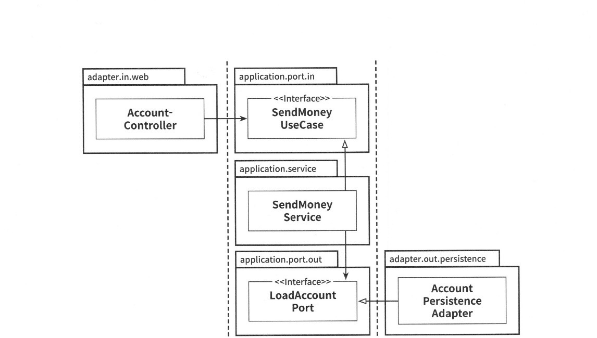
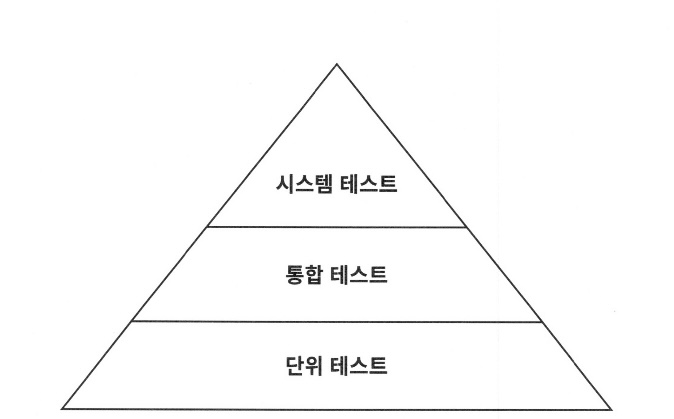

# 만들면서 배우는 클린 아키텍처

건전한 제안이나 비판을 하기위한 기반을 만들기 위한 책이다.


### 1. 계층형 아키텍처의 문제는 무엇일까?

영속성 코드가 사실상 도메인 코드에 녹아들아가서 둘 중 하나만 바꾸는 것이 어려워진다.

고도로 특화된 좁은 도메인 서비스가 유스케이스 하나씩만 담당하게 한다면 작업들이 얼마나 쉬워질까?

UserService 에서 사용자 등록 유스케이스를 찾는 대신 RegisterUserService 를 바로 열어서 작업을 시작

계층형 아키텍처에서는 영속성 계층을 먼저 개발해야 하고, 그 다음에 도메인 계층을, 그리고 마지막으로 웹 계층을 만들어야 한다.
-> 코드에 넓은 서비스가 있다면 서로 다른 기능을 동시에 작업하기가 더욱 어렵다.


ㅡㅡㅡㅡㅡㅡㅡㅡㅡ 

메시지는 함수 이름 + 파라미터이다

행위가 항상 update만 있는 것이 아닌 질의의 행동도 있음
영속성을 생각 안 하는 건 도메인을 만들어서 행위만 하면 됨

service -> useCase 로 나와야한다.

ORM이 추구하는 것은 xml 같은 외부 파일에 저장을 해서
자바는 순수한 object 였다. annotation이 들어오면서 

@Entity가 들어오면서 영속성 계층이라고 하는 것은 좀 과한 점이 있다.
-> @Version 정도는 도메인과 관련이 없긴함 (Optimistic lock)
도메인에서 N + 1 을 신경써서 코드를 작성하긴 해야한다.

로버트 마틴 : 엔티티는 가장 critical한 도메인 로직이 들어 있는 것이다. (영속성과 상관 없는 것이었음)
Spring Data Jpa를 쓰면 mocking하기 고민이 됨


유스케이스를 숨긴다.
예전에는 DAO를 만들고 있어서 그럼 비대한 서비스가 생성 됨

몇몇 서비스들은 커짐, 유스케이스 시나리오 관점으로 만들면 찾아서 작업하기 쉽지 않을까 하는 내용(이름 짓기가 어려움;;)
잘 만들어진 name policy가 있어야함

interface 분리 ISP 하고 나중에 class 까지 나누는 경우도 있음


### 2. 의존성 역전하기
SRP (Single Responsibility Principle)
하나의 컴포넌트는 오로지 한 가지 일만 해야 하고, 그것을 올바르게 수행해야 한다.

-> 컴포넌트를 변경하는 이유는 오직 하나뿐이어야 한다. 


DIP
영속성 코드가 바뀐다고 해서 도메인 코드까지 바꾸고 싶지 않다면 의존성 역전 원칙이 답을 알려준다.
코드상의 어떤 의존성이든 그 방향을 바꿀 수 있다.

클린 아키텍처는 도메인 계층이 영속성이나 UI 같은 외부 계층과 철저하게 분리돼야 하므로 애플리케이션의 엔티티에 모델을 각 계층에서 유지보수해야 한다.
-> 도메인 계층과 영속성 계층이 데이터를 주고 받을 때, 두 엔티티를 서로 변환해야 한다는 뜻이다.


클린 아키텍처에서 모든 의존성은 도메인 로직을 향해 안쪽 방향으로 향한다.

특정 기술에 특화된 코드를 가질 수 없고 비즈니스 규칙에 집중할 수 있다.

#### 육각형 아키텍처 (포트와 어댑터)

육각형 아키텍처는 도메인 코드가 다른 바같쪽 코드에 의존하지 않게 함으로써 영속성과 UI에 특화된 모든 문제로부터 도메인 로직의 결합을 제거하고 코드를 변경할 이유의 수를 줄일 수 있다.

계층으로 구성하기, 기능으로 구성하기

불필요한 레이어에 비즈니스 로직이 담기는 것을 방지하기 위해서 발표 되었음
레이어는 결국 인프라스트럭처를 의존하게 됨, 모든 레이어에 걸쳐서 변경이 될 수 있음

헥사고날 아키텍처의 장점
1. 아키텍처 확장이 용이
2. 테스트를 위해 가짜 어댑터를 설정할 수 있으므로, 테스트가 안정적이고 쉬움
3. 인프라와 통신방법등을 신경쓰지 않아도 되어 도메인 모델에 집중 가능


관심사 분리
1. 외부와의 연결에 문제 -> 어댑터
2. 외부와의 규격이 바뀜 -> 포트
3. 비즈니스 로직이 문제 -> 애플리케이션 코어

##### 어니언 아키텍처
헥사고날과는 다르게 애플리케이션 코어를 더 세부적인 레이어를 구성한다.
인프라스트럭처가 어떻게 구성이 되어있는지 알 이유가 없어짐

Screaming Architecture 애플리케이션 서비스를 유스케이스로 바꾸어 실제로 수행하는 작업을 매우 명확하게 만듬

ㅡㅡㅡ

포트는 인터페이스에 다른 말 - 도메인별 서비스 인터페이스를 만들고 웹이나 배치에서 호출에서 사용한다(어댑터)   
어떤 포트는 유스케이스가 input 포트 output 포트는 구현이 바깥쪽으로 날아가게 됨 interface는 application 내부로 들어가게 된다. 서비스 유스케이스 등
common 바깥쪽에서 구현함 (보안 암호화 encryptor, walletTxCreator)

low level component에 high level component가 의존한다.
원래는 상위에서 하위로 내려가는 것이 자연스럽긴 함

A가 변하면 B가 바뀜 B는 A에 의존한다.

!!!DIP!!!

Policy Layer -> Policy Service Interface
                          ^
                          |
                          Mechanism Layer -> Mechanism Service Interface
                                                        ^
                                                        |
                                                        Utility Layer
                                                        
Output 포트를 보려면 repository로 뺼 수 있음                                                     
우리 같은 경우 passwordEncryptor 아웃풋 어댑터임

@EventListener
common 이벤트를 외부에 리스너가 infrastructure 호출함 일종에 DIP라고 할 수 있음 아웃풋 포트라고 할 수 있다


(archi unit) 의존관계가 생기는 것을 테스트 과정에서 체크하는 것도 있긴함

엔티티 (클린 아키텍처)
- An Entity is an object within our computer system embodies a small set of critical business rules operation on Criticacl Business Data

Use Cases
- Not all business rules are as pure as entities. some business rules make or save money for the business by defining and constraining the way that an automated system operates.

ㅡㅡㅡ


### 3. 코드 구성하기

새 프로젝트에서 가장 먼저 제대로 만들려고 하는 것은 패키지 구조이다.

#### 계층으로 구성하기
```kotlin
buckpal
|- domain
|   |- Account
|   |- Activity
|   |- AccountRepository
|   |- AccoutService
|
|- persistence   
|   |- AccountRepositoryImpl
|
|- web
    |- AccountController
```

AccountRepository 인터페이스를 추가하고 AccountRepositoryImpl 구현체를 이용해 의존성을 역전시켰음

1.
애플리케이션의 기능 조각 특정을 구분 짓는 패키지 경계가 없다.
추가하게 된다면 UserService, UserServiceImpl, UserController 가 생기게 된다.
(서로 연관되지 않은 기능들끼리 예상하지 못한 부수효과를 일으킬 수 있게 됨)

2.
애플리케이션이 어떤 유스케이스들을 제공하는지 파악할 수 없다.
AccountService와 AccountController가 어떤 유스케이스를 구현했는지 파악하기 힘들다.
(인커밍 포트와 아웃 커밍포트가 코드 속에 숨겨져 있다.)


#### 기능으로 구성하기
```kotlin
buckpal
|- account
    |- Account
    |- AccoutContoller
    |- AccountRepository
    |- AccountRepositoryImpl
    |- SendMoneyService
```

패키지 경계를 package-private 접근 수준과 결합하면 각 기능 사이의 불필요한 의존성을 방지할 수 있다.

애플리케이션의 기능을 코드를 통해 볼 수 있게 만드는 것을 'screaming architecture' 라고 한다.

어댑터를 나타내는 패키지명이 없고, 인커밍 포트, 아웃고잉 포트를 확인할 수 없다.

도메인 코드와 영속성 코드 간의 의존성을 역전시켜서
SendMoneyService가 AccountRepository 인터페이스만 알고 있고 구현체는 알 수 없게 했더라도,
package-private 접근 수준을 이용해 도메인 코드가 실수로 영속성 코드에 의존하는 것을 막을 수 없다.


#### 아키텍처적으로 표현력 있는 패키지 구조

육각형 아키텍처에서 구조적으로 핵심적인 요소는 엔티티, 유스케이스, 인커밍/아웃고잉 포트, 인커밍/아웃고잉(혹은 주도하거나 주도되는) 어댑터다.

패키지 구조는 아키택처-코드 갭, 모델 코드갭을 효과적으로 다루는 강력한 요소

```kotlin
buckpal
|- account
    |- adapter
    |   |- in
    |   |   |-web
    |   |       |- AccountController
    |   |- out
    |   |   |- persistence
    |   |       |- AccountPersistenceAdapter
    |   |       |- SpringDataAccountRepository
    |- domain
    |   |- Account
    |   |- Activity
    |- application
        |- SendMoneyService
        |- port
            |- in
            |   |-SendMoneyUseCase
            |- out
                |- LoadAccountPort
                |- UpdateAccountStatePort
```

장점
1. 어댑터 코드를 자체 패키지로 이동시키면 필요할 경우 하나의 어댑터를 다른 구현으로 쉽게 교체할 수 있다는 장점이 있다.
2. DDD 개념에 직접적으로 대응시킬 수 있다는 점, account 같은 패키지는 다른 바운디드 컨텍스트와 통신할 전용 진입점과 출구(포트)를 포함하는 바운디드 컨텍스트에 해당


### 의존성 주입의 역할
클린 아키텍처의 가장 본질적인 요건은 애플리케이션 계층이 인커밍/아웃고잉 어댑터에 의존성을 갖지 않는 것이다.

그렇다면 포트 인터페이스를 구현한 실제 객체를 누가 애플리케이션 계층에 제공해야 할까?
-> 모든 계층에 의존성을 가진 중립적인 컴포넌트를 하나 도입한다. 이 컴포넌트는 아키텍처를 구성하는 대부분의 클래스를 초기화하는 역할을 한다.



### 유지보수 가능한 소프트웨어를 만드는 데 어떻게 도움이 될까?

코드에서 아키텍처의 특정 요소를 찾으려면 아키텍처 다이어그램의 박스 이름을 따라 패키지 구조를 탐색하면 된다.
(의사소통, 개발, 유지보수가 수월해진다?)


ㅡㅡㅡ
패키지를 나누는 이유는 패키지 레벨에서도 의존 관계를 제약하기 위한 것이다.

패키지 나누기에 장점
1. jar 파일을 쪼개서 쓸 수 있도록 할 수 있음
2. 모듈 분리
3. micro service 
의존을 받기만 한다면 뜯을 수 있기 때문에 패키지를 나눴다.

패키지를 나누게 되면 원하는 것을 찾기 힘들게 된다.
Organize by feature

패키지를 자동으로 만들어주는 sh 스크립트를 만드는 것도 괜찮을 것 같다

ㅡㅡㅡ

### 4. 유스케이스 구현하기

육각형 아키텍처는 도메인 중심의 아키텍처에 적합하기 때문에 도메인 엔티티를 만드는 것으로 시작한 후 해당 도메인 엔티티를 중심으로 유스케이스를 구현한다.

#### 유스케이스 둘러보기

일반적으로 유스케이스는 다음과 같은 단계를 따른다.

1. 입력을 받는다.
2. 비즈니스 규칙을 검증한다.
3. 모델 상태를 조작한다.
4. 출력을 반환한다.

유스케이스 코드가 도메인 로직에만 신경 써야 하고 입력 유효성 검증으로 오염되면 안 된다.
그러나 유스케이스는 비즈니스 규칙을 검증할 책임이 있다.

비즈니스 규칙을 충족하면 유스케이스는 입력을 기반으로 어떤 방법으로든 모델의 상태를 변경한다.
일반적으로 도메인 객체의 상태를 바꾸고 영속성 어댑터를 통해 구현된 포트로 이 상태를 전달해서 저장될 수 있게 한다. 유스케이스는 또 다른 아웃고잉 어댑터를 호출할 수도 있다.

```java
@RequiredArgsConstructor
@Transactional
public class SendMoneyService implements SendMoneyUseCase {
    private final LoadAccountPort loadAccountPort;
    private final AccountLock accountLock;
    private final UpdateAccountStatePort updateAccountStatePort;
    
    @Override
    public boolean sendMoney(SendMoneyCommand command) {
        // TODO 비즈니스 규칙 검증
        // TODO 모델 상태 조작
        // TODO 출력 값 반환
    }
}
```

#### 입력 유효성 검증

애플리케이션 계층에서 입력 유효성을 검증해야 하는 이유는, 그렇게 하지 않을 경우 애플리케이션 코어의 바깥쪽으로부터 유효하지 않은 입력값을 받게 되고, 모델의 상태를 해칠 수 있기 때문이다.

입력 모델인 SendMoneyCommand에서 유효성을 검증하자

```java
@Getter
public class SendMoneyCommand {
    
    private final AccountId sourceAccountId;
    private final AccountId targetAccountId;
    private final Money money;
    
    public SendMoneyCommand() {// 주입
        requireNonNull(sourceAccountId);
        requireNonNull(targetAccountId);
        requireNonNull(money);
        requireGreater(money, 0);
    }
}
```

필드가 final이라 변경 가능성이 없고, SendMoneyCommand는 유스케이스 API의 일부이기 떄문에 인커밍 포트 패키지에 위치한다.
자바에서는 Bean Validation API가 이러한 작업을 해줄 수 있음

#### 생성자의 힘
생성자는 파라미터 유효성 감증과 불변등 많은 역할을 할 수 있다.

파라미터가 더 많다면 어떻게 해야할까?
긴 파라미터 리스트를 받아야 하는 생성자를 private으로 만들고 빌더의 build() 메서드 내부에 생성자 호출을 숨길 수 있다.

```java
new SendMoneyCommandBuilder()
        .sourceAccountId(new AccountId(41L))
        .targetAccountId(new AccountId(42L))
        // ...
        .build()
```
컴파일러는 실수로 빌더에 새로운 필드를 추가하는 것을 잊는 것과 같은 실수를 방어해주지 못한다.

#### 유스케이스마다 다른 입력 모델
하나 차이나서 null을 허용하는 모델을 쓴다면 null에 대한 값을 검증하지 못한다.
따로써라

#### 비즈니스 규칙 검증하기
입력 유효성 검증은 유스케이스 로직의 일부가 아닌 반면, 비즈니스 규칙 검증은 분명히 유스케이스 로직의 일부다.

입력 유효성을 검증하는 것은 구문상의 유효성을 검증하는 것이라고도 할 수 있다. 반면 비즈니스 규칙은 유스케이스의 맥락 속에서 의미적인 유효성을 검증하는 일이라고 할 수 있다.

출금 계좌는 초과 출금되어서는 안 된다 - 모델의 접근해야하기 때문에 비즈니스 규칙
(비즈니스 규칙을 도메인 엔티티 안에 넣는 것이 위치도 쉽고 추론하기도 쉬움)
엔티티에 비즈니스 규칙을 검증하기가 여의치 않다면 유스케이스에서 도메인 엔티티에 사용하기 전에 해도 된다.

송금되는 금액은 0보다 커야 한다 - 입력 유효성


#### 풍부한 도메인 모델 vs 빈약한 도메인 모델

1. 풍부한 도메인 모델은 많은 비즈니스 규칙이 유스케이스 구현체 대신 엔티티에 위치함
2. 빈약한 도메인 모델은 엔티티 자체가 굉장히 얇음 get, set 메서드만 포함

#### 유스케이스마다 다른 출력 모델

유스케이스들 간에 같은 출력 모델을 공유하게 되면 유스케이스들도 강하게 결합된다.

단일 책임 원칙을 적용하고 모델을 분리해서 유지하는 것은 유스케이스의 결합을 제거하는데 도움이 된다.

#### 읽기 전용 유스케이스는 어떨까?
한 가지 방법은 쿼리를 위한 인커밍 전용 포트를 만들고 이를 쿼리 서비스에 구현하는 것

읽기 전용 쿼리는 쓰기가 가능한 유스케이스와 코드 상에서 명확하게 구분 된다.
- 이런 방식은 CQS, CQRS 개념과 잘 맞는다.


#### 유지보수 가능한 소프트웨어를 만드는데 어떻게 도움이 될까?
- 입출력 모델을 독립적으로 모델링한다면 원치 않는 부수효과를 피할 수 있다.
- 유스케이스별로 모델을 만들면 유스케이스를 명확하게 이해할 수 있고, 장기적으로 유지보수하기도 더 쉽다. 
- 또한 여러 명의 개발자가 다른 사람이 작업 중인 유스케이스를 건드리지 않은 채로 여러 개의 유스케이스를 동시에 작업할 수 있다.

ㅡㅡㅡㅡㅡㅡㅡㅡㅡ 

이 책에서 가장 충격적인 것 - 빈약한 도메인 모델을 써도 괜찮다!

엔티티와 유스케이스를 헥사고날에서는 따로 구분하지 않는다.

제일 큰 문제는 엔티티에 변경이 일어나는데 여러 useCase에서 중복이 된다면
변경과 관련된 코드에 중복이 일어나게 된다.

-> 로버트 마틴이 클린 코드에서 잘 설명하고 있음

다시 한 번

엔티티 (클린 아키텍처)
- An Entity is an object within our computer system embodies a small set of critical business rules operation on Criticacl Business Data

Use Cases
- Not all business rules are as pure as entities. some business rules make or save money for the business by defining and constraining the way that an automated system operates.


엔티티를 밖에서 바꾸는 것은 객체지향적이 아니다. 객체들끼리 메시지를 주고 받으면서 (데이터를 직접 조작하지 않는다)

앨런 케이 (독립적인 세포같이 대화를 주고 받는다) - 객체지향 적인 언어의 창시 Smalltalk
Object Oriented - message 중심

Simula -> c++

!!
함수 호출(command)과 메시지(desire)의 차이 - 객체 자신이 상태를 확인하고 거부할 수 있는 권리가 있음

ruby on rails 는 activeRecord 패턴을 사용
[active record](https://www.martinfowler.com/eaaCatalog/activeRecord.html)

self validate - annotation을 통해서 검증, 자바 표준임 

유스케이스가 그래서 뭔가? 찾아보기
어떤 한 가지 목적을 위해서 사용하는 흐름?
기능 하나?

CQRS?
읽기를 위한 객체와 쓰기를 위한 객체를 따로 만든다.

CQS?
객체 분리가 아닌 메소드 분리만 되어도 CQS라고 할 수 있음
Command는 void Query는 읽기만
over해서 처리하기 쉽다.

읽기 처럼해놓고 -> count 변경 일어남 (X)

ㅡㅡㅡㅡㅡㅡㅡㅡㅡㅡㅡㅡㅡㅡㅡㅡㅡㅡㅡㅡㅡㅡㅡㅡㅡㅡㅡㅡㅡ


### 5장 웹 어댑터 구현하기

웹 어댑터의 책임
1. HTTP 요청을 자바 객체로 매핑
2. 권한 검사
3. 입력 유효성 검증
4. 입력을 유스케이스의 입력 모델로 매핑
5. 유스케이스 호출
6. 유스케이스의 출력을 HTTP로 매핑
7. HTTP 응답을 변환

웹 어댑터의 입력 모델을 유스케이스의 입력 모델로 변환할 수 있다는 것을 검증해야한다.


#### 컨트롤러 나누기

너무 적은 것보다는 너무 많은 게 낫다.
각 컨트롤러가 가능한 한 좁고 다른 컨트롤러와 가능한 한 적게 공유하는 웹 어댑터 조각을 구현해야한다.

클래스가 작을수록 테스트 코드를 찾기도 쉽다. 동시 작업도 지원


ㅡㅡㅡㅡㅡㅡㅡㅡㅡㅡㅡㅡㅡㅡㅡㅡㅡㅡ

인커밍 어댑터 : 외부로부터 요청을 받아 애플리케이션 코어를 호출하고 어떤 일을 할지 알려줌

@Valid 이용

http rendering 하는 경우에 로직에 따라 어떤 뷰를 보여줘야할지 바꾸는 것

서비스에서 만들어서 dto를 줘야한다.
controller에서 dto를 만들어 준다.

ui 요구사항이 바뀌었다고 서비스, repository 까지 바뀌어야하는가

osiv - 이미 조회 끝나고 와야하지 않는가?, 편의성을 위해서 괜찮다
써야할 때 쓰지 말아야할 때를 알아야한다.

controller slicing

Controller나 UseCase를 어떤 기준으로 쪼개고 합치게 될 것인가?

Controller가 아닌 accountWebAdapter
webFlux나 함수형에서는 handler, router, routing

ㅡㅡㅡㅡㅡㅡㅡㅡㅡㅡㅡㅡㅡㅡㅡㅡㅡㅡㅡㅡㅡㅡㅡㅡ


### 6장 영속성 어댑터 구현하기

#### 의존성 역전
애플리케이션 서비스에서는 영속성 기능을 사용하기 위해 포트 인터페이스를 호출한다.
이 포트는 실제로 영속성 작업을 수행하고 데이터베이스와 통신할 책임을 가진 영속성 어댑터 클래스에 의해 구현된다.

영속성 계층에 대한 코드 의존성을 없애기 위해 이러한 간접 계층을 추가하고 있다
리팩터링을 하더라고 코어 코드를 변경하는 결과로 이어지지 않을 것이다.


#### 영속성 어댑터의 책임

1. 입력을 받는다.
2. 입력을 데이터베이스 포맷으로 매핑한다.
3. 입력을 데이터베이스로 보낸다.
4. 데이터베이스 출력을 애플리케이션 포맷으로 매핑한다.
5. 출력을 반환한다.

#### 포트 인터페이스 나누기
필요없는 화물을 운반하는 무언가에 의존하고 있으면 예상하지 못했던 문제가 생길 수 있다.

인터페이스를 분리하자

AccountRepository 를 (LoadAccountPort, UpdateAccountStatePort, CreateAccountPort)
서비스 코드를 짤 때는 필요한 포트에 그저 꽂는 것을 플러그 앤드 플레이라고한다.

#### 영속성 어댑터 나누기

애그리거트당 하나의 영속성 어댑터 접근 방식 또한 여러 개의 바운디드 컨텍스트의 영속성 요구사항을 분리하기 위한 좋은 토대가 된다.

#### 데이터베이스 트랜잭션은 어떻게 해야할까?

영속성 어댑터는 어떤 데이터베이스 연산이 같은 유스케이스에 포함되는지 알지 못하기 때문에 언제 트랜잭션을 열고 닫을지 결정할 수 없다.
이 책임은 영속성 어댑터 호출을 관장하는 서비스에 위임해야한다.

```java
@Transactional
public class SendMoneyService implements SendMoneyUseCase {}
```

ㅡㅡㅡㅡㅡㅡㅡㅡㅡㅡㅡㅡㅡㅡㅡㅡㅡㅡㅡ
Jpa Entity와 도메인 Entity를 분리하는 것이

Account user, bank policy 로직이 서비스로 많이 흘러가게 된다.
그렇다고 엔티티 타고타고 들어가게되면 어디서 시작하고 끝나는지 잘 안 보인다.

db 조회하는 성능은 어떨까

조영호 - 우아한 객체지향 세미나에서 (jpa entity는 그대로 사용하고 모듈이 나눠지면 id로 끊어냈다, msa에도 재사용이 가능) 

dirty checking도 못 씀

rdb 죽으면 mongo 죽으면 redis 자동 변경 필요하면 쓰기 좋음


jpaRepository 안티패턴 아니냐
를 사용하는 경우에도 output port는 나눠야하지 않을까
ㅡㅡㅡㅡㅡㅡㅡㅡㅡㅡㅡㅡㅡㅡㅡㅡㅡㅡㅡㅡㅡㅡㅡㅡ

단순히 어댑터의 로직만 검증하고 싶은 것이 아니라 데이터베이스 매핑도 검증하고 싶기 때문에 영속성 테스트도 통합 테스트를 적용하는 것이 좋다.

### 7장 아키텍처 요소 테스트하기



테스트의 기본 전제는 만드는 비용이 적고, 유지보수하기 쉽고, 빨리 실행되고, 안정적인 작은 크기의 테스트들에 대해 높은 커버리지를 유지해야 한다는 것이다.

여러 개의 단위와 단위를 넘는 경계, 아키텍처 경계, 시스템 경계를 결합하는 테스트는 만드는 비용이 더 비싸지고, 실행이 더 느려지며 깨지기 쉬워진다.
이렇게 되면 새로운 기능을 만드는 것보다 테스트를 만드는 데 시간을 더 쓰게 되기 때문에
테스트가 비싸질수록 테스트의 커버리지 목표는 낮게 잡아야 한다
(비용이 많이 드는 테스트는 지양하고 비용이 적게 드는 테스트를 많이 만들어야한다.)


단위 테스트
일반적으로 하나의 클래스를 인스턴스화하고 해당 클래스의 인터페이스를 통해 기능들을 테스트함
(클래스가 다른 클래스에 의존한다면 의존되는 클래스들은 인스턴스화하지 않고 테스트하는 동한 필요한 작업을 흉내 내는 목으로 대체한다.)


통합 테스트
연결된 여러 유닛을 인스턴스화하고 시작점이 되는 클래스의 인터페이스로 데이터를 보낸 후 유닛들의 네트워크가 기대한대로 잘 동작하는지 검증
이 책에서 정의한 통합 테스트에서는 두 계층 간의 경계를 걸쳐서 테스트할 수 있기 때문에 어떤 시점에는 목을 대상으로 수행해야 한다


시스템 테스트
애플리케이션의 UI를 포함하는 앤드투앤드 테스트 층이 있을 수 있다.


#### 단위 테스트로 도메인 엔티티 테스트하기

```kotlin
class AccountTest {

    @Test
    fun withdrawalSucceeds() {
        val account = Account()

        val success = account.withdraw(Money.of(555L), AccountId(99L))

        assertThat(success).isTrue()
        assertThat(account.getActivityWindow().getActivities()).hasSize(3)
        assertThat(account.calculateBalance()).isEqualTo(Money.of(1000L))
    }
}
```

withdraw() 메서드를 호출해서 출금을 성공했는지 검증하고
Account 객체의 상태에 대해 기대되는 부수효과들이 잘 일어났는지 확인하는 단순한 단위 테스트

단위 테스트가 도메인 엔티티에 녹아 있는 비즈니스 규칙을 검증하기에 가장 적절한 방법이다.
도메인 엔티티의 행동은 다른 클래스에 거의 의존하지 않기 때문에 다른 종류의 테스트가 필요하지 않다.


#### 단위 테스트로 유스케이스 테스트하기

SendMoneyService

출금 계좌와 잔고가 다른 트랜잭션이 변경되지 않도록 락을 걸기 ->
출금 계좌에서 돈이 출금되고 나면 똑같이 입금 계좌에 락을 걸고 돈을 입금 -> 두 계좌에 락을 해제


```kotlin
class SendMoneyServiceTest {

    @Test
    fun transactionSucceeds() {
        val sourceAccount = givenSourceAccount()
        val targetAccount = givenTargetAccount()

        givenWithdrawalWillSucceed(sourceAccount)
        givendDeposityWillSucceed(targetAccount)

        val money = Money.of(500L)

        val command = SendMoneyCommand(sourceAccount.id, targetAccount.id, money)

        val success = sendMoneyService.sendMoney(command)

        assertThat(success).isTrue()

        // sourceAccount, targetAccount : lock 송금 lock 해제가 정상적으로 호출되었는지가지 확인
        verify(exactly = 1) { accountLock.lockAccount(sourceAccount.id!!) }
    }
}

```
책 예제에서는 Mockito에서 given then으로 호출 확인

테스트 중인 유스케이스 서비스는 상태가 없기 때문에 특정 상태를 검사하는 것이 아닌
모킹된 의존 대상의 특정 메서드와 상호작용했는지 여부를 검증한다. 이는 테스트가 코드의 행동 변경뿐만 아니라 코드의 구조 변경에도 취약해진다는 의미가 있다.
(코드가 리팬터링되면 테스트도 변경될 확률이 높음)

모든 동작을 검증하려고 하면 클래스가 조금이라도 바뀔 때마다 테스트를 변경해야 하므로 테스트의 가치를 떨어뜨리는 일이다.

단위 테스트이긴 하지만 의존성의 상호작용을 테스트하고 있기 때문에 통합 테스트에 가깝다.
하지만 목으로 작업하고 있고 실제 의존성을 관리해야 하는 것은 아니기 때문에 완전한 통합 테스트에 비해 만들고 유지보수하기가 쉽ㄴ다.


#### 통합 테스트로 웹 어댑터 테스트하기

웹 어댑터는
- JSON 문자열 등의 형태로 HTTP를 통해 입력을 받고
- 입력에 대한 유효성 검증
- 유스케이스에서 사용할 수 있는 포맷으로 매핑
- 유스케이스에 전달
- 결과를 JSON으로 매핑후 HTTP 응답을 클라이언트에 반환


```kotlin

@WebMvcTest(controllers = SendMoneyController::class)
class SendMoneyControllerTest {
    @Autowired
    lateinit var mockMvc: MockMvc

    @MockBean
    lateinit var sendMoneyUseCase: SendMoneyUseCase

    @Test
    fun testSendMoney() {
        mockMvc.perform(
            post("/accounts/send/{sourceAccountId}/{targetAccountId}/{amount}"), 41L, 42L, 500
        ).andExpect(status().isOk())

        verify { sendMoneyUseCase(SendMoneyCommand(AccountId(41L), AccountId(42L), Money.of(500L))) }
    }
}

```

isOk 메서드로 HTTP 응답의 상태가 200임을 검증하고, 모킹한 유스케이스를 잘 호출했는지 검증함으로써
웹 어댑터의 책임 대부분을 커버할 수 있다.
(프레임워크가 HTTP 프로토콜에 맞게 모든 것을 적절히 잘 변환한다고 믿음, 프레임워크를 테스트할 필요는 없다.)

단위 테스트처럼 보이지만 통합 테스트이다.

@WebMvcTest
애너테이션은 스프링의 특정 요청 경로, JSON 매핑, HTTP 입력 검증 등에 필요한 전체 객체 네트워크를 인스턴스화한다.
그리고 웹 컨트롤러가 이 네트워크의 일로서 잘 동작하는지 테스트한다.


웹 컨트롤러가 스프링 프레임워크에 강하게 묶여 있기 때문에 격리된 상태로 테스트하기 보다는 이 프레임워크와 통합된 상태로 테스트하는 것이 합리적
(단위 테스트를 했다면 매핑, 유효성 검증, HTTP 항목에 대한 커버리지가 낮아지고 프로덕션 환경에서 정상적으로 작동할지 확신할 수 없게 된다)


#### 통합 테스트로 영속성 어댑터 테스트하기

Account 엔티티를 데이터베이스에서 가져오는 메서드 / 새로운 계좌 활동을 데이터베이스에 저장하는 메서드

```kotlin
@DataJpaTest
@Import([AccountPersistenceAdapter::class, AccountMapper::class])
class AccountPersistenceAdapterTest {
    
    @Autowired
    lateinit var adapterUnderTest: AccountPersistenceAdapter
    
    @Autowired
    lateinit var activityRepository: ActivityRepository
    
    @Test
    @Sql("AccountPersistenceAdapterTest.sql")
    fun loadsAccount() {
        // 스크립트를 이용해 특정 상태로 만들고 api 를 통해 가져온 후 설정한 상태값을 가지고 있는지 확인
        val account = adapter.loadAccount(AccountId(1L), LocalDateTime.now())
      
        assertThat(account.activityWindow.activities).hasSize(2)
        assertThat(account.calculateBalance()).isEqualTo(Money.of(500))
    }
  
    @Test
    fun updateActivities() {
        // 새로운 활동을 가진 Account를 만들어서 저장하기 위해 어댑터로 전달 잘 저장 되었는지 확인
        val account = Account()
      
        adapter.updateActivities(account)
      
        assertThat(activityRepository.count()).isEqualTo(1)
      
        val savedActivity = activityRepository.findAll()[0]
      
        assertThat(savedActivity.amount).isEqualTo(1L)
    }
}
```

@DataJpaTest 애너테이션은 스프링 데이터 리포지토리를 포함해서 데이터베이스 접근에 필요한 객체 네트워크를 인스턴스화해야 한다고 스프링에 알려준다.

스프링에서 기본적으로 제공하는 인메모리 데이터베이스를 사용할 수 있지만

SQL 문법이 다를 수 있고 테스트베이스와 실제 데이터베이스가 다르다면 두 개의 데이터베이스 시스템을 신경써야하므로
테스트 컨테이너를 이용해서 테스트를 실행하고 실제와 똑같이 동작한다고 믿을 수 있게 된다.


#### 시스템 테스트로 주요 경로 테스트하기
전체 애플리케이션을 띄우고 API를 통해 요청 보내고, 모든 계층이 조화롭게 잘 동작하는지 검증
송금하기 유스케이스의 시스템 테스트에서는 애플리케이션에 HTTP 요청을 보내고 계좌의 잔고를 확인하는 것을 포함해서 응답을 검증

```kotlin
@SpringBootTest
class SendMoneySystemTest {
    @Autowired
    lateinit var restTemplate: TestRestTemplate
    
    @Test
    @Sql("SendMoneySystemTest.sql")
    fun sendMoney() {
        val initialSourceBalance = sourceAccount().calculateBalance()
        val initialTargetBalance = targetAccount().calculateBalance()
      
        val response = whenSendMoney(sourceAccountId(), targetAccountId(), transferredAmount())
      
        // status, source, target Balance 확인
    }
  
    private fun whenSendMoney(): ResponseEntity {
        return restTemplate.exchange(
            //
        )
    }
}
```

TestRestTemplate을 이용해서 프로덕션 환경에 조금 더 가깝게 만든다.

테스트 가독성을 위해 private으로 뺀 헬퍼 메서드는 여러 가지 상태를 검증할 때 사용할 수 있는 
domain-specific language를 형성한다.

시스템 테스트는 커버한 코드와 겹치는 부분이 많다.

일반적으로 시스템 테스트는 단위 테스트와 통합 테스트가 발견하는 버그와는 다른 버그를 발견할 수 있게 해준다.
(계층 간 매핑 버그 등)

시스템 테스트를 통해 중요한 시나리오들이 커버된다면 최신 변경사항들이 애플리케이션을 망가뜨리지 않았음을 가정할 수 있고, 배포할 준비가 됐다는 확신을 준다.


#### 얼마만큼의 테스트가 충분할까?

얼마나 마음 편하게 소프트웨어를 배포할 수 있느냐가 핵심
더 자주 배포할수록 테스트를 신뢰할 수 있다.


- 도메인 엔티티를 구현할 대는 단위 테스트로 커버
- 유스케이스를 구현할 때는 단위 테스트로 커버
- 어댑터를 구현할 때는 통합 테스트로 커버
- 사용자가 취할 수 있는 중요 애플리케이션 경로는 시스템 테스트로 커버


#### 유지보수 가능한 소프트웨어를 만드는 데 어떻게 도움이 될가?
입출력 포트는 테스트에서 뚜렷한 모킹 지점이 된다.
각 포트에 대해 모킹할지, 실제 구현할지 선택할 수 있으며
만약 포트가 아주 작고 핵심만 담고 있다면 모킹하는 것도 쉽다.

모킹이 버거워지거나 테스트 종류를 모르게 된다면, 
! 아키텍처의 문제에 대해 경고하고 유지보수 가능한 코드를 만들기 위해 올바른 길로 인도하는 카나리아 역할도 하게 된다.

ㅡㅡㅡㅡㅡㅡㅡㅡㅡㅡㅡㅡㅡㅡㅡㅡㅡㅡㅡㅡㅡㅡㅡㅡㅡㅡㅡㅡ
ㅡㅡㅡㅡㅡㅡㅡㅡㅡㅡㅡㅡㅡㅡㅡㅡㅡㅡㅡㅡㅡㅡㅡㅡㅡㅡㅡㅡ


### 8장 경계 간 매핑하기

#### 각 계층 모델 매핑에 대한 주장
매핑에 찬성하는 개발자
두 계층 간 매핑 안함 → 두 계층이 강하게 결합

매핑에 반대하는 개발자
두 계층 간 매핑 함 → 보일러플레이트 코드 많이 만들게 됨 → 만약 유스케이스 단순 CRUD만 수행 → 계층 간의 매핑 과함


#### 보일러플레이트 코드란?
최소한의 변경으로 여러곳에서 재사용 되며, 비슷한 형태를 가지고 있는 코드

매핑에 사용하는 객체는 그 형태가 비슷할 것이고 약간의 필드 수정만 해서 여러곳에서 재사용 됨

#### ‘매핑하지 않기’ 전략

컨트롤러, 유스케이스, 유스케이스 구현체 모두 Account 클래스에 접근 해야 함

각 포트에 해당하는 인터페이스가 도메인을 모델을 의존하면 매핑 객체 필요 없음.

비단 인커밍 뿐만 아니라 영속성 계층도 마찬가지

요구사항 변화
계좌 이름이랑 별칭이랑 합쳐서 보여주세요.

응답에 대한 변경이 전체 계층에 영향을 줌

‘매핑하지 않기’ 전략 쓰지 말기?
꼭 그런 것은 아니다

지저분하게 느껴질 수는 있지만 딱 들어맞을 때가 있다.

같은 필드를 가진 웹 모델을 도메인 모델로

같은 필드를 가진 도메인 모델을 영속성 모델로 매핑 할 필요 있을까?

도메인 모델에 추가한 JSON이나 ORM 애너테이션이 방해가 될까?

영속성 계층 계층의 뭔가가 바뀌었을 때 도메인 모델의 애너테이션 한 두개 바꿔야 하는게 크게 상관 있을까?

모든 계층이 정확히 같은 구조, 정확히 같은 정보를 필요로 한다 → ‘매핑하지 않기 전략’은 완벽한 선택지 어떤 매핑 전략을 선택했더라도 나중에 언제든 바꿀 수 있다.

우리는 이 전략을 어디서 쓰고 있나?
도메인 모델에서 쓰고 있지 않을까? 도메인 모델과 영속성 모델을 따로 구분하지않고 하나로 사용하고 있기 때문에 우리는 애플리케이션 계층과 영속성 계층의 매핑 전략을 ‘매핑하지 않기’ 전략으로 쓰고 있지 않을까?


#### ‘양방향’ 매핑 전략

키워드: 전용모델

웹 모델을 도메인 모델로 매핑, 도메인 객체를 다시 웹 모델로 매핑

영속성 모델 또한 마찬가지

두 계층이 모두 양방향으로 매핑하기 때문에 ‘양방향’ 매핑이라고 함

장점
전용 모델 변경 → 다른 계층 모델 영향 X

물론, 내용 자체가 변경되는 것은 예외

각 계층별로 간섭없이 필요로 하는 구조로 변경 가능

오염되지 않는 깨끗한 도메인 모델 유지 → 단일 책임 원칙 만족

단점
너무 많은 보일러플레이트 코드가 생김

매핑 프레임워크를 사용하더라도 구현하는 비용이 있음.

MapStruct, ModelMapper, BeanUtils 등

매핑하는 내부 동작방식을 리플렉션 뒤로 숨김 → 디버깅 고통

도메인 모델이 통신에 직접적으로 사용됨 → 바깥쪽 요구에 대한 변경에 취약

간단한 CRUD 유스케이스 → 규칙은 신성!!! 철저하게 준수 → 생산성 저하


어떤 매핑 전략도 철칙처럼 여겨져서는 안 된다. 그 대신 각 유스케이스마다 적절한 전략을 택할 수 있어야 한다.

#### ‘완전’ 매핑 전략

각 연산마다 별도의 입출력 모델 사용

계층 간의 통신 → SendMoneyCommand 처럼 각 작업 특화 모델 사용

웹 계층의 책임
웹 계층 입력을 애플리케이션 계층으로 매핑 할 책임

커맨드 객체로 애플리케이션 계층 인터페이스 해석 필요 없음

어떤 필드를 채울 것인가?

어떤 필요를 비워두는 편이 좋은가?

애플리케이션 계층의 책임
애플리케이션 계층은 커맨드 객체를 도메인 모델로 변경 할 책임

장점
여러 유스케이스의 요구사항을 함께 다뤄야 하는 매핑에 비해 구현과 유지보수 쉬움

단점
다른 전략들에 비해 더 많은 코드가 필요

특성
전역으로 하기에는 무리

웹 계층과 애플리케이션 계층 사이 추천

애플리케이션 계층과 영속성 계층 사이는 비추천

일반적으로 도메인 모델과 영속성 모델이 달라야 할 이유는 별로 없던 것 같다.

연산의 입력 모델만 사용하고 출력은 도메인 객체 그대로 이용

웹 계층에서 까지 도메인 객체를 그대로 이용하는 것을 말하는 건 아닐 거라고 생각...

매핑 전략은 여러 가지를 섞어 쓸 수 있고, 섞어 써야만 한다. 어떤 매핑 전략도 모든 계층에 걸쳐 전역 규칙일 필요가 없다.

예제에서 아쉬운점이 매핑의 주체에 대한 설명이 없는 부분이 아쉬운 요소

우리는 이 전략을 어디서 쓰고 있나?
서비스 DTO만들어서 사용하는 경우가 있는데, 그런 경우가 이 ‘완전' 매핑 전략을 사용하고 있는 경우라고 할 수 있을 것 같다. 그렇지만, 책에서 나오는 것처럼 유효성 검증 책임을 가지거나 하지는 않는다.


#### ‘단방향’ 매핑 전략

키워드: 동일한 상태 인터페이스

모든 계층의 모델들이 같은 인터페이스를 구현

인터페이스는 getter 메서드 제공 → 도메인 모델 상태 캡슐화

이 전략의 매핑 책임은 한 쪽 방향으로만 향하고 있어서 ‘단방향' 매핑 전략

장점
도메인 모델 자체는 풍부한 행동을 구현 가능

애플리케이션 계층에서 이러한 행동 접근 가능

매핑 없이 각 계층간 객체 전달 가능

상태 변경 인터페이스 비노출 → 안전하게 바깥에서 사용 가능

단점
매핑이 전 계층을 넘나들며 퍼져 있음 → 개념적으로 어려움

특성
계층 간의 전략 모델이 비슷할 때 효과적

읽기 전용 연산의 경우 → 인터페이스가 필요한 모든 정보 제공 → 웹 계층에서 전용 모델로 매핑 할 필요 없음


#### 언제 어떤 매핑 전략을 사용할 것인가?
‘그때 그때 다르다’

각 매핑 마다 장단점 있음 → 전역 규칙의 충동 이겨내야 함

패턴 섞음 → 어수선함 → 최선의 선택이 아님에도 깔끔 때문에 전역? → 무책임

시간이 지남 → 소프트웨어 변함 → 어제의 최선 != 오늘의 최선

팀 내에서 합의할 수 있는 가이드라인 정해야 함

어떤 상황에서 어떤 매핑 전략을 선택 해야 하는가? 답할 수 있어야 함

왜 해당 전략이 최우선인가? 설명 가능해야 함

그래야 시간이 흘러도 유효한 선택인가 평가할 수 있음

변경 유스케이스 예시
웹 계층 → 애플리케이션 계층

서로의 결합을 제거하기 위해서 ’완전 매핑’ 전략이 최우선 선택지

유스케이스별 유효성 검증 규칙 명확 → 특정 유스케이스에 필요하지 않는 필드 신경 안써도 됨

애플리케이션 계층 → 영속성 계층

매핑 오버헤드 줄이기 위해 ‘매핑하지 않기’ 전략이 최우선 선택지

애플리케이션 계층에서 영속성 문제를 다뤄야 하게 되면 ‘양방향’ 매핑 전략으로 변경 → 결합 느슨

쿼리 유스케이스 예시
웹 계층 → 애플리케이션 계층, 애플리케이션 계층 → 영속성 계층

매핑 오버헤드 줄이기 위해 ‘매핑하지 않기’ 전략이 최우선 선택지

영속성이나 웹 문제를 다뤄야 하게 되면 ‘양방향’ 매핑 전략으로 변경

가이드 라인을 성공적으로 적용하려면 개발자들의 머릿속에 가이드라인이 잘 담겨 있어야 한다. 그러므로 가이드라인은 팀 차원에서 지속적으로 논의하고 수정해야 한다.

유지보수 가능한 소프트웨어를 만드는 데 어떻게 도움이 될까?
각 유스케이스에 대해 좁은 포트 사용 → 유스케이스 마다 다른 매핑 전략 사용 선택지 → 결합 느슨

특정 상황, 특정 시점 → 최선의 전략 선택

상황마다 매핑 전략 선택은 전역 매핑 보다 어려움

그렇지만, 분명한 가이드라인이 있다면 유지보수하기 쉬운 코드가 되는 보상

ㅡㅡㅡㅡㅡㅡㅡㅡㅡㅡㅡㅡㅡㅡㅡㅡㅡㅡㅡㅡㅡㅡㅡㅡㅡㅡㅡㅡㅡㅡ

8장 토비와 아이들

매핑 전략이 이 책에 가장 큰 핵심 (쟁점)

MapStruct compile 해서 떨궈줌 build하는 시점에 만듬

ModelMapper runtime에서 reflection (deep tree) - 알고보니 cpu 30퍼를 먹고 있었다?

웹은 양방향 매핑 전략 가져가야할듯
@Valid는 자바 표준이니 도메인을 오염해도 괜찮다?

얼마나 적은 양을 유지하면서 잘 짤 것인가?, layer까지 정보가 나와도 되는 것인가
한 가지 전략을 전역적으로 적용하지 말자? (영속성 모델을 가져갈지는 정하고 가야할듯)


