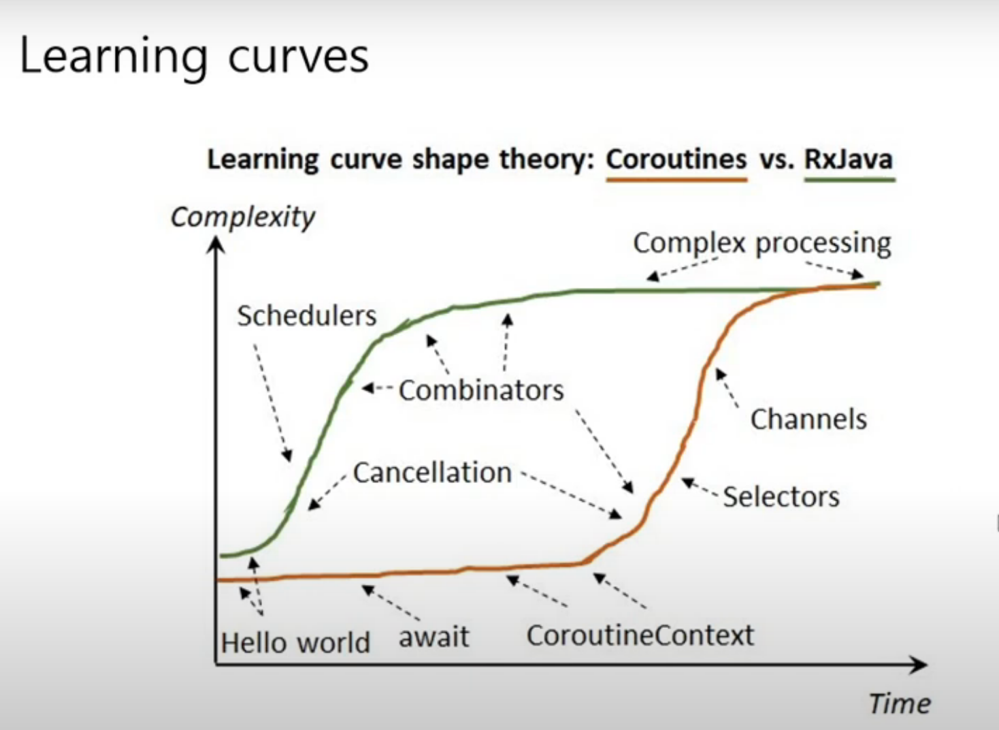

[Android Coroutine](https://developer.android.com/kotlin/first)

## Coroutine

- 코루틴은 루틴의 일정
- 협동 루틴이라 할 수 있다.

> 코루틴은 이전에 자신의 실행이 마지막으로 중단되었던 지점 다음의 장소에서 실행을 재개한다.

- A coroutine is a concurrency design pattern that you can use on Android to simplify code that executes asynchronously.
- On Android, coroutines help to manage long-running tasks that might otherwise block the main thread and cause your app
  to become unresponsive.

- Coroutines are a Kotlin feature that converts async callbacks for long-running tasks, such as database or network
  access, into sequential code

비동기(async)를 순차적으로 처리할 수 있도록 해주는 것이다.

```kotlin
suspend fun loadUser() {
    val user = api.fetchUser()
    show(user)
}
```

callback 도 없고 thread 처리도 없었지만 쓰레드 이동 예외처리가 되어 있음



## Basics

```kotlin
// 일시 중단이 될 수 있다는 뜻
suspend fun myWorld() {
    delay(1000L)
    println("world.")
}
```

coroutine 이 thread 보다 가볍다

```kotlin
repeat(100_000) {
    println(".")
}
```

- process가 끝나면 coroutine도 끝난다
- delay도 suspend fun
- launch는 스케줄러 느낌


